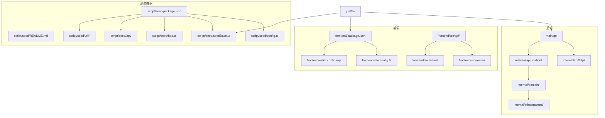
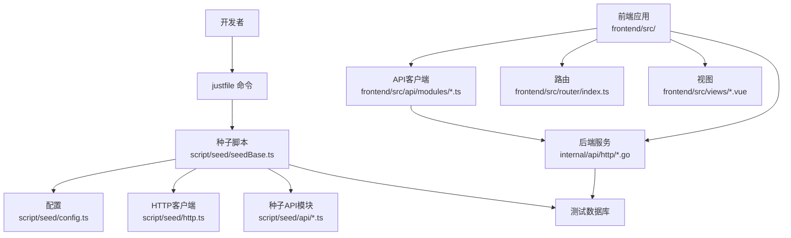
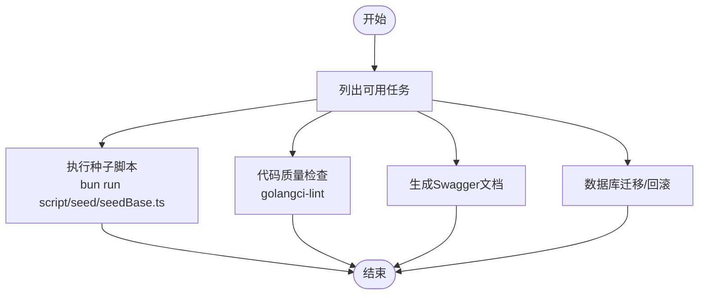
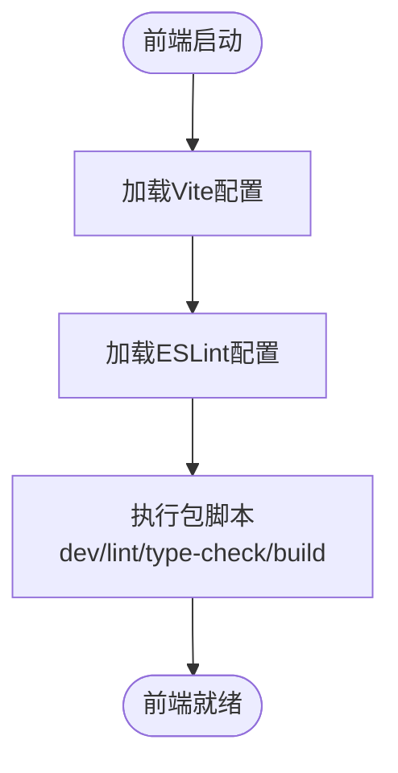
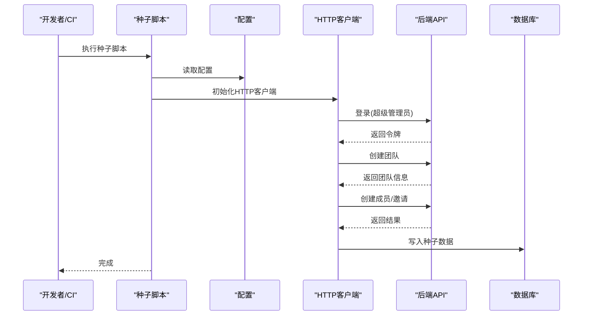
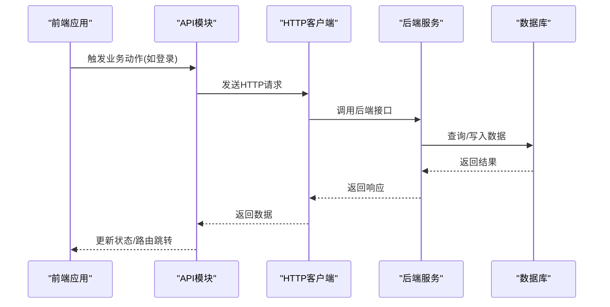
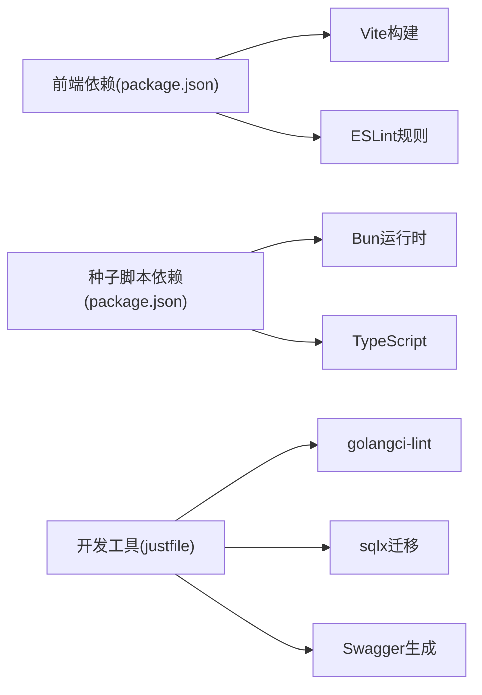

# 测试自动化

<cite>
**本文引用的文件**
- [justfile](file://justfile)
- [.github/copilot-instructions.md](file://.github/copilot-instructions.md)
- [frontend/package.json](file://frontend/package.json)
- [frontend/vite.config.ts](file://frontend/vite.config.ts)
- [frontend/eslint.config.mjs](file://frontend/eslint.config.mjs)
- [script/seed/README.md](file://script/seed/README.md)
- [script/seed/package.json](file://script/seed/package.json)
- [script/seed/config.ts](file://script/seed/config.ts)
- [script/seed/seedBase.ts](file://script/seed/seedBase.ts)
- [script/seed/http.ts](file://script/seed/http.ts)
- [script/seed/util/roles.ts](file://script/seed/util/roles.ts)
- [script/seed/api/auth.ts](file://script/seed/api/auth.ts)
- [script/seed/api/team.ts](file://script/seed/api/team.ts)
- [script/seed/api/member.ts](file://script/seed/api/member.ts)
- [script/seed/api/invitation.ts](file://script/seed/api/invitation.ts)
- [internal/api/http/auth.go](file://internal/api/http/auth.go)
- [internal/api/http/team.go](file://internal/api/http/team.go)
- [internal/api/http/member.go](file://internal/api/http/member.go)
- [internal/api/http/invitation.go](file://internal/api/http/invitation.go)
- [frontend/src/api/http.ts](file://frontend/src/api/http.ts)
- [frontend/src/api/modules/index.ts](file://frontend/src/api/modules/index.ts)
- [frontend/src/api/modules/auth.ts](file://frontend/src/api/modules/auth.ts)
- [frontend/src/api/modules/team.ts](file://frontend/src/api/modules/team.ts)
- [frontend/src/api/modules/member.ts](file://frontend/src/api/modules/member.ts)
- [frontend/src/api/modules/invitation.ts](file://frontend/src/api/modules/invitation.ts)
- [frontend/src/views/LoginView.vue](file://frontend/src/views/LoginView.vue)
- [frontend/src/views/DashboardView.vue](file://frontend/src/views/DashboardView.vue)
- [frontend/src/main.ts](file://frontend/src/main.ts)
- [frontend/src/router/index.ts](file://frontend/src/router/index.ts)
- [frontend/src/types/domain.ts](file://frontend/src/types/domain.ts)
- [frontend/src/types/common.ts](file://frontend/src/types/common.ts)
- [frontend/src/env.d.ts](file://frontend/src/env.d.ts)
</cite>

## 目录
1. [引言](#引言)
2. [项目结构](#项目结构)
3. [核心组件](#核心组件)
4. [架构总览](#架构总览)
5. [详细组件分析](#详细组件分析)
6. [依赖分析](#依赖分析)
7. [性能考虑](#性能考虑)
8. [故障排查指南](#故障排查指南)
9. [结论](#结论)
10. [附录](#附录)

## 引言
本文件面向“漫画翻译协作平台”的测试自动化与持续集成实践，系统梳理后端Go服务、前端Vue应用、测试数据种子脚本与开发工作流之间的协同关系。重点覆盖以下方面：
- CI/CD流水线中的测试自动化配置思路与任务编排
- 测试数据自动化：种子脚本、测试环境初始化与清理
- 前端测试自动化：API客户端测试与端到端测试的落地路径
- 测试覆盖率统计与质量门禁建议
- 开发环境一键测试与持续验证的自动化脚本示例

## 项目结构
该项目采用前后端分离架构，后端为Go微服务，前端为Vue 3 + TypeScript应用；测试相关的关键位置如下：
- 后端Go模块位于 internal/，对外HTTP接口集中在 internal/api/http/
- 前端位于 frontend/，包含API客户端、路由、视图与类型定义
- 测试数据种子脚本位于 script/seed/，通过Bun运行，负责快速初始化测试数据
- 开发与测试工作流通过 justfile 统一编排，配合Copilot规范约束

图表来源
- [justfile](file://justfile)
- [frontend/package.json](file://frontend/package.json)
- [frontend/vite.config.ts](file://frontend/vite.config.ts)
- [frontend/eslint.config.mjs](file://frontend/eslint.config.mjs)
- [script/seed/README.md](file://script/seed/README.md)
- [script/seed/package.json](file://script/seed/package.json)
- [script/seed/config.ts](file://script/seed/config.ts)
- [script/seed/seedBase.ts](file://script/seed/seedBase.ts)
- [script/seed/http.ts](file://script/seed/http.ts)
- [script/seed/util/roles.ts](file://script/seed/util/roles.ts)
- [script/seed/api/auth.ts](file://script/seed/api/auth.ts)
- [script/seed/api/team.ts](file://script/seed/api/team.ts)
- [script/seed/api/member.ts](file://script/seed/api/member.ts)
- [script/seed/api/invitation.ts](file://script/seed/api/invitation.ts)
- [internal/api/http/auth.go](file://internal/api/http/auth.go)
- [internal/api/http/team.go](file://internal/api/http/team.go)
- [internal/api/http/member.go](file://internal/api/http/member.go)
- [internal/api/http/invitation.go](file://internal/api/http/invitation.go)

章节来源
- [justfile](file://justfile)
- [frontend/package.json](file://frontend/package.json)
- [frontend/vite.config.ts](file://frontend/vite.config.ts)
- [frontend/eslint.config.mjs](file://frontend/eslint.config.mjs)
- [script/seed/README.md](file://script/seed/README.md)
- [script/seed/package.json](file://script/seed/package.json)
- [script/seed/config.ts](file://script/seed/config.ts)
- [script/seed/seedBase.ts](file://script/seed/seedBase.ts)
- [script/seed/http.ts](file://script/seed/http.ts)
- [script/seed/util/roles.ts](file://script/seed/util/roles.ts)
- [script/seed/api/auth.ts](file://script/seed/api/auth.ts)
- [script/seed/api/team.ts](file://script/seed/api/team.ts)
- [script/seed/api/member.ts](file://script/seed/api/member.ts)
- [script/seed/api/invitation.ts](file://script/seed/api/invitation.ts)
- [internal/api/http/auth.go](file://internal/api/http/auth.go)
- [internal/api/http/team.go](file://internal/api/http/team.go)
- [internal/api/http/member.go](file://internal/api/http/member.go)
- [internal/api/http/invitation.go](file://internal/api/http/invitation.go)

## 核心组件
- 开发与测试工作流编排：通过 justfile 提供统一命令入口，涵盖格式化、静态检查、Swagger生成、迁移、种子数据等任务。
- 前端工程化：Vite作为构建与开发服务器，ESLint保证代码质量，包管理器负责依赖安装与脚本执行。
- 测试数据种子：基于Bun的种子脚本，按配置自动创建超级管理员、团队、成员与邀请等实体，便于快速搭建测试环境。
- 后端HTTP接口：围绕认证、团队、成员、邀请等模块提供REST接口，为前端与种子脚本提供统一的数据访问层。

章节来源
- [justfile](file://justfile)
- [frontend/package.json](file://frontend/package.json)
- [frontend/vite.config.ts](file://frontend/vite.config.ts)
- [frontend/eslint.config.mjs](file://frontend/eslint.config.mjs)
- [script/seed/README.md](file://script/seed/README.md)
- [script/seed/package.json](file://script/seed/package.json)
- [script/seed/config.ts](file://script/seed/config.ts)
- [script/seed/seedBase.ts](file://script/seed/seedBase.ts)
- [script/seed/http.ts](file://script/seed/http.ts)
- [script/seed/util/roles.ts](file://script/seed/util/roles.ts)
- [script/seed/api/auth.ts](file://script/seed/api/auth.ts)
- [script/seed/api/team.ts](file://script/seed/api/team.ts)
- [script/seed/api/member.ts](file://script/seed/api/member.ts)
- [script/seed/api/invitation.ts](file://script/seed/api/invitation.ts)
- [internal/api/http/auth.go](file://internal/api/http/auth.go)
- [internal/api/http/team.go](file://internal/api/http/team.go)
- [internal/api/http/member.go](file://internal/api/http/member.go)
- [internal/api/http/invitation.go](file://internal/api/http/invitation.go)

## 架构总览
下图展示了从开发命令到测试数据初始化、再到前端与后端交互的整体流程，体现测试自动化的关键节点与职责边界。

图表来源
- [justfile](file://justfile)
- [script/seed/seedBase.ts](file://script/seed/seedBase.ts)
- [script/seed/config.ts](file://script/seed/config.ts)
- [script/seed/http.ts](file://script/seed/http.ts)
- [script/seed/api/auth.ts](file://script/seed/api/auth.ts)
- [script/seed/api/team.ts](file://script/seed/api/team.ts)
- [script/seed/api/member.ts](file://script/seed/api/member.ts)
- [script/seed/api/invitation.ts](file://script/seed/api/invitation.ts)
- [frontend/src/api/modules/auth.ts](file://frontend/src/api/modules/auth.ts)
- [frontend/src/api/modules/team.ts](file://frontend/src/api/modules/team.ts)
- [frontend/src/api/modules/member.ts](file://frontend/src/api/modules/member.ts)
- [frontend/src/api/modules/invitation.ts](file://frontend/src/api/modules/invitation.ts)
- [frontend/src/router/index.ts](file://frontend/src/router/index.ts)
- [frontend/src/views/LoginView.vue](file://frontend/src/views/LoginView.vue)
- [frontend/src/views/DashboardView.vue](file://frontend/src/views/DashboardView.vue)
- [internal/api/http/auth.go](file://internal/api/http/auth.go)
- [internal/api/http/team.go](file://internal/api/http/team.go)
- [internal/api/http/member.go](file://internal/api/http/member.go)
- [internal/api/http/invitation.go](file://internal/api/http/invitation.go)

## 详细组件分析

### 开发与测试工作流编排（justfile）
- 统一入口：通过 justfile 提供常用命令，避免在CI中重复书写复杂脚本。
- 关键任务：
  - 代码质量：golangci-lint静态检查与格式化
  - 文档：Swagger生成
  - 数据库：迁移与回滚
  - 种子数据：一键执行种子脚本
- 与Copilot规范协同：遵循既定风格与命令约定，减少CI中的额外处理。

图表来源
- [justfile](file://justfile)

章节来源
- [justfile](file://justfile)
- [.github/copilot-instructions.md](file://.github/copilot-instructions.md)

### 前端工程化与测试准备（Vite + ESLint）
- Vite配置：注册Vue插件与路径别名，确保开发与构建一致性。
- ESLint规则：结合TypeScript与Vue 3推荐规则，忽略部分类型声明文件，降低误报。
- 包脚本：提供开发、类型检查、Lint与构建预检，便于在CI中串联。

图表来源
- [frontend/vite.config.ts](file://frontend/vite.config.ts)
- [frontend/eslint.config.mjs](file://frontend/eslint.config.mjs)
- [frontend/package.json](file://frontend/package.json)

章节来源
- [frontend/vite.config.ts](file://frontend/vite.config.ts)
- [frontend/eslint.config.mjs](file://frontend/eslint.config.mjs)
- [frontend/package.json](file://frontend/package.json)

### 测试数据自动化（种子脚本）
- 依赖与运行：Bun运行，支持TypeScript与类型提示。
- 配置中心：集中管理API基础地址、默认凭据与团队信息。
- 执行流程：通过HTTP客户端调用后端接口，按顺序创建超级管理员、团队、成员与邀请。
- 清理机制：可在CI中通过justfile的迁移回滚任务或种子脚本内的清理逻辑实现环境重置。

图表来源
- [script/seed/README.md](file://script/seed/README.md)
- [script/seed/package.json](file://script/seed/package.json)
- [script/seed/config.ts](file://script/seed/config.ts)
- [script/seed/seedBase.ts](file://script/seed/seedBase.ts)
- [script/seed/http.ts](file://script/seed/http.ts)
- [script/seed/api/auth.ts](file://script/seed/api/auth.ts)
- [script/seed/api/team.ts](file://script/seed/api/team.ts)
- [script/seed/api/member.ts](file://script/seed/api/member.ts)
- [script/seed/api/invitation.ts](file://script/seed/api/invitation.ts)
- [internal/api/http/auth.go](file://internal/api/http/auth.go)
- [internal/api/http/team.go](file://internal/api/http/team.go)
- [internal/api/http/member.go](file://internal/api/http/member.go)
- [internal/api/http/invitation.go](file://internal/api/http/invitation.go)

章节来源
- [script/seed/README.md](file://script/seed/README.md)
- [script/seed/package.json](file://script/seed/package.json)
- [script/seed/config.ts](file://script/seed/config.ts)
- [script/seed/seedBase.ts](file://script/seed/seedBase.ts)
- [script/seed/http.ts](file://script/seed/http.ts)
- [script/seed/util/roles.ts](file://script/seed/util/roles.ts)
- [script/seed/api/auth.ts](file://script/seed/api/auth.ts)
- [script/seed/api/team.ts](file://script/seed/api/team.ts)
- [script/seed/api/member.ts](file://script/seed/api/member.ts)
- [script/seed/api/invitation.ts](file://script/seed/api/invitation.ts)
- [internal/api/http/auth.go](file://internal/api/http/auth.go)
- [internal/api/http/team.go](file://internal/api/http/team.go)
- [internal/api/http/member.go](file://internal/api/http/member.go)
- [internal/api/http/invitation.go](file://internal/api/http/invitation.go)

### 前端测试自动化（API客户端与端到端）
- API客户端测试：在前端src/api/modules下按模块组织HTTP请求封装，便于单元测试与Mock。
- 端到端测试：结合路由与视图，对登录、仪表盘等关键流程进行自动化验证。
- 建议：在CI中先执行前端类型检查与Lint，再执行构建与端到端测试，最后输出测试报告。

图表来源
- [frontend/src/api/modules/auth.ts](file://frontend/src/api/modules/auth.ts)
- [frontend/src/api/modules/team.ts](file://frontend/src/api/modules/team.ts)
- [frontend/src/api/modules/member.ts](file://frontend/src/api/modules/member.ts)
- [frontend/src/api/modules/invitation.ts](file://frontend/src/api/modules/invitation.ts)
- [frontend/src/api/http.ts](file://frontend/src/api/http.ts)
- [frontend/src/router/index.ts](file://frontend/src/router/index.ts)
- [frontend/src/views/LoginView.vue](file://frontend/src/views/LoginView.vue)
- [frontend/src/views/DashboardView.vue](file://frontend/src/views/DashboardView.vue)
- [internal/api/http/auth.go](file://internal/api/http/auth.go)
- [internal/api/http/team.go](file://internal/api/http/team.go)
- [internal/api/http/member.go](file://internal/api/http/member.go)
- [internal/api/http/invitation.go](file://internal/api/http/invitation.go)

章节来源
- [frontend/src/api/modules/auth.ts](file://frontend/src/api/modules/auth.ts)
- [frontend/src/api/modules/team.ts](file://frontend/src/api/modules/team.ts)
- [frontend/src/api/modules/member.ts](file://frontend/src/api/modules/member.ts)
- [frontend/src/api/modules/invitation.ts](file://frontend/src/api/modules/invitation.ts)
- [frontend/src/api/http.ts](file://frontend/src/api/http.ts)
- [frontend/src/router/index.ts](file://frontend/src/router/index.ts)
- [frontend/src/views/LoginView.vue](file://frontend/src/views/LoginView.vue)
- [frontend/src/views/DashboardView.vue](file://frontend/src/views/DashboardView.vue)
- [internal/api/http/auth.go](file://internal/api/http/auth.go)
- [internal/api/http/team.go](file://internal/api/http/team.go)
- [internal/api/http/member.go](file://internal/api/http/member.go)
- [internal/api/http/invitation.go](file://internal/api/http/invitation.go)

### 测试覆盖率与质量门禁（建议）
- 后端覆盖率：结合Go测试框架与覆盖率工具，在CI中生成覆盖率报告并设置阈值门禁。
- 前端覆盖率：在测试框架中启用覆盖率统计，输出HTML/Cobertura等格式报告。
- 质量门禁：在PR检查中要求覆盖率不低于阈值，未达标则阻止合并。

[本节为通用实践建议，不直接分析具体文件，故无章节来源]

## 依赖分析
- 前端依赖：Vue 3、Vue Router、Pinia、Axios、Ant Design Vue等，构建与类型检查由Vite与TypeScript配合完成。
- 种子脚本依赖：Bun运行时、TypeScript与类型声明，通过HTTP客户端与后端API交互。
- 开发工具链：golangci-lint、sqlx迁移工具、Swagger工具等，统一由justfile编排。

图表来源
- [frontend/package.json](file://frontend/package.json)
- [script/seed/package.json](file://script/seed/package.json)
- [justfile](file://justfile)

章节来源
- [frontend/package.json](file://frontend/package.json)
- [script/seed/package.json](file://script/seed/package.json)
- [justfile](file://justfile)

## 性能考虑
- 构建阶段：在CI中缓存依赖与构建产物，缩短流水线时间。
- 测试阶段：优先执行快速测试（单元/集成），慢速测试（端到端）放在后续阶段或按需触发。
- 数据初始化：种子脚本应幂等且可清理，避免重复初始化导致的性能损耗。

[本节提供一般性指导，不直接分析具体文件，故无章节来源]

## 故障排查指南
- 前端问题：检查ESLint规则与类型检查是否通过，确认Vite配置与别名解析正确。
- 后端问题：使用justfile中的静态检查与Swagger生成命令定位问题。
- 种子脚本问题：核对配置项与网络连通性，确保后端服务已启动并可访问。

章节来源
- [frontend/eslint.config.mjs](file://frontend/eslint.config.mjs)
- [frontend/vite.config.ts](file://frontend/vite.config.ts)
- [justfile](file://justfile)
- [script/seed/config.ts](file://script/seed/config.ts)

## 结论
通过justfile统一编排、前端工程化与种子脚本的协同，本项目形成了可复用、可扩展的测试自动化基线。建议在现有基础上补充：
- 明确CI流水线中的测试阶段与报告输出
- 在种子脚本中完善清理逻辑，支持多轮测试
- 在前端与后端分别建立覆盖率统计与质量门禁

[本节为总结性内容，不直接分析具体文件，故无章节来源]

## 附录
- 开发环境一键测试建议
  - 前端：先执行类型检查与Lint，再执行构建与端到端测试
  - 后端：执行静态检查与测试，输出覆盖率报告
  - 种子数据：在测试前执行初始化，测试后执行清理
- CI流水线建议阶段
  - 准备：安装依赖、启动数据库与后端服务
  - 测试：执行前端与后端测试，收集覆盖率
  - 报告：上传测试报告与覆盖率，设置质量门禁

[本节为通用实践建议，不直接分析具体文件，故无章节来源]