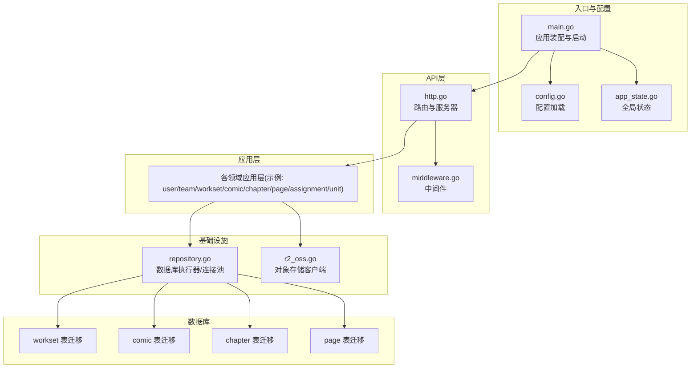
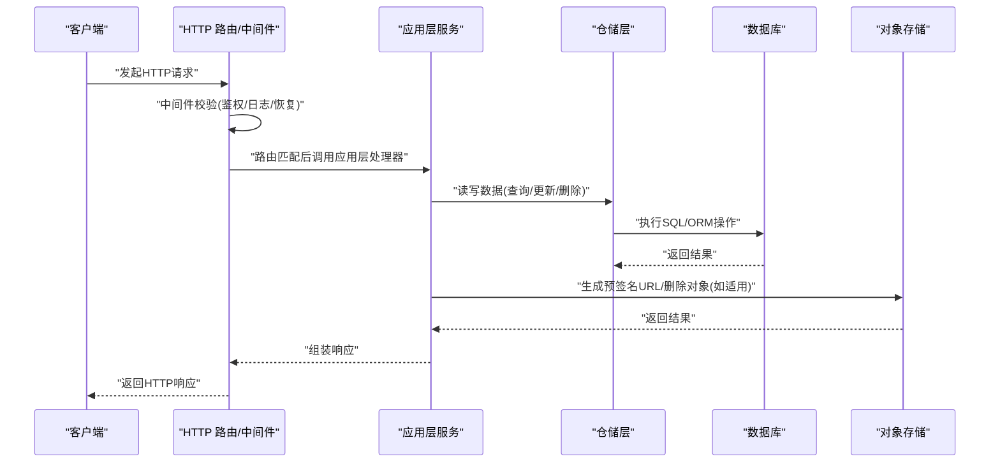
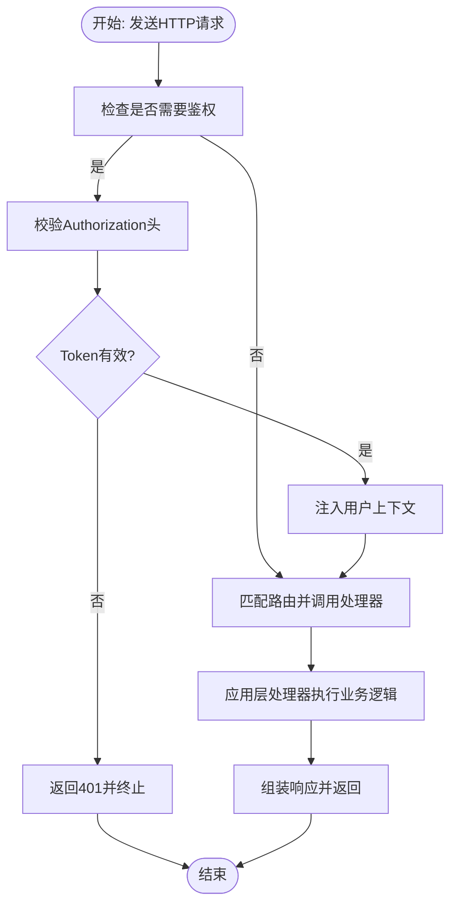
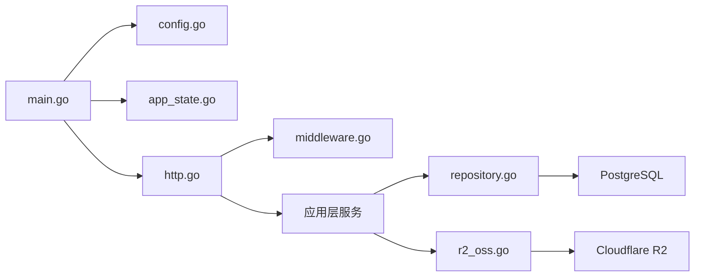

# 集成测试

<cite>
**本文引用的文件**
- [main.go](file://main.go)
- [http.go](file://internal/api/http/http.go)
- [middleware.go](file://internal/api/http/middleware.go)
- [config.go](file://internal/config/config.go)
- [app_state.go](file://internal/state/app_state.go)
- [repository.go](file://internal/infrastructure/repository/repository.go)
- [r2_oss.go](file://internal/infrastructure/external/r2_oss.go)
- [20260306101211_workset-table.up.sql](file://migrations/20260306101211_workset-table.up.sql)
- [20260306101212_comic-table.up.sql](file://migrations/20260306101212_comic-table.up.sql)
- [20260306101213_chapter-table.up.sql](file://migrations/20260306101213_chapter-table.up.sql)
- [20260306101214_page-table.up.sql](file://migrations/20260306101214_page-table.up.sql)
</cite>

## 目录
1. [引言](#引言)
2. [项目结构](#项目结构)
3. [核心组件](#核心组件)
4. [架构总览](#架构总览)
5. [详细组件分析](#详细组件分析)
6. [依赖分析](#依赖分析)
7. [性能考虑](#性能考虑)
8. [故障排查指南](#故障排查指南)
9. [结论](#结论)
10. [附录](#附录)

## 引言
本文件面向漫画翻译协作平台的集成测试实施，目标是提供一套可落地的测试方案，覆盖API层与应用层之间的集成、数据库迁移与一致性、仓储层与数据库的集成验证，以及外部对象存储服务的端到端验证。文档同时给出测试环境搭建、测试数据准备与典型业务流程的测试场景设计，帮助测试团队高效验证跨组件交互与完整业务闭环。

## 项目结构
该系统采用分层架构：入口程序负责装配应用与基础设施；API层通过HTTP框架组织路由与中间件；应用层封装业务逻辑；仓储层对接数据库；外部模块对接对象存储服务。迁移脚本定义了数据库表结构与索引，支撑上层业务模型。

图表来源
- [main.go:25-145](file://main.go#L25-L145)
- [http.go:16-151](file://internal/api/http/http.go#L16-L151)
- [middleware.go:15-79](file://internal/api/http/middleware.go#L15-L79)
- [config.go:11-59](file://internal/config/config.go#L11-L59)
- [app_state.go:23-49](file://internal/state/app_state.go#L23-L49)
- [repository.go:11-29](file://internal/infrastructure/repository/repository.go#L11-L29)
- [r2_oss.go:29-79](file://internal/infrastructure/external/r2_oss.go#L29-L79)
- [20260306101211_workset-table.up.sql:1-19](file://migrations/20260306101211_workset-table.up.sql#L1-L19)
- [20260306101212_comic-table.up.sql:1-37](file://migrations/20260306101212_comic-table.up.sql#L1-L37)
- [20260306101213_chapter-table.up.sql:1-38](file://migrations/20260306101213_chapter-table.up.sql#L1-L38)
- [20260306101214_page-table.up.sql:1-25](file://migrations/20260306101214_page-table.up.sql#L1-L25)

章节来源
- [main.go:25-145](file://main.go#L25-L145)
- [http.go:16-151](file://internal/api/http/http.go#L16-L151)
- [config.go:11-59](file://internal/config/config.go#L11-L59)
- [app_state.go:23-49](file://internal/state/app_state.go#L23-L49)
- [repository.go:11-29](file://internal/infrastructure/repository/repository.go#L11-L29)
- [r2_oss.go:29-79](file://internal/infrastructure/external/r2_oss.go#L29-L79)

## 核心组件
- 应用装配与启动：入口程序加载环境变量与配置，初始化日志、数据库执行器与各仓储，构建应用层服务，并启动HTTP服务器。
- API层：基于HTTP框架组织路由分组与中间件链路，提供认证、授权、资源管理等接口。
- 应用层：封装业务规则与流程编排，协调仓储与外部服务。
- 基础设施：数据库执行器负责连接池配置；对象存储客户端负责预签名URL生成与对象删除。
- 数据库：迁移脚本定义多层级业务表结构与索引，确保查询性能与数据一致性。

章节来源
- [main.go:25-145](file://main.go#L25-L145)
- [http.go:16-151](file://internal/api/http/http.go#L16-L151)
- [repository.go:11-29](file://internal/infrastructure/repository/repository.go#L11-L29)
- [r2_oss.go:29-79](file://internal/infrastructure/external/r2_oss.go#L29-L79)

## 架构总览
下图展示了从HTTP请求到应用层再到仓储与数据库的整体调用路径，以及外部对象存储的集成点。

图表来源
- [http.go:16-151](file://internal/api/http/http.go#L16-L151)
- [middleware.go:15-79](file://internal/api/http/middleware.go#L15-L79)
- [repository.go:11-29](file://internal/infrastructure/repository/repository.go#L11-L29)
- [r2_oss.go:81-140](file://internal/infrastructure/external/r2_oss.go#L81-L140)

## 详细组件分析

### API层与应用层集成测试策略
- HTTP请求响应验证
  - 路由匹配测试：针对每个路由分组与具体端点构造请求，断言状态码与响应体结构，确保路由映射正确。
  - 响应内容验证：对列表、详情、创建、更新、删除等操作断言字段完整性与类型。
- 路由匹配测试
  - 无认证路由：如登录/注册，断言未携带有效Token时的行为。
  - 授权路由：携带无效或过期Token时应拒绝；携带有效Token时应放行。
- 中间件功能测试
  - 日志中间件：开发环境下断言日志中包含方法、路径、状态码、耗时、请求ID等字段。
  - 鉴权中间件：断言缺失/格式错误/无效Token的拒绝行为；成功鉴权后上下文注入用户ID。
  - 恢复中间件：触发panic路径时应返回标准错误响应，避免进程崩溃。

图表来源
- [http.go:38-149](file://internal/api/http/http.go#L38-L149)
- [middleware.go:47-79](file://internal/api/http/middleware.go#L47-L79)

章节来源
- [http.go:38-149](file://internal/api/http/http.go#L38-L149)
- [middleware.go:15-79](file://internal/api/http/middleware.go#L15-L79)

### 数据库集成测试设计
- 迁移脚本验证
  - 使用独立测试数据库实例执行迁移，验证DDL成功与约束存在性（主键、外键、唯一索引、普通索引）。
  - 针对每张表断言关键列、默认值与时序字段。
- 数据一致性测试
  - 关联写入：先创建团队，再在该团队下创建作品、章节、页面，最后建立分配关系，断言引用完整性。
  - 更新传播：修改父实体属性后，子实体查询结果应反映最新状态。
- 事务回滚测试
  - 在同一事务中执行多步写入，中途模拟失败，断言所有变更均被回滚。
  - 对于幂等写入（如唯一索引冲突），断言错误码与回滚行为符合预期。

```mermaid
erDiagram
TEAM {
text id PK
text name
timestamptz created_at
timestamptz updated_at
}
WORKSET {
text id PK
text team_id FK
integer index
text name
text description
integer comic_count
timestamptz created_at
timestamptz updated_at
}
COMIC {
text id PK
text workset_id FK
integer index
text title
text author
text description
integer chapter_count
text creator_id
timestamptz last_active_at
timestamptz created_at
timestamptz updated_at
timestamptz deleted_at
}
CHAPTER {
text id PK
text comic_id FK
integer index
text subtitle
integer page_count
integer total_unit_count
integer translated_unit_count
integer proofread_unit_count
timestamptz uploaded_at
timestamptz translating_at
timestamptz translated_at
timestamptz proofreading_at
timestamptz proofread_at
timestamptz typesetting_at
timestamptz typeset_at
timestamptz reviewed_at
timestamptz published_at
text creator_id
timestamptz created_at
timestamptz updated_at
timestamptz deleted_at
}
PAGE {
text id PK
text chapter_id FK
integer index
text oss_key
boolean uploaded
integer total_unit_count
integer translated_unit_count
integer proofread_unit_count
text creator_id
timestamptz created_at
timestamptz updated_at
}
TEAM ||--o{ WORKSET : "拥有"
WORKSET ||--o{ COMIC : "包含"
COMIC ||--o{ CHAPTER : "包含"
CHAPTER ||--o{ PAGE : "包含"
```

图表来源
- [20260306101211_workset-table.up.sql:1-19](file://migrations/20260306101211_workset-table.up.sql#L1-L19)
- [20260306101212_comic-table.up.sql:1-37](file://migrations/20260306101212_comic-table.up.sql#L1-L37)
- [20260306101213_chapter-table.up.sql:1-38](file://migrations/20260306101213_chapter-table.up.sql#L1-L38)
- [20260306101214_page-table.up.sql:1-25](file://migrations/20260306101214_page-table.up.sql#L1-L25)

章节来源
- [20260306101211_workset-table.up.sql:1-19](file://migrations/20260306101211_workset-table.up.sql#L1-L19)
- [20260306101212_comic-table.up.sql:1-37](file://migrations/20260306101212_comic-table.up.sql#L1-L37)
- [20260306101213_chapter-table.up.sql:1-38](file://migrations/20260306101213_chapter-table.up.sql#L1-L38)
- [20260306101214_page-table.up.sql:1-25](file://migrations/20260306101214_page-table.up.sql#L1-L25)

### 仓储层与数据库集成验证
- 查询性能测试
  - 列表查询：对关联表进行分页查询，断言排序与过滤条件命中索引；记录慢查询阈值。
  - 单条查询：按主键与唯一索引查询，断言返回正确记录且无多余字段。
- 连接池管理
  - 并发压力下观察连接数、空闲连接与最大连接上限；断言在高并发下无连接泄漏。
- 并发访问测试
  - 多线程/多协程同时写入同一批数据，断言唯一约束不冲突；读写并发下不出现脏读或丢失更新。

章节来源
- [repository.go:11-29](file://internal/infrastructure/repository/repository.go#L11-L29)

### 外部对象存储集成测试
- 预签名URL生成
  - 断言生成PUT/GET预签名URL成功，URL可直接用于上传/访问；对不同图片类型断言Content-Type推断。
- 批量删除
  - 传入多个对象Key，断言删除结果；对不存在Key进行重试与容错处理。
- 错误与重试
  - 对异常网络或服务端错误，断言重试机制与最终错误传播。

章节来源
- [r2_oss.go:81-140](file://internal/infrastructure/external/r2_oss.go#L81-L140)
- [r2_oss.go:142-198](file://internal/infrastructure/external/r2_oss.go#L142-L198)

### 测试环境搭建与数据准备
- 环境变量
  - 加载环境变量与配置文件，确保JWT密钥、数据库URL、对象存储凭据齐全。
- 数据库
  - 使用独立测试数据库，执行迁移脚本初始化表结构与索引。
- 外部服务
  - 配置对象存储端点、桶名与凭据；若使用自定义域名，需在测试中显式配置。
- 测试数据
  - 以最小必要数据驱动测试：先创建用户/团队，再创建作品/章节/页面，最后建立分配关系。

章节来源
- [config.go:11-59](file://internal/config/config.go#L11-L59)
- [main.go:25-42](file://main.go#L25-L42)
- [repository.go:11-29](file://internal/infrastructure/repository/repository.go#L11-L29)
- [r2_oss.go:29-79](file://internal/infrastructure/external/r2_oss.go#L29-L79)

### 典型测试场景设计
- 场景一：用户登录与资料管理
  - 步骤：注册用户 -> 登录获取Token -> 携带Token访问个人资料接口 -> 更新资料 -> 断言鉴权中间件生效。
- 场景二：团队内作品全流程
  - 步骤：创建团队 -> 创建工作集 -> 创建作品 -> 创建章节 -> 创建页面 -> 建立分配 -> 断言关联查询与索引命中。
- 场景三：图片上传与清理
  - 步骤：申请预签名URL -> 上传图片 -> 生成访问URL -> 删除对象 -> 断言URL失效与删除结果。

章节来源
- [http.go:40-92](file://internal/api/http/http.go#L40-L92)
- [middleware.go:47-79](file://internal/api/http/middleware.go#L47-L79)
- [r2_oss.go:81-140](file://internal/infrastructure/external/r2_oss.go#L81-L140)

## 依赖分析
- 组件耦合
  - 入口程序通过全局状态聚合应用层服务，API层仅依赖状态与配置，降低耦合度。
  - 应用层依赖仓储接口与外部服务接口，便于替换实现与测试替身。
- 外部依赖
  - 数据库：GORM + PostgreSQL驱动；连接池参数来自配置。
  - 对象存储：AWS SDK for Go v2，支持预签名URL与批量删除。
- 潜在循环依赖
  - 当前结构清晰，未见循环导入；仓储与应用层通过接口解耦。

图表来源
- [main.go:25-145](file://main.go#L25-L145)
- [http.go:16-151](file://internal/api/http/http.go#L16-L151)
- [middleware.go:15-79](file://internal/api/http/middleware.go#L15-L79)
- [repository.go:11-29](file://internal/infrastructure/repository/repository.go#L11-L29)
- [r2_oss.go:29-79](file://internal/infrastructure/external/r2_oss.go#L29-L79)

章节来源
- [main.go:25-145](file://main.go#L25-L145)
- [http.go:16-151](file://internal/api/http/http.go#L16-L151)
- [repository.go:11-29](file://internal/infrastructure/repository/repository.go#L11-L29)
- [r2_oss.go:29-79](file://internal/infrastructure/external/r2_oss.go#L29-L79)

## 性能考虑
- 连接池参数
  - 合理设置最大打开连接数与最小空闲连接数，避免连接争用与资源耗尽。
- 索引与查询
  - 针对高频查询字段建立索引；避免N+1查询，优先使用JOIN与批量查询。
- 中间件开销
  - 开发环境开启详细日志，生产关闭冗余日志；确保鉴权与恢复中间件不会成为瓶颈。
- 对象存储
  - 预签名URL减少服务端转发开销；批量删除时控制单次删除数量，避免超时。

## 故障排查指南
- 配置问题
  - 环境变量缺失：检查配置加载与环境变量设置，确保数据库URL、JWT密钥、对象存储凭据齐全。
- 鉴权失败
  - Authorization头部格式错误或Token无效：确认中间件校验逻辑与Token签发方一致。
- 数据库异常
  - 迁移失败：核对DDL与约束；检查连接池参数与权限。
  - 并发冲突：检查唯一索引与事务隔离级别，必要时引入重试或乐观锁。
- 对象存储异常
  - 预签名URL不可用：确认桶名与自定义域名配置；检查凭据与区域设置。
  - 删除失败：查看重试次数与错误类型，区分“对象不存在”与真实错误。

章节来源
- [config.go:44-56](file://internal/config/config.go#L44-L56)
- [middleware.go:50-78](file://internal/api/http/middleware.go#L50-L78)
- [repository.go:25-26](file://internal/infrastructure/repository/repository.go#L25-L26)
- [r2_oss.go:50-79](file://internal/infrastructure/external/r2_oss.go#L50-L79)

## 结论
通过将API层、应用层、仓储层与外部服务纳入统一的集成测试矩阵，可以系统性地验证端到端业务流程与跨组件交互。建议以迁移脚本为数据基线，围绕路由与中间件行为、数据库一致性与事务回滚、仓储查询性能与连接池管理、对象存储预签名与批量删除等维度设计测试场景，持续提升系统稳定性与交付质量。

## 附录
- 测试用例示例（路径）
  - 登录与鉴权：[http.go:42-44](file://internal/api/http/http.go#L42-L44)、[middleware.go:47-79](file://internal/api/http/middleware.go#L47-L79)
  - 团队与作品：[http.go:63-101](file://internal/api/http/http.go#L63-L101)
  - 章节与页面：[http.go:113-129](file://internal/api/http/http.go#L113-L129)
  - 分配与单元：[http.go:131-145](file://internal/api/http/http.go#L131-L145)
  - 连接池参数：[repository.go:25-26](file://internal/infrastructure/repository/repository.go#L25-L26)
  - 预签名URL生成：[r2_oss.go:81-99](file://internal/infrastructure/external/r2_oss.go#L81-L99)
  - 批量删除：[r2_oss.go:142-198](file://internal/infrastructure/external/r2_oss.go#L142-L198)