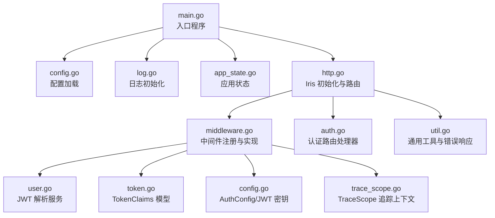
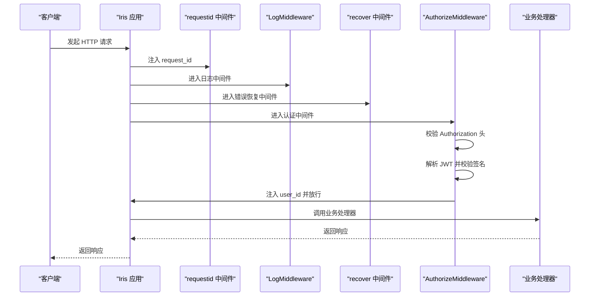
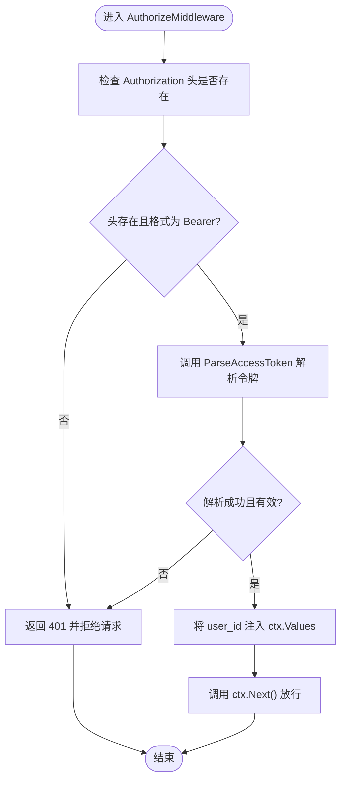
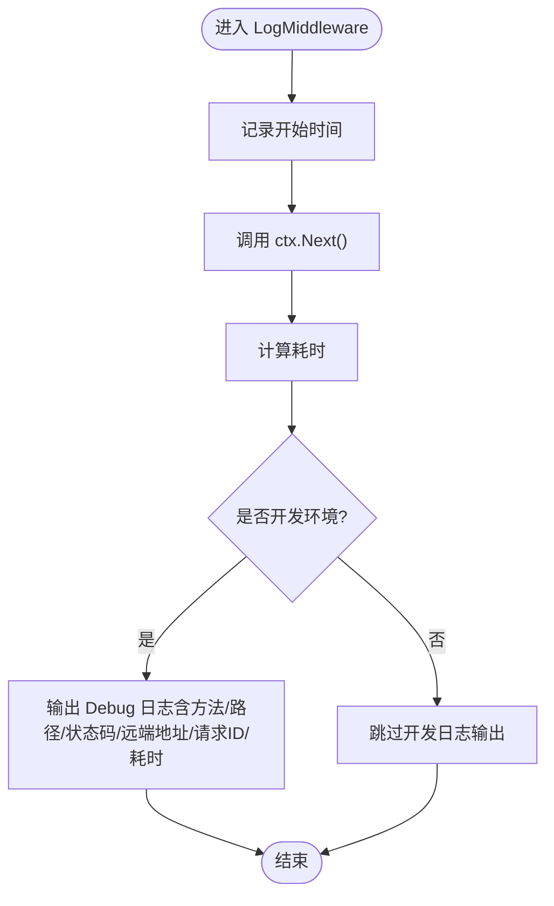
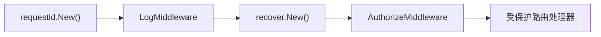
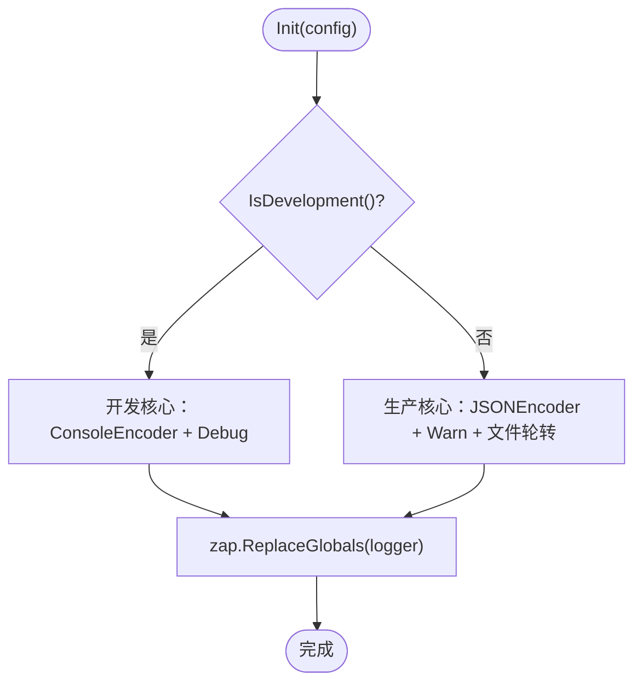
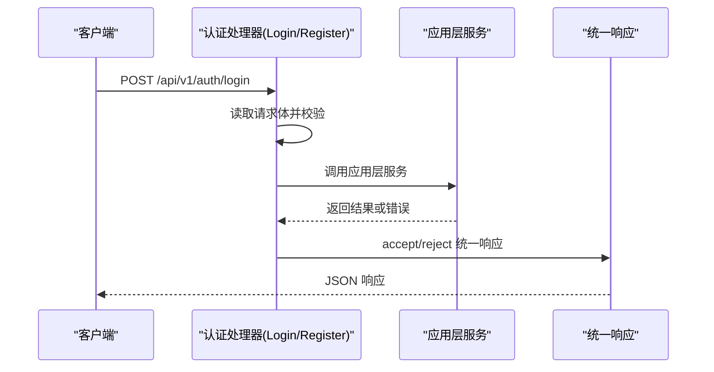
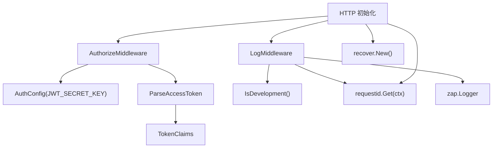

# 中间件体系

<cite>
**本文引用的文件列表**
- [middleware.go](file://internal/api/http/middleware.go)
- [http.go](file://internal/api/http/http.go)
- [log.go](file://internal/log/log.go)
- [user.go](file://internal/domain/service/user.go)
- [token.go](file://internal/domain/model/token.go)
- [auth.go](file://internal/api/http/auth.go)
- [util.go](file://internal/api/http/util.go)
- [config.go](file://internal/config/config.go)
- [app_state.go](file://internal/state/app_state.go)
- [trace_scope.go](file://internal/util/trace_scope.go)
- [main.go](file://main.go)
</cite>

## 目录
1. [简介](#简介)
2. [项目结构](#项目结构)
3. [核心组件](#核心组件)
4. [架构总览](#架构总览)
5. [详细组件分析](#详细组件分析)
6. [依赖分析](#依赖分析)
7. [性能考量](#性能考量)
8. [故障排查指南](#故障排查指南)
9. [结论](#结论)
10. [附录](#附录)

## 简介
本文件系统性梳理漫画翻译协作平台的中间件体系，重点覆盖以下方面：
- 认证中间件的 JWT 令牌验证流程：令牌解析、用户身份注入与权限检查的前置条件。
- 日志中间件的请求追踪与审计能力：如何在不同环境下采集请求信息并输出到控制台与文件。
- 中间件执行顺序与组合模式：中间件链的构建、异常处理与请求生命周期管理。
- 中间件开发最佳实践：性能优化、错误处理与可测试性设计。
- 自定义中间件与第三方中间件集成示例路径：便于开发者快速扩展。

## 项目结构
后端基于 Iris 框架，采用分层架构与中间件组合模式：
- 入口程序负责加载配置、初始化日志、装配应用层与仓储层，并启动 HTTP 服务。
- HTTP 层负责路由组织、中间件注册与处理器绑定。
- 认证中间件负责拦截请求，校验 Authorization 头中的 Bearer 令牌，并将用户标识注入上下文。
- 日志中间件负责统计请求耗时、收集请求元数据并在开发环境输出调试日志。
- 错误恢复中间件用于捕获 panic 并保证服务稳定性。
- 配置模块负责加载运行环境与密钥，日志模块负责按环境切换编码与输出目标。

图表来源
- [main.go:25-145](file://main.go#L25-L145)
- [http.go:26-151](file://internal/api/http/http.go#L26-L151)
- [middleware.go:15-79](file://internal/api/http/middleware.go#L15-L79)
- [user.go:43-68](file://internal/domain/service/user.go#L43-L68)
- [token.go:5-8](file://internal/domain/model/token.go#L5-L8)
- [config.go:69-83](file://internal/config/config.go#L69-L83)
- [trace_scope.go:12-30](file://internal/util/trace_scope.go#L12-L30)
- [util.go:41-58](file://internal/api/http/util.go#L41-L58)

章节来源
- [main.go:25-145](file://main.go#L25-L145)
- [http.go:26-151](file://internal/api/http/http.go#L26-L151)

## 核心组件
- 认证中间件 AuthorizeMiddleware：校验 Authorization 头格式与 Bearer 令牌有效性，解析出用户标识并注入到请求上下文，供后续处理器使用。
- 日志中间件 LogMiddleware：在请求完成后统计耗时，收集方法、路径、状态码、远端地址、请求 ID 等信息，在开发环境输出调试日志。
- 错误恢复中间件 recover.New()：捕获 panic，避免服务崩溃。
- 请求 ID 中间件 requestid.New()：为每个请求生成唯一 ID，贯穿日志与追踪。
- JWT 服务 ParseAccessToken：使用 HS256 算法与配置密钥解析令牌，返回 TokenClaims。
- TokenClaims 模型：承载用户标识与标准声明。
- 配置模块 AuthConfig：加载 JWT 密钥与过期时长等认证相关配置。
- TraceScope 工具：为日志与追踪注入统一字段（如 request_id）。

章节来源
- [middleware.go:15-79](file://internal/api/http/middleware.go#L15-L79)
- [log.go:13-83](file://internal/log/log.go#L13-L83)
- [user.go:43-68](file://internal/domain/service/user.go#L43-L68)
- [token.go:5-8](file://internal/domain/model/token.go#L5-L8)
- [config.go:69-83](file://internal/config/config.go#L69-L83)
- [trace_scope.go:12-30](file://internal/util/trace_scope.go#L12-L30)
- [util.go:41-58](file://internal/api/http/util.go#L41-L58)

## 架构总览
中间件链在 Iris 初始化阶段注册，形成如下顺序：
- requestid.New()：生成请求 ID 并注入上下文。
- LogMiddleware(appState)：记录请求耗时与元信息（开发环境）。
- recover.New()：捕获 panic，保障稳定性。
- AuthorizeMiddleware(appState)：对受保护路由进行认证拦截。

图表来源
- [http.go:29-34](file://internal/api/http/http.go#L29-L34)
- [middleware.go:15-79](file://internal/api/http/middleware.go#L15-L79)
- [user.go:43-68](file://internal/domain/service/user.go#L43-L68)

## 详细组件分析

### 认证中间件：JWT 令牌验证流程
- 输入校验：要求存在 Authorization 头，且格式为 Bearer <token>。
- 令牌解析：调用 ParseAccessToken，使用 HS256 算法与配置密钥进行签名验证与 Claims 解析。
- 用户注入：当解析成功且包含用户标识时，将 user_id 写入请求上下文 Values，供后续处理器读取。
- 异常处理：任一步骤失败均返回 401，并通过统一错误响应格式返回消息。

图表来源
- [middleware.go:50-78](file://internal/api/http/middleware.go#L50-L78)
- [user.go:43-68](file://internal/domain/service/user.go#L43-L68)
- [util.go:11-22](file://internal/api/http/util.go#L11-L22)

章节来源
- [middleware.go:47-79](file://internal/api/http/middleware.go#L47-L79)
- [user.go:43-68](file://internal/domain/service/user.go#L43-L68)
- [util.go:11-22](file://internal/api/http/util.go#L11-L22)

### 日志中间件：请求追踪与审计
- 执行时机：在 ctx.Next() 之后计算请求耗时，确保包含下游处理器与响应序列化的耗时。
- 开发环境输出：收集方法、路径、状态码、远端地址、请求 ID 与耗时，使用 Debug 级别输出。
- 生产环境输出：由全局日志初始化决定（见“日志模块”），通常输出到控制台与文件，级别更高。

图表来源
- [middleware.go:18-44](file://internal/api/http/middleware.go#L18-L44)

章节来源
- [middleware.go:15-45](file://internal/api/http/middleware.go#L15-L45)

### 中间件执行顺序与组合模式
- 注册顺序：requestid -> LogMiddleware -> recover -> 认证中间件（受保护路由）。
- 组合方式：通过 Iris 的 Party 机制将认证中间件作用于受保护路由前缀；未登录路由（如 /auth）不挂载认证中间件。
- 生命周期：中间件在请求进入时按注册顺序依次执行，ctx.Next() 作为“放行点”，在下游处理器返回后再回到中间件执行后续逻辑（如日志中间件统计耗时）。

图表来源
- [http.go:29-48](file://internal/api/http/http.go#L29-L48)

章节来源
- [http.go:26-151](file://internal/api/http/http.go#L26-L151)

### 日志模块：环境化配置与输出策略
- 开发环境：使用 ConsoleEncoder，开启颜色输出与 ISO8601 时间格式，级别 Debug。
- 生产环境：使用 JSONEncoder，级别 Warn，同时输出到控制台与文件（lumberjack 轮转），文件路径 logs/main-service.log。
- 全局替换：初始化后使用 zap.ReplaceGlobals 将全局 logger 注入到整个应用。

图表来源
- [log.go:13-83](file://internal/log/log.go#L13-L83)

章节来源
- [log.go:13-83](file://internal/log/log.go#L13-L83)

### 配置与密钥管理
- AuthConfig：从环境变量加载 JWT_SECRET_KEY，用于 HS256 签名验证。
- AppConfig：提供 IsProduction()/IsDevelopment() 判断，驱动日志与中间件行为差异。
- 中间件密钥来源：AuthorizeMiddleware 从 AppState.AppConfig.AuthConfig.JWTSecretKey 获取密钥。

章节来源
- [config.go:69-83](file://internal/config/config.go#L69-L83)
- [config.go:61-67](file://internal/config/config.go#L61-L67)
- [middleware.go:48](file://internal/api/http/middleware.go#L48)

### 认证流程与处理器集成
- 登录/注册处理器：auth.go 中 Login/ Register 将请求体解析为 DTO，调用应用层服务，成功后返回统一响应格式。
- 统一响应格式：util.accept 与 util.reject 提供统一的 200 响应体结构，错误通过 Code/Message 字段表达。
- 追踪上下文：buildTraceScope 从 requestid 中间件提取 request_id，注入到日志上下文，便于跨服务追踪。

图表来源
- [auth.go:22-72](file://internal/api/http/auth.go#L22-L72)
- [util.go:24-39](file://internal/api/http/util.go#L24-L39)
- [util.go:41-46](file://internal/api/http/util.go#L41-L46)

章节来源
- [auth.go:22-72](file://internal/api/http/auth.go#L22-L72)
- [util.go:24-58](file://internal/api/http/util.go#L24-L58)

## 依赖分析
- 中间件依赖关系
  - AuthorizeMiddleware 依赖：AppState.AppConfig.AuthConfig.JWTSecretKey、service.ParseAccessToken、ctx.Values 注入。
  - LogMiddleware 依赖：AppState.AppConfig.IsDevelopment()、requestid.Get(ctx)、zap 日志。
  - recover/requestid 来自 Iris 中间件库。
- 服务与模型依赖
  - ParseAccessToken 依赖：HS256 签名算法、TokenClaims 模型。
  - TokenClaims 模型依赖：golang-jwt/jwt/v5 的 RegisteredClaims 与自定义字段。
- 配置与状态
  - AppState 汇聚各应用层服务实例，供 HTTP 层注入。
  - 配置加载失败会阻断启动，确保运行时一致性。

图表来源
- [middleware.go:47-79](file://internal/api/http/middleware.go#L47-L79)
- [user.go:43-68](file://internal/domain/service/user.go#L43-L68)
- [token.go:5-8](file://internal/domain/model/token.go#L5-L8)
- [config.go:61-83](file://internal/config/config.go#L61-L83)
- [http.go:29-34](file://internal/api/http/http.go#L29-L34)

章节来源
- [middleware.go:47-79](file://internal/api/http/middleware.go#L47-L79)
- [user.go:43-68](file://internal/domain/service/user.go#L43-L68)
- [token.go:5-8](file://internal/domain/model/token.go#L5-L8)
- [config.go:61-83](file://internal/config/config.go#L61-L83)
- [http.go:29-34](file://internal/api/http/http.go#L29-L34)

## 性能考量
- 中间件顺序优化
  - requestid 与 recover 放在靠前位置，避免后续中间件异常导致的重复开销。
  - 日志中间件在 ctx.Next() 后执行，确保包含下游处理耗时，避免低估。
- JWT 解析成本
  - HS256 解析为 CPU 密集型，建议在高并发场景下：
    - 合理设置令牌过期时间，减少频繁签发。
    - 对热点接口考虑缓存用户会话信息（需结合业务安全策略）。
- 日志输出
  - 生产环境使用 JSON + 文件轮转，避免控制台输出带来的 I/O 压力。
  - 开发环境仅输出 Debug 级别，避免冗余日志影响性能。
- 错误恢复
  - recover 中间件可避免 panic 导致进程退出，但应配合日志与监控，定位问题根因。

## 故障排查指南
- 401 未授权
  - 现象：返回统一错误响应，Code=401。
  - 常见原因：缺少 Authorization 头、格式不是 Bearer、令牌无效或不含用户标识。
  - 排查要点：确认 Authorization 头格式、令牌签名与密钥一致、令牌未过期。
- 令牌解析失败
  - 现象：ParseAccessToken 抛错或返回无效 Claims。
  - 常见原因：密钥不匹配、签名算法不正确、令牌被篡改。
  - 排查要点：核对 JWT_SECRET_KEY 环境变量、HS256 签名一致性。
- 日志缺失
  - 现象：开发环境未看到请求日志。
  - 常见原因：未在 requestid 之后调用 requestid.Get(ctx)、非开发环境。
  - 排查要点：确认中间件注册顺序、IsDevelopment() 判断。
- Panic 导致服务中断
  - 现象：服务崩溃。
  - 常见原因：未启用 recover 中间件或异常未被捕获。
  - 排查要点：确认 recover 中间件已注册、日志级别包含 Panic。

章节来源
- [middleware.go:50-78](file://internal/api/http/middleware.go#L50-L78)
- [user.go:43-68](file://internal/domain/service/user.go#L43-L68)
- [util.go:11-22](file://internal/api/http/util.go#L11-L22)
- [http.go:29-34](file://internal/api/http/http.go#L29-L34)

## 结论
本中间件体系以 Iris 中间件链为核心，结合 requestid、日志与认证中间件，实现了：
- 明确的请求生命周期与可追踪性（request_id）。
- 基于 HS256 的 JWT 认证与用户标识注入。
- 环境化日志输出与耗时统计。
- 稳健的错误恢复与统一响应格式。
建议在实际落地中持续关注令牌密钥管理、日志级别与输出策略、以及中间件顺序对性能的影响，确保在高并发场景下的稳定性与可观测性。

## 附录
- 自定义中间件开发步骤
  - 定义 Handler：接收 iris.Context，实现前置逻辑与 ctx.Next() 放行。
  - 注册中间件：在 initialize 中 app.Use(...) 注册，注意顺序。
  - 与配置集成：通过 AppState/AppConfig 获取运行参数（如密钥、开关）。
  - 与日志集成：使用 requestid.Get(ctx) 提取 request_id，注入 TraceScope。
- 第三方中间件集成
  - 参考 Iris 官方中间件库，按相同模式注册与组合。
  - 注意中间件顺序与职责边界，避免重复处理同一请求阶段。
- 最佳实践清单
  - 明确中间件职责单一、顺序合理、异常可控。
  - 统一错误响应格式，便于前端与监控系统消费。
  - 在开发与生产环境分别优化日志级别与输出目标。
  - 对认证中间件进行充分的边界条件测试（空头、格式错误、无效令牌）。