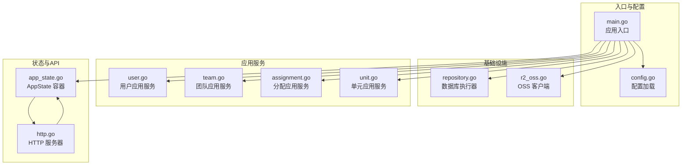
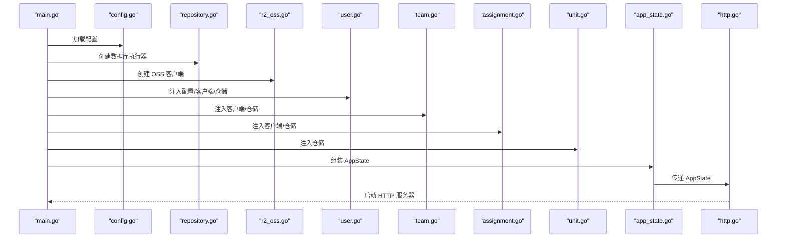
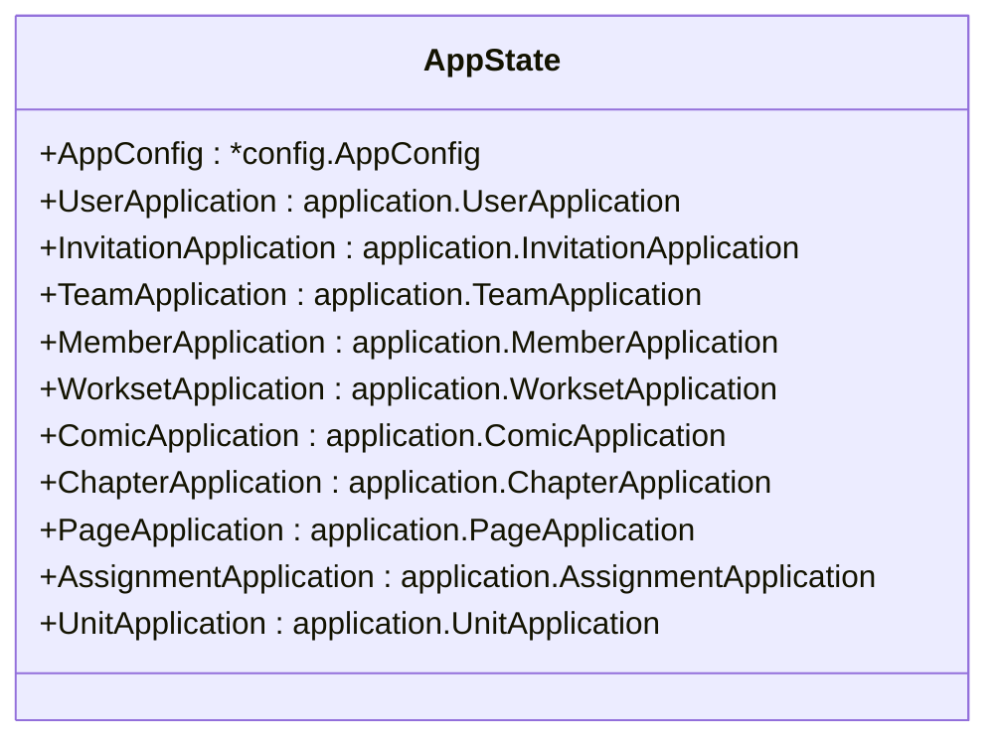
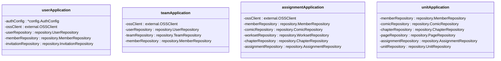
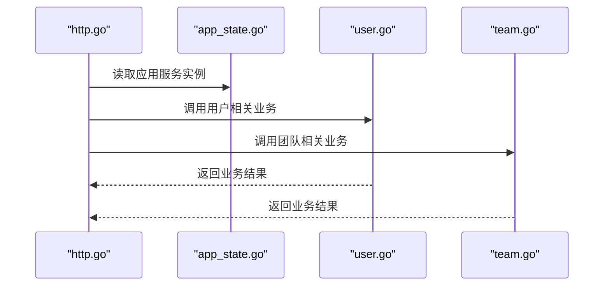
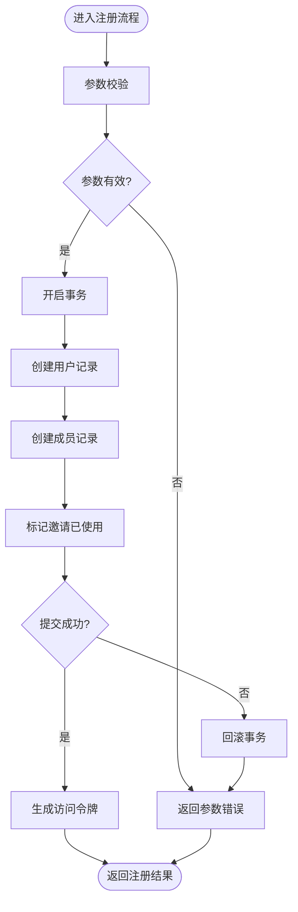
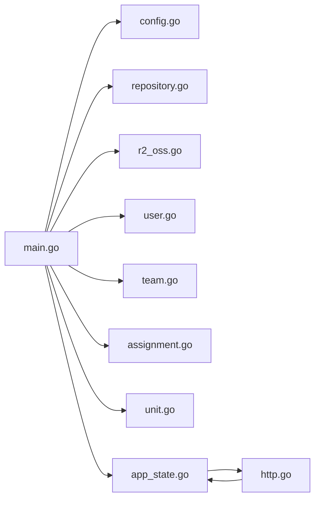

# 依赖注入机制

<cite>
**本文引用的文件**
- [main.go](file://main.go)
- [app_state.go](file://internal/state/app_state.go)
- [config.go](file://internal/config/config.go)
- [repository.go](file://internal/infrastructure/repository/repository.go)
- [r2_oss.go](file://internal/infrastructure/external/r2_oss.go)
- [http.go](file://internal/api/http/http.go)
- [user.go](file://internal/application/user.go)
- [team.go](file://internal/application/team.go)
- [assignment.go](file://internal/application/assignment.go)
- [unit.go](file://internal/application/unit.go)
- [ARCHETECT.md](file://docs/ARCHETECT.md)
- [SKILL.md](file://.copilot-skill/build-application-closed-loop/SKILL.md)
</cite>

## 目录
1. [简介](#简介)
2. [项目结构](#项目结构)
3. [核心组件](#核心组件)
4. [架构总览](#架构总览)
5. [详细组件分析](#详细组件分析)
6. [依赖分析](#依赖分析)
7. [性能考虑](#性能考虑)
8. [故障排查指南](#故障排查指南)
9. [结论](#结论)
10. [附录](#附录)

## 简介
本文件系统性阐述漫画翻译协作平台中的依赖注入机制，重点围绕 AppState 作为“中央协调者”的容器角色，说明如何通过构造函数注入实现松耦合的组件装配与生命周期管理。文档还覆盖应用服务（Application Services）的创建、配置与生命周期，以及依赖注入在测试中的优势与最佳实践。

## 项目结构
本项目采用分层架构与 DDD 思想结合的组织方式：
- 应用层（Application）：面向用例的服务，协调多个仓储与外部依赖，统一管理事务边界
- 基础设施层（Infrastructure）：数据库执行器、外部 OSS 客户端等
- 领域层（Domain）：模型、仓储接口与领域服务
- API 层（HTTP）：路由与处理器，仅负责 HTTP 细节与调用应用层
- 状态与配置：AppState 作为全局状态容器，集中持有应用服务实例与配置

图表来源
- [main.go:25-145](file://main.go#L25-L145)
- [app_state.go:8-21](file://internal/state/app_state.go#L8-L21)
- [config.go:11-59](file://internal/config/config.go#L11-L59)
- [repository.go:11-29](file://internal/infrastructure/repository/repository.go#L11-L29)
- [r2_oss.go:29-79](file://internal/infrastructure/external/r2_oss.go#L29-L79)
- [http.go:16-24](file://internal/api/http/http.go#L16-L24)

章节来源
- [main.go:25-145](file://main.go#L25-L145)
- [app_state.go:8-21](file://internal/state/app_state.go#L8-L21)
- [config.go:11-59](file://internal/config/config.go#L11-L59)
- [repository.go:11-29](file://internal/infrastructure/repository/repository.go#L11-L29)
- [r2_oss.go:29-79](file://internal/infrastructure/external/r2_oss.go#L29-L79)
- [http.go:16-24](file://internal/api/http/http.go#L16-L24)

## 核心组件
- AppState：集中持有应用配置与所有应用服务实例，作为依赖注入的“容器”。通过构造函数注入各应用服务，实现松耦合与可替换。
- 应用服务：每个资源（用户、团队、分配、单元等）对应一个应用服务，负责业务流程编排与事务管理。
- 基础设施：数据库执行器与 OSS 客户端，通过工厂函数创建并注入到应用服务。
- HTTP 层：路由与处理器仅依赖 AppState，不直接依赖具体实现，便于替换与测试。

章节来源
- [app_state.go:8-21](file://internal/state/app_state.go#L8-L21)
- [user.go:75-104](file://internal/application/user.go#L75-L104)
- [team.go:65-90](file://internal/application/team.go#L65-L90)
- [assignment.go:57-90](file://internal/application/assignment.go#L57-L90)
- [unit.go:46-76](file://internal/application/unit.go#L46-L76)

## 架构总览
依赖注入在本项目中的体现：
- 入口层（main.go）负责创建基础设施与应用服务实例，并组装到 AppState
- AppState 作为全局容器，向 HTTP 层暴露应用服务
- 应用服务内部通过构造函数注入所需的仓储与外部依赖，保证职责单一与可测试性

图表来源
- [main.go:30-145](file://main.go#L30-L145)
- [config.go:11-59](file://internal/config/config.go#L11-L59)
- [repository.go:11-29](file://internal/infrastructure/repository/repository.go#L11-L29)
- [r2_oss.go:29-79](file://internal/infrastructure/external/r2_oss.go#L29-L79)
- [user.go:75-104](file://internal/application/user.go#L75-L104)
- [team.go:65-90](file://internal/application/team.go#L65-L90)
- [assignment.go:57-90](file://internal/application/assignment.go#L57-L90)
- [unit.go:46-76](file://internal/application/unit.go#L46-L76)
- [app_state.go:23-49](file://internal/state/app_state.go#L23-L49)
- [http.go:16-24](file://internal/api/http/http.go#L16-L24)

## 详细组件分析

### AppState 作为依赖注入容器
- 角色定位：集中持有 AppConfig 与所有应用服务实例，作为全局依赖提供者
- 构造函数注入：通过 NewAppState 将各应用服务注入，形成稳定的依赖图
- 生命周期：随进程启动创建，贯穿应用运行期

图表来源
- [app_state.go:8-21](file://internal/state/app_state.go#L8-L21)

章节来源
- [app_state.go:23-49](file://internal/state/app_state.go#L23-L49)

### 应用服务的创建与装配
- 用户应用服务（UserApplication）：注入认证配置、OSS 客户端与用户/成员/邀请相关仓储，统一管理注册、登录、头像上传等流程
- 团队应用服务（TeamApplication）：注入 OSS 客户端与用户/团队/成员仓储，负责团队创建、列表、头像上传等
- 分配应用服务（AssignmentApplication）：注入 OSS 客户端与成员/漫画/工作集/章节/分配仓储，负责章节分配的增删改查
- 单元应用服务（UnitApplication）：注入成员/漫画/章节/页面/分配/单元仓储，负责页面单元保存与列表

图表来源
- [user.go:66-104](file://internal/application/user.go#L66-L104)
- [team.go:58-90](file://internal/application/team.go#L58-L90)
- [assignment.go:48-90](file://internal/application/assignment.go#L48-L90)
- [unit.go:40-76](file://internal/application/unit.go#L40-L76)

章节来源
- [user.go:75-104](file://internal/application/user.go#L75-L104)
- [team.go:65-90](file://internal/application/team.go#L65-L90)
- [assignment.go:57-90](file://internal/application/assignment.go#L57-L90)
- [unit.go:46-76](file://internal/application/unit.go#L46-L76)

### HTTP 层与 AppState 的交互
- HTTP 服务器启动时接收 AppState，路由处理器通过 AppState 获取具体应用服务
- 该模式使 HTTP 层与具体实现解耦，便于替换与测试

图表来源
- [http.go:16-24](file://internal/api/http/http.go#L16-L24)
- [app_state.go:8-21](file://internal/state/app_state.go#L8-L21)
- [user.go:106-154](file://internal/application/user.go#L106-L154)
- [team.go:92-130](file://internal/application/team.go#L92-L130)

章节来源
- [http.go:38-151](file://internal/api/http/http.go#L38-L151)
- [app_state.go:8-21](file://internal/state/app_state.go#L8-L21)

### 事务与错误处理流程（以用户注册为例）
用户注册涉及多仓储与事务，应用层统一开启/回滚/提交事务，确保一致性。

图表来源
- [user.go:156-278](file://internal/application/user.go#L156-L278)

章节来源
- [user.go:156-278](file://internal/application/user.go#L156-L278)

## 依赖分析
- 入口层依赖配置、数据库执行器与外部 OSS 客户端，负责创建应用服务并注入 AppState
- 应用服务之间无直接依赖，通过 AppState 统一对外暴露
- HTTP 层仅依赖 AppState，不直接依赖具体实现，降低耦合度

图表来源
- [main.go:30-145](file://main.go#L30-L145)
- [config.go:11-59](file://internal/config/config.go#L11-L59)
- [repository.go:11-29](file://internal/infrastructure/repository/repository.go#L11-L29)
- [r2_oss.go:29-79](file://internal/infrastructure/external/r2_oss.go#L29-L79)
- [user.go:75-104](file://internal/application/user.go#L75-L104)
- [team.go:65-90](file://internal/application/team.go#L65-L90)
- [assignment.go:57-90](file://internal/application/assignment.go#L57-L90)
- [unit.go:46-76](file://internal/application/unit.go#L46-L76)
- [app_state.go:23-49](file://internal/state/app_state.go#L23-L49)
- [http.go:16-24](file://internal/api/http/http.go#L16-L24)

章节来源
- [main.go:30-145](file://main.go#L30-L145)
- [app_state.go:23-49](file://internal/state/app_state.go#L23-L49)

## 性能考虑
- 数据库连接池：通过配置最大打开连接数与最小空闲连接数，平衡并发与资源占用
- 外部依赖：OSS 客户端按需创建，避免重复初始化
- 事务范围：应用层统一管理事务，减少跨层事务传播带来的开销
- 日志与追踪：在应用层统一记录与追踪，避免重复开销

章节来源
- [repository.go:20-29](file://internal/infrastructure/repository/repository.go#L20-L29)
- [config.go:85-100](file://internal/config/config.go#L85-L100)
- [user.go:200-262](file://internal/application/user.go#L200-L262)

## 故障排查指南
- 配置加载失败：检查环境变量与配置文件路径，确认配置解析成功
- 数据库连接失败：核对 DATABASE_URL 与连接池参数，确认数据库可达
- OSS 客户端初始化失败：检查 R2 相关环境变量，确认凭证与桶名正确
- 应用服务依赖为空：构造函数中对空依赖进行 Panic，需检查装配顺序与参数传递
- 事务回滚失败：关注 defer 回滚逻辑与错误日志，确保异常路径正确处理

章节来源
- [config.go:36-59](file://internal/config/config.go#L36-L59)
- [repository.go:11-29](file://internal/infrastructure/repository/repository.go#L11-L29)
- [r2_oss.go:30-79](file://internal/infrastructure/external/r2_oss.go#L30-L79)
- [user.go:82-104](file://internal/application/user.go#L82-L104)
- [team.go:71-90](file://internal/application/team.go#L71-L90)
- [assignment.go:65-90](file://internal/application/assignment.go#L65-L90)
- [unit.go:54-76](file://internal/application/unit.go#L54-L76)

## 结论
本项目通过 AppState 作为依赖注入容器，结合构造函数注入与分层架构，实现了松耦合、可测试与可维护的系统设计。应用服务在统一的事务边界内编排业务流程，HTTP 层仅承担传输职责，整体具备良好的扩展性与稳定性。

## 附录

### 依赖注入在测试中的优势
- Mock 对象：通过接口隔离与构造函数注入，可在测试中注入 Mock 仓储与外部依赖
- 单元测试：针对应用服务的业务逻辑进行独立验证，无需启动完整 HTTP 服务器
- 集成测试：在事务回滚的测试上下文中验证多仓储协作与错误处理

章节来源
- [SKILL.md:43-49](file://.copilot-skill/build-application-closed-loop/SKILL.md#L43-L49)
- [ARCHETECT.md:15](file://docs/ARCHETECT.md#L15)

### 代码示例路径（不展示具体代码内容）
- 入口装配与 AppState 组装：[main.go:56-136](file://main.go#L56-L136)
- 应用服务构造函数注入（用户）：[user.go:75-104](file://internal/application/user.go#L75-L104)
- 应用服务构造函数注入（团队）：[team.go:65-90](file://internal/application/team.go#L65-L90)
- 应用服务构造函数注入（分配）：[assignment.go:57-90](file://internal/application/assignment.go#L57-L90)
- 应用服务构造函数注入（单元）：[unit.go:46-76](file://internal/application/unit.go#L46-L76)
- HTTP 服务器启动与路由绑定：[http.go:16-151](file://internal/api/http/http.go#L16-L151)