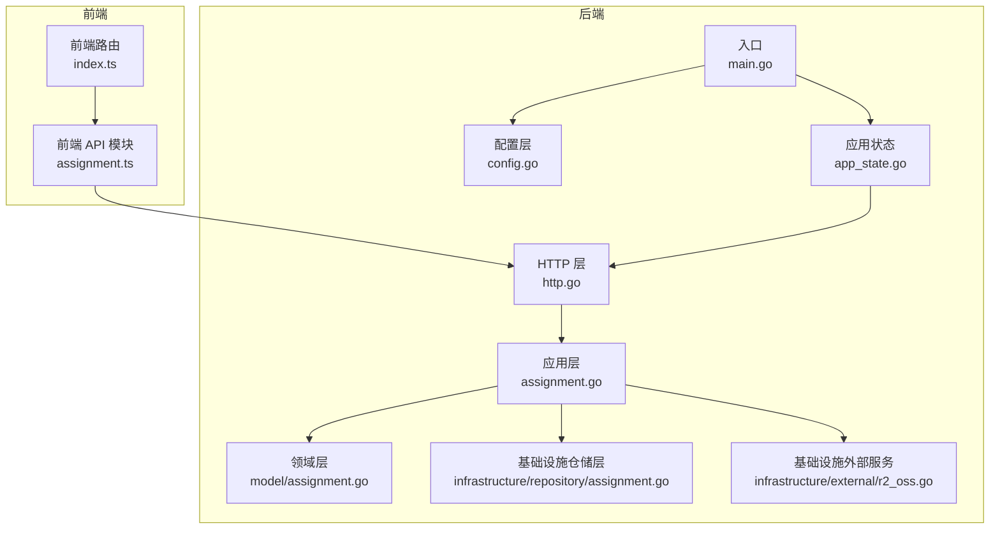
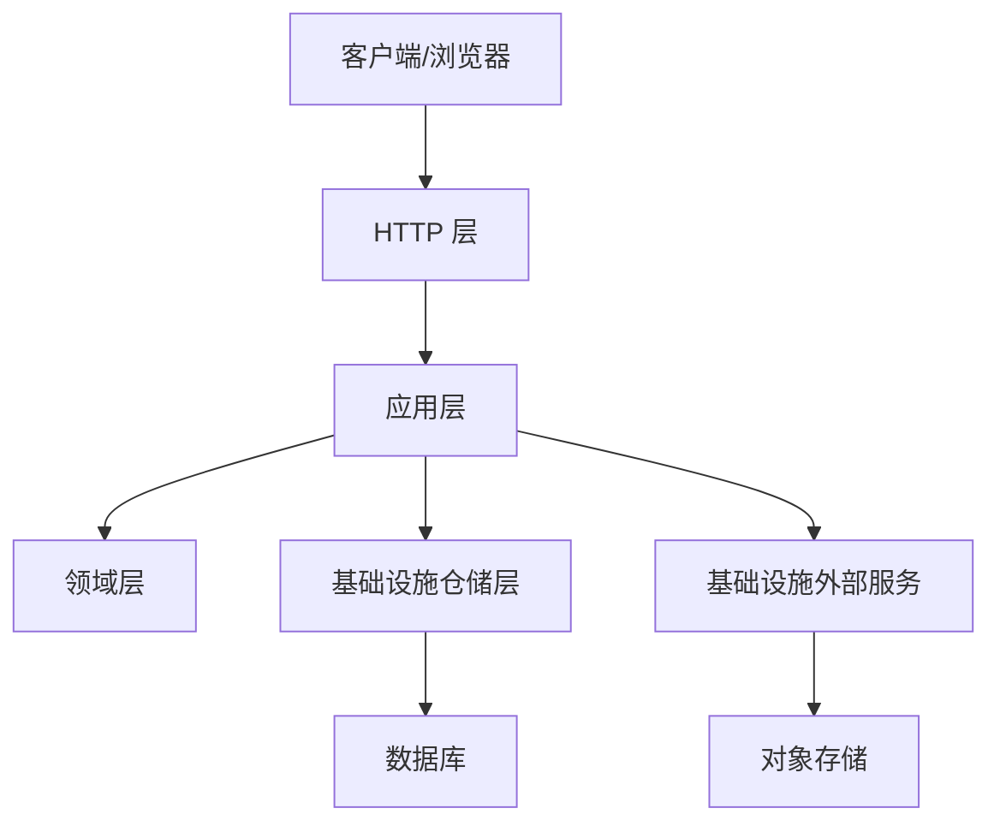
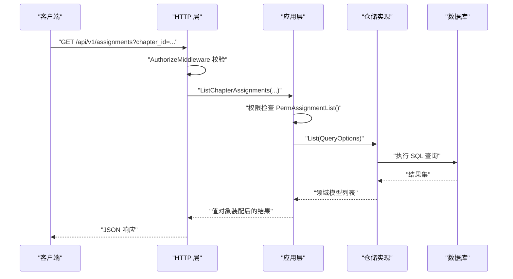
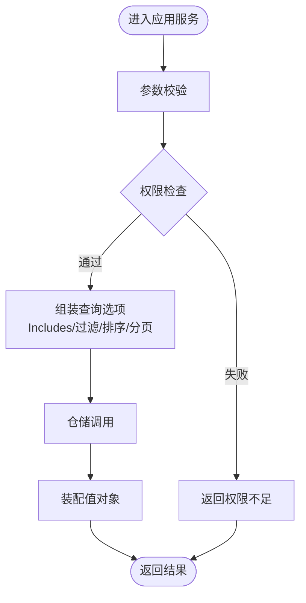
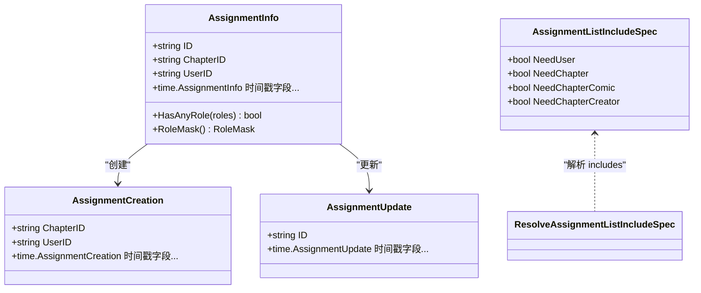
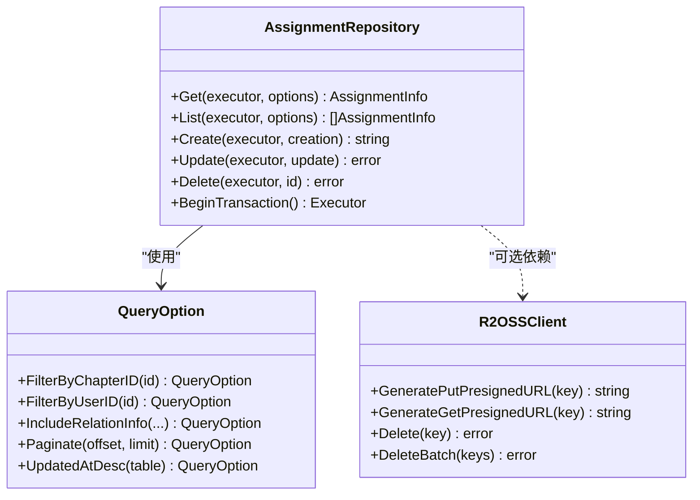
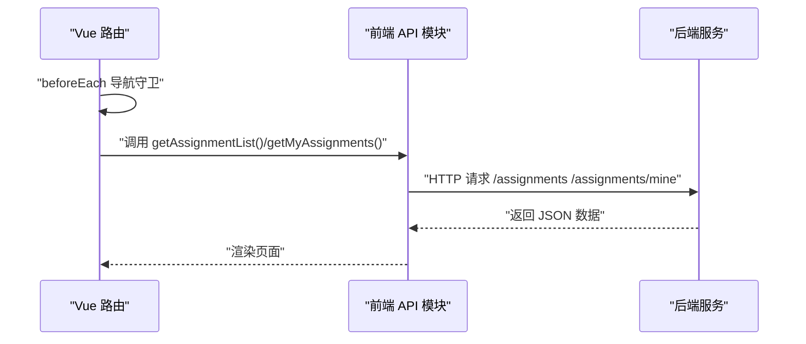
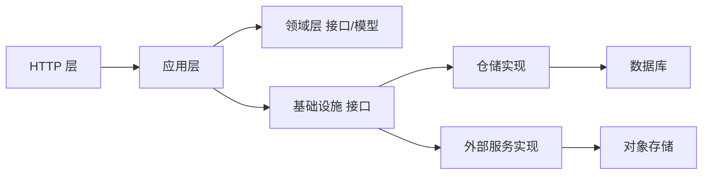

# 分层架构设计

<cite>
**本文引用的文件**
- [main.go](file://main.go)
- [http.go](file://internal/api/http/http.go)
- [assignment_application.go](file://internal/application/assignment.go)
- [assignment_model.go](file://internal/domain/model/assignment.go)
- [assignment_repository_interface.go](file://internal/domain/repository/assignment.go)
- [assignment_repository_impl.go](file://internal/infrastructure/repository/assignment.go)
- [assignment_assembler.go](file://internal/application/assembler/assignment.go)
- [assignment_loader_adapter.go](file://internal/application/adapter/loader.go)
- [assignment_include_service.go](file://internal/domain/service/assignment_include.go)
- [assignment_query_option.go](file://internal/infrastructure/repository/query_option/assignment.go)
- [r2_oss_client.go](file://internal/infrastructure/external/r2_oss.go)
- [config.go](file://internal/config/config.go)
- [app_state.go](file://internal/state/app_state.go)
- [assignment_api_ts.ts](file://frontend/src/api/modules/assignment.ts)
- [router_ts.ts](file://frontend/src/router/index.ts)
- [ARCHETECT.md](file://docs/ARCHETECT.md)
</cite>

## 目录
1. [简介](#简介)
2. [项目结构](#项目结构)
3. [核心组件](#核心组件)
4. [架构总览](#架构总览)
5. [详细组件分析](#详细组件分析)
6. [依赖分析](#依赖分析)
7. [性能考虑](#性能考虑)
8. [故障排查指南](#故障排查指南)
9. [结论](#结论)
10. [附录](#附录)

## 简介
本文件系统性阐述漫画翻译协作平台采用的 Clean Architecture 分层架构设计，重点说明表现层、应用层、领域层与基础设施层的职责划分、边界定义与交互关系。通过从 HTTP 请求到数据库操作的完整数据链路，展示依赖反转原则在项目中的落地实践，并给出典型实现模式、最佳实践与性能优化建议。

## 项目结构
项目采用 Go 语言后端与 Vue 前端分离的双端架构，后端以 Clean Architecture 为核心，按层组织代码；前端通过模块化 API 客户端与路由守卫实现用户交互与鉴权控制。

**图示来源**
- [http.go:16-151](file://internal/api/http/http.go#L16-L151)
- [assignment_application.go:20-90](file://internal/application/assignment.go#L20-L90)
- [assignment_model.go:1-190](file://internal/domain/model/assignment.go#L1-L190)
- [assignment_repository_impl.go:1-143](file://internal/infrastructure/repository/assignment.go#L1-L143)
- [r2_oss_client.go:1-225](file://internal/infrastructure/external/r2_oss.go#L1-L225)
- [config.go:11-101](file://internal/config/config.go#L11-L101)
- [app_state.go:8-50](file://internal/state/app_state.go#L8-L50)
- [main.go:25-146](file://main.go#L25-L146)

**章节来源**
- [main.go:25-146](file://main.go#L25-L146)
- [http.go:16-151](file://internal/api/http/http.go#L16-L151)
- [config.go:11-101](file://internal/config/config.go#L11-L101)
- [app_state.go:8-50](file://internal/state/app_state.go#L8-L50)

## 核心组件
- 表现层（Presentation Layer）
  - HTTP 路由与控制器：负责接收 HTTP 请求、参数校验、鉴权中间件、调用应用层并返回响应。
  - 前端 API 模块与路由：封装后端接口调用、路由守卫与登录态管理。
- 应用层（Application Layer）
  - 应用服务：编排业务用例、执行权限校验、组装查询选项、协调仓储与外部服务。
  - 组装器与适配器：将领域模型转换为对外值对象，提供懒加载回调以解耦仓储细节。
- 领域层（Domain Layer）
  - 领域模型与值对象：承载核心业务规则与状态，如分配记录的角色掩码、创建/更新结构体。
  - 领域服务：解析 includes 规格、权限检查等纯逻辑。
- 基础设施层（Infrastructure Layer）
  - 仓储实现：基于 GORM 的 SQL 执行器，提供 CRUD 与复杂查询。
  - 外部服务：对象存储客户端，提供预签名 URL 生成与批量删除能力。
  - 配置与状态：应用配置加载、运行时状态聚合。

**章节来源**
- [http.go:16-151](file://internal/api/http/http.go#L16-L151)
- [assignment_application.go:20-90](file://internal/application/assignment.go#L20-L90)
- [assignment_model.go:1-190](file://internal/domain/model/assignment.go#L1-L190)
- [assignment_repository_impl.go:1-143](file://internal/infrastructure/repository/assignment.go#L1-L143)
- [r2_oss_client.go:1-225](file://internal/infrastructure/external/r2_oss.go#L1-L225)
- [assignment_api_ts.ts:1-99](file://frontend/src/api/modules/assignment.ts#L1-L99)
- [router_ts.ts:1-53](file://frontend/src/router/index.ts#L1-L53)

## 架构总览
Clean Architecture 的核心是依赖反转：高层策略（应用层）不依赖底层细节（仓储与外部服务），而是通过接口抽象向上依赖。本项目在以下方面体现该原则：
- 应用层依赖领域接口与值对象，而非具体实现。
- 仓储接口定义在领域层，实现位于基础设施层。
- 外部服务接口定义在领域层，实现位于基础设施层。
- HTTP 层仅作为入口，不包含业务逻辑，只负责协议与参数处理。

**图示来源**
- [http.go:16-151](file://internal/api/http/http.go#L16-L151)
- [assignment_application.go:20-90](file://internal/application/assignment.go#L20-L90)
- [assignment_repository_impl.go:1-143](file://internal/infrastructure/repository/assignment.go#L1-L143)
- [r2_oss_client.go:1-225](file://internal/infrastructure/external/r2_oss.go#L1-L225)

## 详细组件分析

### HTTP 层（表现层）
- 职责
  - 初始化 Iris 应用、注册中间件（请求 ID、日志、恢复）、构建路由。
  - 将路由映射到应用层方法，统一鉴权与错误处理。
- 关键点
  - 路由按模块划分（认证、用户、团队、成员、邀请、漫画、工作集、章节、页面、分配、单元）。
  - 非生产环境启用 Swagger UI。
- 与应用层交互
  - 通过 AppState 注入各应用服务，避免全局状态污染。

**图示来源**
- [http.go:16-151](file://internal/api/http/http.go#L16-L151)
- [assignment_application.go:92-157](file://internal/application/assignment.go#L92-L157)
- [assignment_repository_impl.go:61-80](file://internal/infrastructure/repository/assignment.go#L61-L80)

**章节来源**
- [http.go:16-151](file://internal/api/http/http.go#L16-L151)

### 应用层（应用服务）
- 职责
  - 编排业务用例：参数校验、权限检查、查询选项组装、调用仓储与外部服务。
  - 使用适配器提供懒加载回调，避免直接依赖具体仓储实现。
  - 使用装配器将领域模型转换为对外值对象。
- 关键点
  - 依赖注入：应用服务构造函数接收外部依赖（仓储、外部服务）。
  - 权限检查：通过领域模型的权限检查器执行细粒度授权。
  - 查询扩展：根据 includes 参数动态拼接关联查询与字段选择。
- 典型流程
  - 列表查询：校验参数 → 权限检查 → 组装查询选项（排序、过滤、分页、关联） → 仓储查询 → 装配结果。
  - 创建/更新/删除：加载目标实体 → 权限检查 → 构造创建/更新结构体 → 仓储持久化。

**图示来源**
- [assignment_application.go:92-157](file://internal/application/assignment.go#L92-L157)
- [assignment_loader_adapter.go:10-71](file://internal/application/adapter/loader.go#L10-L71)
- [assignment_assembler.go:9-39](file://internal/application/assembler/assignment.go#L9-L39)
- [assignment_include_service.go:13-39](file://internal/domain/service/assignment_include.go#L13-L39)

**章节来源**
- [assignment_application.go:20-358](file://internal/application/assignment.go#L20-L358)
- [assignment_loader_adapter.go:1-71](file://internal/application/adapter/loader.go#L1-L71)
- [assignment_assembler.go:1-39](file://internal/application/assembler/assignment.go#L1-L39)
- [assignment_include_service.go:1-67](file://internal/domain/service/assignment_include.go#L1-L67)

### 领域层（领域模型与服务）
- 领域模型
  - AssignmentInfo：分配记录的领域视图，包含章节、用户关联与多角色时间戳。
  - AssignmentCreation/AssignmentUpdate：创建与更新的领域结构体，支持 PUT 语义的角色替换。
- 领域服务
  - ResolveAssignmentListIncludeSpec：解析 includes 参数，生成关联展开规格。
  - 权限检查器：基于当前用户与目标资源执行细粒度授权。
- 设计要点
  - 充血模型：在模型上定义行为（如角色掩码计算、是否有任一角色）。
  - 纯函数服务：不依赖仓储，仅处理通用逻辑。

**图示来源**
- [assignment_model.go:1-190](file://internal/domain/model/assignment.go#L1-L190)
- [assignment_include_service.go:1-67](file://internal/domain/service/assignment_include.go#L1-L67)

**章节来源**
- [assignment_model.go:1-190](file://internal/domain/model/assignment.go#L1-L190)
- [assignment_include_service.go:1-67](file://internal/domain/service/assignment_include.go#L1-L67)

### 基础设施层（仓储与外部服务）
- 仓储实现
  - AssignmentRepository：基于 GORM Executor 的 CRUD 与复杂查询，支持事务与连接池。
  - QueryOption：提供链式查询选项（过滤、排序、关联、分页）。
- 外部服务
  - R2OSSClient：封装 Cloudflare R2 S3 兼容对象存储，提供预签名上传/下载 URL、批量删除等能力。
- 设计要点
  - 仓储接口定义在领域层，实现位于基础设施层，符合依赖反转。
  - 通过适配器将仓储细节暴露为回调函数，供应用层按需懒加载。

**图示来源**
- [assignment_repository_impl.go:1-143](file://internal/infrastructure/repository/assignment.go#L1-L143)
- [assignment_query_option.go:1-112](file://internal/infrastructure/repository/query_option/assignment.go#L1-L112)
- [r2_oss_client.go:1-225](file://internal/infrastructure/external/r2_oss.go#L1-L225)

**章节来源**
- [assignment_repository_impl.go:1-143](file://internal/infrastructure/repository/assignment.go#L1-L143)
- [assignment_query_option.go:1-112](file://internal/infrastructure/repository/query_option/assignment.go#L1-L112)
- [r2_oss_client.go:1-225](file://internal/infrastructure/external/r2_oss.go#L1-L225)

### 前端集成（概念性说明）
- 前端通过模块化 API 客户端封装后端接口，统一处理分页与 includes 参数。
- 路由守卫基于本地存储的访问令牌进行登录态校验，未登录跳转登录页，已登录禁止重复进入登录页。

**图示来源**
- [assignment_api_ts.ts:63-98](file://frontend/src/api/modules/assignment.ts#L63-L98)
- [router_ts.ts:41-50](file://frontend/src/router/index.ts#L41-L50)

**章节来源**
- [assignment_api_ts.ts:1-99](file://frontend/src/api/modules/assignment.ts#L1-L99)
- [router_ts.ts:1-53](file://frontend/src/router/index.ts#L1-L53)

## 依赖分析
- 层间依赖方向
  - HTTP 层 → 应用层：入口调用，无反向依赖。
  - 应用层 → 领域层：依赖接口与值对象。
  - 应用层 → 基础设施层：依赖仓储与外部服务接口。
  - 基础设施层 → 数据库/外部服务：具体实现。
- 依赖反转与解耦
  - 领域层仅定义接口与模型，不依赖具体实现。
  - 应用层通过接口抽象向上依赖，避免被底层实现绑定。
  - 适配器与装配器进一步降低耦合，使应用层专注于业务编排。

**图示来源**
- [http.go:16-151](file://internal/api/http/http.go#L16-L151)
- [assignment_application.go:20-90](file://internal/application/assignment.go#L20-L90)
- [assignment_repository_impl.go:1-143](file://internal/infrastructure/repository/assignment.go#L1-L143)
- [r2_oss_client.go:1-225](file://internal/infrastructure/external/r2_oss.go#L1-L225)

**章节来源**
- [assignment_repository_interface.go:1-15](file://internal/domain/repository/assignment.go#L1-L15)
- [assignment_repository_impl.go:1-143](file://internal/infrastructure/repository/assignment.go#L1-L143)
- [assignment_application.go:20-90](file://internal/application/assignment.go#L20-L90)

## 性能考虑
- 查询优化
  - 使用 Includes 动态拼接关联查询，避免 N+1 查询；仅在 includes 指定时加载关联字段。
  - 通过排序、分页与过滤减少结果集大小。
- 事务与并发
  - 仓储支持 BeginTransaction，应用层在需要时开启事务保证一致性。
  - 连接池配置通过数据库配置集中管理，避免连接泄漏。
- 外部服务
  - 对象存储预签名 URL 降低后端压力；批量删除带重试机制提升可靠性。
- 前端体验
  - 路由守卫避免无效请求；API 模块统一分页与 includes 参数，减少无效网络往返。

**章节来源**
- [assignment_query_option.go:27-101](file://internal/infrastructure/repository/query_option/assignment.go#L27-L101)
- [assignment_repository_impl.go:25-27](file://internal/infrastructure/repository/assignment.go#L25-L27)
- [r2_oss_client.go:81-140](file://internal/infrastructure/external/r2_oss.go#L81-L140)
- [config.go:85-100](file://internal/config/config.go#L85-L100)

## 故障排查指南
- 配置加载失败
  - 检查环境变量是否正确设置（APP_ENVIRONMENT、JWT_SECRET_KEY、DATABASE_URL、R2_*）。
- 权限不足
  - 确认当前用户对目标资源具备相应权限；检查 PermAssignmentList/PermAssignmentCreate/PermAssignmentUpdate/PermAssignmentDelete 的授权逻辑。
- 仓储查询异常
  - 查看 QueryOption 组装是否正确；确认 Includes 参数与数据库联结字段匹配。
- 外部服务错误
  - 对象存储删除失败时查看重试日志；确认桶名与域名配置正确。
- 前端路由问题
  - 登录态异常时检查本地存储的 access_token；确认路由守卫逻辑。

**章节来源**
- [config.go:44-100](file://internal/config/config.go#L44-L100)
- [assignment_application.go:112-122](file://internal/application/assignment.go#L112-L122)
- [assignment_query_option.go:27-101](file://internal/infrastructure/repository/query_option/assignment.go#L27-L101)
- [r2_oss_client.go:109-198](file://internal/infrastructure/external/r2_oss.go#L109-L198)
- [router_ts.ts:41-50](file://frontend/src/router/index.ts#L41-L50)

## 结论
本项目以 Clean Architecture 为核心，通过明确的层边界与依赖反转，实现了高内聚、低耦合的系统设计。应用层专注业务编排，领域层承载核心规则，基础设施层屏蔽技术细节，HTTP 层仅承担协议适配职责。配合 Includes 动态查询、事务管理与外部服务重试机制，系统在可维护性与性能之间取得良好平衡。

## 附录
- 架构理念参考
  - 项目文档指出借鉴了 DDD 的三层架构，但领域服务不依赖仓储，而是将仓储操作上提到应用层统一处理，同时通过回调函数懒加载仓储数据，兼顾灵活性与可测试性。

**章节来源**
- [ARCHETECT.md:1-36](file://docs/ARCHETECT.md#L1-L36)