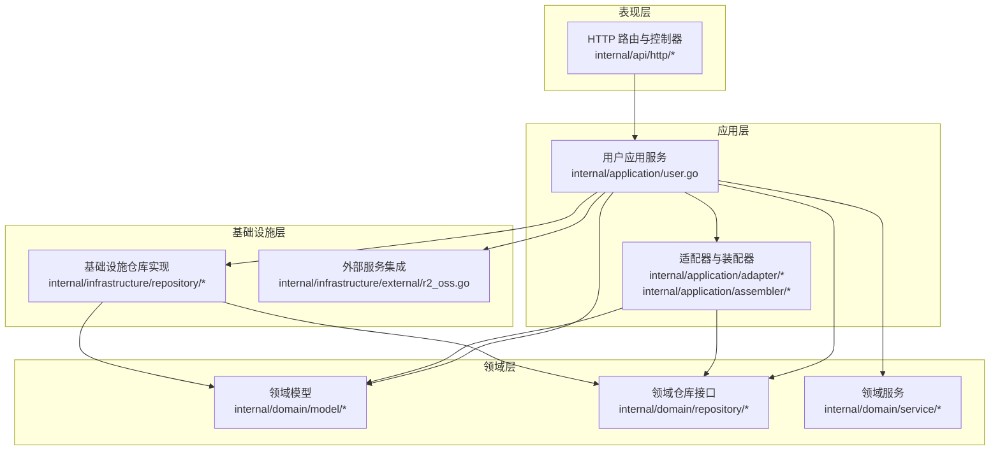
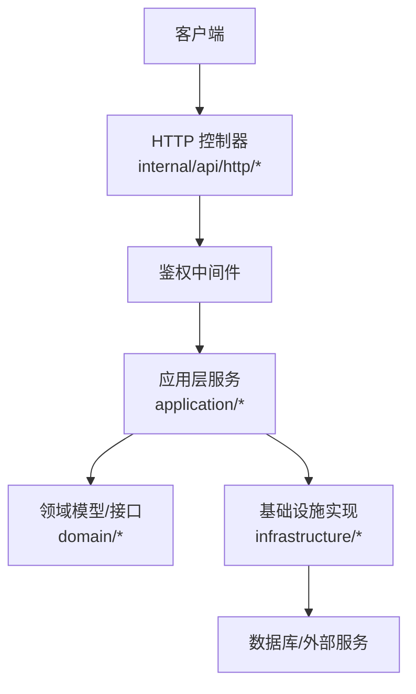
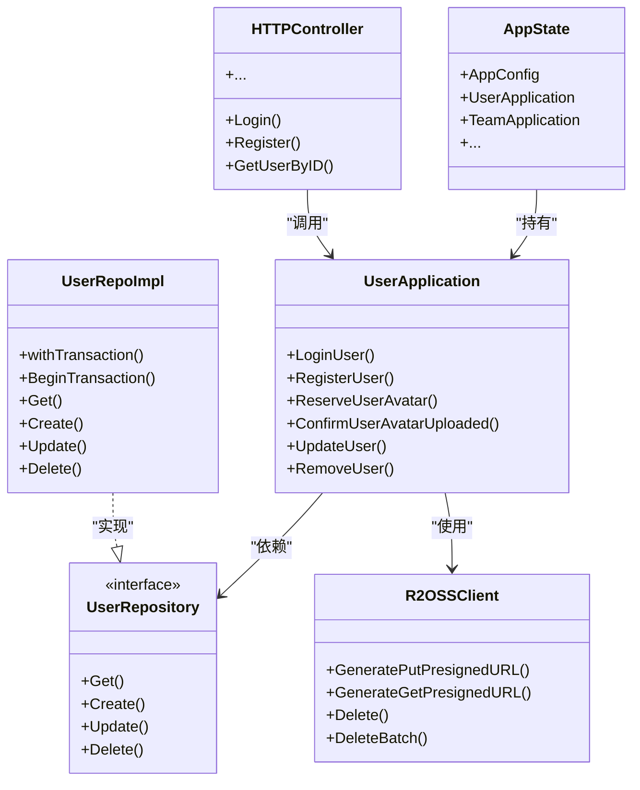
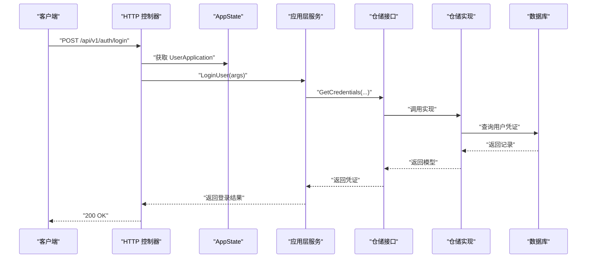
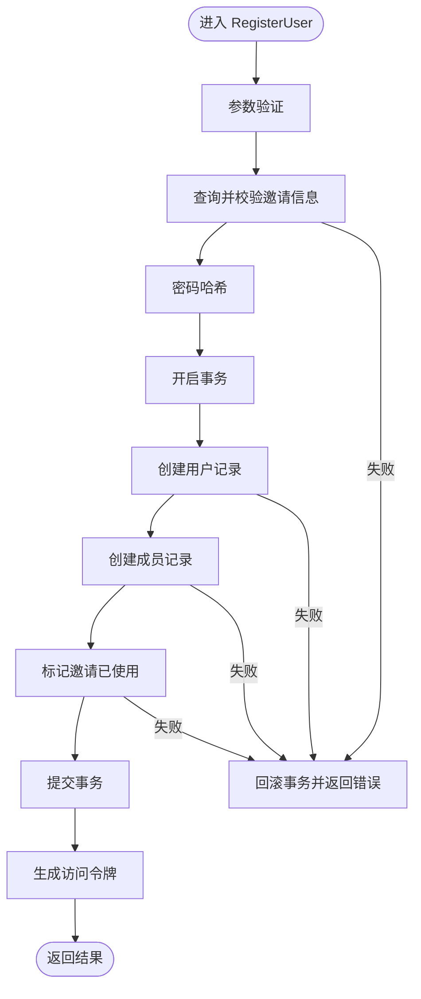
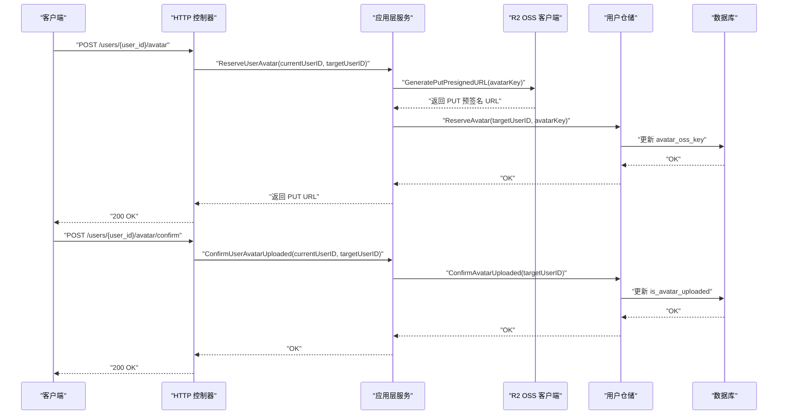
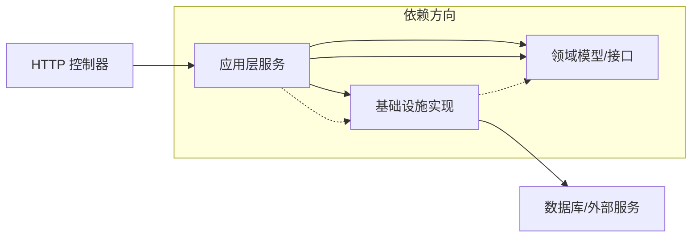

# 系统架构设计

<cite>
**本文引用的文件**
- [main.go](file://main.go)
- [app_state.go](file://internal/state/app_state.go)
- [config.go](file://internal/config/config.go)
- [http.go](file://internal/api/http/http.go)
- [auth.go](file://internal/api/http/auth.go)
- [user.go](file://internal/api/http/user.go)
- [middleware.go](file://internal/api/http/middleware.go)
- [user.go](file://internal/application/user.go)
- [user.go](file://internal/domain/model/user.go)
- [user.go](file://internal/domain/repository/user.go)
- [user.go](file://internal/infrastructure/repository/user.go)
- [user.go](file://internal/application/adapter/loader.go)
- [user.go](file://internal/application/assembler/user.go)
- [user.go](file://internal/domain/service/user.go)
- [r2_oss.go](file://internal/infrastructure/external/r2_oss.go)
</cite>

## 目录
1. [引言](#引言)
2. [项目结构](#项目结构)
3. [核心组件](#核心组件)
4. [架构总览](#架构总览)
5. [详细组件分析](#详细组件分析)
6. [依赖关系分析](#依赖关系分析)
7. [性能考虑](#性能考虑)
8. [故障排查指南](#故障排查指南)
9. [结论](#结论)

## 引言
本文件面向“漫画翻译协作平台”的后端系统，基于 Clean Architecture 分层架构理念，系统性阐述表现层、应用层、领域层与基础设施层的职责划分、依赖方向与数据流向。文档重点解释依赖注入机制、AppState 作为中央协调者的角色、以及从 HTTP 请求到数据库操作的完整处理链路。同时给出架构决策的技术考量、性能优化策略与可扩展性设计建议，并配套架构图与时序图帮助开发者快速理解整体设计。

## 项目结构
后端采用 Go 语言实现，遵循 Clean Architecture 的分层组织方式：
- 表现层（Presentation Layer）：HTTP 路由与控制器，负责接收请求、参数解析、鉴权与响应封装。
- 应用层（Application Layer）：业务用例编排，协调领域模型与外部服务，保证业务规则与事务边界。
- 领域层（Domain Layer）：核心业务模型与规则，定义不变的业务语义与接口契约。
- 基础设施层（Infrastructure Layer）：具体技术实现，如数据库访问、外部服务集成等。

**图表来源**
- [http.go:16-151](file://internal/api/http/http.go#L16-L151)
- [user.go:21-104](file://internal/application/user.go#L21-L104)
- [user.go:7-41](file://internal/domain/model/user.go#L7-L41)
- [user.go:5-15](file://internal/domain/repository/user.go#L5-L15)
- [user.go:12-150](file://internal/infrastructure/repository/user.go#L12-L150)
- [r2_oss.go:21-79](file://internal/infrastructure/external/r2_oss.go#L21-L79)

**章节来源**
- [http.go:16-151](file://internal/api/http/http.go#L16-L151)
- [user.go:21-104](file://internal/application/user.go#L21-L104)

## 核心组件
- 入口与依赖注入
  - main 函数负责加载配置、初始化数据库执行器、构建各领域应用服务实例，并注入到 AppState 中，随后启动 HTTP 服务器。
  - 依赖注入通过构造函数参数传递，确保应用层只依赖抽象接口，避免上层对下层实现的耦合。
- AppState 中央协调者
  - 统一持有应用层服务实例与全局配置，供 HTTP 层按需取用，避免全局变量与循环依赖。
- 配置管理
  - 通过 JSON 配置文件与环境变量组合加载，支持开发/生产环境差异。
- HTTP 中间件
  - 日志中间件与鉴权中间件分别负责请求追踪与 JWT 校验，统一在路由前执行。

**章节来源**
- [main.go:25-145](file://main.go#L25-L145)
- [app_state.go:8-50](file://internal/state/app_state.go#L8-L50)
- [config.go:11-59](file://internal/config/config.go#L11-L59)
- [middleware.go:15-80](file://internal/api/http/middleware.go#L15-L80)

## 架构总览
Clean Architecture 的核心是“依赖倒置”：上层模块不依赖下层模块的具体实现；下层模块向上层提供抽象接口。本项目通过以下方式实现：
- 应用层仅依赖领域接口（如 UserRepository），不直接依赖数据库实现。
- 基础设施层实现领域接口，向应用层提供具体能力。
- 表现层仅依赖应用层接口，不关心数据存储细节。

**图表来源**
- [http.go:16-151](file://internal/api/http/http.go#L16-L151)
- [middleware.go:47-80](file://internal/api/http/middleware.go#L47-L80)
- [user.go:21-104](file://internal/application/user.go#L21-L104)
- [user.go:12-150](file://internal/infrastructure/repository/user.go#L12-L150)

## 详细组件分析

### 清洁架构分层与职责
- 表现层
  - 负责路由注册、参数解析、鉴权、响应封装与错误处理。
  - 示例：登录、注册、用户信息查询等路由均在 HTTP 层定义，调用对应应用层方法。
- 应用层
  - 编排业务流程，执行权限校验、参数验证、事务控制与结果组装。
  - 示例：用户应用服务负责登录、注册、头像上传预留与确认等用例。
- 领域层
  - 定义业务模型与规则，提供不可变的领域知识。
  - 示例：用户信息、凭证、创建与更新模型等。
- 基础设施层
  - 提供具体实现：数据库访问、外部对象存储服务集成等。
  - 示例：用户仓储实现、R2 对象存储客户端。

**图表来源**
- [app_state.go:8-50](file://internal/state/app_state.go#L8-L50)
- [http.go:16-151](file://internal/api/http/http.go#L16-L151)
- [user.go:21-104](file://internal/application/user.go#L21-L104)
- [user.go:5-15](file://internal/domain/repository/user.go#L5-L15)
- [user.go:12-150](file://internal/infrastructure/repository/user.go#L12-L150)
- [r2_oss.go:21-79](file://internal/infrastructure/external/r2_oss.go#L21-L79)

**章节来源**
- [app_state.go:8-50](file://internal/state/app_state.go#L8-L50)
- [http.go:16-151](file://internal/api/http/http.go#L16-L151)
- [user.go:21-104](file://internal/application/user.go#L21-L104)
- [user.go:5-15](file://internal/domain/repository/user.go#L5-L15)
- [user.go:12-150](file://internal/infrastructure/repository/user.go#L12-L150)
- [r2_oss.go:21-79](file://internal/infrastructure/external/r2_oss.go#L21-L79)

### 依赖注入与 AppState 协调者
- 注入点
  - main 中集中创建配置、数据库执行器、各仓储实例与应用服务实例，并注入到 AppState。
  - 应用服务构造函数参数均为接口类型，确保依赖倒置。
- AppState 角色
  - 作为全局上下文容器，HTTP 控制器通过它获取所需的应用服务实例，避免全局变量与循环依赖。
- 优点
  - 易于测试：可通过 mock 接口替换实现。
  - 可维护性强：新增功能只需扩展应用层与基础设施层，不破坏既有层次。

**图表来源**
- [main.go:56-122](file://main.go#L56-L122)
- [auth.go:22-40](file://internal/api/http/auth.go#L22-L40)
- [user.go:106-154](file://internal/application/user.go#L106-L154)
- [user.go:73-87](file://internal/infrastructure/repository/user.go#L73-L87)

**章节来源**
- [main.go:56-122](file://main.go#L56-L122)
- [auth.go:22-40](file://internal/api/http/auth.go#L22-L40)
- [user.go:106-154](file://internal/application/user.go#L106-L154)

### 数据流与事务处理（用户注册）
用户注册涉及鉴权、邀请校验、密码哈希、数据库事务与令牌签发，典型的数据流如下：

**图表来源**
- [user.go:156-278](file://internal/application/user.go#L156-L278)
- [user.go:89-106](file://internal/infrastructure/repository/user.go#L89-L106)
- [user.go:15-41](file://internal/domain/service/user.go#L15-L41)

**章节来源**
- [user.go:156-278](file://internal/application/user.go#L156-L278)
- [user.go:89-106](file://internal/infrastructure/repository/user.go#L89-L106)
- [user.go:15-41](file://internal/domain/service/user.go#L15-L41)

### 头像上传预留与确认（用户头像）
该流程展示了应用层如何协调外部对象存储与数据库状态变更：

**图表来源**
- [user.go:426-468](file://internal/application/user.go#L426-L468)
- [user.go:521-555](file://internal/application/user.go#L521-L555)
- [r2_oss.go:81-99](file://internal/infrastructure/external/r2_oss.go#L81-L99)
- [user.go:108-127](file://internal/infrastructure/repository/user.go#L108-L127)

**章节来源**
- [user.go:426-468](file://internal/application/user.go#L426-L468)
- [user.go:521-555](file://internal/application/user.go#L521-L555)
- [r2_oss.go:81-99](file://internal/infrastructure/external/r2_oss.go#L81-L99)
- [user.go:108-127](file://internal/infrastructure/repository/user.go#L108-L127)

### 鉴权与中间件
- 鉴权中间件从 Authorization 头提取 Bearer Token，解析 JWT 并将用户 ID 注入请求上下文，供后续处理器使用。
- 日志中间件在开发环境下记录请求方法、路径、状态码、远程地址、请求 ID 与耗时，便于问题定位。

**章节来源**
- [middleware.go:47-80](file://internal/api/http/middleware.go#L47-L80)
- [middleware.go:15-45](file://internal/api/http/middleware.go#L15-L45)

## 依赖关系分析
- 层间依赖方向
  - 表现层 → 应用层：控制器调用应用服务。
  - 应用层 → 领域层：应用服务依赖领域模型与接口。
  - 应用层 → 基础设施层：应用服务使用仓储与外部服务。
  - 基础设施层 ← 领域层：基础设施实现领域接口。
- 关键依赖点
  - 应用服务通过接口依赖仓储，避免对具体数据库实现的耦合。
  - HTTP 层仅依赖应用层接口，不直接访问数据库或外部服务。
  - AppState 作为依赖注入容器，集中管理应用层服务实例。

**图表来源**
- [http.go:16-151](file://internal/api/http/http.go#L16-L151)
- [user.go:21-104](file://internal/application/user.go#L21-L104)
- [user.go:12-150](file://internal/infrastructure/repository/user.go#L12-L150)

**章节来源**
- [http.go:16-151](file://internal/api/http/http.go#L16-L151)
- [user.go:21-104](file://internal/application/user.go#L21-L104)

## 性能考虑
- 事务边界与一致性
  - 用户注册等关键流程使用事务包裹，确保多步写入的一致性，减少回滚成本。
- 外部服务幂等与重试
  - 对象存储删除操作具备重试与错误聚合，降低网络抖动影响。
- 预签名 URL 时效性
  - 头像上传使用短期有效的预签名 URL，兼顾安全性与易用性。
- 日志与追踪
  - 开发环境记录请求耗时与上下文信息，有助于定位性能瓶颈。
- 可扩展性设计
  - 新增资源可在应用层新增用例、领域层新增模型与接口、基础设施层新增实现，保持清晰分层。

[本节为通用指导，无需列出具体文件来源]

## 故障排查指南
- 配置加载失败
  - 检查 app_config.json 是否存在且可解析，确认环境变量是否设置齐全。
- 数据库连接失败
  - 核对 DATABASE_URL 环境变量与连接参数，确认数据库可达。
- JWT 解析失败
  - 确认 Authorization 头格式为 Bearer <token>，并检查 JWT_SECRET_KEY 是否正确。
- 事务回滚
  - 查看应用层事务回滚日志，定位具体失败步骤并修复。
- 头像上传异常
  - 检查预签名 URL 生成与 OSS 配置，确认对象键命名与权限设置。

**章节来源**
- [config.go:29-59](file://internal/config/config.go#L29-L59)
- [middleware.go:47-80](file://internal/api/http/middleware.go#L47-L80)
- [user.go:204-214](file://internal/application/user.go#L204-L214)
- [r2_oss.go:109-140](file://internal/infrastructure/external/r2_oss.go#L109-L140)

## 结论
本系统以 Clean Architecture 为核心，通过明确的分层职责与依赖倒置，实现了表现层与业务逻辑的解耦、业务规则与数据持久化的分离。依赖注入与 AppState 的引入进一步提升了可测试性与可维护性。结合事务、外部服务重试与预签名 URL 等实践，系统在功能完整性与工程化方面具备良好基础。未来可在缓存策略、异步任务与可观测性方面持续演进，以满足更高并发与复杂业务场景的需求。