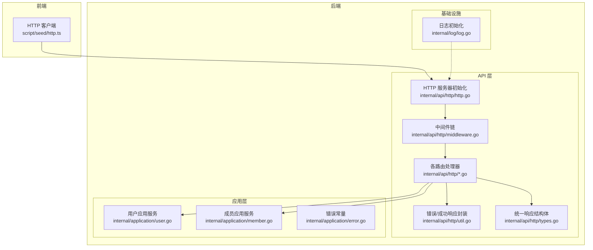
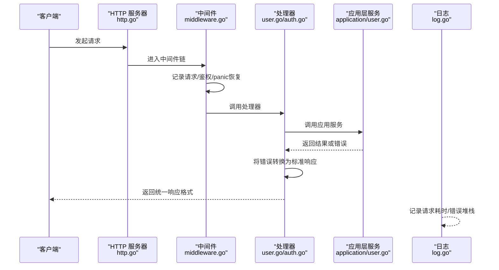
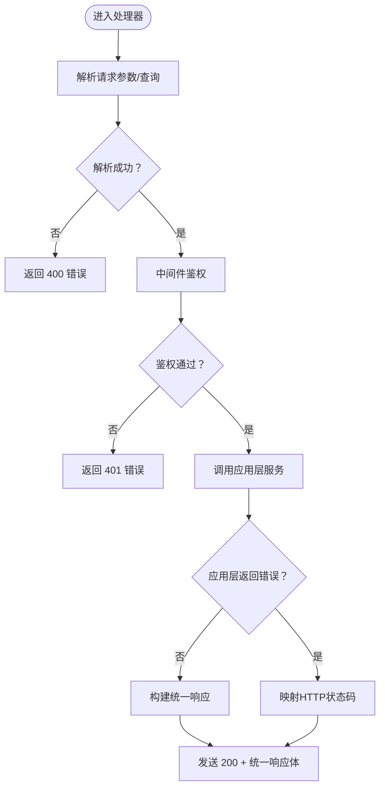
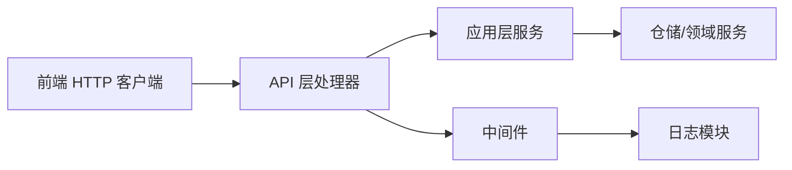

# 错误处理架构

<cite>
**本文引用的文件**
- [internal/api/http/http.go](file://internal/api/http/http.go)
- [internal/api/http/middleware.go](file://internal/api/http/middleware.go)
- [internal/api/http/util.go](file://internal/api/http/util.go)
- [internal/api/http/types.go](file://internal/api/http/types.go)
- [internal/api/http/auth.go](file://internal/api/http/auth.go)
- [internal/api/http/user.go](file://internal/api/http/user.go)
- [internal/api/http/team.go](file://internal/api/http/team.go)
- [internal/application/error.go](file://internal/application/error.go)
- [internal/application/user.go](file://internal/application/user.go)
- [internal/application/member.go](file://internal/application/member.go)
- [internal/log/log.go](file://internal/log/log.go)
- [script/seed/http.ts](file://script/seed/http.ts)
</cite>

## 目录
1. [简介](#简介)
2. [项目结构](#项目结构)
3. [核心组件](#核心组件)
4. [架构总览](#架构总览)
5. [详细组件分析](#详细组件分析)
6. [依赖关系分析](#依赖关系分析)
7. [性能考量](#性能考量)
8. [故障排查指南](#故障排查指南)
9. [结论](#结论)
10. [附录](#附录)

## 简介
本文件系统性梳理漫画翻译协作平台的错误处理架构，覆盖统一错误类型定义、错误分类（业务错误、系统错误、网络错误）、错误传播链路（从底层异常到HTTP响应）、中间件层的错误拦截与转换、错误日志记录策略、错误恢复机制与用户体验优化，并提供可落地的实现参考路径。

## 项目结构
后端采用分层架构：API层（HTTP处理器）负责请求接入与响应封装；应用层（Application）编排业务流程并统一错误语义；领域层与仓储层负责数据与业务不变量；日志模块集中初始化与输出。前端通过统一的HTTP客户端封装，消费后端统一的响应格式。

图表来源
- [internal/api/http/http.go:26-151](file://internal/api/http/http.go#L26-L151)
- [internal/api/http/middleware.go:15-80](file://internal/api/http/middleware.go#L15-L80)
- [internal/api/http/util.go:11-59](file://internal/api/http/util.go#L11-L59)
- [internal/api/http/types.go:3-9](file://internal/api/http/types.go#L3-L9)
- [internal/application/user.go:106-154](file://internal/application/user.go#L106-L154)
- [internal/application/member.go:85-139](file://internal/application/member.go#L85-L139)
- [internal/log/log.go:13-84](file://internal/log/log.go#L13-L84)

章节来源
- [internal/api/http/http.go:16-151](file://internal/api/http/http.go#L16-L151)
- [internal/log/log.go:13-84](file://internal/log/log.go#L13-L84)

## 核心组件
- 统一响应结构体：定义统一的响应载体，包含状态码、消息与业务数据，便于前后端约定与解析。
- 错误拦截与转换：通过中间件与工具函数，将业务错误、鉴权失败、参数校验失败等转换为标准HTTP响应。
- 应用层错误语义：在应用层统一抛出人类可读的错误信息，并由API层转换为合适的HTTP状态码。
- 日志与追踪：全局日志初始化，结合请求ID进行跨层追踪，支持开发与生产环境差异化输出。

章节来源
- [internal/api/http/types.go:3-9](file://internal/api/http/types.go#L3-L9)
- [internal/api/http/util.go:11-59](file://internal/api/http/util.go#L11-L59)
- [internal/application/error.go:3-7](file://internal/application/error.go#L3-L7)
- [internal/log/log.go:13-84](file://internal/log/log.go#L13-L84)

## 架构总览
错误处理链路自下而上分为四层：数据与业务层（仓储/领域）→ 应用层（业务编排）→ API层（HTTP处理器）→ 前端（统一响应解析）。中间件负责日志、鉴权与panic恢复，确保错误在可控范围内被记录与返回。

图表来源
- [internal/api/http/http.go:26-151](file://internal/api/http/http.go#L26-L151)
- [internal/api/http/middleware.go:15-80](file://internal/api/http/middleware.go#L15-L80)
- [internal/api/http/user.go:22-49](file://internal/api/http/user.go#L22-L49)
- [internal/application/user.go:106-154](file://internal/application/user.go#L106-L154)
- [internal/log/log.go:13-84](file://internal/log/log.go#L13-L84)

## 详细组件分析

### 统一错误类型与分类
- 业务错误：由应用层在参数校验、权限检查、业务规则违反等场景抛出，API层根据场景映射为合适的HTTP状态码（如400、401、403）。
- 系统错误：由应用层在不可预期的内部错误（如生成令牌失败、事务回滚失败）抛出，API层统一映射为500。
- 网络错误：由外部依赖（如OSS、数据库）引发的错误，应用层捕获并包装为可读错误信息，API层同样映射为500。
- 内部错误常量：应用层提供统一的内部错误标识，便于在特定场景下统一返回。

章节来源
- [internal/application/error.go:3-7](file://internal/application/error.go#L3-L7)
- [internal/application/user.go:129-131](file://internal/application/user.go#L129-L131)
- [internal/application/user.go:145-147](file://internal/application/user.go#L145-L147)
- [internal/application/user.go:204-213](file://internal/application/user.go#L204-L213)
- [internal/application/member.go:118-121](file://internal/application/member.go#L118-L121)
- [internal/application/member.go:288-291](file://internal/application/member.go#L288-L291)

### 错误传播机制与HTTP响应链路
- 参数解析失败：API层在读取JSON/Query时失败，直接返回400。
- 鉴权失败：中间件在Authorization头部缺失、格式错误或令牌无效时，返回401。
- 权限不足：应用层在权限检查失败时返回错误，API层映射为403。
- 业务错误：应用层返回错误信息，API层根据场景映射为400/403。
- 系统错误：应用层返回内部错误，API层映射为500。
- 成功响应：统一使用200状态码，业务状态通过响应体中的code字段表达。

图表来源
- [internal/api/http/user.go:22-49](file://internal/api/http/user.go#L22-L49)
- [internal/api/http/auth.go:22-40](file://internal/api/http/auth.go#L22-L40)
- [internal/api/http/middleware.go:47-79](file://internal/api/http/middleware.go#L47-L79)
- [internal/api/http/util.go:11-39](file://internal/api/http/util.go#L11-L39)

### 中间件层的错误拦截与转换
- 日志中间件：记录请求方法、路径、状态码、远端地址、请求ID与耗时，开发环境输出更丰富字段。
- 鉴权中间件：校验Authorization头部格式与JWT有效性，失败时返回401。
- panic恢复中间件：捕获panic并避免服务崩溃，配合日志记录堆栈。

章节来源
- [internal/api/http/middleware.go:15-80](file://internal/api/http/middleware.go#L15-L80)
- [internal/api/http/http.go:26-35](file://internal/api/http/http.go#L26-L35)

### 错误响应封装与统一格式
- 统一响应结构体包含code、message、data三要素，便于前端统一处理。
- accept/reject工具函数分别用于成功与错误响应的封装，reject直接设置HTTP状态码并返回统一格式；accept统一返回200并在响应体中携带业务数据。
- 响应体中的code字段承载业务状态语义，兼容HTTP状态码与业务状态的双重表达。

章节来源
- [internal/api/http/types.go:3-9](file://internal/api/http/types.go#L3-L9)
- [internal/api/http/util.go:11-39](file://internal/api/http/util.go#L11-L39)

### 应用层错误处理策略
- 参数校验：在进入业务逻辑前进行参数校验，失败即返回错误，API层映射为400。
- 权限检查：在关键操作前进行权限校验，失败返回错误，API层映射为403。
- 事务管理：在需要一致性保证的操作中开启事务，异常时回滚并记录错误，最终统一返回错误。
- 外部依赖错误：对外部OSS、数据库等错误进行捕获与包装，返回可读错误信息，API层映射为500。

章节来源
- [internal/application/user.go:106-154](file://internal/application/user.go#L106-L154)
- [internal/application/user.go:200-261](file://internal/application/user.go#L200-L261)
- [internal/application/member.go:85-139](file://internal/application/member.go#L85-L139)
- [internal/application/member.go:245-294](file://internal/application/member.go#L245-L294)

### 前端错误消费与用户体验
- 前端HTTP客户端对非2xx与统一响应中的业务错误进行抛错，统一捕获并提示用户。
- 对于204无内容与空响应体，前端按约定处理。
- 建议：前端在错误提示中避免暴露内部错误细节，仅展示友好提示，并将错误信息上报至监控系统。

章节来源
- [script/seed/http.ts:9-60](file://script/seed/http.ts#L9-L60)

## 依赖关系分析
- API层依赖应用层提供的服务接口，应用层依赖仓储与领域服务，形成清晰的单向依赖。
- 中间件与日志模块作为横切关注点，被API层统一引入。
- 前端通过统一响应格式与HTTP客户端消费后端服务，降低耦合。

图表来源
- [internal/api/http/http.go:26-151](file://internal/api/http/http.go#L26-L151)
- [internal/application/user.go:106-154](file://internal/application/user.go#L106-L154)
- [internal/log/log.go:13-84](file://internal/log/log.go#L13-L84)

章节来源
- [internal/api/http/http.go:26-151](file://internal/api/http/http.go#L26-L151)
- [internal/application/user.go:106-154](file://internal/application/user.go#L106-L154)
- [internal/log/log.go:13-84](file://internal/log/log.go#L13-L84)

## 性能考量
- 中间件顺序：日志中间件应尽量靠前，panic恢复中间件确保异常被捕获，避免阻塞后续处理。
- 日志级别：生产环境默认警告级别以上输出，减少I/O开销；开发环境输出更详细字段便于调试。
- 响应封装：统一200状态码与业务code组合，减少HTTP状态码分支判断成本，提升前端解析效率。

## 故障排查指南
- 400类错误：检查请求参数解析与业务参数校验，确认前端传参与后端DTO一致。
- 401类错误：检查Authorization头部格式与JWT签名、过期时间，确认中间件鉴权逻辑。
- 403类错误：检查权限模型与角色掩码，确认当前用户对目标资源的访问权限。
- 500类错误：查看日志堆栈与错误摘要，定位应用层事务回滚、外部依赖异常等问题。
- 日志与追踪：结合请求ID在日志中检索全链路调用轨迹，快速定位问题节点。

章节来源
- [internal/api/http/middleware.go:15-80](file://internal/api/http/middleware.go#L15-L80)
- [internal/log/log.go:13-84](file://internal/log/log.go#L13-L84)

## 结论
本项目通过“统一响应格式 + 中间件拦截 + 应用层统一错误语义”的设计，实现了从底层异常到HTTP响应的清晰链路。配合日志与追踪能力，既保障了系统的可观测性，也提升了用户体验与可维护性。建议在后续迭代中持续完善错误分类与前端提示策略，进一步增强系统的韧性与稳定性。

## 附录

### 错误处理代码示例路径
- 自定义错误类型定义：[internal/application/error.go:3-7](file://internal/application/error.go#L3-L7)
- 错误处理器实现（reject/accept）：[internal/api/http/util.go:11-39](file://internal/api/http/util.go#L11-L39)
- 错误响应格式规范（统一响应结构体）：[internal/api/http/types.go:3-9](file://internal/api/http/types.go#L3-L9)
- 中间件层错误拦截与转换（鉴权/日志/panic恢复）：[internal/api/http/middleware.go:15-80](file://internal/api/http/middleware.go#L15-L80)
- 应用层错误处理策略（参数校验/权限/事务）：[internal/application/user.go:106-154](file://internal/application/user.go#L106-L154), [internal/application/member.go:85-139](file://internal/application/member.go#L85-L139)
- 前端错误消费与统一响应解析：[script/seed/http.ts:9-60](file://script/seed/http.ts#L9-L60)