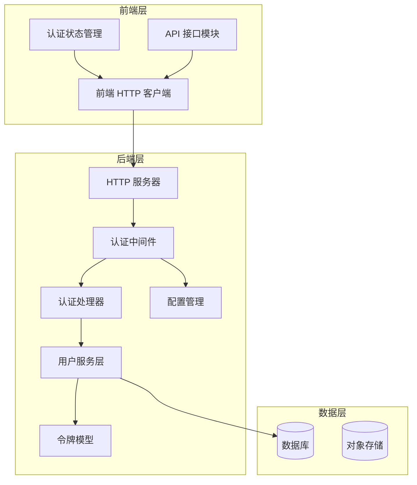
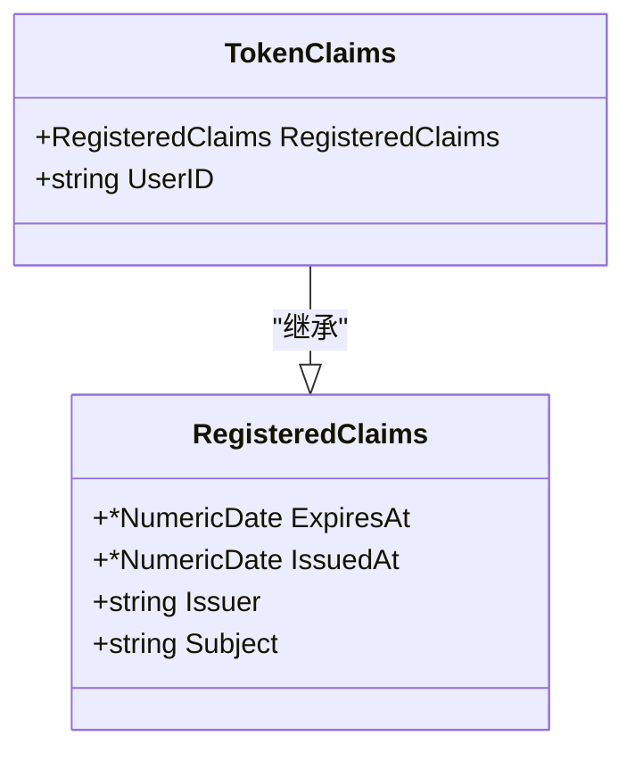
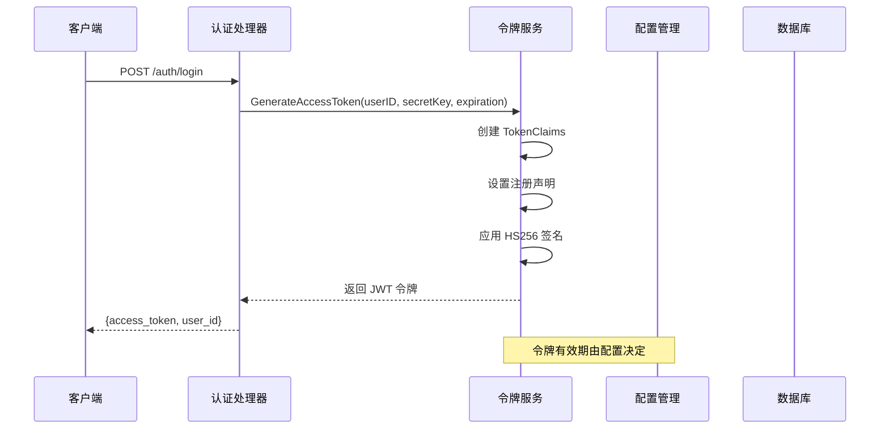
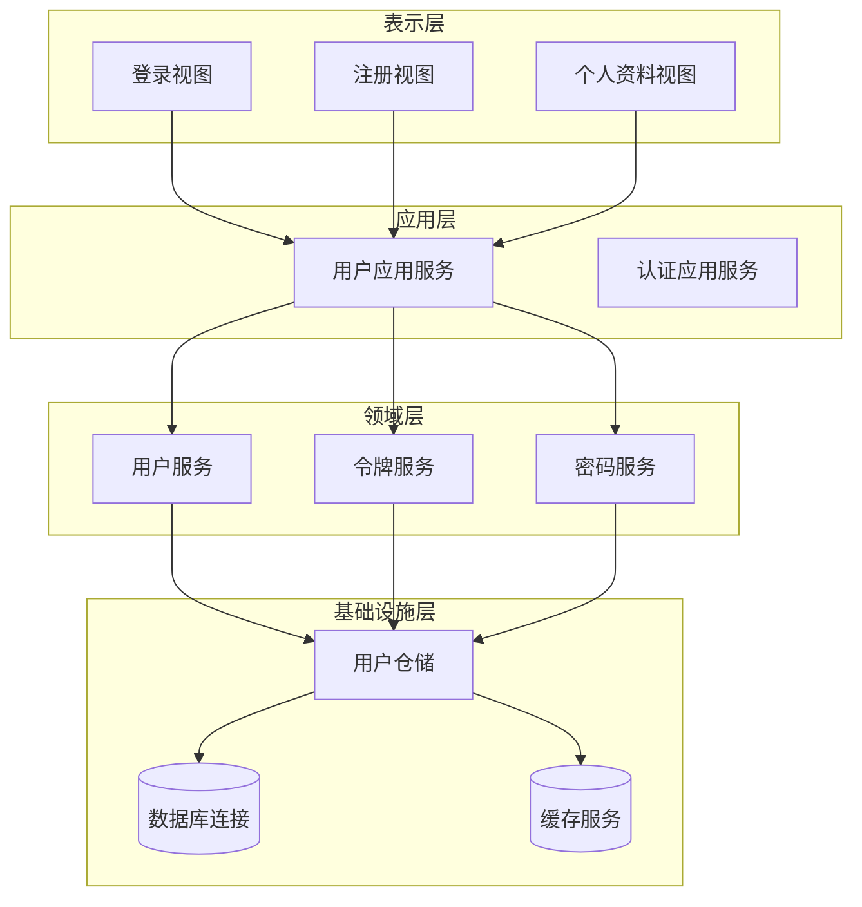
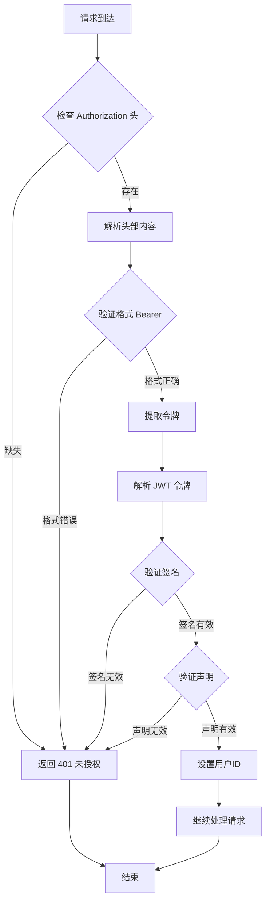
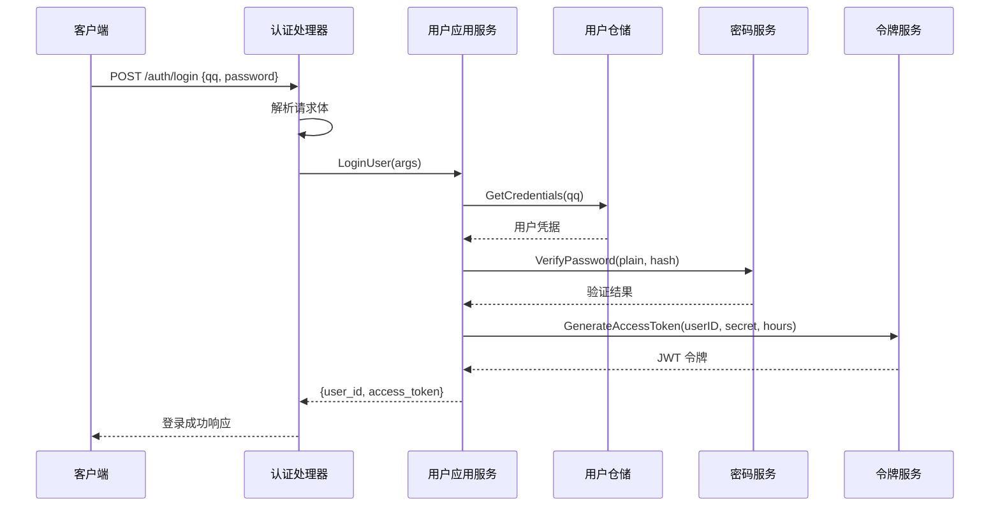
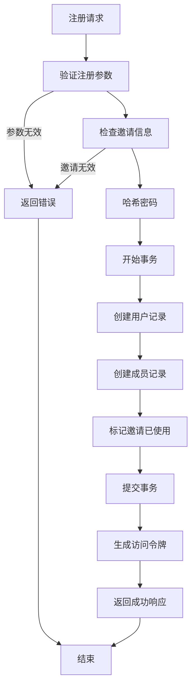
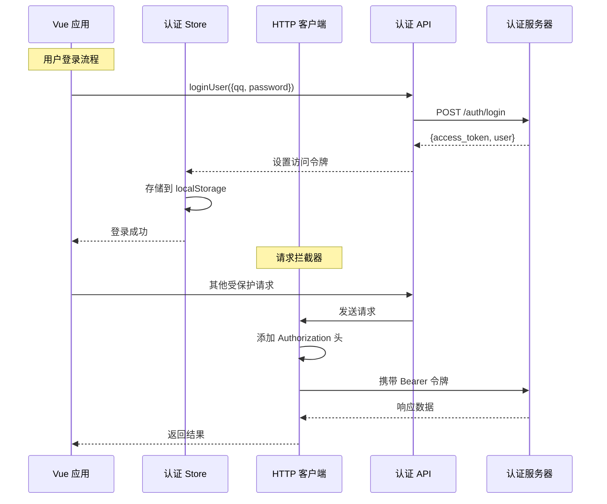
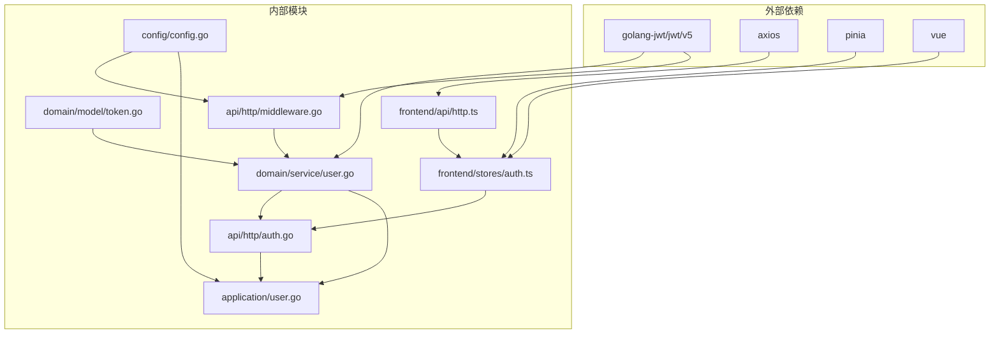

# JWT 认证机制

<cite>
**本文档引用的文件**
- [token.go](file://internal/domain/model/token.go)
- [user.go](file://internal/domain/service/user.go)
- [auth.go](file://internal/api/http/auth.go)
- [middleware.go](file://internal/api/http/middleware.go)
- [http.go](file://internal/api/http/http.go)
- [user.go](file://internal/application/user.go)
- [config.go](file://internal/config/config.go)
- [auth.ts](file://frontend/src/stores/auth.ts)
- [auth.ts](file://frontend/src/api/modules/auth.ts)
- [http.ts](file://frontend/src/api/http.ts)
- [user.go](file://internal/value/user.go)
- [main.go](file://main.go)
</cite>

## 目录
1. [简介](#简介)
2. [项目结构](#项目结构)
3. [核心组件](#核心组件)
4. [架构概览](#架构概览)
5. [详细组件分析](#详细组件分析)
6. [依赖关系分析](#依赖关系分析)
7. [性能考虑](#性能考虑)
8. [故障排除指南](#故障排除指南)
9. [结论](#结论)

## 简介

poprako-web-ms 项目采用基于 JWT（JSON Web Token）的认证机制，实现了完整的用户身份验证和授权体系。该系统支持用户登录、注册、令牌生成、验证和过期处理等功能，为前后端分离的应用提供了安全可靠的认证解决方案。

JWT 认证机制的核心优势在于无状态性、跨域支持和移动端友好等特性，特别适合现代 Web 应用的分布式架构需求。

## 项目结构

项目采用分层架构设计，JWT 认证相关的代码分布在多个层次中：

**图表来源**
- [http.go:26-151](file://internal/api/http/http.go#L26-L151)
- [middleware.go:47-79](file://internal/api/http/middleware.go#L47-L79)
- [auth.go:22-72](file://internal/api/http/auth.go#L22-L72)

**章节来源**
- [http.go:26-151](file://internal/api/http/http.go#L26-L151)
- [main.go:25-145](file://main.go#L25-L145)

## 核心组件

### 令牌模型定义

JWT 令牌的核心数据结构由 `TokenClaims` 结构体定义，继承了标准的注册声明并扩展了用户标识字段：

**图表来源**
- [token.go:5-8](file://internal/domain/model/token.go#L5-L8)

### 令牌生成服务

令牌生成服务实现了完整的 JWT 令牌创建流程，包括声明构建、签名和有效期管理：

**图表来源**
- [user.go:15-41](file://internal/domain/service/user.go#L15-L41)
- [user.go:139-153](file://internal/application/user.go#L139-L153)

**章节来源**
- [token.go:1-9](file://internal/domain/model/token.go#L1-L9)
- [user.go:15-41](file://internal/domain/service/user.go#L15-L41)
- [user.go:106-154](file://internal/application/user.go#L106-L154)

## 架构概览

JWT 认证系统的整体架构采用经典的三层设计模式：

**图表来源**
- [user.go:21-104](file://internal/application/user.go#L21-L104)
- [user.go:15-84](file://internal/domain/service/user.go#L15-L84)

## 详细组件分析

### 认证中间件

认证中间件是 JWT 认证机制的核心组件，负责拦截所有受保护的请求并验证令牌的有效性：

**图表来源**
- [middleware.go:47-79](file://internal/api/http/middleware.go#L47-L79)

中间件的实现特点：
- 支持 Bearer 令牌格式验证
- 使用 HS256 签名算法
- 验证令牌的完整性和有效性
- 提取用户标识并注入到请求上下文

**章节来源**
- [middleware.go:47-79](file://internal/api/http/middleware.go#L47-L79)

### 登录接口实现

登录接口处理用户凭据验证和令牌发放：

**图表来源**
- [auth.go:22-40](file://internal/api/http/auth.go#L22-L40)
- [user.go:106-154](file://internal/application/user.go#L106-L154)

登录流程的关键安全措施：
- 凭据验证采用恒定时间比较，防止时序攻击
- 密码使用 bcrypt 进行哈希存储
- 令牌生成包含完整的注册声明
- 错误处理避免泄露敏感信息

**章节来源**
- [auth.go:10-40](file://internal/api/http/auth.go#L10-L40)
- [user.go:106-154](file://internal/application/user.go#L106-L154)

### 注册接口实现

注册接口处理新用户创建和初始令牌发放：

**图表来源**
- [user.go:156-278](file://internal/application/user.go#L156-L278)

注册流程的安全特性：
- 邀请码验证确保用户来源可信
- 事务保证数据一致性
- 密码安全存储
- 自动令牌发放简化前端流程

**章节来源**
- [auth.go:42-72](file://internal/api/http/auth.go#L42-L72)
- [user.go:156-278](file://internal/application/user.go#L156-L278)

### 前端认证集成

前端使用 Pinia 状态管理和 Axios 拦截器实现完整的认证流程：

**图表来源**
- [auth.ts:15-50](file://frontend/src/stores/auth.ts#L15-L50)
- [http.ts:38-82](file://frontend/src/api/http.ts#L38-L82)

前端实现特点：
- 使用 localStorage 持久化存储访问令牌
- Axios 请求拦截器自动添加认证头
- 统一的错误处理和重定向逻辑
- 类型安全的 API 接口定义

**章节来源**
- [auth.ts:1-51](file://frontend/src/stores/auth.ts#L1-L51)
- [auth.ts:1-110](file://frontend/src/api/modules/auth.ts#L1-L110)
- [http.ts:38-82](file://frontend/src/api/http.ts#L38-L82)

## 依赖关系分析

JWT 认证机制涉及多个层次的依赖关系：

**图表来源**
- [user.go:3-12](file://internal/domain/service/user.go#L3-L12)
- [middleware.go:3-12](file://internal/api/http/middleware.go#L3-L12)
- [auth.ts:4-11](file://frontend/src/api/http.ts#L4-L11)

**章节来源**
- [config.go:69-83](file://internal/config/config.go#L69-L83)
- [http.go:47-60](file://internal/api/http/http.go#L47-L60)

## 性能考虑

JWT 认证机制在性能方面的优化策略：

### 令牌缓存策略
- 令牌验证采用内存缓存减少重复计算
- 支持令牌黑名单机制防止已撤销令牌使用
- 合理设置令牌有效期平衡安全性与性能

### 数据库优化
- 用户凭据查询使用索引优化
- 密码验证采用批量操作减少数据库往返
- 连接池管理提高数据库访问效率

### 前端性能优化
- 本地存储令牌避免频繁网络请求
- 请求拦截器减少重复代码
- 异步加载提升用户体验

## 故障排除指南

### 常见认证问题

**问题 1：令牌验证失败**
- 检查 JWT_SECRET_KEY 环境变量是否正确设置
- 验证令牌签名算法是否匹配（HS256）
- 确认令牌未过期且格式正确

**问题 2：登录失败**
- 验证用户凭据是否正确
- 检查用户是否存在且状态正常
- 确认密码哈希验证通过

**问题 3：前端认证异常**
- 检查 localStorage 中的 access_token 是否存在
- 验证 Axios 请求拦截器是否正常工作
- 确认路由守卫配置正确

**问题 4：跨域认证问题**
- 配置正确的 CORS 策略
- 确保 Authorization 头部允许跨域传输
- 检查预检请求处理

**章节来源**
- [middleware.go:57-79](file://internal/api/http/middleware.go#L57-L79)
- [http.ts:74-82](file://frontend/src/api/http.ts#L74-L82)

## 结论

poprako-web-ms 项目的 JWT 认证机制实现了完整的身份验证和授权流程，具有以下特点：

### 安全性保障
- 采用标准的 JWT 规范和 HS256 签名算法
- 实现了恒定时间的密码验证防止时序攻击
- 提供了完善的错误处理和安全防护措施

### 开发体验
- 清晰的分层架构便于维护和扩展
- 类型安全的 API 接口定义
- 完整的前端状态管理和拦截器支持

### 性能优化
- 无状态设计支持水平扩展
- 合理的令牌有效期设置
- 前后端分离架构提升响应速度

该认证机制为现代 Web 应用提供了可靠、安全、高效的用户身份验证解决方案，适用于各种规模的企业级应用开发。