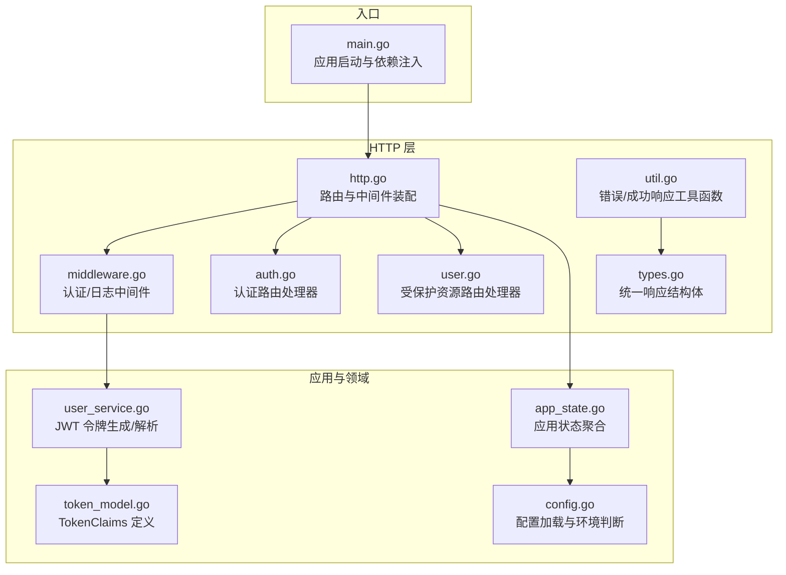
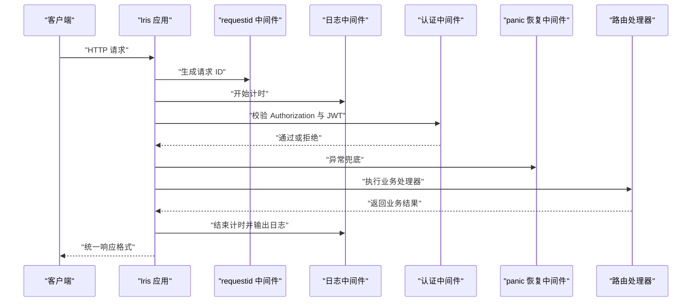
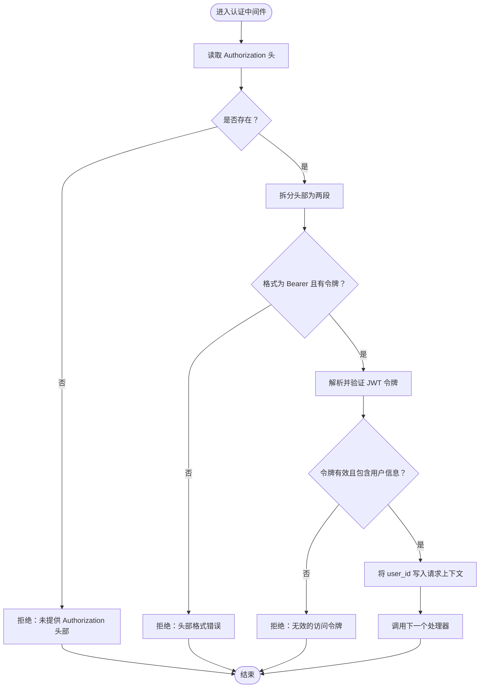
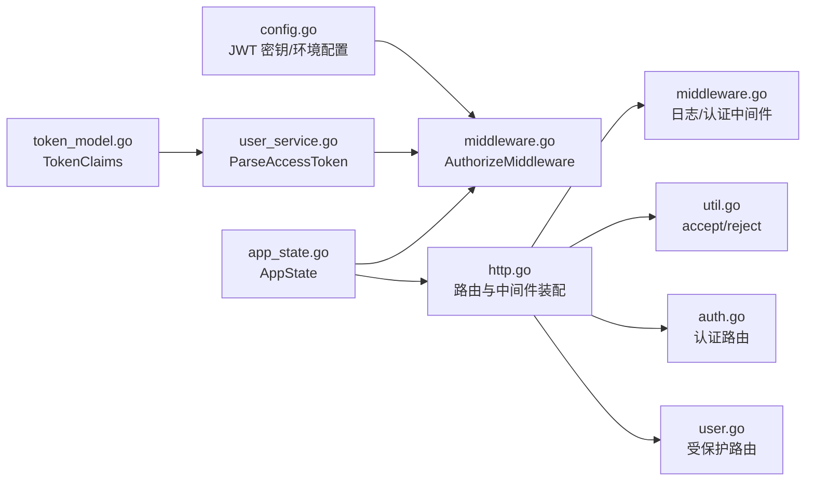

# 中间件实现

<cite>
**本文引用的文件**
- [middleware.go](file://internal/api/http/middleware.go)
- [http.go](file://internal/api/http/http.go)
- [util.go](file://internal/api/http/util.go)
- [auth.go](file://internal/api/http/auth.go)
- [user.go](file://internal/api/http/user.go)
- [types.go](file://internal/api/http/types.go)
- [main.go](file://main.go)
- [app_state.go](file://internal/state/app_state.go)
- [config.go](file://internal/config/config.go)
- [user_service.go](file://internal/domain/service/user.go)
- [token_model.go](file://internal/domain/model/token.go)
</cite>

## 目录
1. [简介](#简介)
2. [项目结构](#项目结构)
3. [核心组件](#核心组件)
4. [架构总览](#架构总览)
5. [详细组件分析](#详细组件分析)
6. [依赖分析](#依赖分析)
7. [性能考虑](#性能考虑)
8. [故障排查指南](#故障排查指南)
9. [结论](#结论)
10. [附录](#附录)

## 简介
本文件系统性梳理 poprako-web-ms 项目的中间件实现，重点覆盖 HTTP 请求处理管道中的中间件架构，包括：
- 认证中间件：基于 JWT 的访问令牌校验与用户上下文注入
- 日志中间件：请求耗时统计与开发环境下的详细日志输出
- 错误处理中间件：统一错误响应格式与状态码策略

文档将详细说明中间件的执行顺序、请求拦截与响应处理机制，解释 JWT 令牌验证的工作流程（令牌提取、验证与用户上下文设置），并提供配置选项、自定义扩展建议与性能优化策略，最后给出最佳实践与调试技巧。

## 项目结构
项目采用分层架构，HTTP 层负责路由与中间件装配，应用层负责业务编排，领域层负责模型与服务，基础设施层负责外部集成与仓储实现。中间件位于 HTTP 层，作为全局处理管道的一部分，贯穿所有路由。

图表来源
- [http.go:26-151](file://internal/api/http/http.go#L26-L151)
- [middleware.go:15-79](file://internal/api/http/middleware.go#L15-L79)
- [util.go:11-58](file://internal/api/http/util.go#L11-L58)
- [auth.go:22-72](file://internal/api/http/auth.go#L22-L72)
- [user.go:22-49](file://internal/api/http/user.go#L22-L49)
- [main.go:25-145](file://main.go#L25-L145)
- [app_state.go:8-49](file://internal/state/app_state.go#L8-L49)
- [config.go:21-83](file://internal/config/config.go#L21-L83)
- [user_service.go:15-68](file://internal/domain/service/user.go#L15-L68)
- [token_model.go:5-8](file://internal/domain/model/token.go#L5-L8)

章节来源
- [http.go:26-151](file://internal/api/http/http.go#L26-L151)
- [main.go:25-145](file://main.go#L25-L145)

## 核心组件
- 认证中间件（AuthorizeMiddleware）：从请求头提取 Bearer 令牌，使用 HMAC 签名验证，失败则拒绝；成功则将用户 ID 写入请求上下文，供后续处理器使用。
- 日志中间件（LogMiddleware）：记录请求方法、路径、状态码、远端地址、请求 ID 与耗时；仅在开发环境输出详细字段。
- 错误处理工具：统一错误响应格式（含 code/message），并提供 accept/reject 辅助函数；部分处理器采用统一 200 状态码承载业务状态码。
- 请求 ID 中间件：为每个请求生成唯一标识，便于链路追踪与日志关联。
- 恐慌恢复中间件：捕获并恢复运行时异常，避免进程崩溃。

章节来源
- [middleware.go:15-79](file://internal/api/http/middleware.go#L15-L79)
- [util.go:11-58](file://internal/api/http/util.go#L11-L58)
- [http.go:26-35](file://internal/api/http/http.go#L26-L35)

## 架构总览
中间件在 Iris 应用初始化阶段被注册，形成如下执行顺序：
1) 请求进入
2) requestid 中间件生成请求 ID
3) 日志中间件开始计时
4) 认证中间件校验 Authorization 头与 JWT 令牌
5) 恐慌恢复中间件兜底
6) 具体路由处理器执行业务逻辑
7) 日志中间件结束计时并输出日志
8) 返回统一响应格式

图表来源
- [http.go:26-35](file://internal/api/http/http.go#L26-L35)
- [middleware.go:15-79](file://internal/api/http/middleware.go#L15-L79)
- [util.go:11-58](file://internal/api/http/util.go#L11-L58)

## 详细组件分析

### 认证中间件（AuthorizeMiddleware）
- 作用：拦截受保护路由，校验 Authorization 头是否为 Bearer 令牌，使用配置中的密钥进行 HMAC 验证，失败则返回未授权；成功则将用户 ID 注入请求上下文。
- 关键点：
  - 令牌提取：要求头部格式为“Bearer <token>”，否则拒绝。
  - 令牌验证：使用 HMAC 签名算法与配置密钥解析并验证令牌有效性。
  - 上下文注入：通过 ctx.Values().Set 将 user_id 写入，供后续处理器使用。
  - 拒绝策略：调用 reject 输出统一错误格式并终止后续处理。

图表来源
- [middleware.go:50-78](file://internal/api/http/middleware.go#L50-L78)
- [user_service.go:43-68](file://internal/domain/service/user.go#L43-L68)
- [token_model.go:5-8](file://internal/domain/model/token.go#L5-L8)

章节来源
- [middleware.go:47-79](file://internal/api/http/middleware.go#L47-L79)
- [user_service.go:43-68](file://internal/domain/service/user.go#L43-L68)
- [token_model.go:5-8](file://internal/domain/model/token.go#L5-L8)

### 日志中间件（LogMiddleware）
- 作用：在开发环境下记录请求完成后的关键指标，包括方法、路径、状态码、远端地址、请求 ID 与耗时。
- 关键点：
  - 开发/生产环境区分：仅在开发环境输出详细字段。
  - 计时：在 ctx.Next() 之前开始计时，在之后计算耗时。
  - 请求 ID：依赖 requestid 中间件提供的标识。

章节来源
- [middleware.go:15-45](file://internal/api/http/middleware.go#L15-L45)

### 错误处理工具与统一响应
- reject：设置状态码并返回统一错误响应结构（code/message）。
- accept：统一返回 200 状态码，业务状态码通过 code 字段承载，消息与数据在 message/data 字段体现。
- extractCurrentUserID：从请求上下文读取 user_id，若不存在则拒绝并返回 false，调用方可据此提前返回。

章节来源
- [util.go:11-58](file://internal/api/http/util.go#L11-L58)
- [types.go:3-9](file://internal/api/http/types.go#L3-L9)

### 路由与中间件装配
- 初始化顺序：requestid -> 日志中间件 -> panic 恢复中间件 -> 认证中间件（受保护路由前缀）。
- 受保护路由：以 AuthorizeMiddleware 包裹的 /api/v1/... 路由均需登录。
- 认证路由：/api/v1/auth/login 与 /api/v1/auth/register 不需要登录。

章节来源
- [http.go:26-48](file://internal/api/http/http.go#L26-L48)

### JWT 令牌生成与解析
- 生成：使用 HS256 算法，包含过期时间、签发时间、发行者与主题等声明，以及用户 ID。
- 解析：校验签名算法与密钥，确保令牌有效且包含用户 ID。

章节来源
- [user_service.go:15-68](file://internal/domain/service/user.go#L15-L68)
- [token_model.go:5-8](file://internal/domain/model/token.go#L5-L8)

### 示例：受保护路由处理器如何使用用户上下文
- 在处理器中调用 extractCurrentUserID 获取当前用户 ID，若失败则自动返回未授权错误。
- 该模式确保所有受保护路由无需重复校验令牌，只需读取上下文即可。

章节来源
- [user.go:22-49](file://internal/api/http/user.go#L22-L49)
- [util.go:48-58](file://internal/api/http/util.go#L48-L58)

## 依赖分析
- 中间件依赖关系：
  - 日志中间件依赖 requestid 中间件与 Zap 日志库。
  - 认证中间件依赖配置中的 JWT 密钥与令牌解析服务。
  - 统一响应工具依赖 Iris Context 与 TraceScope。
- 路由与中间件装配：
  - 所有受保护路由共享同一认证中间件实例。
  - 认证路由独立于认证中间件，避免循环依赖。

图表来源
- [config.go:69-83](file://internal/config/config.go#L69-L83)
- [middleware.go:47-79](file://internal/api/http/middleware.go#L47-L79)
- [user_service.go:43-68](file://internal/domain/service/user.go#L43-L68)
- [token_model.go:5-8](file://internal/domain/model/token.go#L5-L8)
- [app_state.go:8-21](file://internal/state/app_state.go#L8-L21)
- [http.go:26-48](file://internal/api/http/http.go#L26-L48)
- [util.go:11-58](file://internal/api/http/util.go#L11-L58)
- [auth.go:22-72](file://internal/api/http/auth.go#L22-L72)
- [user.go:22-49](file://internal/api/http/user.go#L22-L49)

## 性能考虑
- 中间件顺序优化：将轻量中间件（如日志）置于较前位置，避免对重逻辑造成额外开销。
- 日志输出控制：仅在开发环境输出详细字段，生产环境可关闭或降低日志级别，减少 IO 压力。
- 令牌解析成本：JWT 解析为 CPU 密集型操作，建议：
  - 缓存近期常用用户上下文（视业务场景评估）。
  - 控制令牌有效期，避免频繁刷新。
  - 对高频接口考虑限流与缓存策略。
- 统一响应格式：减少前端解析负担，但需注意避免在错误路径上产生过多 JSON 序列化开销。

[本节为通用指导，不直接分析具体文件]

## 故障排查指南
- 未提供 Authorization 头或格式错误
  - 现象：返回未授权错误。
  - 排查：确认请求头格式为“Bearer <token>”，检查大小写与空格。
  - 参考路径：[middleware.go:50-61](file://internal/api/http/middleware.go#L50-L61)
- 无效的访问令牌
  - 现象：返回无效令牌错误。
  - 排查：确认 JWT 密钥正确、签名算法匹配、令牌未过期。
  - 参考路径：[middleware.go:65-69](file://internal/api/http/middleware.go#L65-L69)，[user_service.go:43-68](file://internal/domain/service/user.go#L43-L68)
- 访问令牌不包含用户信息
  - 现象：返回未授权错误。
  - 排查：确认令牌声明中包含 user_id。
  - 参考路径：[middleware.go:71-74](file://internal/api/http/middleware.go#L71-L74)，[token_model.go:5-8](file://internal/domain/model/token.go#L5-L8)
- 统一错误响应格式
  - 现象：HTTP 状态码可能为 200，业务状态码通过 code 字段承载。
  - 排查：前端需按 code 字段判断业务成功与否。
  - 参考路径：[util.go:24-39](file://internal/api/http/util.go#L24-L39)，[types.go:3-9](file://internal/api/http/types.go#L3-L9)
- 请求 ID 丢失
  - 现象：日志中无法关联请求。
  - 排查：确认 requestid 中间件在日志中间件之前注册。
  - 参考路径：[http.go:29-34](file://internal/api/http/http.go#L29-L34)

章节来源
- [middleware.go:50-78](file://internal/api/http/middleware.go#L50-L78)
- [user_service.go:43-68](file://internal/domain/service/user.go#L43-L68)
- [token_model.go:5-8](file://internal/domain/model/token.go#L5-L8)
- [util.go:24-39](file://internal/api/http/util.go#L24-L39)
- [types.go:3-9](file://internal/api/http/types.go#L3-L9)
- [http.go:29-34](file://internal/api/http/http.go#L29-L34)

## 结论
本项目中间件体系简洁高效：通过 requestid、日志与认证三类中间件，实现了请求追踪、安全校验与统一响应。JWT 令牌验证流程清晰，错误处理统一规范，适合在生产环境中稳定运行。建议在生产环境进一步完善日志策略与令牌缓存机制，持续优化高并发场景下的性能表现。

[本节为总结性内容，不直接分析具体文件]

## 附录

### 中间件配置选项
- JWT 密钥：通过环境变量加载，用于 HMAC 验证。
- 服务器地址：来自配置文件，用于监听。
- 环境：development/production，影响日志输出与 Swagger UI 显示。

章节来源
- [config.go:69-83](file://internal/config/config.go#L69-L83)
- [config.go:21-27](file://internal/config/config.go#L21-L27)
- [config.go:61-67](file://internal/config/config.go#L61-L67)

### 自定义扩展建议
- 新增中间件：遵循 ctx.Next() 调用顺序，确保在合适位置插入逻辑。
- 自定义日志：可扩展日志中间件，增加采样率或结构化字段。
- 自定义认证：可替换为其他鉴权方案（如 OAuth），保持统一响应格式。
- 统一响应：保持 accept/reject 行为一致，避免前后端理解偏差。

[本节为通用指导，不直接分析具体文件]

### 最佳实践与调试技巧
- 最佳实践
  - 将认证中间件置于受保护路由前缀，避免重复校验。
  - 使用 requestid 进行全链路追踪，结合日志输出定位问题。
  - 统一错误响应格式，前端按 code 字段处理业务状态。
- 调试技巧
  - 开发环境开启详细日志，观察 method/path/status_code/duration/request_id。
  - 使用抓包工具检查 Authorization 头格式与令牌内容。
  - 在处理器中打印 trace scope，结合请求 ID 定位具体请求。

[本节为通用指导，不直接分析具体文件]