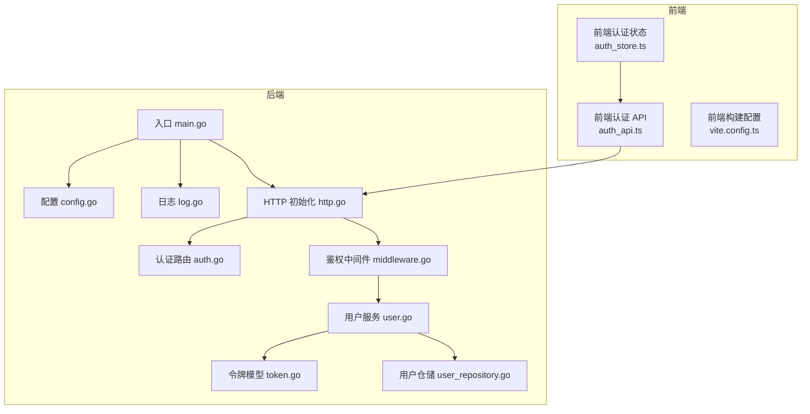
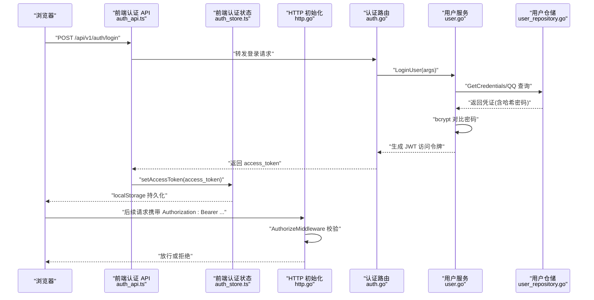
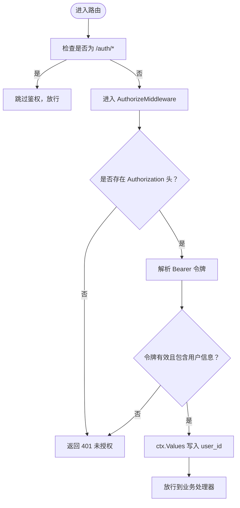
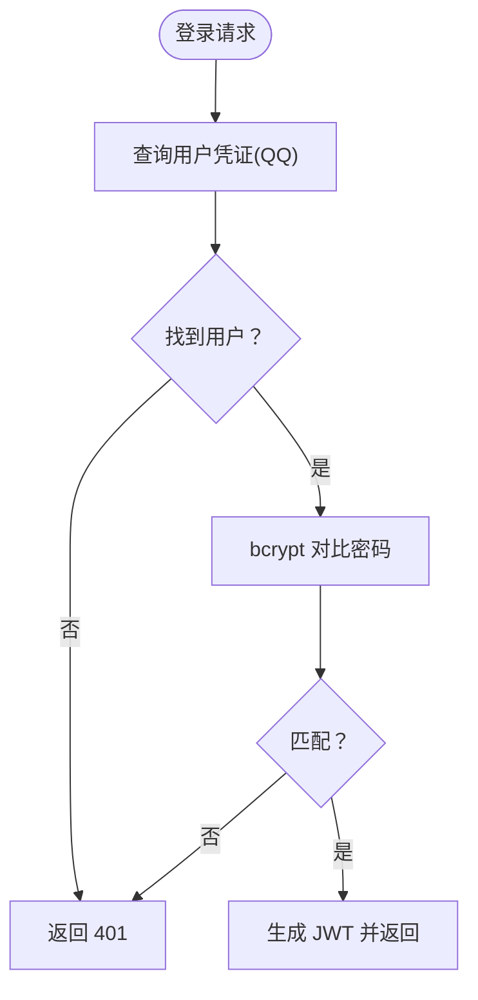
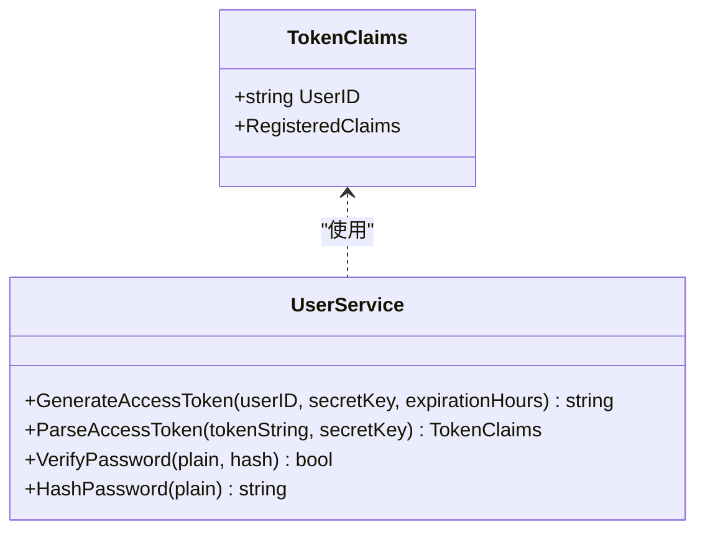
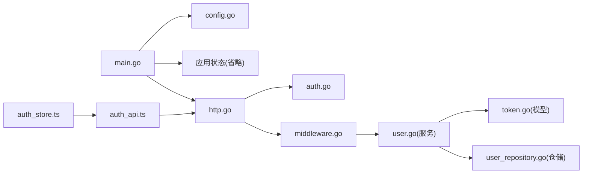

# 安全防护策略

<cite>
**本文引用的文件**
- [main.go](file://main.go)
- [config.go](file://internal/config/config.go)
- [middleware.go](file://internal/api/http/middleware.go)
- [token.go](file://internal/domain/model/token.go)
- [auth.go](file://internal/api/http/auth.go)
- [user.go](file://internal/domain/service/user.go)
- [user_repository.go](file://internal/infrastructure/repository/user.go)
- [auth_store.ts](file://frontend/src/stores/auth.ts)
- [auth_api.ts](file://frontend/src/api/modules/auth.ts)
- [http.go](file://internal/api/http/http.go)
- [log.go](file://internal/log/log.go)
- [error.go](file://internal/application/error.go)
- [vite.config.ts](file://frontend/vite.config.ts)
</cite>

## 目录
1. [简介](#简介)
2. [项目结构](#项目结构)
3. [核心组件](#核心组件)
4. [架构总览](#架构总览)
5. [详细组件分析](#详细组件分析)
6. [依赖分析](#依赖分析)
7. [性能考量](#性能考量)
8. [故障排查指南](#故障排查指南)
9. [结论](#结论)
10. [附录](#附录)

## 简介
本文件面向 poprako-web-ms 项目的安全防护策略，聚焦认证授权、密码存储、令牌安全、防暴力破解、CSRF/XSS/SQL 注入防护、会话与令牌管理、安全头部、安全审计与异常监控、入侵检测、漏洞扫描与渗透测试、以及合规与数据保护等主题。文档基于代码库实际实现进行分析，并提出可操作的加固建议。

## 项目结构
后端采用 Go 语言与 Iris 框架，前端采用 Vue + TypeScript + Vite。认证采用 JWT 令牌，密码使用 bcrypt 哈希；路由按模块划分，认证相关路由无需登录即可访问，其余路由均受统一鉴权中间件保护。

**图表来源**
- [main.go:25-145](file://main.go#L25-L145)
- [config.go:11-101](file://internal/config/config.go#L11-L101)
- [http.go:26-151](file://internal/api/http/http.go#L26-L151)
- [auth.go:22-73](file://internal/api/http/auth.go#L22-L73)
- [middleware.go:15-79](file://internal/api/http/middleware.go#L15-L79)
- [token.go:1-9](file://internal/domain/model/token.go#L1-L9)
- [user.go:15-93](file://internal/domain/service/user.go#L15-L93)
- [user_repository.go:1-150](file://internal/infrastructure/repository/user.go#L1-L150)
- [log.go:13-84](file://internal/log/log.go#L13-L84)
- [auth_api.ts:79-110](file://frontend/src/api/modules/auth.ts#L79-L110)
- [auth_store.ts:15-51](file://frontend/src/stores/auth.ts#L15-L51)
- [vite.config.ts:12-19](file://frontend/vite.config.ts#L12-L19)

**章节来源**
- [main.go:25-145](file://main.go#L25-L145)
- [http.go:26-151](file://internal/api/http/http.go#L26-L151)

## 核心组件
- 配置与密钥管理：JWT 密钥通过环境变量注入，数据库连接地址通过环境变量注入，生产/开发模式由环境变量区分。
- 认证与授权：登录/注册路由无需鉴权；其他路由统一由鉴权中间件保护，使用 Bearer JWT 令牌校验。
- 密码安全：bcrypt 哈希存储，明文密码仅在内存中短暂存在，用于比对验证。
- 令牌模型：自定义 Claims，包含用户标识与标准声明。
- 日志与审计：开发/生产差异化日志策略，生产环境启用日志轮转与告警级别提升。
- 前端令牌存储：localStorage 存储访问令牌，便于跨页面持久化登录态。

**章节来源**
- [config.go:69-101](file://internal/config/config.go#L69-L101)
- [middleware.go:47-79](file://internal/api/http/middleware.go#L47-L79)
- [user.go:70-84](file://internal/domain/service/user.go#L70-L84)
- [token.go:5-9](file://internal/domain/model/token.go#L5-L9)
- [log.go:13-84](file://internal/log/log.go#L13-L84)
- [auth_store.ts:19-42](file://frontend/src/stores/auth.ts#L19-L42)

## 架构总览
下图展示从浏览器到后端的典型认证与授权流程，包括令牌发放、存储与使用。

**图表来源**
- [auth_api.ts:79-86](file://frontend/src/api/modules/auth.ts#L79-L86)
- [auth_store.ts:31-34](file://frontend/src/stores/auth.ts#L31-L34)
- [http.go:40-49](file://internal/api/http/http.go#L40-L49)
- [auth.go:22-40](file://internal/api/http/auth.go#L22-L40)
- [user.go:15-41](file://internal/domain/service/user.go#L15-L41)
- [user_repository.go:73-87](file://internal/infrastructure/repository/user.go#L73-L87)

## 详细组件分析

### 认证与授权流程
- 登录/注册：无需鉴权，返回访问令牌；前端将令牌写入 localStorage。
- 其他路由：统一经 AuthorizeMiddleware 校验，要求 Authorization 头部为 Bearer 令牌，解析失败或缺少用户信息即拒绝。
- 令牌内容：包含用户标识与标准声明，签名算法为 HS256，密钥来自环境变量。

**图表来源**
- [http.go:40-49](file://internal/api/http/http.go#L40-L49)
- [middleware.go:50-78](file://internal/api/http/middleware.go#L50-L78)

**章节来源**
- [auth.go:22-73](file://internal/api/http/auth.go#L22-L73)
- [middleware.go:47-79](file://internal/api/http/middleware.go#L47-L79)
- [token.go:5-9](file://internal/domain/model/token.go#L5-L9)

### 密码加密存储与验证
- 存储：密码以 bcrypt 哈希形式保存于数据库。
- 验证：登录时使用 bcrypt 对比明文与哈希，成功则签发 JWT。
- 生成：哈希成本使用默认值，兼顾安全性与性能。

**图表来源**
- [user.go:70-84](file://internal/domain/service/user.go#L70-L84)
- [user_repository.go:73-87](file://internal/infrastructure/repository/user.go#L73-L87)

**章节来源**
- [user.go:70-84](file://internal/domain/service/user.go#L70-L84)
- [user_repository.go:73-87](file://internal/infrastructure/repository/user.go#L73-L87)

### 令牌安全与会话管理
- 令牌结构：包含用户标识与标准声明，签名算法为 HS256。
- 传输：通过 HTTP Authorization 头部 Bearer 传输，建议配合 HTTPS。
- 过期：由服务端配置过期小时数，前端需在过期后重新登录。
- 会话撤销：当前实现未见黑名单或撤销列表，建议引入短期令牌+刷新令牌、服务端注销接口、或维护黑名单。

**图表来源**
- [token.go:5-9](file://internal/domain/model/token.go#L5-L9)
- [user.go:15-68](file://internal/domain/service/user.go#L15-L68)

**章节来源**
- [token.go:5-9](file://internal/domain/model/token.go#L5-L9)
- [user.go:15-68](file://internal/domain/service/user.go#L15-L68)

### CSRF 防护
- 当前后端未实现 CSRF 防护机制（如 SameSite Cookie、CSRF Token）。建议：
  - 对于 SPA + Bearer 令牌场景，CSRF 风险较低，但仍建议：
    - 严格限制 CORS 策略（仅允许前端域名）。
    - 使用 HttpOnly Cookie 作为补充（若切换至 Cookie 方案），并启用 SameSite=Lax|Strict。
    - 对敏感操作增加二次确认或验证码。

[本节为概念性建议，不直接分析具体文件]

### XSS 防护
- 前端渲染：Vue 模板默认进行 DOM 转义，建议：
  - 避免 innerHTML 或 v-html 动态绑定不受信任内容。
  - 对用户输入进行白名单过滤与长度限制。
  - 启用 Content-Security-Policy，限制脚本来源与内联脚本。
- 后端输出：确保 API 响应不包含未经转义的用户输入。

**章节来源**
- [auth_store.ts:19-42](file://frontend/src/stores/auth.ts#L19-L42)
- [vite.config.ts:12-19](file://frontend/vite.config.ts#L12-L19)

### SQL 注入防护
- ORM 使用：仓储层通过类型化查询与条件拼接，避免原生 SQL 拼接。
- 参数化：查询均使用参数化条件，降低注入风险。
- 建议：保持 ORM 使用习惯，避免手写 SQL；对复杂查询进行 SQL 审计与静态扫描。

**章节来源**
- [user_repository.go:32-87](file://internal/infrastructure/repository/user.go#L32-L87)

### 会话管理、令牌撤销与安全头部
- 会话管理：当前为无状态 JWT，建议引入短期访问令牌与刷新令牌策略。
- 令牌撤销：建议实现服务端注销接口与黑名单，或缩短过期时间并定期轮换密钥。
- 安全头部：建议在网关/反向代理层启用：
  - Strict-Transport-Security
  - X-Content-Type-Options: nosniff
  - X-Frame-Options: DENY
  - Referrer-Policy: strict-origin-when-cross-origin
  - Content-Security-Policy（按需）

[本节为概念性建议，不直接分析具体文件]

### 安全审计、异常监控与入侵检测
- 日志：生产环境启用 JSON 日志与轮转，告警级别提升；开发环境增强调试输出。
- 审计：结合请求 ID（requestid 中间件）追踪请求链路，记录关键事件（登录、登出、权限变更）。
- 异常监控：panic 恢复中间件捕获异常，结合日志与告警系统上报。

**章节来源**
- [log.go:13-84](file://internal/log/log.go#L13-L84)
- [http.go:26-35](file://internal/api/http/http.go#L26-L35)

### 防暴力破解机制
- 当前未见账户锁定、速率限制或验证码机制。建议：
  - 登录失败次数阈值与冷却时间。
  - IP/账号维度限流（Redis 计数器）。
  - 首次失败发送通知或二次验证。

[本节为概念性建议，不直接分析具体文件]

### 安全漏洞扫描、渗透测试与加固
- 扫描：CI 集成静态代码分析（golangci-lint）、依赖漏洞扫描（如 govulncheck）、前端依赖扫描。
- 测试：定期进行渗透测试，覆盖认证绕过、敏感信息泄露、越权访问等场景。
- 加固：最小权限原则、最小暴露面、HTTPS 强制、密钥轮换、最小化日志输出敏感信息。

[本节为概念性建议，不直接分析具体文件]

### 合规性与数据保护
- 数据最小化：仅收集必要信息（QQ、用户名、密码）。
- 数据加密：传输层使用 TLS；静态数据可考虑加密（按法规要求）。
- 用户权利：提供删除账号、导出数据、更正信息等能力。
- 第三方组件：定期审查依赖版本与 CVE。

[本节为概念性建议，不直接分析具体文件]

## 依赖分析
后端依赖关系围绕“入口 -> 配置 -> 应用状态 -> HTTP -> 中间件/路由 -> 服务/仓储”的层次化结构展开；前端通过 API 模块与状态管理与后端交互。

**图表来源**
- [main.go:25-145](file://main.go#L25-L145)
- [config.go:11-101](file://internal/config/config.go#L11-L101)
- [http.go:26-151](file://internal/api/http/http.go#L26-L151)
- [auth.go:22-73](file://internal/api/http/auth.go#L22-L73)
- [middleware.go:15-79](file://internal/api/http/middleware.go#L15-L79)
- [user.go:15-93](file://internal/domain/service/user.go#L15-L93)
- [token.go:5-9](file://internal/domain/model/token.go#L5-L9)
- [user_repository.go:1-150](file://internal/infrastructure/repository/user.go#L1-L150)
- [auth_api.ts:79-110](file://frontend/src/api/modules/auth.ts#L79-L110)
- [auth_store.ts:15-51](file://frontend/src/stores/auth.ts#L15-L51)

**章节来源**
- [main.go:25-145](file://main.go#L25-L145)
- [http.go:26-151](file://internal/api/http/http.go#L26-L151)

## 性能考量
- JWT 解析与 bcrypt 对比均为 CPU 密集型，建议：
  - 合理设置过期时间，避免频繁签发。
  - 对高频接口进行缓存（如用户基本信息），减少数据库压力。
  - 使用连接池与索引优化查询。

[本节为通用建议，不直接分析具体文件]

## 故障排查指南
- 401 未授权
  - 检查 Authorization 头是否为 Bearer 令牌。
  - 确认 JWT 密钥一致且未被修改。
  - 核对令牌是否过期。
- 登录失败
  - 确认 QQ 是否存在且密码正确。
  - 查看 bcrypt 对比是否报错。
- 日志定位
  - 开发环境查看控制台 Debug 日志。
  - 生产环境查看 logs/main-service.log 并关注 Warn/Panic 级别。

**章节来源**
- [middleware.go:50-78](file://internal/api/http/middleware.go#L50-L78)
- [user.go:70-84](file://internal/domain/service/user.go#L70-L84)
- [log.go:13-84](file://internal/log/log.go#L13-L84)

## 结论
本项目在认证授权方面具备良好基础：JWT 令牌、bcrypt 密码哈希、统一鉴权中间件与分层架构。建议优先补齐 CSRF/XSS/SQL 注入防护、防暴力破解、令牌撤销与安全头部配置，并完善安全审计与异常监控体系，以满足生产级安全要求。

## 附录
- 前端构建与别名配置，确保开发体验与打包一致性。

**章节来源**
- [vite.config.ts:12-19](file://frontend/vite.config.ts#L12-L19)