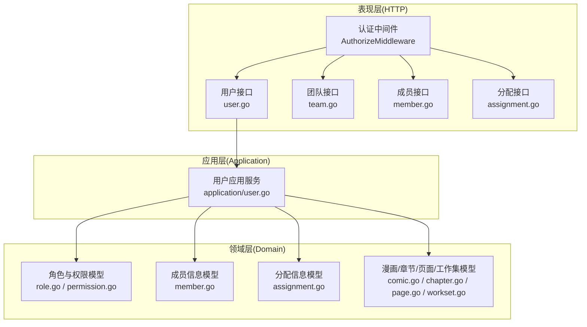
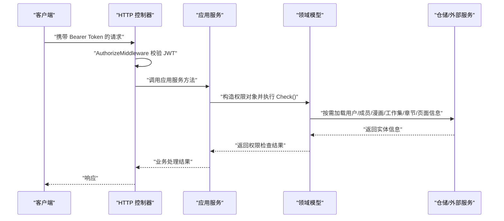
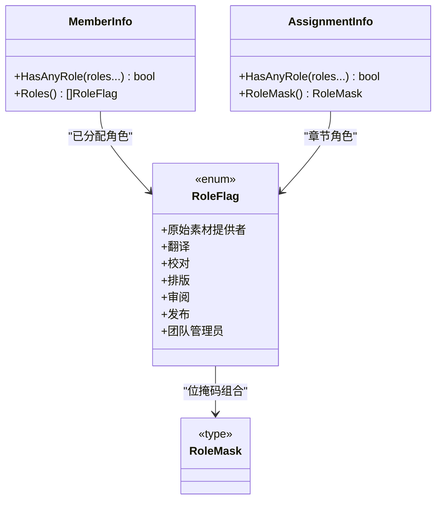
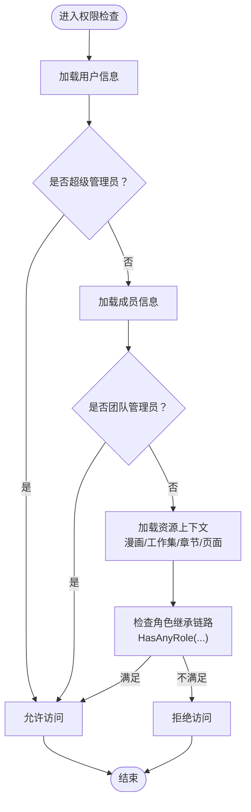
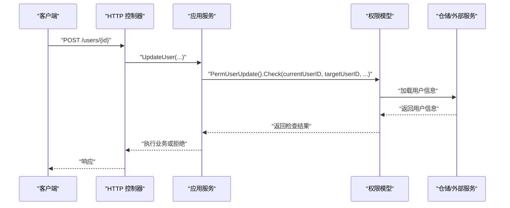
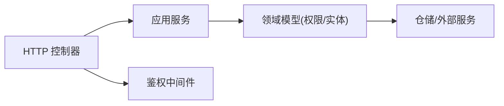

# 权限控制系统

<cite>
**本文档引用的文件**
- [permission.go](file://internal/domain/model/permission.go)
- [role.go](file://internal/domain/model/role.go)
- [member.go](file://internal/domain/model/member.go)
- [assignment.go](file://internal/domain/model/assignment.go)
- [comic.go](file://internal/domain/model/comic.go)
- [chapter.go](file://internal/domain/model/chapter.go)
- [page.go](file://internal/domain/model/page.go)
- [workset.go](file://internal/domain/model/workset.go)
- [middleware.go](file://internal/api/http/middleware.go)
- [auth.go](file://internal/api/http/auth.go)
- [user.go](file://internal/api/http/user.go)
- [team.go](file://internal/api/http/team.go)
- [member.go](file://internal/api/http/member.go)
- [assignment.go](file://internal/api/http/assignment.go)
- [user.go](file://internal/application/user.go)
</cite>

## 目录
1. [引言](#引言)
2. [项目结构](#项目结构)
3. [核心组件](#核心组件)
4. [架构总览](#架构总览)
5. [详细组件分析](#详细组件分析)
6. [依赖分析](#依赖分析)
7. [性能考虑](#性能考虑)
8. [故障排除指南](#故障排除指南)
9. [结论](#结论)
10. [附录](#附录)

## 引言
本文件系统性阐述 poprako-web-ms 项目的权限控制系统，围绕 RBAC（基于角色的访问控制）模型展开，覆盖角色定义、权限分配与继承机制、权限检查流程、资源访问控制与操作权限验证。文档还解释不同角色（普通用户、团队管理员、超级管理员）的权限范围与限制，给出权限缓存策略、动态权限更新与权限审计的建议方案，并总结最佳实践与安全注意事项。

## 项目结构
权限控制涉及三层协作：
- 表现层（HTTP 层）：路由定义、鉴权中间件、控制器入口
- 应用层（Application 层）：业务编排、权限前置检查
- 领域层（Domain 层）：角色与权限模型、权限判定逻辑

**图表来源**
- [middleware.go:47-79](file://internal/api/http/middleware.go#L47-L79)
- [user.go:1-292](file://internal/api/http/user.go#L1-L292)
- [team.go:1-289](file://internal/api/http/team.go#L1-L289)
- [member.go:1-272](file://internal/api/http/member.go#L1-L272)
- [assignment.go:1-228](file://internal/api/http/assignment.go#L1-L228)
- [user.go:1-594](file://internal/application/user.go#L1-L594)
- [role.go:1-56](file://internal/domain/model/role.go#L1-L56)
- [permission.go:1-845](file://internal/domain/model/permission.go#L1-L845)
- [member.go:1-205](file://internal/domain/model/member.go#L1-L205)
- [assignment.go:1-190](file://internal/domain/model/assignment.go#L1-L190)
- [comic.go:1-107](file://internal/domain/model/comic.go#L1-L107)
- [chapter.go:1-260](file://internal/domain/model/chapter.go#L1-L260)
- [page.go:1-134](file://internal/domain/model/page.go#L1-L134)
- [workset.go:1-82](file://internal/domain/model/workset.go#L1-L82)

**章节来源**
- [middleware.go:1-80](file://internal/api/http/middleware.go#L1-L80)
- [user.go:1-292](file://internal/api/http/user.go#L1-L292)
- [team.go:1-289](file://internal/api/http/team.go#L1-L289)
- [member.go:1-272](file://internal/api/http/member.go#L1-L272)
- [assignment.go:1-228](file://internal/api/http/assignment.go#L1-L228)
- [user.go:1-594](file://internal/application/user.go#L1-L594)

## 核心组件
- 角色与权限模型
  - 角色标志位与掩码：通过位掩码表达多角色组合，支持角色集合的合并与解包。
  - 成员角色：成员信息包含各角色的“已分配时间”字段，用于判定是否具备某角色。
  - 分配角色：章节分配信息包含各角色的“已分配时间”字段，用于判定用户在特定章节上的角色。
- 权限判定器
  - 将具体权限抽象为类型化对象，每个权限对象封装 Check 方法，结合加载器函数完成跨实体的权限校验。
  - 提供统一的加载器函数族，负责按需加载用户、成员、漫画、工作集、章节、页面等上下文信息。
- 鉴权中间件
  - 解析 Authorization 头，校验 JWT 并注入用户标识到请求上下文，为后续权限检查提供基础。

**章节来源**
- [role.go:1-56](file://internal/domain/model/role.go#L1-L56)
- [member.go:101-136](file://internal/domain/model/member.go#L101-L136)
- [assignment.go:57-88](file://internal/domain/model/assignment.go#L57-L88)
- [permission.go:1-845](file://internal/domain/model/permission.go#L1-L845)
- [middleware.go:47-79](file://internal/api/http/middleware.go#L47-L79)

## 架构总览
RBAC 权限控制在系统中的位置如下：

**图表来源**
- [middleware.go:47-79](file://internal/api/http/middleware.go#L47-L79)
- [user.go:280-361](file://internal/application/user.go#L280-L361)
- [permission.go:212-246](file://internal/domain/model/permission.go#L212-L246)
- [member.go:101-136](file://internal/domain/model/member.go#L101-L136)
- [assignment.go:57-88](file://internal/domain/model/assignment.go#L57-L88)

## 详细组件分析

### 角色与权限模型
- 角色体系
  - 基础角色：原始素材提供者、翻译、校对、排版、审阅、发布、团队管理员。
  - 角色掩码：支持多角色组合，便于批量判定与持久化存储。
- 成员角色判定
  - 通过“已分配时间”字段非空判定是否具备某角色；支持 HasAnyRole 与 Roles 列表导出。
- 分配角色判定
  - 同成员模型，但限定在章节维度，用于页面与单元操作的权限控制。

**图表来源**
- [role.go:9-17](file://internal/domain/model/role.go#L9-L17)
- [member.go:101-136](file://internal/domain/model/member.go#L101-L136)
- [assignment.go:57-111](file://internal/domain/model/assignment.go#L57-L111)

**章节来源**
- [role.go:1-56](file://internal/domain/model/role.go#L1-L56)
- [member.go:1-205](file://internal/domain/model/member.go#L1-L205)
- [assignment.go:1-190](file://internal/domain/model/assignment.go#L1-L190)

### 权限检查流程
- 统一权限对象
  - 以类型化权限对象承载 Check 方法，例如邀请、用户、团队、成员、漫画、章节、分配、页面、单元等。
  - Check 方法内部通过加载器函数获取上下文实体信息，并结合角色判定逻辑完成权限校验。
- 加载器函数族
  - 用户信息加载：用于超级管理员判定与用户自身信息访问。
  - 成员信息加载：用于团队管理员判定与团队内成员列表访问。
  - 漫画/工作集/章节/页面信息加载：用于资源归属与角色继承链路的判定。
- 权限继承链路
  - 页面与单元操作通常要求用户在“章节”维度具备相应角色；章节又由漫画归属决定团队；因此权限检查形成“页面→章节→漫画→工作集→团队”的继承链。

**图表来源**
- [permission.go:15-45](file://internal/domain/model/permission.go#L15-L45)
- [permission.go:68-80](file://internal/domain/model/permission.go#L68-L80)
- [permission.go:82-99](file://internal/domain/model/permission.go#L82-L99)
- [permission.go:101-120](file://internal/domain/model/permission.go#L101-L120)
- [permission.go:122-139](file://internal/domain/model/permission.go#L122-L139)
- [member.go:101-136](file://internal/domain/model/member.go#L101-L136)
- [assignment.go:57-88](file://internal/domain/model/assignment.go#L57-L88)

**章节来源**
- [permission.go:1-845](file://internal/domain/model/permission.go#L1-L845)
- [member.go:1-205](file://internal/domain/model/member.go#L1-L205)
- [assignment.go:1-190](file://internal/domain/model/assignment.go#L1-L190)

### 资源访问控制与操作权限验证
- 用户资源
  - 查看他人信息：仅超级管理员可查看；普通用户仅可查看自身。
  - 更新他人信息：仅超级管理员可更新；普通用户可更新自身。
  - 删除用户：仅超级管理员可删除，且不可删除自身。
- 团队资源
  - 创建/更新/删除团队：仅超级管理员可操作；更新时团队管理员可对所属团队进行更新。
- 成员资源
  - 创建成员：仅超级管理员可直接创建成员。
  - 列表/更新/删除成员：仅团队管理员可操作。
- 漫画/章节/页面/单元资源
  - 列表/创建/更新/删除：通常要求团队成员或特定角色（如审阅者）。
  - 页面与单元操作：要求用户在“章节”维度具备相应角色（翻译、校对等）。

**图表来源**
- [user.go:177-225](file://internal/api/http/user.go#L177-L225)
- [user.go:470-519](file://internal/application/user.go#L470-L519)
- [permission.go:277-287](file://internal/domain/model/permission.go#L277-L287)

**章节来源**
- [user.go:1-292](file://internal/api/http/user.go#L1-L292)
- [user.go:280-594](file://internal/application/user.go#L280-L594)
- [permission.go:200-300](file://internal/domain/model/permission.go#L200-L300)

### 不同角色的权限范围与限制
- 普通用户
  - 可查看自身信息与数据。
  - 可更新自身信息（密码等）。
  - 无删除用户、团队、成员等高权限操作。
- 团队管理员
  - 可查看/更新所属团队信息。
  - 可管理所属团队内的成员与资源（漫画、章节、页面、单元）。
  - 对邀请与用户管理无直接权限。
- 超级管理员
  - 可查看/管理所有用户与团队。
  - 可执行删除用户等高风险操作（且不可删除自身）。
  - 可管理所有团队与成员。

**章节来源**
- [permission.go:15-45](file://internal/domain/model/permission.go#L15-L45)
- [permission.go:68-80](file://internal/domain/model/permission.go#L68-L80)
- [permission.go:294-300](file://internal/domain/model/permission.go#L294-L300)

### 权限缓存策略
- 缓存粒度
  - 用户角色与成员身份：短期缓存（如 5–15 分钟），结合用户登录态与变更事件刷新。
  - 团队/工作集/漫画/章节/页面归属：按资源 ID 缓存，结合写操作失效。
- 刷新机制
  - 写操作（新增/更新/删除）后主动失效相关缓存键。
  - 定期任务清理过期缓存，保证一致性。
- 注意事项
  - 缓存键应包含用户 ID 与资源 ID，避免越权。
  - 对高敏感操作（删除、权限变更）强制绕过缓存，走实时校验。

### 动态权限更新
- 实时生效
  - 成员角色变更、分配角色变更应即时反映在权限检查中。
- 事件驱动
  - 通过仓储层事件或应用层事件触发缓存失效与权限重算。
- 幂等性
  - 权限更新接口需幂等，避免重复赋权导致的异常状态。

### 权限审计
- 审计内容
  - 关键权限操作（创建/删除用户、团队、成员、资源）的日志记录。
  - 权限检查失败的统计与告警。
- 日志字段
  - 操作人、目标资源、操作类型、时间戳、结果、IP、UA、请求 ID。
- 存储与检索
  - 结构化日志输出至集中式日志系统，支持快速检索与报表生成。

## 依赖分析
- HTTP 层依赖应用层，应用层依赖领域层的权限模型与实体模型。
- 领域层通过加载器函数族解耦仓储细节，提升可测试性与可维护性。
- 鉴权中间件独立于业务逻辑，仅负责用户身份注入。

**图表来源**
- [middleware.go:47-79](file://internal/api/http/middleware.go#L47-L79)
- [user.go:1-594](file://internal/application/user.go#L1-L594)
- [permission.go:1-845](file://internal/domain/model/permission.go#L1-L845)

**章节来源**
- [middleware.go:1-80](file://internal/api/http/middleware.go#L1-L80)
- [user.go:1-594](file://internal/application/user.go#L1-L594)
- [permission.go:1-845](file://internal/domain/model/permission.go#L1-L845)

## 性能考虑
- 权限检查的最小化调用
  - 合理复用加载器函数，避免重复查询同一实体。
  - 将多个 Check 调用合并为一次批量加载，减少数据库往返。
- 缓存命中率优化
  - 将常用实体（用户、团队、成员）放入热点缓存。
  - 使用分布式缓存时，注意缓存穿透与雪崩防护。
- 异步刷新
  - 对权限变更采用异步刷新策略，降低写路径延迟。
- 监控与告警
  - 对权限检查耗时与失败率进行监控，及时发现性能瓶颈。

## 故障排除指南
- 常见问题
  - 401 未授权：检查 Authorization 头格式与 JWT 是否有效。
  - 403 权限不足：核对用户角色与资源归属，确认是否满足权限继承链路。
  - 404 资源不存在：确认资源 ID 与上下文是否匹配。
- 排查步骤
  - 开启调试日志，定位鉴权中间件与权限检查的具体路径。
  - 核对加载器函数返回值，确认实体信息是否完整。
  - 检查缓存状态，必要时强制刷新或绕过缓存验证。
- 错误处理
  - 对加载失败与权限检查失败进行明确的错误提示与日志记录。

**章节来源**
- [middleware.go:47-79](file://internal/api/http/middleware.go#L47-L79)
- [user.go:280-361](file://internal/application/user.go#L280-L361)
- [permission.go:212-246](file://internal/domain/model/permission.go#L212-L246)

## 结论
本权限控制系统以 RBAC 为核心，通过类型化权限对象与加载器函数族实现了清晰、可扩展的权限判定机制。配合鉴权中间件与应用层前置检查，系统在保证安全性的同时兼顾了性能与可维护性。建议进一步完善权限缓存、动态更新与审计能力，持续提升系统的可观测性与稳定性。

## 附录
- 最佳实践
  - 权限检查前置：在应用层尽早进行权限校验，避免无效业务调用。
  - 最小权限原则：默认拒绝，仅授予必要权限。
  - 审计留痕：关键操作必须记录，便于追溯与合规。
  - 定期评审：定期审查角色与权限映射，剔除冗余与过度授权。
- 安全注意事项
  - 严格校验 Authorization 头，防止伪造与泄露。
  - 对高危操作增加二次确认与审批流程。
  - 定期轮换密钥与令牌，缩短有效期，启用刷新机制。
  - 对输入参数进行严格校验，防范注入与越权。