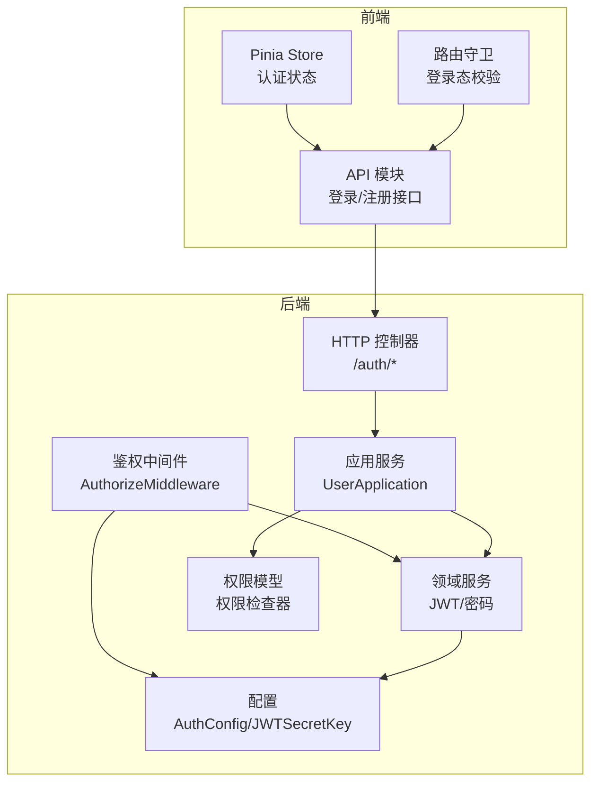
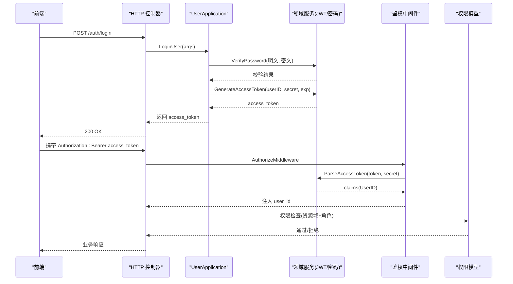
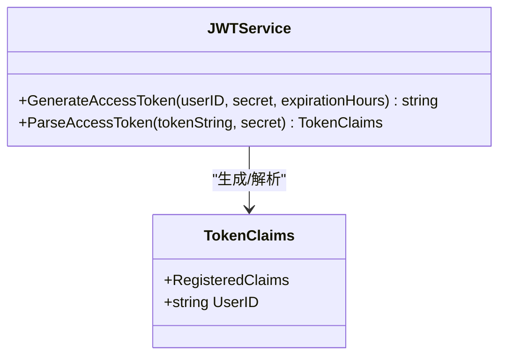
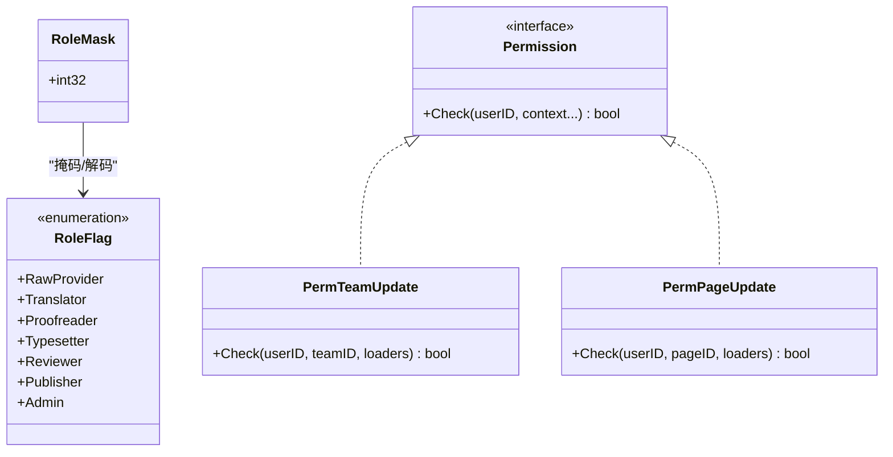
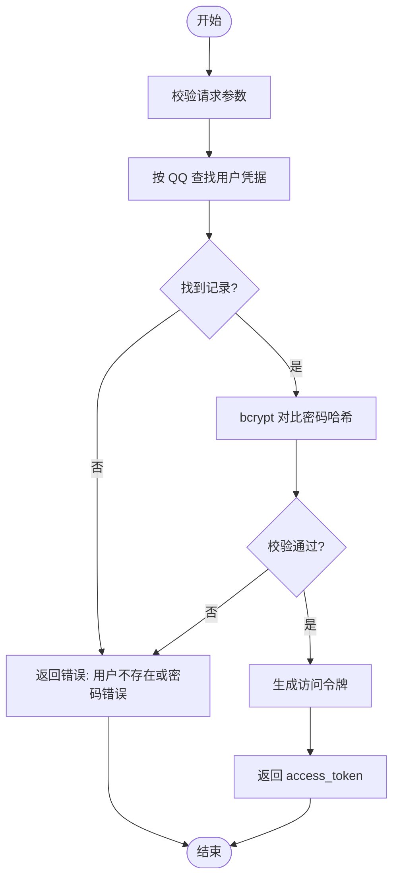
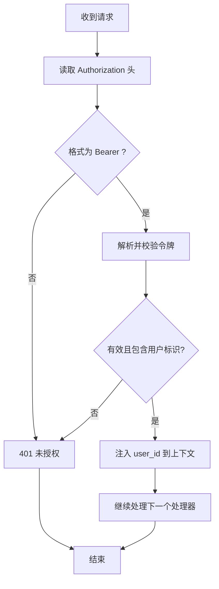
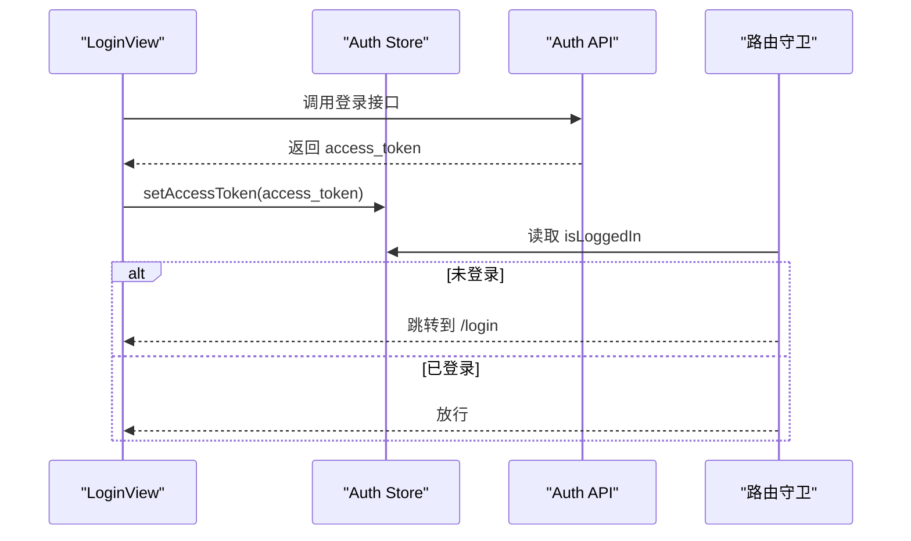
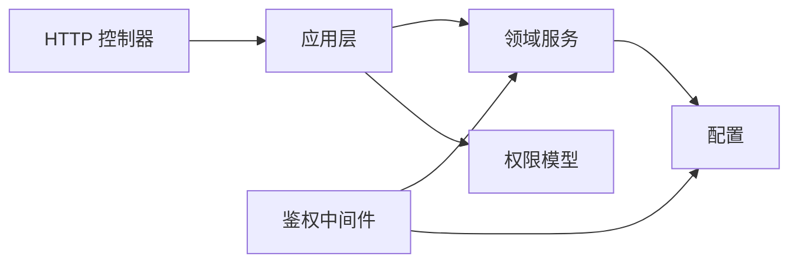

# 认证授权系统

<cite>
**本文档引用的文件**
- [auth.go](file://internal/api/http/auth.go)
- [middleware.go](file://internal/api/http/middleware.go)
- [user.go](file://internal/domain/service/user.go)
- [token.go](file://internal/domain/model/token.go)
- [permission.go](file://internal/domain/model/permission.go)
- [role.go](file://internal/domain/model/role.go)
- [user.go](file://internal/domain/model/user.go)
- [user.go](file://internal/application/user.go)
- [config.go](file://internal/config/config.go)
- [auth.ts](file://frontend/src/stores/auth.ts)
- [auth.ts](file://frontend/src/api/modules/auth.ts)
- [index.ts](file://frontend/src/router/index.ts)
- [loader.go](file://internal/application/adapter/loader.go)
</cite>

## 目录
1. [简介](#简介)
2. [项目结构](#项目结构)
3. [核心组件](#核心组件)
4. [架构总览](#架构总览)
5. [详细组件分析](#详细组件分析)
6. [依赖分析](#依赖分析)
7. [性能考虑](#性能考虑)
8. [故障排除指南](#故障排除指南)
9. [结论](#结论)

## 简介
本文件面向 poprako-web-ms 项目的认证授权系统，系统采用基于 JWT 的无状态认证方案，结合 RBAC（基于角色的访问控制）模型实现细粒度的权限控制。后端使用 Iris 框架提供 REST 接口，前端通过 Pinia 管理登录态并在路由层进行登录态守卫。系统支持用户登录、注册、头像上传等基础能力，并通过中间件统一鉴权，权限检查采用“权限类型 + 资源上下文”的设计，覆盖团队、漫画、章节、页面、单元等多个业务域。

## 项目结构
认证授权相关的代码主要分布在以下层次：
- API 层：提供 /auth/login、/auth/register 等接口，以及统一的鉴权中间件
- 应用层：UserApplication 实现登录、注册、用户信息查询等业务逻辑
- 领域服务：JWT 令牌生成与解析、密码哈希与校验
- 领域模型：TokenClaims、角色掩码、权限检查器
- 前端：Pinia Store 维护访问令牌，HTTP 客户端封装认证接口，路由守卫进行登录态校验

**图表来源**
- [auth.go:22-72](file://internal/api/http/auth.go#L22-L72)
- [middleware.go:47-79](file://internal/api/http/middleware.go#L47-L79)
- [user.go:106-278](file://internal/application/user.go#L106-L278)
- [user.go:15-84](file://internal/domain/service/user.go#L15-L84)
- [permission.go:198-800](file://internal/domain/model/permission.go#L198-L800)
- [config.go:69-83](file://internal/config/config.go#L69-L83)

**章节来源**
- [auth.go:10-72](file://internal/api/http/auth.go#L10-L72)
- [middleware.go:15-79](file://internal/api/http/middleware.go#L15-L79)
- [user.go:21-104](file://internal/application/user.go#L21-L104)
- [user.go:15-84](file://internal/domain/service/user.go#L15-L84)
- [permission.go:198-800](file://internal/domain/model/permission.go#L198-L800)
- [config.go:69-83](file://internal/config/config.go#L69-L83)

## 核心组件
- JWT 认证机制
  - 令牌生成：使用 HS256 签名，包含用户标识、签发时间、过期时间等声明
  - 令牌解析：校验签名与有效期，提取用户标识
  - 过期策略：由配置决定过期小时数
- 权限控制系统
  - 角色定义：原始提供者、翻译、校对、排版、审阅、出版、管理员等
  - 权限检查：按资源域（团队、漫画、章节、页面、单元）定义权限类型，结合成员角色与资源归属进行判定
  - 中间件：统一从 Authorization 头解析 Bearer 令牌，注入用户标识
- 用户认证流程
  - 登录：凭 QQ+密码校验，成功后签发访问令牌
  - 注册：凭邀请码与密码创建用户，同时建立成员关系
  - 密码策略：bcrypt 哈希存储，明文比对校验
- 前端集成
  - Store：持久化访问令牌，提供登录态计算
  - API：封装登录/注册接口，接收访问令牌
  - 路由守卫：非登录路径强制跳转至登录页，已登录则跳转到仪表盘

**章节来源**
- [user.go:15-84](file://internal/domain/service/user.go#L15-L84)
- [permission.go:198-800](file://internal/domain/model/permission.go#L198-L800)
- [role.go:9-56](file://internal/domain/model/role.go#L9-L56)
- [middleware.go:47-79](file://internal/api/http/middleware.go#L47-L79)
- [auth.go:22-72](file://internal/api/http/auth.go#L22-L72)
- [auth.ts:15-50](file://frontend/src/stores/auth.ts#L15-L50)
- [auth.ts:79-109](file://frontend/src/api/modules/auth.ts#L79-L109)
- [index.ts:42-51](file://frontend/src/router/index.ts#L42-L51)

## 架构总览
下图展示认证授权的关键交互流程：前端发起登录/注册请求，后端校验凭据并签发 JWT；后续请求携带令牌，中间件解析并注入用户标识，应用层结合权限模型进行资源访问控制。

**图表来源**
- [auth.go:22-72](file://internal/api/http/auth.go#L22-L72)
- [user.go:106-154](file://internal/application/user.go#L106-L154)
- [user.go:15-84](file://internal/domain/service/user.go#L15-L84)
- [middleware.go:47-79](file://internal/api/http/middleware.go#L47-L79)
- [permission.go:198-800](file://internal/domain/model/permission.go#L198-L800)

## 详细组件分析

### JWT 认证机制
- 令牌结构
  - 自定义声明包含用户标识
  - 标准声明包含签发时间、过期时间、签发者、主题
- 生成与解析
  - 生成：指定签名算法与过期时间，使用密钥签名
  - 解析：校验签名方法与密钥，验证有效性并提取声明
- 过期与刷新
  - 当前实现未提供刷新令牌流程，建议在生产环境引入刷新令牌与黑名单机制

**图表来源**
- [token.go:5-8](file://internal/domain/model/token.go#L5-L8)
- [user.go:15-84](file://internal/domain/service/user.go#L15-L84)

**章节来源**
- [token.go:5-8](file://internal/domain/model/token.go#L5-L8)
- [user.go:15-84](file://internal/domain/service/user.go#L15-L84)
- [config.go:69-83](file://internal/config/config.go#L69-L83)

### 权限控制系统
- 角色与掩码
  - 角色常量定义七种分工角色，支持掩码组合与拆分
- 权限模型
  - 将权限抽象为“权限类型”，每个类型提供 Check 方法，结合资源上下文（如团队、漫画、章节、页面、分配）与成员角色进行判定
  - 支持超级管理员、团队管理员等不同层级的权限
- 资源访问控制
  - 团队域：团队列表、创建、更新、删除等操作受角色限制
  - 成员域：成员列表、创建、更新、删除等操作受团队管理员限制
  - 漫画/章节/页面/单元域：基于资源归属团队与成员角色判定
  - 分配域：仅具备审阅者角色的用户可进行分配相关操作

**图表来源**
- [role.go:9-56](file://internal/domain/model/role.go#L9-L56)
- [permission.go:198-800](file://internal/domain/model/permission.go#L198-L800)

**章节来源**
- [role.go:9-56](file://internal/domain/model/role.go#L9-L56)
- [permission.go:198-800](file://internal/domain/model/permission.go#L198-L800)
- [loader.go:10-70](file://internal/application/adapter/loader.go#L10-L70)

### 用户认证流程
- 登录
  - 校验请求参数，按 QQ 查询用户凭据
  - 使用 bcrypt 对比密码哈希
  - 生成访问令牌并返回
- 注册
  - 校验邀请码与状态
  - 密码哈希后在事务中创建用户与成员关系，标记邀请失效
  - 生成访问令牌并返回
- 密码策略
  - 存储使用 bcrypt，默认成本
  - 登录时进行明文与哈希对比

**图表来源**
- [user.go:106-154](file://internal/application/user.go#L106-L154)
- [user.go:70-84](file://internal/domain/service/user.go#L70-L84)

**章节来源**
- [auth.go:22-72](file://internal/api/http/auth.go#L22-L72)
- [user.go:106-278](file://internal/application/user.go#L106-L278)
- [user.go:70-84](file://internal/domain/service/user.go#L70-L84)

### 中间件与安全防护
- 鉴权中间件
  - 从 Authorization 头解析 Bearer 令牌
  - 使用配置中的密钥解析并校验令牌
  - 将用户标识注入上下文供后续处理器使用
- 安全建议
  - 引入刷新令牌与黑名单
  - 限制请求频率与重试次数
  - HTTPS 传输与安全响应头
  - 定期轮换密钥

**图表来源**
- [middleware.go:47-79](file://internal/api/http/middleware.go#L47-L79)
- [config.go:69-83](file://internal/config/config.go#L69-L83)

**章节来源**
- [middleware.go:47-79](file://internal/api/http/middleware.go#L47-L79)
- [config.go:69-83](file://internal/config/config.go#L69-L83)

### 前端集成
- Store
  - 维护访问令牌与登录态
  - 同步到本地存储
- API
  - 封装登录/注册接口，接收访问令牌
- 路由守卫
  - 非登录路径强制跳转至登录页
  - 已登录路径跳转至仪表盘

**图表来源**
- [auth.ts:15-50](file://frontend/src/stores/auth.ts#L15-L50)
- [auth.ts:79-109](file://frontend/src/api/modules/auth.ts#L79-L109)
- [index.ts:42-51](file://frontend/src/router/index.ts#L42-L51)

**章节来源**
- [auth.ts:15-50](file://frontend/src/stores/auth.ts#L15-L50)
- [auth.ts:79-109](file://frontend/src/api/modules/auth.ts#L79-L109)
- [index.ts:42-51](file://frontend/src/router/index.ts#L42-L51)

## 依赖分析
- 组件耦合
  - HTTP 控制器依赖应用层
  - 应用层依赖领域服务与权限模型
  - 中间件依赖领域服务与配置
- 外部依赖
  - JWT 解析库、bcrypt 密码库、Iris Web 框架
- 循环依赖
  - 当前结构清晰，未发现循环依赖

**图表来源**
- [auth.go:22-72](file://internal/api/http/auth.go#L22-L72)
- [user.go:106-278](file://internal/application/user.go#L106-L278)
- [user.go:15-84](file://internal/domain/service/user.go#L15-L84)
- [middleware.go:47-79](file://internal/api/http/middleware.go#L47-L79)
- [config.go:69-83](file://internal/config/config.go#L69-L83)

**章节来源**
- [auth.go:22-72](file://internal/api/http/auth.go#L22-L72)
- [user.go:106-278](file://internal/application/user.go#L106-L278)
- [user.go:15-84](file://internal/domain/service/user.go#L15-L84)
- [middleware.go:47-79](file://internal/api/http/middleware.go#L47-L79)
- [config.go:69-83](file://internal/config/config.go#L69-L83)

## 性能考虑
- 令牌解析开销
  - HS256 签名与解析开销极低，可忽略
- 密码哈希
  - bcrypt 默认成本适中，可根据硬件调整
- 权限检查
  - 权限检查为内存操作，复杂度低
- 建议
  - 对频繁访问的接口增加缓存（如用户基本信息）
  - 合理设置令牌过期时间，平衡安全与性能

## 故障排除指南
- 401 未授权
  - 检查 Authorization 头是否为 Bearer <token> 格式
  - 确认 JWT_SECRET_KEY 环境变量正确
  - 校验令牌是否过期
- 登录失败
  - 确认 QQ 是否存在且密码正确
  - 检查数据库连接与配置
- 注册失败
  - 确认邀请码有效且未使用
  - 检查事务执行与回滚日志

**章节来源**
- [middleware.go:52-74](file://internal/api/http/middleware.go#L52-L74)
- [user.go:124-148](file://internal/application/user.go#L124-L148)
- [user.go:175-190](file://internal/application/user.go#L175-L190)

## 结论
本系统以 JWT 为核心实现了无状态认证，并通过 RBAC 权限模型对多维资源进行细粒度控制。前端通过 Store 与路由守卫保障登录态一致性。建议在生产环境中补充刷新令牌、黑名单与密钥轮换等机制，进一步提升安全性与可用性。