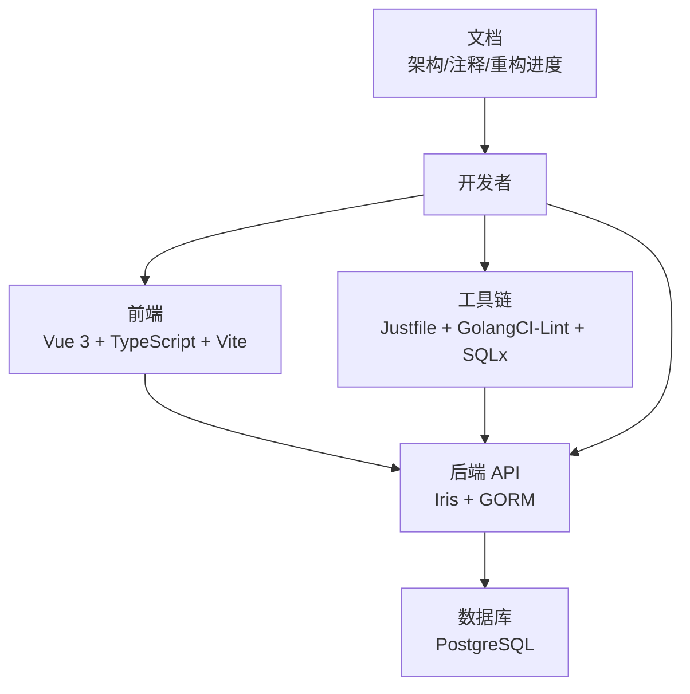
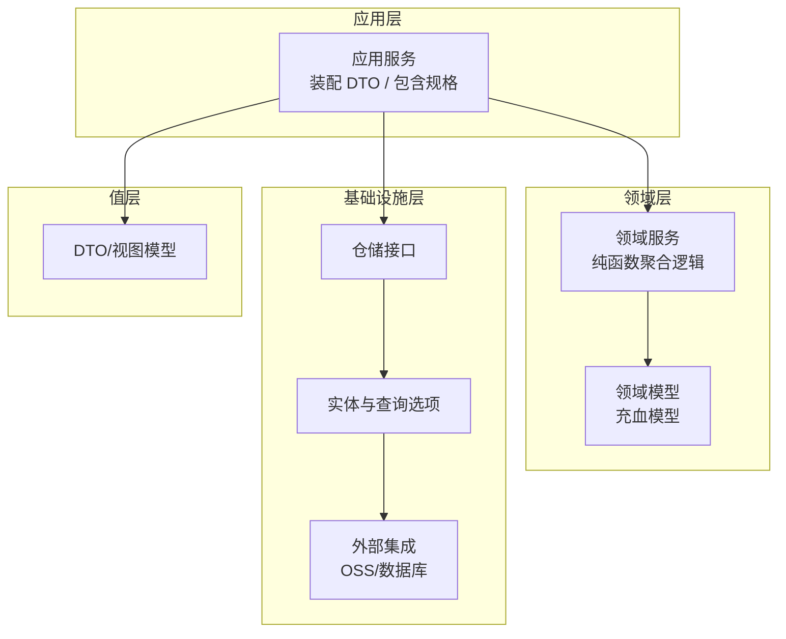
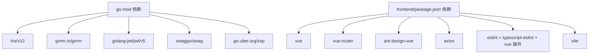

# 贡献指南

<cite>
**本文引用的文件**
- [README.md](file://README.md)
- [.github/copilot-instructions.md](file://.github/copilot-instructions.md)
- [docs/docs-comment-format.md](file://docs/docs-comment-format.md)
- [docs/ARCHETECT.md](file://docs/ARCHETECT.md)
- [docs/refactor-progress.md](file://docs/refactor-progress.md)
- [frontend/package.json](file://frontend/package.json)
- [frontend/tsconfig.json](file://frontend/tsconfig.json)
- [frontend/vite.config.ts](file://frontend/vite.config.ts)
- [frontend/eslint.config.mjs](file://frontend/eslint.config.mjs)
- [go.mod](file://go.mod)
- [.golangci.yml](file://.golangci.yml)
- [justfile](file://justfile)
- [script/seed/README.md](file://script/seed/README.md)
</cite>

## 目录
1. [简介](#简介)
2. [项目结构](#项目结构)
3. [核心组件](#核心组件)
4. [架构概览](#架构概览)
5. [详细组件分析](#详细组件分析)
6. [依赖分析](#依赖分析)
7. [性能考虑](#性能考虑)
8. [故障排除指南](#故障排除指南)
9. [结论](#结论)
10. [附录](#附录)

## 简介
本贡献指南面向希望参与漫画翻译协作平台开源项目的开发者，旨在建立高效、规范、可持续的协作生态。内容覆盖代码提交规范、分支管理策略、Pull Request 流程、代码审查标准、测试与文档更新规范、Copilot 技能模板使用、AI 辅助开发最佳实践、代码注释格式、开发环境搭建、调试技巧以及问题报告流程。同时提供社区行为准则、沟通渠道与协作工具使用建议，帮助新贡献者快速上手并高质量交付。

## 项目结构
该项目采用前后端分离与多模块 Go 后端的组织方式：
- 前端：基于 Vue 3 + TypeScript + Vite，使用 ESLint/Volar 进行类型与风格约束。
- 后端：Go 语言，采用部分 DDD 分层架构，包含 domain、application、infrastructure、value、repository 等层次。
- 文档：包含架构说明、注释格式规范、重构进度等。
- 工具链：Justfile 提供常用命令（格式化、检查、Swagger 生成、迁移、种子数据等），GolangCI-Lint 作为静态检查工具，SQLx 用于数据库迁移。

**章节来源**
- [frontend/package.json:1-35](file://frontend/package.json#L1-L35)
- [frontend/tsconfig.json:1-12](file://frontend/tsconfig.json#L1-L12)
- [frontend/vite.config.ts:1-20](file://frontend/vite.config.ts#L1-L20)
- [frontend/eslint.config.mjs:1-40](file://frontend/eslint.config.mjs#L1-L40)
- [go.mod:1-113](file://go.mod#L1-L113)
- [justfile:1-39](file://justfile#L1-L39)
- [docs/ARCHETECT.md:1-36](file://docs/ARCHETECT.md#L1-L36)

## 核心组件
- 前端工程
  - 使用 Vite 作为构建工具，注册 Vue 插件并设置路径别名，保证开发体验与构建一致性。
  - ESLint 配置启用 TypeScript 与 Vue 3 推荐规则，关闭多词组件名强制，放宽 any 使用限制，兼顾可维护性与灵活性。
  - 类型检查与脚本命令通过 package.json 统一管理，确保本地与 CI 一致。
- 后端工程
  - Go 模块定义与依赖管理，使用 Iris 作为 Web 框架、GORM 作为 ORM、JWT 处理鉴权、Zap 记日志、Swag 生成 OpenAPI 文档。
  - 通过 Justfile 封装常用命令，如 swag 初始化、golangci-lint 检查、格式化、迁移、种子数据生成等。
  - GolangCI-Lint 配置启用 vet、staticcheck、errcheck、unused、gosec、gocritic、misspell 等规则，确保质量门禁。
- 文档与规范
  - 架构文档说明 DDD 分层与领域服务上提至应用层的特殊设计。
  - 注释格式文档明确 Swagger godoc 注解规范，避免文档与实现脱节。
  - 重构进度文档展示 includes[] 参数驱动的可选嵌套查询机制，统一返回类型，提升可扩展性。

**章节来源**
- [frontend/vite.config.ts:1-20](file://frontend/vite.config.ts#L1-L20)
- [frontend/eslint.config.mjs:1-40](file://frontend/eslint.config.mjs#L1-L40)
- [frontend/package.json:1-35](file://frontend/package.json#L1-L35)
- [go.mod:1-113](file://go.mod#L1-L113)
- [justfile:1-39](file://justfile#L1-L39)
- [.golangci.yml:1-31](file://.golangci.yml#L1-L31)
- [docs/ARCHETECT.md:1-36](file://docs/ARCHETECT.md#L1-L36)
- [docs/docs-comment-format.md:1-29](file://docs/docs-comment-format.md#L1-L29)
- [docs/refactor-progress.md:1-224](file://docs/refactor-progress.md#L1-L224)

## 架构概览
系统采用“部分 DDD”的三层架构思路：
- Domain 层：领域模型与服务，聚合跨模型的通用逻辑；领域服务不依赖仓储接口，而是将事务与仓储操作上提到 Application 层。
- Application 层：协调用例、装配 DTO、驱动包含规格（includes）按需加载关联数据。
- Infrastructure 展示仓储与外部集成（如 OSS），Repository 接口与实体实现分离。
- Value 层：DTO/视图模型，承载 API 与应用层之间的数据传输。

**图表来源**
- [docs/ARCHETECT.md:1-36](file://docs/ARCHETECT.md#L1-L36)

**章节来源**
- [docs/ARCHETECT.md:1-36](file://docs/ARCHETECT.md#L1-L36)

## 详细组件分析

### 代码提交规范与分支管理策略
- 分支命名
  - 功能分支：feature/功能描述
  - 修复分支：fix/问题描述
  - 文档分支：docs/主题
  - 热修复分支：hotfix/紧急修复
- 提交信息
  - 类型限定：feat、fix、docs、style、refactor、test、chore、perf、build
  - 格式：类型(作用域): 概述；正文说明变更动机与影响；引用 Issue 或相关 PR
  - 通过工具（如 commitlint）在本地或 CI 强制校验
- 合并与清理
  - 合并前确保通过 Lint、测试与文档检查
  - 合并后清理分支，保持仓库整洁

### Pull Request 流程
- PR 模plate
  - 标题：简明扼要描述变更
  - 摘要：变更动机、范围、影响评估
  - 测试：新增/修改的测试用例与覆盖度
  - 文档：OpenAPI 注释、架构/设计文档更新
  - 依赖：Go/JS 依赖变更与升级说明
- 审查要点
  - 代码风格与静态检查通过
  - 逻辑正确性、边界条件、异常处理
  - 性能与安全（gosec/gocritic）
  - 可维护性与可读性
  - 是否引入破坏性变更
- 合并策略
  - 至少一名维护者批准
  - CI 通过且无未解决评论
  - Squash 或 Rebase 合并，保留清晰历史

### 代码审查标准
- Go 后端
  - 遵循 GolangCI-Lint 规则集，关注 vet、staticcheck、errcheck、unused、gosec、gocritic、misspell
  - 优先使用 New 构造函数，避免直接字面量构造；权限校验使用 Perm 前缀函数
  - handler godoc 必须与实现一致，swagger 文档由 swag 自动生成，无需手动维护
  - 严格遵循 migrations/ 数据库脚本作为单一事实源
- 前端
  - ESLint/Volar 规则通过；Vue 3 推荐规则启用；关闭多词组件名强制，放宽 any 使用
  - 类型检查通过，构建产物无告警
- 通用
  - 包含 includes[] 的查询统一走应用层解析与注入，避免硬编码 JOIN
  - 保持注释与实现同步，特别是 OpenAPI 注释

**章节来源**
- [.github/copilot-instructions.md:1-23](file://.github/copilot-instructions.md#L1-L23)
- [.golangci.yml:1-31](file://.golangci.yml#L1-L31)
- [docs/docs-comment-format.md:1-29](file://docs/docs-comment-format.md#L1-L29)
- [docs/refactor-progress.md:1-224](file://docs/refactor-progress.md#L1-L224)

### 测试要求
- 单元测试
  - Go：使用标准 testing 包，覆盖关键业务逻辑与边界条件
  - 前端：使用 Vitest/Jest（根据项目实际选择），确保覆盖率达标
- 集成测试
  - 数据库：通过 SQLx 迁移脚本初始化测试环境，使用事务隔离测试
  - API：使用 Iris 自带测试工具或第三方客户端发起请求，验证响应与状态码
- 文档与注释
  - handler godoc 与 swag 文档保持一致，避免文档漂移
- 质量门禁
  - 本地运行 golangci-lint 与 ESLint/Volar 检查
  - 构建脚本包含 lint 与类型检查步骤

**章节来源**
- [.golangci.yml:1-31](file://.golangci.yml#L1-L31)
- [frontend/package.json:1-35](file://frontend/package.json#L1-L35)
- [docs/docs-comment-format.md:1-29](file://docs/docs-comment-format.md#L1-L29)

### 文档更新规范
- OpenAPI 文档
  - 通过 swag init 自动生成；仅更新 handler godoc，不手动维护 YAML/JSON
- 架构与设计
  - ARCHETECT.md、refactor-progress.md 等文档随设计演进同步更新
- 注释格式
  - 严格遵循 docs-comment-format.md 的 godoc 注解格式，确保 swag 解析正确

**章节来源**
- [.github/copilot-instructions.md:15-15](file://.github/copilot-instructions.md#L15-L15)
- [docs/docs-comment-format.md:1-29](file://docs/docs-comment-format.md#L1-L29)
- [docs/ARCHETECT.md:1-36](file://docs/ARCHETECT.md#L1-L36)
- [docs/refactor-progress.md:1-224](file://docs/refactor-progress.md#L1-L224)

### Copilot 技能模板与 AI 辅助开发
- Copilot 宪章要点
  - 优先使用值对象与模型对象的 New 构造函数，避免直接字面量构造
  - 严格遵循用户指定风格，不得随意更改代码风格
  - 权限校验使用 Perm 开头函数，避免陈旧命名
  - 修改后使用 get_errors MCP 检查规范与静态错误
  - handler godoc 必须更新，swagger 文档自动生成
  - 除关联对象外，参数一律使用全称，提高可读性
  - 数据单源在 migrations/ SQL 脚本，Go 字段可能因 SQL 脚本变化失效
  - 大多数命令来自 justfile，禁止随意使用 gofmt/gofumpt/golangci-lint 等命令
- 最佳实践
  - 在本地先运行 just check 与 golangci-lint，确保通过后再提交
  - 使用 includes[] 参数驱动的可选嵌套查询，减少硬编码 JOIN
  - 保持注释与实现一致，避免文档漂移

**章节来源**
- [.github/copilot-instructions.md:1-23](file://.github/copilot-instructions.md#L1-L23)

### 代码注释格式要求
- OpenAPI godoc 注解
  - 必须包含 @Summary、@Description、@Param、@Tags、@Produce、@Success、@Router 等关键标签
  - 不需要 @Failure，避免冗余
  - 通过 swag init 转换为 Swagger 文档，务必严格遵守格式
- 架构与设计注释
  - 关键设计决策与演进记录在 ARCHETECT.md、refactor-progress.md 中同步更新

**章节来源**
- [docs/docs-comment-format.md:1-29](file://docs/docs-comment-format.md#L1-L29)
- [docs/ARCHETECT.md:1-36](file://docs/ARCHETECT.md#L1-L36)
- [docs/refactor-progress.md:1-224](file://docs/refactor-progress.md#L1-L224)

### 开发环境搭建
- 前端
  - 安装 Node.js 与包管理器（推荐 pnpm），安装依赖后启动 dev server
  - 构建时自动执行 lint 与类型检查，确保质量
- 后端
  - 安装 Go 1.25+，安装依赖（go mod tidy）
  - 使用 Justfile 提供的命令完成格式化、检查、Swagger 生成、迁移与种子数据
  - 数据库：PostgreSQL，使用 SQLx 迁移脚本初始化
- 工具链
  - GolangCI-Lint：启用 vet、staticcheck、errcheck、unused、gosec、gocritic、misspell
  - Swag：生成 OpenAPI 文档
  - SQLx：数据库迁移与回滚

**章节来源**
- [frontend/package.json:1-35](file://frontend/package.json#L1-L35)
- [frontend/tsconfig.json:1-12](file://frontend/tsconfig.json#L1-L12)
- [frontend/vite.config.ts:1-20](file://frontend/vite.config.ts#L1-L20)
- [frontend/eslint.config.mjs:1-40](file://frontend/eslint.config.mjs#L1-L40)
- [go.mod:1-113](file://go.mod#L1-L113)
- [justfile:1-39](file://justfile#L1-L39)
- [.golangci.yml:1-31](file://.golangci.yml#L1-L31)

### 调试技巧
- 后端
  - 使用 iris 的内置日志与 zap 输出，结合 GolangCI-Lint 的 errcheck 捕捉未处理错误
  - 通过 swag init 生成的文档定位接口，结合单元/集成测试验证行为
  - 使用 SQLx 迁移脚本快速回滚与重放，定位数据层问题
- 前端
  - Vite dev server 提供热更新与错误提示；ESLint/Volar 即时反馈
  - 构建预览（preview）模拟生产环境行为

**章节来源**
- [.golangci.yml:1-31](file://.golangci.yml#L1-L31)
- [justfile:1-39](file://justfile#L1-L39)

### 问题报告与沟通
- 问题报告
  - 使用 GitHub Issues 模板，提供复现步骤、期望与实际行为、日志与截图
  - 标注类型（bug、enhancement、question）与优先级
- 沟通渠道
  - 讨论区：GitHub Discussions 或社区群组
  - 提交 PR 前先开议题讨论设计与影响
- 社区行为准则
  - 尊重与包容，禁止人身攻击与歧视
  - 建设性反馈，聚焦问题与改进方案
  - 遵守开源许可证与法律合规

[本节为通用指导，不直接分析具体文件]

## 依赖分析
- Go 依赖
  - Iris、GORM、JWT、Swag、Zap、Crypto、Viper、godotenv 等
- 前端依赖
  - Vue 3、Vue Router、Ant Design Vue、Axios、ESLint、TypeScript、Vite
- 工具链
  - GolangCI-Lint、SQLx、Justfile、Swag

**图表来源**
- [go.mod:1-113](file://go.mod#L1-L113)
- [frontend/package.json:1-35](file://frontend/package.json#L1-L35)

**章节来源**
- [go.mod:1-113](file://go.mod#L1-L113)
- [frontend/package.json:1-35](file://frontend/package.json#L1-L35)

## 性能考虑
- 查询优化
  - 使用 includes[] 参数驱动的可选嵌套查询，避免硬编码 JOIN 导致的 N+1 与多余数据传输
  - 应用层解析包含规格，按需注入关联数据，降低网络与序列化成本
- 代码质量
  - 通过 GolangCI-Lint 的 gocritic、ineffassign、unused 等规则减少冗余与低效代码
- 构建与部署
  - Vite 构建开启类型检查与 ESLint，确保生产包质量
  - 后端通过 Justfile 的 build 命令生成 Linux 可执行文件，便于容器化部署

[本节提供一般性建议，不直接分析具体文件]

## 故障排除指南
- 本地检查
  - 运行 golangci-lint 与 ESLint/Volar，确保无告警
  - 使用 just check 与 swag init 验证代码规范与文档生成
- 数据库问题
  - 使用 SQLx 迁移脚本初始化/回滚，核对 migrations/ 脚本与实体字段一致性
  - 若 Go 字段与 SQL 脚本不一致，优先以 SQL 为准，调整 Go 结构
- 前端构建失败
  - 确认依赖安装与类型检查通过；检查 Vite 配置与路径别名
- Copilot 行为异常
  - 按照 copilot-instructions.md 的规则调整提示与风格，确保生成代码符合项目规范

**章节来源**
- [.golangci.yml:1-31](file://.golangci.yml#L1-L31)
- [justfile:1-39](file://justfile#L1-L39)
- [.github/copilot-instructions.md:1-23](file://.github/copilot-instructions.md#L1-L23)
- [script/seed/README.md:1-16](file://script/seed/README.md#L1-L16)

## 结论
通过统一的提交规范、分支策略与 PR 流程，配合严格的代码审查与测试要求，结合 Copilot 技能模板与 AI 辅助开发最佳实践，本项目能够持续产出高质量、可维护、可扩展的代码。完善的文档更新与注释规范确保知识沉淀与团队协作效率。建议贡献者在提交前充分阅读本文档与相关设计文档，遵循既定流程与工具链，共同建设开放、包容、高效的开源协作生态。

[本节为总结性内容，不直接分析具体文件]

## 附录
- 常用命令速查
  - 后端：just swag、just check、just fmt、just dev、just build、just mgr-add/mgr-run/mgr-rvt、just seed-base
  - 前端：pnpm dev、pnpm build、pnpm lint、pnpm type-check、pnpm preview
- 参考文档
  - 架构思路：docs/ARCHETECT.md
  - 注释格式：docs/docs-comment-format.md
  - 重构进度：docs/refactor-progress.md

**章节来源**
- [justfile:1-39](file://justfile#L1-L39)
- [frontend/package.json:1-35](file://frontend/package.json#L1-L35)
- [docs/ARCHETECT.md:1-36](file://docs/ARCHETECT.md#L1-L36)
- [docs/docs-comment-format.md:1-29](file://docs/docs-comment-format.md#L1-L29)
- [docs/refactor-progress.md:1-224](file://docs/refactor-progress.md#L1-L224)