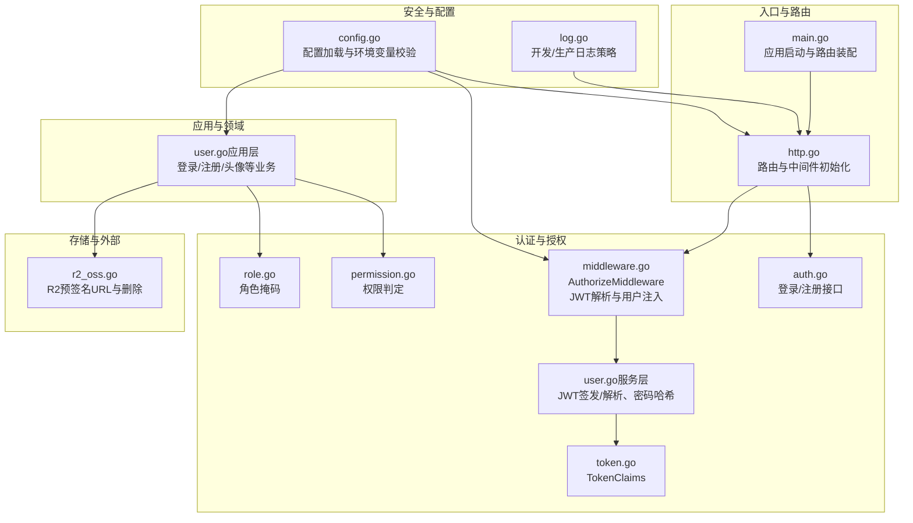
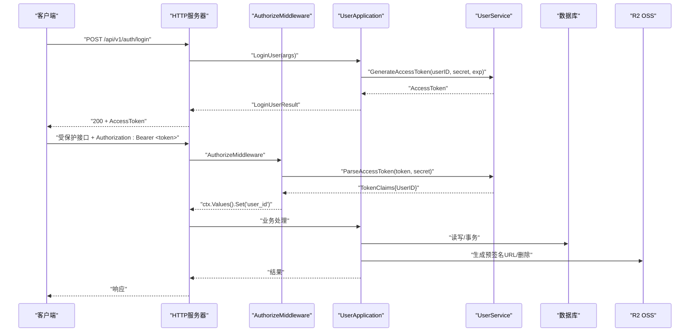
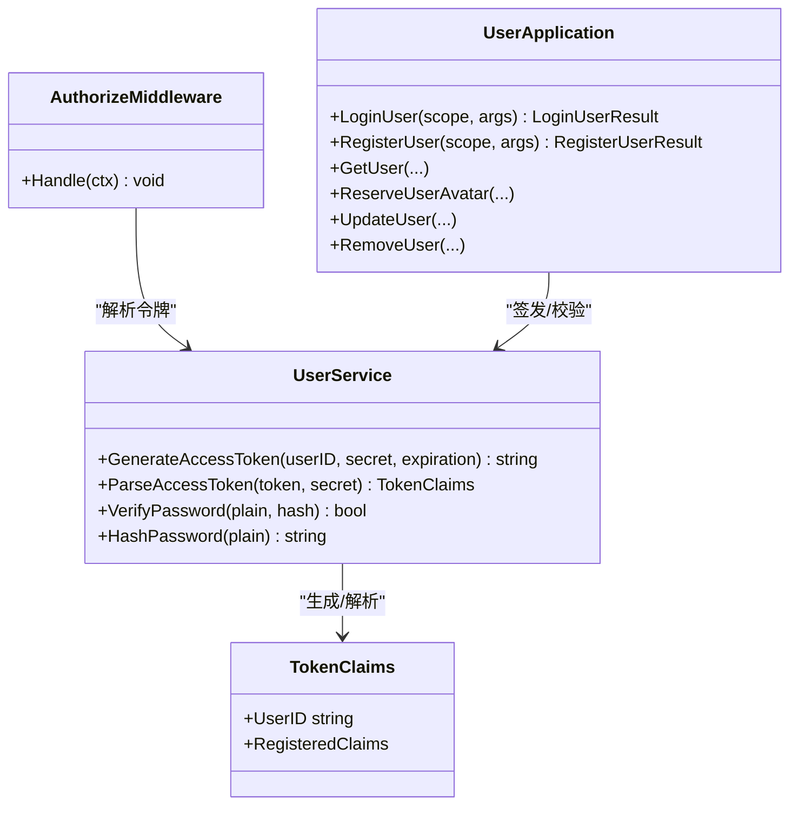
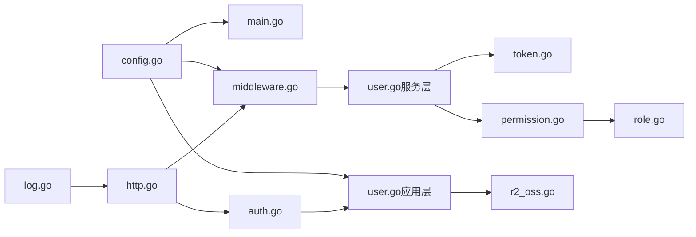

# 安全和合规

<cite>
**本文引用的文件**
- [main.go](file://main.go)
- [config.go](file://internal/config/config.go)
- [middleware.go](file://internal/api/http/middleware.go)
- [token.go](file://internal/domain/model/token.go)
- [permission.go](file://internal/domain/model/permission.go)
- [role.go](file://internal/domain/model/role.go)
- [auth.go](file://internal/api/http/auth.go)
- [user.go（服务层）](file://internal/domain/service/user.go)
- [r2_oss.go](file://internal/infrastructure/external/r2_oss.go)
- [log.go](file://internal/log/log.go)
- [user.go（应用层）](file://internal/application/user.go)
- [http.go](file://internal/api/http/http.go)
- [docs.go](file://docs/docs.go)
- [swagger.json](file://docs/swagger.json)
- [app_config.json](file://app_config.json)
</cite>

## 目录
1. [简介](#简介)
2. [项目结构](#项目结构)
3. [核心组件](#核心组件)
4. [架构总览](#架构总览)
5. [详细组件分析](#详细组件分析)
6. [依赖关系分析](#依赖关系分析)
7. [性能考虑](#性能考虑)
8. [故障排查指南](#故障排查指南)
9. [结论](#结论)
10. [附录](#附录)

## 简介
本指南围绕“漫画翻译协作平台”的安全加固与合规性管理展开，结合现有代码库实现，系统梳理身份认证与授权、网络安全、数据安全、漏洞扫描与安全审计、安全事件响应、合规性满足、安全监控与日志审计、以及安全培训与意识提升等维度。文档以代码为依据，辅以可视化图示，帮助技术与非技术读者快速理解并落地实施。

## 项目结构
后端采用分层架构：入口与路由层、HTTP中间件与鉴权、应用服务层、领域模型与权限、基础设施与外部集成、日志与配置。整体结构清晰，便于在各层插入安全控制点。

图表来源
- [main.go:25-145](file://main.go#L25-L145)
- [http.go:26-151](file://internal/api/http/http.go#L26-L151)
- [config.go:11-100](file://internal/config/config.go#L11-L100)
- [middleware.go:47-79](file://internal/api/http/middleware.go#L47-L79)
- [user.go（服务层）:15-93](file://internal/domain/service/user.go#L15-L93)
- [token.go:5-9](file://internal/domain/model/token.go#L5-L9)
- [permission.go:15-845](file://internal/domain/model/permission.go#L15-L845)
- [role.go:9-56](file://internal/domain/model/role.go#L9-L56)
- [user.go（应用层）:106-278](file://internal/application/user.go#L106-L278)
- [r2_oss.go:41-91](file://internal/infrastructure/external/r2_oss.go#L41-L91)
- [log.go:13-83](file://internal/log/log.go#L13-L83)

章节来源
- [main.go:25-145](file://main.go#L25-L145)
- [http.go:26-151](file://internal/api/http/http.go#L26-L151)
- [config.go:11-100](file://internal/config/config.go#L11-L100)

## 核心组件
- 配置与环境变量：集中于配置加载与环境变量校验，确保密钥与连接参数安全注入。
- JWT令牌：基于HS256签名，包含过期时间与签发方等声明，服务层负责签发与解析。
- RBAC权限：基于角色掩码与权限类型化判定，覆盖用户、团队、成员、漫画、章节、页面、分配、单元等工作流。
- 中间件：统一鉴权中间件从Authorization头部解析Bearer Token，注入用户ID。
- 存储与预签名：R2 OSS客户端生成上传/下载预签名URL，支持批量删除与重试。
- 日志：开发与生产差异化输出，生产环境启用轮转与告警级别阈值。

章节来源
- [config.go:69-100](file://internal/config/config.go#L69-L100)
- [user.go（服务层）:15-93](file://internal/domain/service/user.go#L15-L93)
- [permission.go:15-845](file://internal/domain/model/permission.go#L15-L845)
- [role.go:9-56](file://internal/domain/model/role.go#L9-L56)
- [middleware.go:47-79](file://internal/api/http/middleware.go#L47-L79)
- [r2_oss.go:94-123](file://internal/infrastructure/external/r2_oss.go#L94-L123)
- [log.go:13-83](file://internal/log/log.go#L13-L83)

## 架构总览
下图展示从客户端到后端服务、鉴权、业务处理与外部存储的整体流程。

图表来源
- [http.go:40-60](file://internal/api/http/http.go#L40-L60)
- [middleware.go:47-79](file://internal/api/http/middleware.go#L47-L79)
- [user.go（应用层）:106-154](file://internal/application/user.go#L106-L154)
- [user.go（服务层）:15-68](file://internal/domain/service/user.go#L15-L68)
- [r2_oss.go:94-123](file://internal/infrastructure/external/r2_oss.go#L94-L123)

## 详细组件分析

### 身份认证与授权机制
- 登录与注册：应用层接收参数，服务层进行密码哈希与JWT签发；注册流程在事务中完成用户与成员创建并标记邀请失效。
- JWT令牌管理：服务层生成访问令牌，包含过期时间、签发时间、签发方与主题；中间件解析并校验令牌，注入用户ID。
- OAuth2集成：当前代码未实现OAuth2集成，建议在鉴权中间件或应用层扩展OIDC/OAuth2回调，以支持第三方登录。
- RBAC权限控制：权限判定通过类型化权限对象与角色掩码组合，覆盖用户、团队、成员、漫画、章节、页面、分配、单元等资源域。

图表来源
- [token.go:5-9](file://internal/domain/model/token.go#L5-L9)
- [user.go（服务层）:15-93](file://internal/domain/service/user.go#L15-L93)
- [middleware.go:47-79](file://internal/api/http/middleware.go#L47-L79)
- [user.go（应用层）:106-278](file://internal/application/user.go#L106-L278)

章节来源
- [auth.go:22-72](file://internal/api/http/auth.go#L22-L72)
- [user.go（应用层）:106-278](file://internal/application/user.go#L106-L278)
- [user.go（服务层）:15-93](file://internal/domain/service/user.go#L15-L93)
- [middleware.go:47-79](file://internal/api/http/middleware.go#L47-L79)
- [token.go:5-9](file://internal/domain/model/token.go#L5-L9)

### 网络安全配置
- HTTPS与证书：当前路由未强制HTTPS，建议在网关/反向代理层启用TLS终止与强密码套件，证书由可信CA签发并定期轮换。
- 防火墙规则：仅开放必要端口（如8080），限制来源IP白名单；内部服务通过内网访问，避免暴露数据库与对象存储凭据。
- DDoS防护：在边缘层启用速率限制、WAF与DDoS清洗，结合CDN缓存热点资源，降低后端压力。

说明：以上为通用最佳实践，具体部署需结合实际网络拓扑与云厂商能力。

### 数据安全保护
- 敏感数据加密：密码采用bcrypt哈希存储；JWT密钥通过环境变量注入，避免硬编码。
- 数据脱敏：用户查询返回信息不含敏感字段；头像访问通过预签名URL或自定义域名直链，避免泄露真实存储路径。
- 访问控制策略：中间件统一鉴权；应用层按资源域与角色进行细粒度权限判定。

章节来源
- [user.go（服务层）:70-84](file://internal/domain/service/user.go#L70-L84)
- [r2_oss.go:94-123](file://internal/infrastructure/external/r2_oss.go#L94-L123)
- [permission.go:15-845](file://internal/domain/model/permission.go#L15-L845)

### 漏洞扫描与安全审计
- 静态代码分析：建议在CI中集成golangci-lint，启用安全相关规则与导入循环检查。
- 依赖包安全检查：使用go list -m all与govulncheck定期扫描已知漏洞；结合GoReleaser与SBOM生成依赖清单。
- 渗透测试流程：在沙箱环境模拟攻击面（API、JWT、RBAC绕过、敏感路径访问），形成修复清单与回归测试。

说明：以上为通用流程建议，需结合团队DevSecOps实践落地。

### 安全事件响应预案
- 威胁检测：日志中记录请求ID、用户ID、资源路径与状态码；生产环境开启告警级别阈值与异常追踪。
- 事件分类：按影响范围分为认证失败、越权访问、敏感数据泄露、拒绝服务等类别。
- 应急处置：立即冻结受影响账户、撤销JWT密钥、回滚可疑变更、恢复备份。
- 事后分析：复盘事件根因、完善规则与监控、补充测试与培训。

章节来源
- [log.go:13-83](file://internal/log/log.go#L13-L83)
- [middleware.go:15-44](file://internal/api/http/middleware.go#L15-L44)

### 合规性要求满足
- 个人信息保护法（PIPL）：最小化采集原则（仅存储必要字段）、明确同意与撤回机制、数据可访问与删除权；日志与数据保留遵循最短时限。
- 网络安全等级保护（等保）：三级等保要求下，应具备身份鉴别、访问控制、安全审计、边界完整性、入侵防范、恶意代码防范、数据完整性与保密性、可用性保障等能力；建议在CI/CD中加入等保合规检查项。
- 规范落地要点：密钥轮换、访问日志、最小权限、数据脱敏、备份与恢复、事件响应演练。

说明：合规实施需结合组织内审与外部评估，建议制定合规路线图与检查清单。

### 安全监控与日志审计
- 日志策略：开发环境彩色控制台输出，生产环境JSON格式+轮转+告警阈值；记录请求ID、用户ID、资源路径、耗时与状态码。
- 审计指标：登录成功率、越权访问次数、异常响应码分布、慢查询与超时统计。
- 建议工具：Prometheus+Grafana+Alertmanager，结合日志聚合平台（如ELK/OTel）实现统一可观测性。

章节来源
- [log.go:13-83](file://internal/log/log.go#L13-L83)

### 安全培训与意识提升
- 培训内容：JWT安全、RBAC最小权限、输入验证与注入防护、敏感数据处理、社会工程学与钓鱼防范。
- 实施方式：季度线上课程+实操演练（沙箱环境）、知识竞赛与红蓝对抗、新员工入职必修课。
- 考核与反馈：培训后测试与复盘，持续改进课程内容与形式。

## 依赖关系分析

图表来源
- [config.go:11-100](file://internal/config/config.go#L11-L100)
- [main.go:30-136](file://main.go#L30-L136)
- [middleware.go:47-79](file://internal/api/http/middleware.go#L47-L79)
- [user.go（应用层）:106-278](file://internal/application/user.go#L106-L278)
- [user.go（服务层）:15-93](file://internal/domain/service/user.go#L15-L93)
- [token.go:5-9](file://internal/domain/model/token.go#L5-L9)
- [permission.go:15-845](file://internal/domain/model/permission.go#L15-L845)
- [role.go:9-56](file://internal/domain/model/role.go#L9-L56)
- [auth.go:22-72](file://internal/api/http/auth.go#L22-L72)
- [http.go:26-151](file://internal/api/http/http.go#L26-L151)
- [r2_oss.go:41-91](file://internal/infrastructure/external/r2_oss.go#L41-L91)
- [log.go:13-83](file://internal/log/log.go#L13-L83)

章节来源
- [main.go:30-136](file://main.go#L30-L136)
- [http.go:26-151](file://internal/api/http/http.go#L26-L151)

## 性能考虑
- JWT签发与解析：HS256计算开销低，建议合理设置过期时间，避免频繁刷新；对高并发场景可考虑缓存近期活跃令牌的解析结果。
- 中间件链路：日志与恢复中间件对性能影响较小，但应避免在生产环境输出过多调试信息。
- 存储访问：预签名URL减少后端转发压力；批量删除与重试策略降低失败率，提高用户体验。

## 故障排查指南
- 登录失败：检查JWT密钥环境变量、数据库连接、密码哈希一致性；查看应用日志定位错误。
- 越权访问：确认中间件是否生效、用户ID是否注入、权限判定逻辑是否正确。
- 存储问题：检查R2凭据、桶名称与自定义域名配置；关注删除失败的重试与错误码。
- 日志异常：确认生产环境日志轮转配置与输出目标；调整告警级别以捕捉异常。

章节来源
- [config.go:74-83](file://internal/config/config.go#L74-L83)
- [middleware.go:47-79](file://internal/api/http/middleware.go#L47-L79)
- [r2_oss.go:125-216](file://internal/infrastructure/external/r2_oss.go#L125-L216)
- [log.go:52-83](file://internal/log/log.go#L52-L83)

## 结论
本项目在认证与授权、权限控制、日志与配置方面已具备良好基础。建议下一步补齐OAuth2集成、HTTPS与防火墙策略、等保合规检查清单、漏洞扫描与渗透测试流程、以及完善的事件响应与培训体系，以形成端到端的安全加固与合规闭环。

## 附录

### API安全定义与文档
- Swagger安全定义：在非生产环境启用Swagger UI，安全定义为ApiKeyAuth（Authorization头部）。
- 建议：生产环境禁用Swagger UI，或仅对内网开放；对敏感接口增加额外校验与审计。

章节来源
- [docs.go:2934-2940](file://docs/docs.go#L2934-L2940)
- [swagger.json:2927-2933](file://docs/swagger.json#L2927-L2933)
- [http.go:153-166](file://internal/api/http/http.go#L153-L166)

### 配置要点
- 环境变量：JWT_SECRET_KEY、DATABASE_URL、R2_ACCOUNT_ID/KEY等必须通过环境注入。
- 应用配置：server_address、auth.expiration_hours、database连接池参数。

章节来源
- [config.go:44-56](file://internal/config/config.go#L44-L56)
- [config.go:74-100](file://internal/config/config.go#L74-L100)
- [app_config.json:1-10](file://app_config.json#L1-L10)