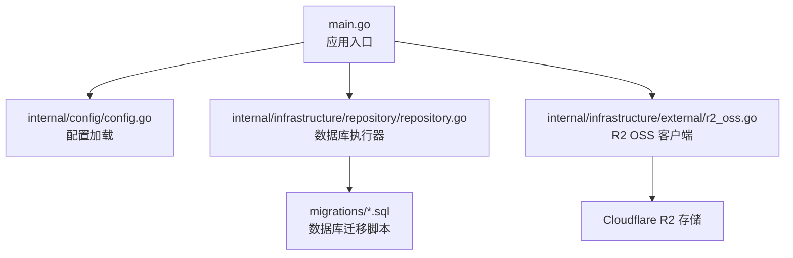
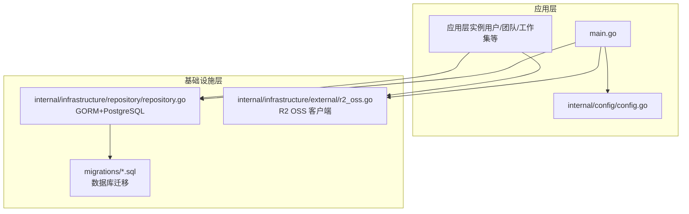
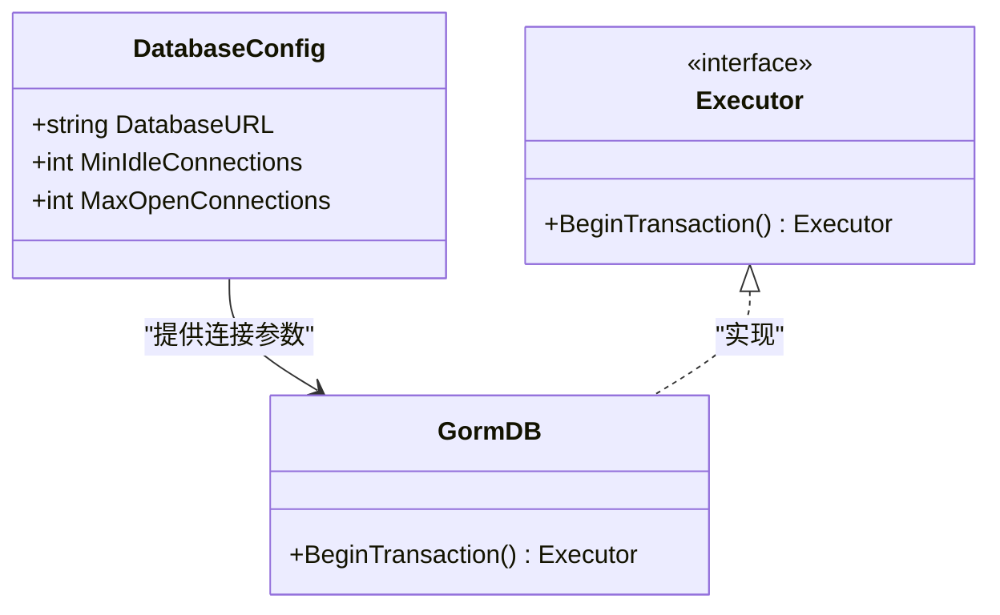
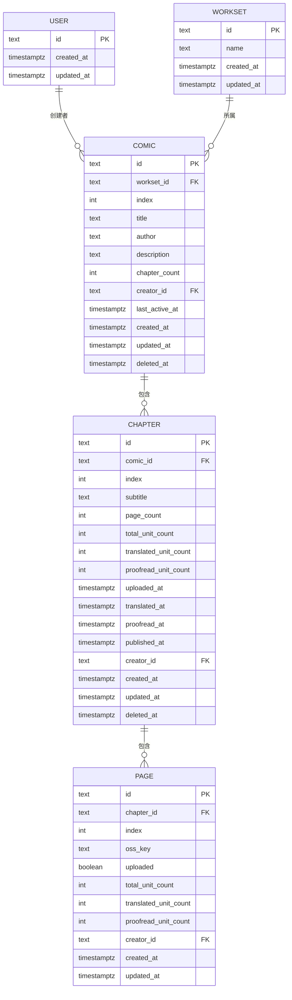
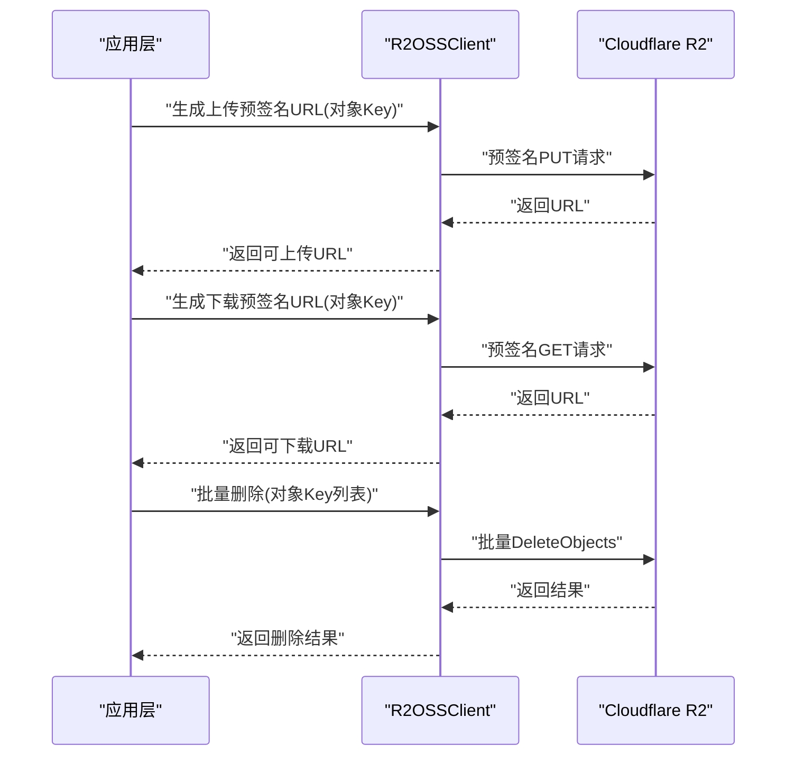
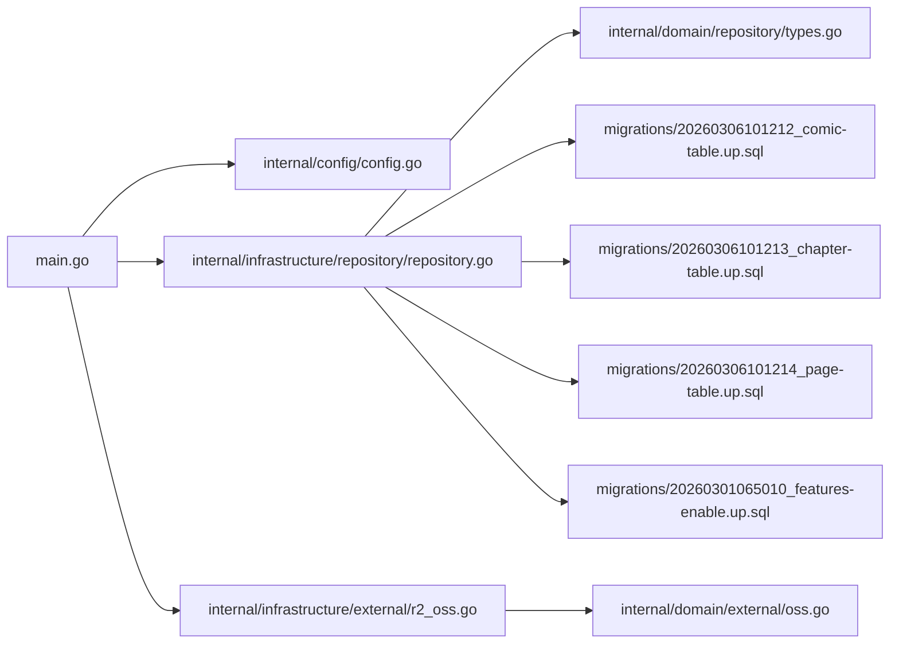

# 数据库备份和恢复

<cite>
**本文引用的文件**
- [main.go](file://main.go)
- [config.go](file://internal/config/config.go)
- [app_config.json](file://app_config.json)
- [repository.go](file://internal/infrastructure/repository/repository.go)
- [table_names.go](file://internal/infrastructure/repository/table_names.go)
- [types.go](file://internal/domain/repository/types.go)
- [r2_oss.go](file://internal/infrastructure/external/r2_oss.go)
- [oss.go](file://internal/domain/external/oss.go)
- [20260306101212_comic-table.up.sql](file://migrations/20260306101212_comic-table.up.sql)
- [20260306101213_chapter-table.up.sql](file://migrations/20260306101213_chapter-table.up.sql)
- [20260306101214_page-table.up.sql](file://migrations/20260306101214_page-table.up.sql)
- [20260301065010_features-enable.up.sql](file://migrations/20260301065010_features-enable.up.sql)
- [comic.go](file://internal/domain/model/comic.go)
</cite>

## 目录
1. [简介](#简介)
2. [项目结构](#项目结构)
3. [核心组件](#核心组件)
4. [架构总览](#架构总览)
5. [详细组件分析](#详细组件分析)
6. [依赖分析](#依赖分析)
7. [性能考虑](#性能考虑)
8. [故障排查指南](#故障排查指南)
9. [结论](#结论)
10. [附录](#附录)

## 简介
本指南围绕漫画翻译协作平台的数据库备份与恢复，结合现有代码库中的数据库连接、迁移脚本与对象存储能力，系统阐述备份策略设计（全量、增量、事务日志）、备份存储管理（本地、云存储备份、异地容灾）、恢复流程（时间点、部分、跨版本）、验证与演练、性能优化、迁移与升级注意事项，以及审计与合规建议。由于当前代码库未直接实现数据库备份/恢复工具链，本指南提供基于现有组件的落地实施方案与最佳实践。

## 项目结构
- 应用入口与配置加载：通过入口程序加载环境变量与配置，初始化日志、数据库执行器与各应用层实例。
- 数据库连接：使用 GORM 连接 PostgreSQL，配置最大空闲与最大连接数。
- 迁移脚本：以 SQL 形式定义表结构、索引与扩展启用。
- 对象存储：通过 R2 OSS 客户端提供预签名上传/下载与批量删除能力，用于图片等大对象的云端归档与容灾。

图表来源
- [main.go:25-145](file://main.go#L25-L145)
- [config.go:11-59](file://internal/config/config.go#L11-L59)
- [repository.go:11-29](file://internal/infrastructure/repository/repository.go#L11-L29)
- [r2_oss.go:29-79](file://internal/infrastructure/external/r2_oss.go#L29-L79)

章节来源
- [main.go:25-145](file://main.go#L25-L145)
- [config.go:11-59](file://internal/config/config.go#L11-L59)
- [repository.go:11-29](file://internal/infrastructure/repository/repository.go#L11-L29)
- [r2_oss.go:29-79](file://internal/infrastructure/external/r2_oss.go#L29-L79)

## 核心组件
- 配置系统：集中加载 JSON 配置与环境变量，提供数据库连接参数与认证密钥。
- 数据库执行器：基于 GORM/PostgreSQL，设置连接池参数，作为所有仓储层的基础。
- 迁移脚本：定义表结构、索引与扩展，确保数据库结构演进的幂等性。
- 对象存储客户端：对接 R2，提供预签名上传/下载与批量删除，支撑图片等大对象的云端归档与容灾。

章节来源
- [config.go:85-100](file://internal/config/config.go#L85-L100)
- [repository.go:11-29](file://internal/infrastructure/repository/repository.go#L11-L29)
- [20260306101212_comic-table.up.sql:1-37](file://migrations/20260306101212_comic-table.up.sql#L1-L37)
- [20260306101213_chapter-table.up.sql:1-38](file://migrations/20260306101213_chapter-table.up.sql#L1-L38)
- [20260306101214_page-table.up.sql:1-25](file://migrations/20260306101214_page-table.up.sql#L1-L25)
- [r2_oss.go:29-79](file://internal/infrastructure/external/r2_oss.go#L29-L79)

## 架构总览
下图展示了应用如何通过配置加载数据库连接、执行迁移、并通过对象存储进行大对象归档，为后续备份与恢复奠定基础。

图表来源
- [main.go:25-145](file://main.go#L25-L145)
- [config.go:11-59](file://internal/config/config.go#L11-L59)
- [repository.go:11-29](file://internal/infrastructure/repository/repository.go#L11-L29)
- [r2_oss.go:29-79](file://internal/infrastructure/external/r2_oss.go#L29-L79)

## 详细组件分析

### 数据库连接与事务接口
- 数据库执行器通过 GORM 打开 PostgreSQL 连接，并设置最大空闲与最大连接数，保证并发访问稳定性。
- 事务接口抽象了 BeginTransaction 能力，便于在应用层统一管理事务边界。

图表来源
- [repository.go:11-29](file://internal/infrastructure/repository/repository.go#L11-L29)
- [types.go:5-11](file://internal/domain/repository/types.go#L5-L11)

章节来源
- [repository.go:11-29](file://internal/infrastructure/repository/repository.go#L11-L29)
- [types.go:5-11](file://internal/domain/repository/types.go#L5-L11)

### 表结构与索引（用于备份范围与恢复粒度）
- 漫画、章节、页面三层表结构清晰，配合唯一索引与多列索引，支撑高效查询与一致性校验。
- 建议在备份策略中明确这些表的备份范围与恢复顺序，确保外键约束与级联行为在恢复后正确生效。

图表来源
- [20260306101212_comic-table.up.sql:1-37](file://migrations/20260306101212_comic-table.up.sql#L1-L37)
- [20260306101213_chapter-table.up.sql:1-38](file://migrations/20260306101213_chapter-table.up.sql#L1-L38)
- [20260306101214_page-table.up.sql:1-25](file://migrations/20260306101214_page-table.up.sql#L1-L25)

章节来源
- [20260306101212_comic-table.up.sql:1-37](file://migrations/20260306101212_comic-table.up.sql#L1-L37)
- [20260306101213_chapter-table.up.sql:1-38](file://migrations/20260306101213_chapter-table.up.sql#L1-L38)
- [20260306101214_page-table.up.sql:1-25](file://migrations/20260306101214_page-table.up.sql#L1-L25)

### 对象存储与大对象归档
- R2 OSS 客户端提供预签名上传/下载与批量删除能力，适合将图片等大对象归档至云端，作为数据库外的灾备补充。
- 建议将页面与章节相关的图片对象纳入备份范围，恢复时优先恢复对象存储数据，再进行数据库恢复与一致性校验。

图表来源
- [r2_oss.go:81-198](file://internal/infrastructure/external/r2_oss.go#L81-L198)
- [oss.go:3-8](file://internal/domain/external/oss.go#L3-L8)

章节来源
- [r2_oss.go:81-198](file://internal/infrastructure/external/r2_oss.go#L81-L198)
- [oss.go:3-8](file://internal/domain/external/oss.go#L3-L8)

### 备份策略设计（全量、增量、事务日志）
- 全量备份
  - 目标：数据库结构与全部数据的完整镜像。
  - 实施：使用数据库自带的逻辑导出或物理备份工具，结合迁移脚本的幂等特性，确保备份可重复应用。
  - 周期：每日/每周全量，按数据增长与恢复窗口确定频率。
- 增量备份
  - 目标：仅捕获自上次全量/增量以来的变化。
  - 实施：结合数据库的 WAL/事务日志，按天生成增量归档；对大对象（图片）采用对象存储层面的差异同步。
- 事务日志备份
  - 目标：支持点-in-time 恢复。
  - 实施：开启数据库的归档日志，定期归档并校验；与全量/增量组合形成可恢复的时间点集合。

说明：上述策略为通用设计建议，需结合实际数据库版本与运维工具制定具体执行计划。

### 备份存储管理（本地、云存储备份、异地容灾）
- 本地备份
  - 用途：快速恢复与离线分析。
  - 策略：压缩归档、分卷存储、定期校验与轮转。
- 云存储备份
  - 用途：高可用与弹性扩展。
  - 策略：将备份文件上传至对象存储（如 R2），设置生命周期与访问权限；对敏感数据加密传输与存储。
- 异地容灾
  - 用途：应对区域性灾难。
  - 策略：至少两套独立的异地存储，定期同步与交叉验证；建立跨区域切换预案与演练机制。

### 数据库恢复流程
- 点-in-time 恢复
  - 步骤：定位目标时间点，依次应用全量备份与对应时间段内的增量/日志，最后重放至目标时间戳。
  - 关键：确保日志归档完整与顺序正确，恢复前进行一致性检查。
- 部分恢复
  - 场景：仅恢复特定表/租户/工作集。
  - 关键：根据迁移脚本与外键关系，确定恢复顺序；先恢复父表，再恢复子表。
- 跨版本恢复
  - 场景：从旧版本数据库恢复到新版本。
  - 关键：先应用新版本迁移脚本，再恢复数据；验证索引与约束是否满足新结构。

### 备份验证与恢复测试
- 定期完整性检查：校验备份文件大小、哈希值与可读性；对数据库备份执行导入到隔离环境的最小化验证。
- 模拟灾难恢复演练：周期性执行“从备份到可运营”的全流程演练，记录耗时与问题，持续优化恢复脚本与工具。

### 性能优化建议
- 索引优化
  - 基于迁移脚本中的索引定义，评估查询模式，补充必要覆盖索引；避免过度索引导致写入性能下降。
- 查询优化
  - 利用查询选项与排序条件，减少全表扫描；对高频过滤字段建立合适索引。
- 存储引擎调优
  - 结合 PostgreSQL 参数与连接池配置，调整共享缓冲区、检查点间隔与并发连接上限，平衡吞吐与延迟。

### 数据迁移与升级注意事项
- 迁移脚本幂等性：确保 up/down 可重复执行，避免破坏生产数据。
- 升级窗口与停机策略：在低峰时段执行，提前备份并验证迁移脚本。
- 回滚预案：准备对应的 down 脚本与数据回滚路径，确保可逆操作。

### 审计与合规
- 记录备份与恢复活动：包括时间、类型、规模、结果与责任人。
- 访问控制与加密：限制备份文件访问权限，传输与静态均加密。
- 合规性检查：满足所在地区的数据保护法规与行业标准。

## 依赖分析
- 应用入口依赖配置模块加载数据库连接参数，随后初始化数据库执行器与对象存储客户端。
- 数据库执行器依赖 GORM/PostgreSQL 驱动，连接池参数由配置提供。
- 迁移脚本定义表结构与索引，决定备份范围与恢复顺序。
- 对象存储客户端依赖 AWS SDK，提供云端大对象的归档与容灾能力。

图表来源
- [main.go:25-145](file://main.go#L25-L145)
- [config.go:85-100](file://internal/config/config.go#L85-L100)
- [repository.go:11-29](file://internal/infrastructure/repository/repository.go#L11-L29)
- [types.go:5-11](file://internal/domain/repository/types.go#L5-L11)
- [r2_oss.go:29-79](file://internal/infrastructure/external/r2_oss.go#L29-L79)
- [oss.go:3-8](file://internal/domain/external/oss.go#L3-L8)
- [20260306101212_comic-table.up.sql:1-37](file://migrations/20260306101212_comic-table.up.sql#L1-L37)
- [20260306101213_chapter-table.up.sql:1-38](file://migrations/20260306101213_chapter-table.up.sql#L1-L38)
- [20260306101214_page-table.up.sql:1-25](file://migrations/20260306101214_page-table.up.sql#L1-L25)
- [20260301065010_features-enable.up.sql:1-1](file://migrations/20260301065010_features-enable.up.sql#L1-L1)

章节来源
- [main.go:25-145](file://main.go#L25-L145)
- [config.go:85-100](file://internal/config/config.go#L85-L100)
- [repository.go:11-29](file://internal/infrastructure/repository/repository.go#L11-L29)
- [types.go:5-11](file://internal/domain/repository/types.go#L5-L11)
- [r2_oss.go:29-79](file://internal/infrastructure/external/r2_oss.go#L29-L79)
- [oss.go:3-8](file://internal/domain/external/oss.go#L3-L8)
- [20260306101212_comic-table.up.sql:1-37](file://migrations/20260306101212_comic-table.up.sql#L1-L37)
- [20260306101213_chapter-table.up.sql:1-38](file://migrations/20260306101213_chapter-table.up.sql#L1-L38)
- [20260306101214_page-table.up.sql:1-25](file://migrations/20260306101214_page-table.up.sql#L1-L25)
- [20260301065010_features-enable.up.sql:1-1](file://migrations/20260301065010_features-enable.up.sql#L1-L1)

## 性能考虑
- 连接池参数：根据峰值并发与查询负载，动态调整最大连接数与空闲连接数，避免连接争用。
- 索引策略：依据迁移脚本中的索引定义，结合查询模式优化覆盖索引；定期分析慢查询日志。
- 存储与网络：对象存储访问延迟与带宽直接影响大对象读写性能，建议就近接入与缓存策略。

## 故障排查指南
- 配置加载失败
  - 现象：启动时报错提示未设置环境变量或配置文件读取失败。
  - 排查：确认环境变量与配置文件存在且格式正确；检查权限与路径。
- 数据库连接失败
  - 现象：无法打开数据库连接或连接池异常。
  - 排查：核对 DATABASE_URL、网络连通性与数据库服务状态；检查连接池参数是否合理。
- 对象存储操作失败
  - 现象：预签名 URL 生成失败或批量删除报错。
  - 排查：确认 R2 相关环境变量、桶名称与自定义域名配置；检查网络与凭证权限。

章节来源
- [config.go:36-56](file://internal/config/config.go#L36-L56)
- [repository.go:16-23](file://internal/infrastructure/repository/repository.go#L16-L23)
- [r2_oss.go:30-79](file://internal/infrastructure/external/r2_oss.go#L30-L79)

## 结论
本指南基于现有配置、数据库连接与对象存储能力，提出了可落地的数据库备份与恢复方案。建议尽快引入数据库层面的自动化备份工具链（逻辑/物理/日志），完善备份验证与灾难演练机制，并将对象存储作为大对象的灾备补充。同时，持续优化索引与查询，确保备份与恢复过程的性能与可靠性。

## 附录
- 配置文件示例与关键参数
  - 服务器地址、认证过期小时、数据库连接池参数等。
- 迁移脚本清单
  - 功能扩展启用、漫画/章节/页面表结构与索引定义。
- 对象存储接口与实现
  - 预签名上传/下载与批量删除接口定义与实现要点。

章节来源
- [app_config.json:1-10](file://app_config.json#L1-L10)
- [20260301065010_features-enable.up.sql:1-1](file://migrations/20260301065010_features-enable.up.sql#L1-L1)
- [20260306101212_comic-table.up.sql:1-37](file://migrations/20260306101212_comic-table.up.sql#L1-L37)
- [20260306101213_chapter-table.up.sql:1-38](file://migrations/20260306101213_chapter-table.up.sql#L1-L38)
- [20260306101214_page-table.up.sql:1-25](file://migrations/20260306101214_page-table.up.sql#L1-L25)
- [oss.go:3-8](file://internal/domain/external/oss.go#L3-L8)
- [r2_oss.go:29-79](file://internal/infrastructure/external/r2_oss.go#L29-L79)