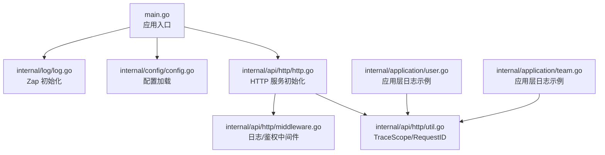
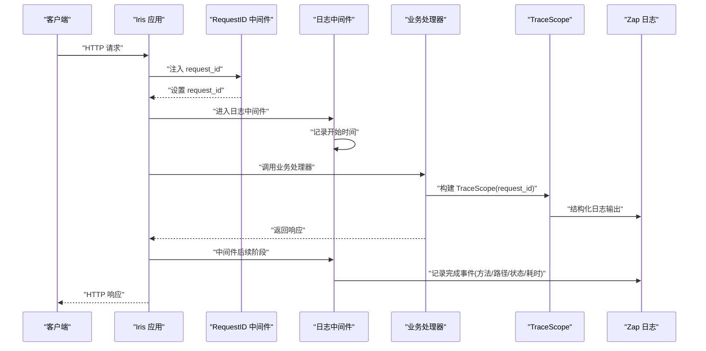
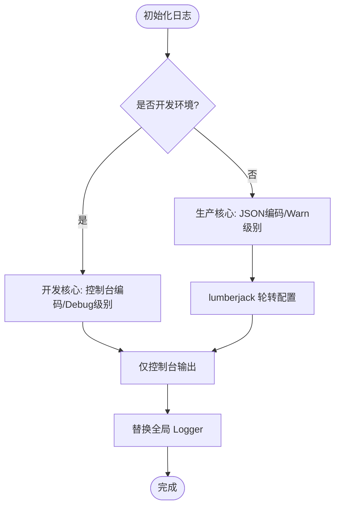
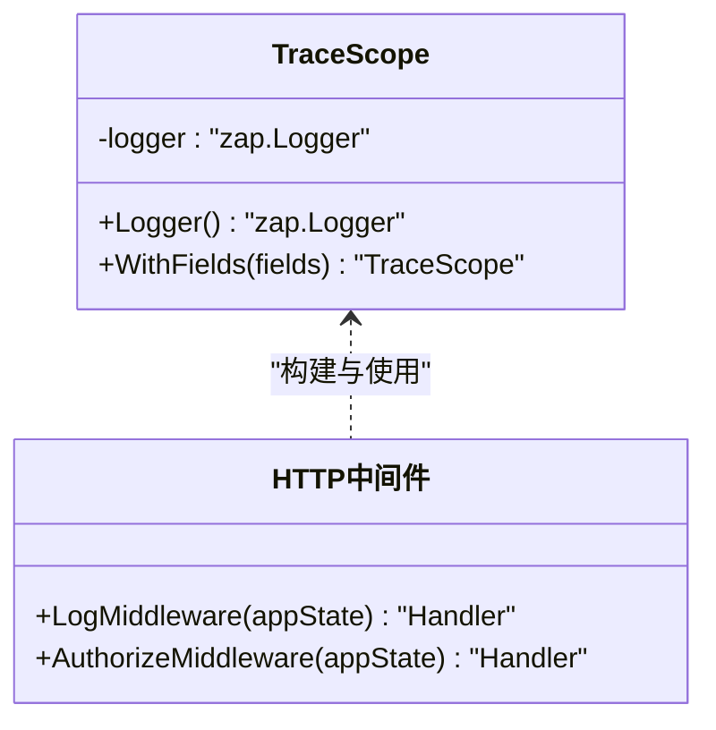
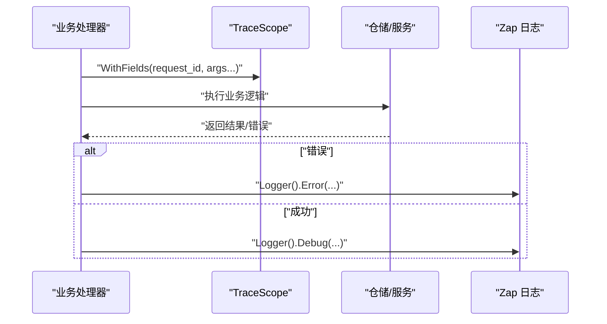
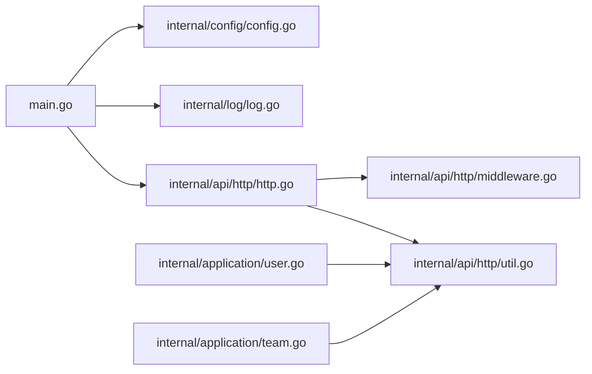

# 监控和日志

<cite>
**本文引用的文件**
- [main.go](file://main.go)
- [internal/log/log.go](file://internal/log/log.go)
- [internal/config/config.go](file://internal/config/config.go)
- [internal/api/http/http.go](file://internal/api/http/http.go)
- [internal/api/http/middleware.go](file://internal/api/http/middleware.go)
- [internal/api/http/util.go](file://internal/api/http/util.go)
- [internal/util/trace_scope.go](file://internal/util/trace_scope.go)
- [internal/application/user.go](file://internal/application/user.go)
- [internal/application/team.go](file://internal/application/team.go)
</cite>

## 目录
1. [简介](#简介)
2. [项目结构](#项目结构)
3. [核心组件](#核心组件)
4. [架构总览](#架构总览)
5. [组件详解](#组件详解)
6. [依赖关系分析](#依赖关系分析)
7. [性能考量](#性能考量)
8. [故障排查指南](#故障排查指南)
9. [结论](#结论)
10. [附录](#附录)

## 简介
本指南面向漫画翻译协作平台的运维与开发团队，系统化阐述当前代码库中的监控与日志管理现状与最佳实践建议。内容覆盖：
- Zap 日志框架的配置与使用：开发与生产环境差异、结构化日志格式、日志轮转策略
- 应用性能监控（APM）落地：请求耗时、错误率、吞吐量等指标采集与可视化思路
- 分布式链路追踪：Span 标记、Trace ID 传递、跨服务调用追踪
- 告警系统：阈值设定、规则配置与通知渠道集成
- Prometheus 指标导出、Grafana 仪表板与告警规则
- 日志聚合、检索与分析最佳实践，以及安全与合规注意事项

## 项目结构
围绕监控与日志的关键模块分布如下：
- 入口与配置：main.go 负责加载环境变量与配置，初始化日志与 HTTP 服务
- 日志子系统：internal/log/log.go 提供基于 Zap 的开发/生产环境日志配置与轮转
- HTTP 中间件：internal/api/http/middleware.go 提供请求日志中间件；util.go 提供 TraceScope 与 request_id 注入
- 应用层日志：internal/application/*.go 展示了如何在业务方法中使用结构化日志与 TraceScope
- 配置加载：internal/config/config.go 提供环境变量与配置文件加载逻辑

**图表来源**
- [main.go:25-145](file://main.go#L25-L145)
- [internal/log/log.go:13-30](file://internal/log/log.go#L13-L30)
- [internal/config/config.go:11-59](file://internal/config/config.go#L11-L59)
- [internal/api/http/http.go:16-24](file://internal/api/http/http.go#L16-L24)
- [internal/api/http/middleware.go:15-45](file://internal/api/http/middleware.go#L15-L45)
- [internal/api/http/util.go:41-46](file://internal/api/http/util.go#L41-L46)
- [internal/application/user.go:106-154](file://internal/application/user.go#L106-L154)
- [internal/application/team.go:92-130](file://internal/application/team.go#L92-L130)

**章节来源**
- [main.go:25-145](file://main.go#L25-L145)
- [internal/log/log.go:13-83](file://internal/log/log.go#L13-L83)
- [internal/config/config.go:11-101](file://internal/config/config.go#L11-L101)
- [internal/api/http/http.go:16-167](file://internal/api/http/http.go#L16-L167)
- [internal/api/http/middleware.go:15-80](file://internal/api/http/middleware.go#L15-L80)
- [internal/api/http/util.go:41-58](file://internal/api/http/util.go#L41-L58)
- [internal/application/user.go:106-200](file://internal/application/user.go#L106-L200)
- [internal/application/team.go:92-200](file://internal/application/team.go#L92-L200)

## 核心组件
- 日志初始化与环境切换
  - 开发环境：控制台彩色编码、ISO 时间格式、Debug 级别、包含调用者信息与 Panic 堆栈
  - 生产环境：JSON 编码、ISO 时间格式、Warn 级别及以上、控制台+文件输出、lumberjack 轮转
- HTTP 中间件
  - 请求 ID 注入与全局中间件顺序：requestid → 自定义日志中间件 → recover
  - 日志中间件按环境输出 Debug 级别的请求完成事件，包含方法、路径、状态码、远程地址、request_id、耗时
- TraceScope
  - 将 request_id 注入到日志上下文，便于跨模块串联日志
- 应用层日志
  - 在业务方法中使用 TraceScope.Logger() 输出结构化日志，包含函数名、参数、错误与结果等关键字段

**章节来源**
- [internal/log/log.go:13-83](file://internal/log/log.go#L13-L83)
- [internal/api/http/middleware.go:15-45](file://internal/api/http/middleware.go#L15-L45)
- [internal/api/http/util.go:41-46](file://internal/api/http/util.go#L41-L46)
- [internal/application/user.go:106-154](file://internal/application/user.go#L106-L154)
- [internal/application/team.go:92-130](file://internal/application/team.go#L92-L130)

## 架构总览
下图展示了从请求进入 HTTP 服务，到日志记录与 TraceScope 注入的整体流程。

**图表来源**
- [internal/api/http/http.go:26-35](file://internal/api/http/http.go#L26-L35)
- [internal/api/http/middleware.go:18-44](file://internal/api/http/middleware.go#L18-L44)
- [internal/api/http/util.go:41-46](file://internal/api/http/util.go#L41-L46)
- [internal/util/trace_scope.go:12-30](file://internal/util/trace_scope.go#L12-L30)

## 组件详解

### 日志子系统（Zap）
- 环境差异化
  - 开发：控制台输出、彩色级别、Debug 级别、包含调用者与堆栈
  - 生产：JSON 输出、Warn 级别及以上、控制台+文件、lumberjack 轮转（文件名、最大尺寸、备份数、保留天数、压缩）
- 全局替换
  - 初始化后替换全局 Zap Logger，业务层可直接使用全局日志接口
- 结构化字段
  - 使用 zap.String、zap.Int、zap.Duration、zap.Error 等类型化字段，提升可检索性与可视化能力

**图表来源**
- [internal/log/log.go:13-83](file://internal/log/log.go#L13-L83)

**章节来源**
- [internal/log/log.go:13-83](file://internal/log/log.go#L13-L83)

### HTTP 中间件与请求追踪
- 中间件顺序
  - requestid → 自定义日志中间件 → recover
- 日志中间件
  - 在开发环境记录请求完成事件，包含方法、路径、状态码、远程地址、request_id、耗时
- TraceScope
  - 从 RequestID 中间件提取 request_id，注入到日志 Logger，形成跨模块的请求级上下文

**图表来源**
- [internal/util/trace_scope.go:8-30](file://internal/util/trace_scope.go#L8-L30)
- [internal/api/http/middleware.go:15-80](file://internal/api/http/middleware.go#L15-L80)
- [internal/api/http/util.go:41-46](file://internal/api/http/util.go#L41-L46)

**章节来源**
- [internal/api/http/http.go:26-35](file://internal/api/http/http.go#L26-L35)
- [internal/api/http/middleware.go:15-45](file://internal/api/http/middleware.go#L15-L45)
- [internal/api/http/util.go:41-46](file://internal/api/http/util.go#L41-L46)
- [internal/util/trace_scope.go:12-30](file://internal/util/trace_scope.go#L12-L30)

### 应用层日志实践
- 在业务方法中使用 TraceScope.Logger() 输出结构化日志
- 关键点：函数名、参数、错误、成功结果、耗时等
- 示例：用户登录、注册、团队创建等方法均体现结构化日志与 TraceScope 的使用

**图表来源**
- [internal/application/user.go:106-154](file://internal/application/user.go#L106-L154)
- [internal/application/team.go:92-130](file://internal/application/team.go#L92-L130)
- [internal/api/http/util.go:41-46](file://internal/api/http/util.go#L41-L46)

**章节来源**
- [internal/application/user.go:106-200](file://internal/application/user.go#L106-L200)
- [internal/application/team.go:92-200](file://internal/application/team.go#L92-L200)

## 依赖关系分析
- 入口依赖
  - main.go 依赖配置加载、日志初始化、HTTP 服务初始化与状态对象
- 日志依赖
  - internal/log/log.go 依赖 internal/config/AppConfig 以判断环境，并使用 lumberjack 进行文件轮转
- HTTP 依赖
  - internal/api/http/http.go 依赖中间件与路由定义；middleware.go 依赖 state.AppConfig 决定日志级别；util.go 依赖 requestid 中间件与 zap
- 应用层依赖
  - internal/application/*.go 依赖 util.TraceScope 与 zap，用于结构化日志输出

**图表来源**
- [main.go:25-145](file://main.go#L25-L145)
- [internal/config/config.go:11-59](file://internal/config/config.go#L11-L59)
- [internal/log/log.go:13-30](file://internal/log/log.go#L13-L30)
- [internal/api/http/http.go:16-24](file://internal/api/http/http.go#L16-L24)
- [internal/api/http/middleware.go:15-45](file://internal/api/http/middleware.go#L15-L45)
- [internal/api/http/util.go:41-46](file://internal/api/http/util.go#L41-L46)
- [internal/application/user.go:106-154](file://internal/application/user.go#L106-L154)
- [internal/application/team.go:92-130](file://internal/application/team.go#L92-L130)

**章节来源**
- [main.go:25-145](file://main.go#L25-L145)
- [internal/log/log.go:13-83](file://internal/log/log.go#L13-L83)
- [internal/config/config.go:11-101](file://internal/config/config.go#L11-L101)
- [internal/api/http/http.go:16-167](file://internal/api/http/http.go#L16-L167)
- [internal/api/http/middleware.go:15-80](file://internal/api/http/middleware.go#L15-L80)
- [internal/api/http/util.go:41-58](file://internal/api/http/util.go#L41-L58)
- [internal/application/user.go:106-200](file://internal/application/user.go#L106-L200)
- [internal/application/team.go:92-200](file://internal/application/team.go#L92-L200)

## 性能考量
- 日志级别与开销
  - 开发环境 Debug 级别便于调试但会带来额外开销；生产环境 Warn 级别减少冗余日志
- 结构化日志
  - 类型化字段（字符串、整数、持续时间、错误）有利于快速过滤与统计
- 日志轮转
  - lumberjack 的 MaxSize、MaxBackups、MaxAge、Compress 参数需结合磁盘容量与保留策略评估
- 中间件顺序
  - requestid → 日志 → recover 的顺序保证了请求追踪与异常恢复的完整性

[本节为通用指导，无需特定文件引用]

## 故障排查指南
- 配置加载失败
  - 检查环境变量是否设置（APP_ENVIRONMENT、JWT_SECRET_KEY、DATABASE_URL），确认配置文件路径与格式
- 日志未输出或级别不符
  - 确认环境变量与 AppConfig 的 Environment 判断逻辑，核对日志初始化分支
- 请求追踪断链
  - 确认中间件顺序与 requestid 是否在日志中间件之前执行；检查 TraceScope 是否正确注入 request_id
- 应用层日志缺失
  - 确认业务方法是否传入 TraceScope 并使用 Logger() 输出；核对 WithFields 是否包含关键上下文

**章节来源**
- [internal/config/config.go:44-50](file://internal/config/config.go#L44-L50)
- [internal/log/log.go:16-20](file://internal/log/log.go#L16-L20)
- [internal/api/http/http.go:29-34](file://internal/api/http/http.go#L29-L34)
- [internal/api/http/util.go:41-46](file://internal/api/http/util.go#L41-L46)
- [internal/application/user.go:112-122](file://internal/application/user.go#L112-L122)

## 结论
当前代码库已具备完善的日志基础设施与请求追踪基础：Zap 的开发/生产差异化配置、lumberjack 轮转、RequestID 注入与 TraceScope 上下文、以及应用层结构化日志实践。在此基础上，建议进一步引入指标导出、分布式追踪与告警体系，以实现更全面的可观测性闭环。

[本节为总结，无需特定文件引用]

## 附录

### A. 日志级别与结构化字段建议
- 开发环境：Debug 级别，输出调用者与堆栈，便于定位问题
- 生产环境：Warn 级别及以上，输出 JSON，便于集中采集与检索
- 结构化字段建议：请求 ID、方法、路径、状态码、远程地址、耗时、错误码与错误详情、用户 ID、业务参数摘要

**章节来源**
- [internal/log/log.go:32-50](file://internal/log/log.go#L32-L50)
- [internal/log/log.go:52-83](file://internal/log/log.go#L52-L83)
- [internal/api/http/middleware.go:24-43](file://internal/api/http/middleware.go#L24-L43)
- [internal/api/http/util.go:41-46](file://internal/api/http/util.go#L41-L46)

### B. APM 指标采集与可视化（建议）
- 指标类型
  - 请求响应时间（分位数）、错误率（按路径/状态码/错误类型）、吞吐量（QPS）
- 采集方式
  - 在日志中间件中统计每条请求的耗时与状态码，结合 request_id 进行聚合
- 可视化
  - 使用 Grafana 展示趋势图、热力图与告警面板

[本节为概念性建议，无需特定文件引用]

### C. 分布式链路追踪（建议）
- Span 标记
  - 在业务入口与关键步骤打点，包含请求 ID、用户 ID、参数摘要、错误信息
- Trace ID 传递
  - 通过 HTTP Header 或消息队列上下文传递 Trace ID，确保跨服务一致性
- 跨服务调用
  - 对外 HTTP/GRPC 调用时透传 Trace ID，下游服务独立打点并汇总

[本节为概念性建议，无需特定文件引用]

### D. 告警系统（建议）
- 阈值设置
  - 错误率、P95/P99 响应时间、吞吐量骤降、依赖可用性下降
- 规则配置
  - 基于时间窗口与滑动窗口的统计，支持多维度聚合
- 通知渠道
  - 邮件、IM、电话等，按级别分级通知

[本节为概念性建议，无需特定文件引用]

### E. Prometheus 指标导出与 Grafana 面板（建议）
- 指标导出
  - 在日志中间件中维护计数器与直方图，暴露 /metrics 接口
- Grafana 面板
  - 展示请求速率、错误率、延迟分布、依赖健康度与告警状态
- 告警规则
  - 基于 PromQL 定义规则，对接告警系统

[本节为概念性建议，无需特定文件引用]

### F. 日志聚合、检索与分析最佳实践
- 聚合
  - 使用集中式日志系统（如 ELK/EFK/Loki）收集控制台与文件日志
- 检索
  - 建立字段索引（请求 ID、状态码、错误码、用户 ID），支持全文检索
- 分析
  - 基于日志统计错误趋势、慢请求、热点路径与异常模式

[本节为通用指导，无需特定文件引用]

### G. 日志安全与合规
- 数据脱敏
  - 对敏感字段（密码、Token、手机号、邮箱）进行脱敏或屏蔽
- 存储加密
  - 传输与静态加密，定期轮换密钥
- 访问控制
  - 最小权限原则，审计日志访问与修改操作
- 保留策略
  - 明确日志保留期限与销毁流程，满足法规要求

[本节为通用指导，无需特定文件引用]