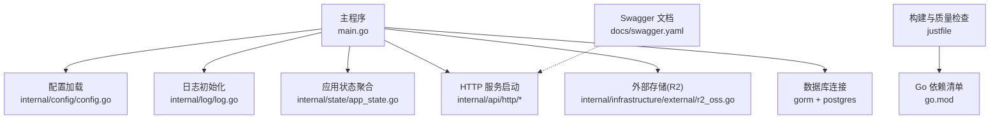
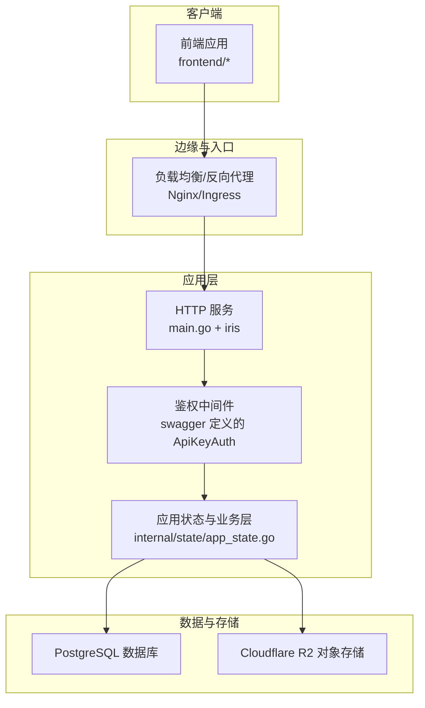
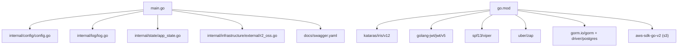

# 部署和运维

<cite>
**本文引用的文件**
- [main.go](file://main.go)
- [go.mod](file://go.mod)
- [app_config.json](file://app_config.json)
- [justfile](file://justfile)
- [.golangci.yml](file://.golangci.yml)
- [internal/config/config.go](file://internal/config/config.go)
- [internal/log/log.go](file://internal/log/log.go)
- [internal/state/app_state.go](file://internal/state/app_state.go)
- [internal/infrastructure/external/r2_oss.go](file://internal/infrastructure/external/r2_oss.go)
- [docs/swagger.yaml](file://docs/swagger.yaml)
</cite>

## 目录
1. [简介](#简介)
2. [项目结构](#项目结构)
3. [核心组件](#核心组件)
4. [架构总览](#架构总览)
5. [详细组件分析](#详细组件分析)
6. [依赖分析](#依赖分析)
7. [性能考虑](#性能考虑)
8. [故障排查指南](#故障排查指南)
9. [结论](#结论)
10. [附录](#附录)

## 简介
本指南面向漫画翻译协作平台的生产环境部署与运维管理，围绕容器化部署、镜像构建、Kubernetes 集群配置、CI/CD 流水线与蓝绿部署策略、监控告警与日志收集、性能指标监控、数据库备份与灾难恢复、高可用架构设计、安全加固与合规检查等方面，提供可操作的实施建议。文档同时结合仓库中的现有配置与代码结构，给出与实际代码映射的架构图与流程图，帮助读者快速落地。

## 项目结构
后端服务采用 Go 语言实现，入口位于主程序，通过配置模块加载运行时参数，初始化日志、数据库连接与外部 OSS 客户端，随后启动 HTTP 服务对外提供 API。前端位于独立目录，与后端通过 API 协议交互。项目根目录包含构建与质量检查任务定义，以及数据库迁移脚本与种子数据脚本。

图表来源
- [main.go:25-145](file://main.go#L25-L145)
- [internal/config/config.go:11-59](file://internal/config/config.go#L11-L59)
- [internal/log/log.go:13-83](file://internal/log/log.go#L13-L83)
- [internal/state/app_state.go:23-49](file://internal/state/app_state.go#L23-L49)
- [internal/infrastructure/external/r2_oss.go:29-59](file://internal/infrastructure/external/r2_oss.go#L29-L59)
- [docs/swagger.yaml:1-20](file://docs/swagger.yaml#L1-L20)

章节来源
- [main.go:25-145](file://main.go#L25-L145)
- [go.mod:1-113](file://go.mod#L1-L113)
- [justfile:1-39](file://justfile#L1-L39)

## 核心组件
- 应用入口与生命周期
  - 主程序负责加载环境变量与配置、初始化日志、建立数据库连接与外部 OSS 客户端、组装应用层对象、启动 HTTP 服务器并等待退出信号。
- 配置系统
  - 通过 JSON 文件与环境变量组合加载，支持开发/生产环境切换，强制要求设置环境变量用于敏感配置。
- 日志系统
  - 开发环境彩色控制台输出，生产环境 JSON 结构化输出并落盘轮转，统一替换全局日志实例。
- 应用状态聚合
  - 将各业务应用层对象注入统一状态结构，便于后续路由与中间件使用。
- 外部存储
  - 基于 AWS SDK 的 R2 OSS 客户端封装，提供预签名上传能力，支撑图片等资源的上传与访问。
- API 文档
  - Swagger/YAML 描述了 API 路径、鉴权方式与数据模型，便于前后端协同与自动化测试。

章节来源
- [main.go:25-145](file://main.go#L25-L145)
- [internal/config/config.go:11-100](file://internal/config/config.go#L11-L100)
- [internal/log/log.go:13-83](file://internal/log/log.go#L13-L83)
- [internal/state/app_state.go:8-49](file://internal/state/app_state.go#L8-L49)
- [internal/infrastructure/external/r2_oss.go:21-59](file://internal/infrastructure/external/r2_oss.go#L21-L59)
- [docs/swagger.yaml:1-20](file://docs/swagger.yaml#L1-L20)

## 架构总览
下图展示了从请求进入、鉴权、业务处理到外部存储与数据库的完整链路，以及与 Kubernetes 集群的典型部署位置关系。

图表来源
- [main.go:12-145](file://main.go#L12-L145)
- [docs/swagger.yaml:2934-2940](file://docs/swagger.yaml#L2934-L2940)
- [internal/infrastructure/external/r2_oss.go:29-59](file://internal/infrastructure/external/r2_oss.go#L29-L59)

## 详细组件分析

### 组件一：容器化与镜像构建
- 运行时基础
  - 基于 Linux amd64 的二进制可执行文件，入口由 Justfile 中的构建目标生成。
- 镜像构建建议
  - 使用多阶段构建：编译阶段使用官方 Go 编译器，运行阶段使用精简的基础镜像（如 distroless 或 alpine），仅拷贝最终二进制与必要资源。
  - 安全扫描：在 CI 中集成镜像漏洞扫描工具，确保基镜像与依赖安全。
- 容器健康检查
  - 提供 HTTP 健康检查端点，探测 /api/v1 状态或内部心跳接口，失败时自动重启。
- 环境隔离
  - 通过 ConfigMap/Secret 注入配置与密钥，避免硬编码在镜像中。

章节来源
- [justfile:21-22](file://justfile#L21-L22)
- [go.mod:1-113](file://go.mod#L1-L113)

### 组件二：Kubernetes 集群配置
- 命名空间与资源
  - 建议按环境划分命名空间（如 production、staging），在其中部署 Deployment、Service、ConfigMap、Secret、Ingress、HPA 等。
- Deployment
  - 设置副本数、滚动更新策略（maxUnavailable/ maxSurge），并启用 PodDisruptionBudget 保障可用性。
- Service 与 Ingress
  - Service 暴露 ClusterIP，Ingress 提供 TLS 终止与路径转发规则。
- 存储与持久化
  - 数据库存储在托管服务或集群内持久卷，对象存储通过 Secret 注入凭证。
- 资源限制
  - 为容器设置 CPU/内存 requests/limits，配合 HPA 实现弹性扩缩容。

（本小节为概念性说明，不直接分析具体文件）

### 组件三：CI/CD 流水线与蓝绿部署
- 流水线阶段
  - 代码检出 → 依赖安装 → 单元测试/静态检查 → 构建二进制 → 打包镜像 → 推送镜像 → 部署新版本 → 健康检查 → 回滚策略。
- 蓝绿部署
  - 两套完全相同的资源（Deployment/Service/Ingress），通过标签切换流量，先部署新版本至“绿”，验证通过后切换流量，旧版本保留一段时间以便回滚。
- 自动化测试
  - 集成 API 测试与安全扫描，失败即阻断发布。

（本小节为概念性说明，不直接分析具体文件）

### 组件四：监控告警与日志收集
- 指标采集
  - 使用 Prometheus 抓取应用指标（如 HTTP 请求耗时、错误率、Goroutines 数、GC 次数等），结合 Grafana 可视化。
- 日志采集
  - 生产日志采用 JSON 结构化输出并落盘轮转，结合集中式日志系统（如 ELK/EFK）采集与检索。
- 告警策略
  - 基于阈值与趋势的告警，覆盖 CPU/内存/磁盘/网络/数据库连接池/对象存储可用性等维度。

章节来源
- [internal/log/log.go:52-83](file://internal/log/log.go#L52-L83)

### 组件五：性能指标监控
- 关键指标
  - QPS、P95/P99 延迟、错误率、数据库连接池利用率、对象存储上传成功率与延迟。
- 性能优化
  - 数据库连接池参数需与并发与实例规格匹配；缓存与异步队列减少热点路径压力；CDN 加速静态资源。

（本小节为通用指导，不直接分析具体文件）

### 组件六：数据库备份与灾难恢复
- 备份策略
  - 定时逻辑备份与增量备份结合，保留多个版本以便回滚；备份加密与异地存放。
- 恢复演练
  - 定期进行恢复演练，验证备份完整性与恢复时间目标（RTO/RPO）。
- 高可用
  - 使用托管数据库的高可用实例或多主架构，配合只读副本分担查询压力。

（本小节为通用指导，不直接分析具体文件）

### 组件七：安全加固与合规
- 配置安全
  - 强制使用环境变量注入密钥与敏感配置，禁止明文写入配置文件与镜像。
- 访问控制
  - API 鉴权基于 Header 中的令牌，建议结合 HTTPS/TLS 与最小权限原则。
- 代码安全
  - 集成静态分析与安全扫描（gosec、golangci-lint），修复高危问题后再发布。
- 合规检查
  - 定期审计第三方依赖与许可证，确保符合组织合规要求。

章节来源
- [internal/config/config.go:74-83](file://internal/config/config.go#L74-L83)
- [.golangci.yml:7-18](file://.golangci.yml#L7-L18)

### 组件八：运维自动化与可靠性
- 自动化
  - 通过 CI/CD 自动化构建、测试、打包与部署；使用声明式配置管理（Helm/Kustomize）统一模板。
- 故障恢复
  - 健康检查与自动重启；蓝绿/金丝雀发布降低变更风险；完善的回滚机制。
- 成本优化
  - 合理设置资源配额与自动扩缩容策略，避免资源浪费；使用预留实例与冷热分层存储。

（本小节为通用指导，不直接分析具体文件）

## 依赖分析
后端服务依赖 Go 生态与云原生组件，关键依赖包括 Web 框架、ORM、日志、配置解析与对象存储 SDK。这些依赖共同支撑服务的稳定性与可维护性。

图表来源
- [go.mod:5-18](file://go.mod#L5-L18)
- [main.go:12-23](file://main.go#L12-L23)

章节来源
- [go.mod:1-113](file://go.mod#L1-L113)
- [main.go:12-23](file://main.go#L12-L23)

## 性能考虑
- 连接池与并发
  - 数据库连接池参数应与实例规格与业务峰值匹配，避免连接不足或过度占用。
- 缓存与异步
  - 对热点数据引入缓存，对耗时操作采用异步队列，减少请求链路阻塞。
- 资源调度
  - 合理设置 requests/limits，结合 HPA 实现弹性伸缩，避免资源争抢导致抖动。

（本小节为通用指导，不直接分析具体文件）

## 故障排查指南
- 启动失败
  - 检查环境变量是否正确设置（应用环境、数据库地址、JWT 密钥、R2 凭证），确认配置文件加载成功。
- 日志定位
  - 开发环境查看控制台彩色日志，生产环境检查 JSON 日志与轮转文件，关注错误级别与堆栈信息。
- API 问题
  - 使用 Swagger 文档核对请求参数与鉴权头，确认路径与方法一致。
- 存储异常
  - 检查 R2 凭证与桶权限，验证预签名上传流程与回调更新逻辑。

章节来源
- [internal/config/config.go:29-59](file://internal/config/config.go#L29-L59)
- [internal/log/log.go:13-83](file://internal/log/log.go#L13-L83)
- [docs/swagger.yaml:2934-2940](file://docs/swagger.yaml#L2934-L2940)
- [internal/infrastructure/external/r2_oss.go:29-59](file://internal/infrastructure/external/r2_oss.go#L29-L59)

## 结论
通过将现有配置与代码结构与容器化、Kubernetes、CI/CD、监控告警、数据库备份与安全加固相结合，可以构建一套稳定、可观测、可扩展且合规的生产环境。建议优先完成镜像构建与集群部署、监控与日志体系搭建，并逐步引入蓝绿/金丝雀发布与自动化回滚，持续优化性能与成本。

## 附录
- 配置文件与环境变量
  - 应用配置文件与环境变量共同决定运行行为，生产环境必须严格管理密钥与敏感信息。
- 构建与质量检查
  - 使用 Justfile 定义构建与迁移命令，配合 golangci-lint 与安全扫描工具保证代码质量。

章节来源
- [app_config.json:1-11](file://app_config.json#L1-L11)
- [internal/config/config.go:29-59](file://internal/config/config.go#L29-L59)
- [justfile:9-13](file://justfile#L9-L13)
- [.golangci.yml:1-30](file://.golangci.yml#L1-L30)