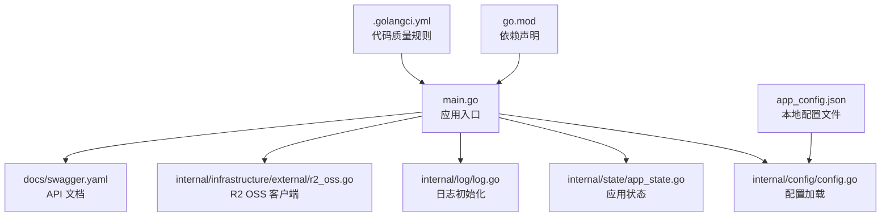
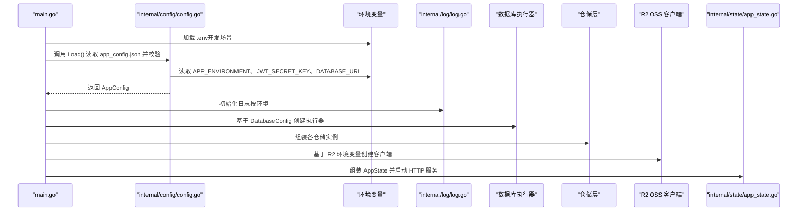
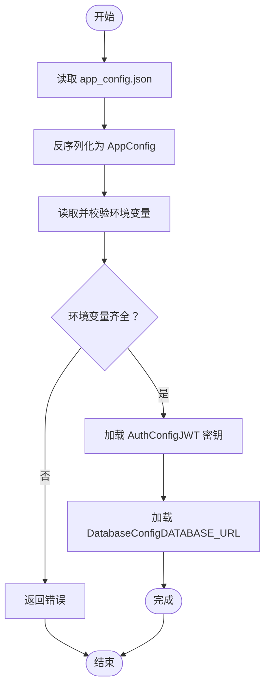
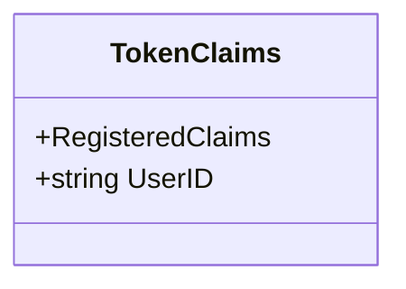
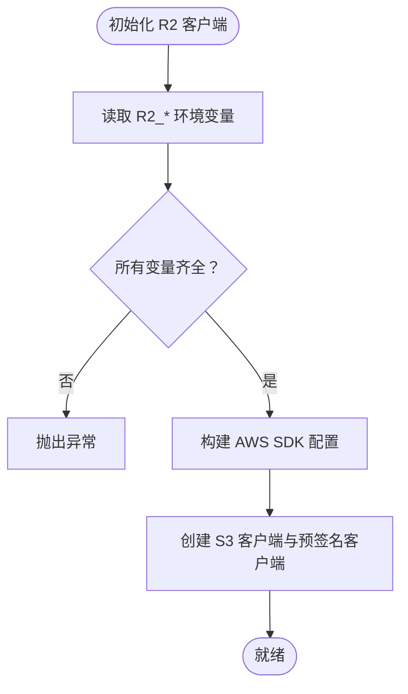
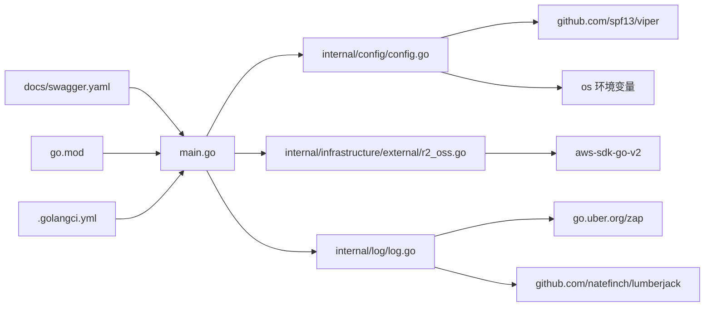

# 部署配置

<cite>
**本文引用的文件**
- [app_config.json](file://app_config.json)
- [config.go](file://internal/config/config.go)
- [main.go](file://main.go)
- [r2_oss.go](file://internal/infrastructure/external/r2_oss.go)
- [swagger.yaml](file://docs/swagger.yaml)
- [go.mod](file://go.mod)
- [.golangci.yml](file://.golangci.yml)
- [log.go](file://internal/log/log.go)
- [app_state.go](file://internal/state/app_state.go)
- [token.go](file://internal/domain/model/token.go)
</cite>

## 目录
1. [简介](#简介)
2. [项目结构](#项目结构)
3. [核心组件](#核心组件)
4. [架构总览](#架构总览)
5. [详细组件分析](#详细组件分析)
6. [依赖分析](#依赖分析)
7. [性能考虑](#性能考虑)
8. [故障排查指南](#故障排查指南)
9. [结论](#结论)
10. [附录](#附录)

## 简介
本指南面向漫画翻译协作平台的生产环境部署，围绕应用配置、环境变量、配置加载与验证、容器化与编排、以及多环境部署策略展开。文档基于仓库中的实际代码与配置文件，提供可操作的部署建议与最佳实践。

## 项目结构
后端服务采用 Go 语言实现，主要模块包括：
- 配置加载与验证：internal/config
- 应用入口与生命周期：main.go
- 外部存储（Cloudflare R2）：internal/infrastructure/external
- 日志与状态：internal/log、internal/state
- API 文档：docs/swagger.yaml
- 构建与依赖：go.mod、.golangci.yml

图表来源
- [main.go:25-145](file://main.go#L25-L145)
- [config.go:11-59](file://internal/config/config.go#L11-L59)
- [app_state.go:23-38](file://internal/state/app_state.go#L23-L38)
- [log.go:53-83](file://internal/log/log.go#L53-L83)
- [r2_oss.go:29-59](file://internal/infrastructure/external/r2_oss.go#L29-L59)
- [swagger.yaml:1-20](file://docs/swagger.yaml#L1-L20)
- [app_config.json:1-11](file://app_config.json#L1-L11)
- [go.mod:1-18](file://go.mod#L1-L18)

章节来源
- [main.go:25-145](file://main.go#L25-L145)
- [config.go:11-59](file://internal/config/config.go#L11-L59)
- [app_state.go:23-38](file://internal/state/app_state.go#L23-L38)
- [log.go:53-83](file://internal/log/log.go#L53-L83)
- [r2_oss.go:29-59](file://internal/infrastructure/external/r2_oss.go#L29-L59)
- [swagger.yaml:1-20](file://docs/swagger.yaml#L1-L20)
- [app_config.json:1-11](file://app_config.json#L1-L11)
- [go.mod:1-18](file://go.mod#L1-L18)

## 核心组件
- 应用配置加载与验证：通过 Viper 读取 JSON 配置文件，结合环境变量完成加载与校验。
- 认证配置：JWT 密钥由环境变量注入，过期时间来自 JSON 配置。
- 数据库配置：数据库连接字符串由环境变量注入，连接池参数来自 JSON 配置。
- 存储配置：Cloudflare R2 的账户、密钥、区域、桶名、自定义域名均通过环境变量注入。
- 日志配置：生产环境启用 JSON 输出与日志轮转。
- 应用状态：集中持有应用所需的服务与仓库实例。

章节来源
- [config.go:11-59](file://internal/config/config.go#L11-L59)
- [config.go:69-100](file://internal/config/config.go#L69-L100)
- [r2_oss.go:29-59](file://internal/infrastructure/external/r2_oss.go#L29-L59)
- [log.go:53-83](file://internal/log/log.go#L53-L83)
- [app_state.go:23-38](file://internal/state/app_state.go#L23-L38)

## 架构总览
下图展示了应用启动时的配置加载、外部依赖初始化与服务装配的关键流程。

图表来源
- [main.go:25-145](file://main.go#L25-L145)
- [config.go:11-59](file://internal/config/config.go#L11-L59)
- [log.go:53-83](file://internal/log/log.go#L53-L83)
- [r2_oss.go:29-59](file://internal/infrastructure/external/r2_oss.go#L29-L59)
- [app_state.go:23-38](file://internal/state/app_state.go#L23-L38)

## 详细组件分析

### 配置系统与参数说明
- 配置文件：app_config.json
  - server_address：监听地址与端口
  - auth.expiration_hours：JWT 过期间（小时）
  - database.min_idle_connections / max_open_connections：连接池参数
- 环境变量：
  - APP_ENVIRONMENT：环境标识（development/production）
  - JWT_SECRET_KEY：JWT 密钥
  - DATABASE_URL：数据库连接串
  - R2_ACCOUNT_ID、R2_ACCESS_KEY_ID、R2_SECRET_ACCESS_KEY、R2_REGION、R2_BUCKET_NAME、R2_CUSTOM_DOMAIN：R2 存储配置
- 配置加载与验证：
  - 通过 Viper 读取 JSON 并反序列化至 AppConfig
  - 校验环境变量是否齐全，否则返回错误
  - 认证与数据库配置分别从环境变量注入敏感信息

图表来源
- [config.go:29-59](file://internal/config/config.go#L29-L59)
- [app_config.json:1-11](file://app_config.json#L1-L11)

章节来源
- [config.go:11-59](file://internal/config/config.go#L11-L59)
- [app_config.json:1-11](file://app_config.json#L1-L11)

### 认证与令牌模型
- 令牌声明包含标准注册字段与用户标识字段
- JWT 密钥来源于环境变量，用于签发与验证访问令牌
- 过期时间来源于配置文件

图表来源
- [token.go:5-8](file://internal/domain/model/token.go#L5-L8)

章节来源
- [token.go:5-8](file://internal/domain/model/token.go#L5-L8)
- [config.go:74-83](file://internal/config/config.go#L74-L83)

### 外部存储（Cloudflare R2）配置
- 通过环境变量注入 R2 凭据与桶信息
- 自动推导 R2 Endpoint，支持自定义域名
- 作为 OSS 客户端被应用层使用

图表来源
- [r2_oss.go:29-59](file://internal/infrastructure/external/r2_oss.go#L29-L59)

章节来源
- [r2_oss.go:29-59](file://internal/infrastructure/external/r2_oss.go#L29-L59)

### 日志与运行时行为
- 生产环境启用 JSON 编码与日志轮转
- 日志文件路径与轮转策略在日志模块中定义
- 应用根据 APP_ENVIRONMENT 决定日志级别与输出

章节来源
- [log.go:53-83](file://internal/log/log.go#L53-L83)
- [config.go:61-67](file://internal/config/config.go#L61-L67)

### 应用状态与服务装配
- AppState 聚合应用所需的服务与仓储实例
- main.go 中按需组装用户、团队、工作集、漫画、章节、页面、任务、单元等应用层对象

章节来源
- [app_state.go:23-38](file://internal/state/app_state.go#L23-L38)
- [main.go:56-122](file://main.go#L56-L122)

## 依赖分析
- 配置与加载：internal/config 依赖 viper 与 OS 环境变量
- 外部存储：internal/infrastructure/external 依赖 AWS SDK
- 日志：internal/log 依赖 zap 与 lumberjack
- API 文档：docs/swagger.yaml 提供 OpenAPI 描述
- 构建与质量：go.mod 声明依赖，.golangci.yml 定义静态检查规则

图表来源
- [config.go:3-8](file://internal/config/config.go#L3-L8)
- [r2_oss.go:12-16](file://internal/infrastructure/external/r2_oss.go#L12-L16)
- [log.go:21-23](file://internal/log/log.go#L21-L23)
- [swagger.yaml:1-20](file://docs/swagger.yaml#L1-L20)
- [go.mod:5-18](file://go.mod#L5-L18)
- [main.go:12-23](file://main.go#L12-L23)

章节来源
- [config.go:3-8](file://internal/config/config.go#L3-L8)
- [r2_oss.go:12-16](file://internal/infrastructure/external/r2_oss.go#L12-L16)
- [log.go:21-23](file://internal/log/log.go#L21-L23)
- [swagger.yaml:1-20](file://docs/swagger.yaml#L1-L20)
- [go.mod:5-18](file://go.mod#L5-L18)
- [main.go:12-23](file://main.go#L12-L23)

## 性能考虑
- 连接池参数：通过 JSON 配置 min_idle_connections 与 max_open_connections，建议结合数据库性能与并发请求峰值进行调优。
- 日志轮转：生产环境启用日志轮转，避免单文件过大影响 IO。
- 外部存储：R2 作为对象存储，上传与预签名 URL 的使用应配合 CDN 与缓存策略提升访问性能。
- 依赖版本：go.mod 中的依赖版本稳定，建议定期同步安全补丁与性能改进。

## 故障排查指南
- 配置加载失败
  - 症状：启动时报“读取配置文件失败”或“解析配置文件失败”
  - 排查：确认 app_config.json 存在且格式正确；检查 server_address、auth.expiration_hours、database.* 参数是否存在
- 环境变量缺失
  - 症状：启动时报“APP_ENVIRONMENT/ JWT_SECRET_KEY/ DATABASE_URL 未设置”
  - 排查：确保在部署环境中正确注入上述变量
- R2 初始化失败
  - 症状：启动时报“未设置 R2_* 环境变量”
  - 排查：核对 R2_ACCOUNT_ID、R2_ACCESS_KEY_ID、R2_SECRET_ACCESS_KEY、R2_BUCKET_NAME 等变量
- 日志问题
  - 症状：日志未输出或文件未生成
  - 排查：确认 logs 目录可写；检查日志轮转配置与权限

章节来源
- [config.go:36-42](file://internal/config/config.go#L36-L42)
- [config.go:44-47](file://internal/config/config.go#L44-L47)
- [config.go:74-78](file://internal/config/config.go#L74-L78)
- [config.go:91-95](file://internal/config/config.go#L91-L95)
- [r2_oss.go:30-53](file://internal/infrastructure/external/r2_oss.go#L30-L53)
- [log.go:64-70](file://internal/log/log.go#L64-L70)

## 结论
本指南基于仓库现有代码与配置，给出了生产环境部署的完整路径：配置文件结构与参数、环境变量管理、配置加载与验证、日志与运行时行为、以及外部存储接入。建议在生产部署中严格管理敏感变量，结合连接池与日志轮转策略，确保服务稳定与可观测性。

## 附录

### Docker 容器化部署建议
- 基础镜像与构建
  - 使用官方 Go 镜像进行多阶段构建，先编译再复制二进制到精简基础镜像
  - 在构建阶段安装必要工具，最终镜像仅包含运行时二进制与依赖
- 可执行文件与入口
  - 将编译产物复制到镜像根目录，设置容器入口命令为二进制名称
- 端口与健康检查
  - 对外暴露服务端口（由 server_address 决定）
  - 在容器运行时配置健康检查，指向 API 的健康端点（如存在）
- 环境变量注入
  - 通过镜像构建参数或运行时环境变量注入 APP_ENVIRONMENT、JWT_SECRET_KEY、DATABASE_URL、R2_* 等

### Kubernetes 集群部署建议
- Deployment
  - 设置副本数、滚动更新策略与资源限制
  - 挂载只读配置卷（包含 app_config.json）与 Secret（包含 JWT_SECRET_KEY、DATABASE_URL、R2_*）
- Service
  - 暴露服务端口，选择 ClusterIP 或 LoadBalancer（视集群类型而定）
- ConfigMap
  - 用于存放非敏感配置（如 server_address、auth.expiration_hours、database.*）
- Secret
  - 存放敏感配置（JWT_SECRET_KEY、DATABASE_URL、R2_*）
- 健康检查与就绪探针
  - 配置 HTTP GET 健康检查端点（如 /health），探针超时与重试策略合理设置
- 横幅扩展
  - 基于 CPU/内存或自定义指标配置 HPA，结合副本数上限与节点亲和性

### 多环境部署（开发/测试/生产）差异与切换
- 环境变量差异
  - development：APP_ENVIRONMENT=development，日志级别较低，可开启调试输出
  - production：APP_ENVIRONMENT=production，启用 JSON 日志与轮转，严格错误处理
- 配置文件差异
  - server_address：开发可使用本地回环，生产使用内网或公网域名
  - database.*：不同环境连接池大小与超时策略不同
- 外部存储差异
  - R2_REGION：开发可使用 auto，生产使用就近区域
  - R2_CUSTOM_DOMAIN：生产可绑定自有域名加速访问
- 切换机制
  - 通过 CI/CD 注入对应环境的 ConfigMap/Secret
  - 通过标签与命名空间隔离不同环境