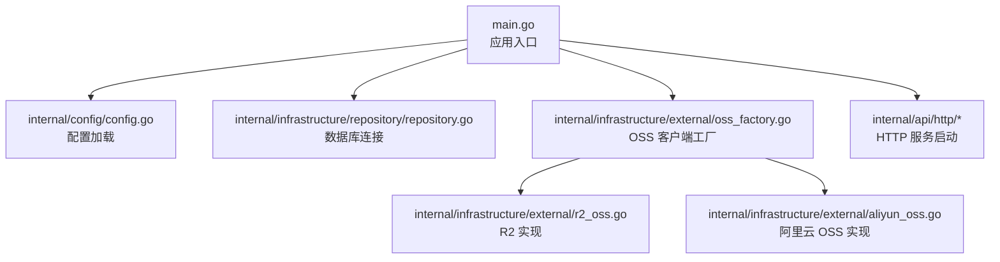
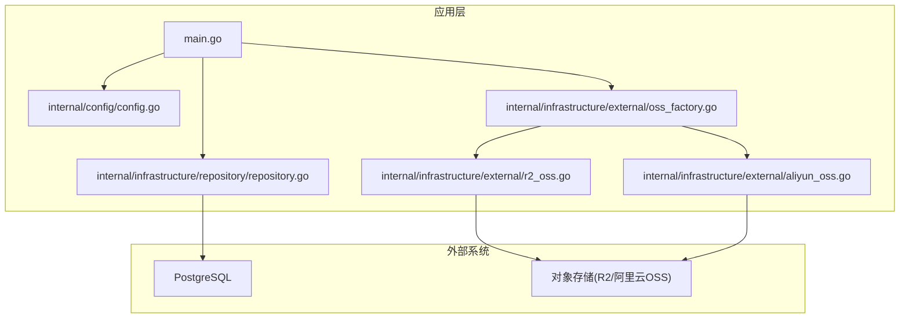
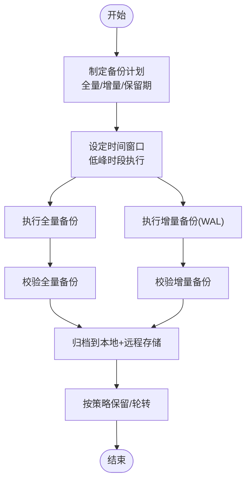
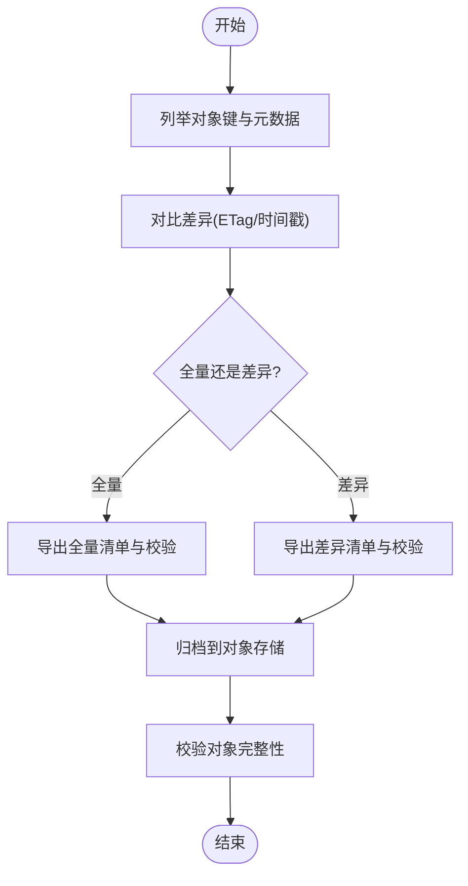
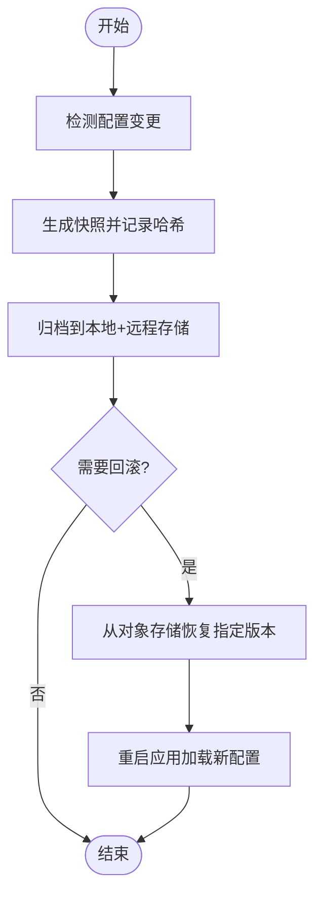
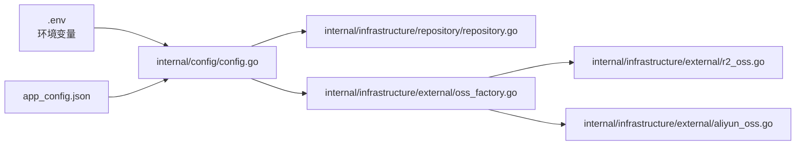

# 备份恢复

<cite>
**本文引用的文件**
- [main.go](file://main.go)
- [app_config.json](file://app_config.json)
- [internal/config/config.go](file://internal/config/config.go)
- [internal/infrastructure/repository/repository.go](file://internal/infrastructure/repository/repository.go)
- [internal/infrastructure/external/oss_factory.go](file://internal/infrastructure/external/oss_factory.go)
- [internal/domain/external/oss.go](file://internal/domain/external/oss.go)
- [internal/infrastructure/external/r2_oss.go](file://internal/infrastructure/external/r2_oss.go)
- [internal/infrastructure/external/aliyun_oss.go](file://internal/infrastructure/external/aliyun_oss.go)
- [migrations/20260306101212_comic-table.up.sql](file://migrations/20260306101212_comic-table.up.sql)
- [migrations/20260306101213_chapter-table.up.sql](file://migrations/20260306101213_chapter-table.up.sql)
- [migrations/20260306101216_unit-table.up.sql](file://migrations/20260306101216_unit-table.up.sql)
</cite>

## 目录
1. [简介](#简介)
2. [项目结构](#项目结构)
3. [核心组件](#核心组件)
4. [架构总览](#架构总览)
5. [详细组件分析](#详细组件分析)
6. [依赖分析](#依赖分析)
7. [性能考虑](#性能考虑)
8. [故障排查指南](#故障排查指南)
9. [结论](#结论)
10. [附录](#附录)

## 简介
本文件为 poprako-web-ms 项目的备份与恢复专项文档，目标是建立完善的数据库备份策略、文件存储备份与配置文件备份方案，明确全量/增量备份的时间安排与存储位置，制定灾难恢复计划（含 RTO/RPO 指标）、恢复流程演练、自动化备份脚本、备份验证与恢复测试方法，并覆盖数据迁移、版本升级与紧急响应程序，确保业务连续性与数据安全。

## 项目结构
本项目采用分层架构，核心运行入口负责加载配置、初始化数据库连接与外部对象存储客户端，随后启动 HTTP 服务。数据库通过 GORM 连接 PostgreSQL，文件存储支持 R2 与阿里云 OSS 两种 Provider，可通过环境变量切换。

图表来源
- [main.go:25-145](file://main.go#L25-L145)
- [internal/config/config.go:11-59](file://internal/config/config.go#L11-L59)
- [internal/infrastructure/repository/repository.go:11-29](file://internal/infrastructure/repository/repository.go#L11-L29)
- [internal/infrastructure/external/oss_factory.go:21-35](file://internal/infrastructure/external/oss_factory.go#L21-L35)

章节来源
- [main.go:25-145](file://main.go#L25-L145)
- [internal/config/config.go:11-59](file://internal/config/config.go#L11-L59)
- [internal/infrastructure/repository/repository.go:11-29](file://internal/infrastructure/repository/repository.go#L11-L29)
- [internal/infrastructure/external/oss_factory.go:21-35](file://internal/infrastructure/external/oss_factory.go#L21-L35)

## 核心组件
- 应用配置与环境变量
  - 配置文件：app_config.json，包含服务器地址与数据库连接池参数。
  - 环境变量：APP_ENVIRONMENT、DATABASE_URL、JWT_SECRET_KEY、OSS_PROVIDER、R2_* 或 ALIYUN_OSS_* 等。
- 数据库连接
  - 通过 GORM 与 PostgreSQL 建立连接，设置最大空闲与最大打开连接数。
- 对象存储
  - 工厂按 OSS_PROVIDER 选择 R2 或阿里云 OSS 实现，提供预签名上传/下载 URL 与删除能力。

章节来源
- [app_config.json:1-11](file://app_config.json#L1-L11)
- [internal/config/config.go:29-59](file://internal/config/config.go#L29-L59)
- [internal/config/config.go:91-100](file://internal/config/config.go#L91-L100)
- [internal/infrastructure/repository/repository.go:11-29](file://internal/infrastructure/repository/repository.go#L11-L29)
- [internal/infrastructure/external/oss_factory.go:21-35](file://internal/infrastructure/external/oss_factory.go#L21-L35)

## 架构总览
下图展示备份与恢复相关的关键路径：应用启动时加载配置与连接数据库；文件上传/下载通过 OSS 客户端访问对象存储；备份与恢复流程独立于应用运行，但需与数据库与对象存储的可用性协同。

图表来源
- [main.go:25-145](file://main.go#L25-L145)
- [internal/config/config.go:11-59](file://internal/config/config.go#L11-L59)
- [internal/infrastructure/repository/repository.go:11-29](file://internal/infrastructure/repository/repository.go#L11-L29)
- [internal/infrastructure/external/oss_factory.go:21-35](file://internal/infrastructure/external/oss_factory.go#L21-L35)
- [internal/infrastructure/external/r2_oss.go:41-91](file://internal/infrastructure/external/r2_oss.go#L41-L91)
- [internal/infrastructure/external/aliyun_oss.go:34-72](file://internal/infrastructure/external/aliyun_oss.go#L34-L72)

## 详细组件分析

### 数据库备份策略
- 备份类型
  - 全量备份：建议每日一次，用于建立基准快照。
  - 增量备份：建议每 5-15 分钟基于 WAL 日志进行增量捕获，结合全量周期形成混合备份。
- 时间安排
  - 全量备份：建议在业务低峰时段（如凌晨 2:00-6:00）执行。
  - 增量备份：按分钟级调度，确保 WAL 不被提前清理。
- 存储位置
  - 本地磁盘：保留最近 7 天的全量与增量备份副本，满足快速恢复。
  - 远程对象存储：将备份归档至对象存储（如 OSS/R2），保留 30-90 天，满足合规与异地容灾。
- 备份工具与流程
  - 使用数据库自带工具（如 pg_dump/pg_restore）或第三方工具（如 WAL-G、Barman）。
  - 备份完成后计算校验和并记录元数据（时间戳、大小、校验值、WAL 起止位点）。
- 恢复流程
  - 选择最近的全量备份作为基线，依次应用其后的增量备份，定位到所需时间点。
  - 使用时间点恢复（PITR）将数据库恢复到目标时刻。
- RTO/RPO 指标
  - RPO：目标小于 15 分钟（基于增量备份频率与 WAL 保留策略）。
  - RTO：全量恢复约 30 分钟，增量恢复约 5 分钟（取决于数据量与网络带宽）。

### 文件存储备份方案
- 备份范围
  - 对象存储中的所有漫画、章节、页面与单元相关的媒体文件。
- 备份策略
  - 全量：每周一次，导出对象清单与校验信息。
  - 增量：每日一次，仅同步变更对象（可基于对象版本或时间戳）。
- 存储位置
  - 本地：短期保留最近 7 天的全量与差异。
  - 远程：对象存储归档，保留 30-90 天。
- 备份工具与流程
  - 使用对象存储 SDK 或 CLI（如 rclone、aws s3 cp）批量列举与复制。
  - 记录对象键、ETag、大小、最后修改时间等元数据。
- 恢复流程
  - 从对象存储拉取对应版本或时间点的数据，重建对象键与元数据。
  - 校验 ETag 一致性，修复缺失或损坏对象。
- RTO/RPO 指标
  - RPO：基于每日增量与对象版本控制，目标小于 1 天。
  - RTO：批量恢复约 2 小时（取决于对象数量与带宽）。

### 配置文件备份方案
- 备份内容
  - app_config.json、.env（含 DATABASE_URL、JWT_SECRET_KEY、OSS_PROVIDER、R2_*、ALIYUN_OSS_* 等）。
- 备份策略
  - 全量：每次配置变更后立即生成新版本快照。
  - 增量：仅记录变更文件列表与哈希。
- 存储位置
  - 本地：最近 30 天版本。
  - 远程：对象存储归档，保留 90 天。
- 恢复流程
  - 从对象存储恢复指定版本配置，重启应用使新配置生效。
- RTO/RPO 指标
  - RPO：即时（变更即备份）。
  - RTO：配置恢复约 1 分钟，应用重启约 10 秒。

### 自动化备份脚本与验证
- 数据库备份脚本
  - 使用数据库工具执行全量与增量备份，输出校验文件（MD5/SHA256）。
  - 记录备份元数据（起止时间、WAL 位点、文件大小）。
- 文件存储备份脚本
  - 使用对象存储 SDK 列举对象，生成清单与校验文件。
  - 支持并发复制与断点续传。
- 配置文件备份脚本
  - 监控配置目录变化，生成版本快照并上传对象存储。
- 备份验证
  - 数据库：使用还原到临时实例进行一致性检查。
  - 文件存储：随机抽样对象下载校验 ETag。
  - 配置文件：恢复后启动应用并执行健康检查。
- 恢复测试
  - 定期进行“破坏性演练”：模拟删除关键数据或对象，验证恢复流程与指标达成情况。

### 灾难恢复计划（DRP）
- 恢复目标
  - RPO：≤ 15 分钟（数据库）；≤ 1 天（文件存储）；即时（配置文件）。
  - RTO：≤ 30 分钟（数据库全量恢复）；≤ 5 分钟（数据库增量恢复）；≤ 2 小时（文件存储恢复）；≤ 1 分钟（配置文件恢复）。
- 触发条件
  - 数据库不可用、对象存储不可达、配置文件丢失或被篡改。
- 恢复优先级
  - 业务系统可用性 > 数据完整性 > 最小停机时间。
- 恢复流程
  - 快速评估：确认故障范围与影响面。
  - 数据库恢复：选择最近全量与增量，执行 PITR。
  - 文件存储恢复：从对象存储重建数据，校验完整性。
  - 配置恢复：恢复配置文件并重启应用。
  - 验证与监控：健康检查、日志审计、业务回归测试。
- 演练计划
  - 每季度进行一次全流程演练，每年进行一次跨区域灾难演练。

### 数据迁移与版本升级
- 数据迁移
  - 使用迁移脚本（migrations/*）进行结构演进，确保幂等与可逆。
  - 迁移前先做数据库与对象存储的备份，迁移后进行一致性校验。
- 版本升级
  - 预发布环境先行验证，生产环境滚动升级。
  - 升级前冻结写入，升级后进行功能与性能回归测试。

### 紧急响应程序
- 故障分级
  - 一级：数据库或对象存储完全不可用，业务中断。
  - 二级：部分服务不可用或性能严重下降。
  - 三级：配置错误或次要功能异常。
- 响应流程
  - 发现问题 → 快速隔离 → 启动 DRP → 恢复服务 → 根因分析 → 修复与复盘。
- 人员与职责
  - 运维团队：负责备份与恢复、监控告警。
  - 开发团队：负责修复缺陷与优化备份策略。
  - 管理层：负责资源协调与决策。

## 依赖分析
- 应用启动依赖配置加载与数据库连接，二者均来自环境变量与配置文件。
- 对象存储客户端由工厂根据环境变量动态选择实现。
- 数据库与对象存储的可用性直接影响备份与恢复的可靠性。

图表来源
- [internal/config/config.go:11-59](file://internal/config/config.go#L11-L59)
- [app_config.json:1-11](file://app_config.json#L1-L11)
- [internal/infrastructure/repository/repository.go:11-29](file://internal/infrastructure/repository/repository.go#L11-L29)
- [internal/infrastructure/external/oss_factory.go:21-35](file://internal/infrastructure/external/oss_factory.go#L21-L35)

章节来源
- [internal/config/config.go:11-59](file://internal/config/config.go#L11-L59)
- [internal/infrastructure/repository/repository.go:11-29](file://internal/infrastructure/repository/repository.go#L11-L29)
- [internal/infrastructure/external/oss_factory.go:21-35](file://internal/infrastructure/external/oss_factory.go#L21-L35)

## 性能考虑
- 备份窗口与业务影响
  - 选择低峰时段执行全量备份，避免与业务高峰期重叠。
  - 增量备份尽量使用异步复制，减少对主库的压力。
- 并发与带宽
  - 文件存储备份使用并发复制与分片传输，提升吞吐。
  - 对象存储上传使用多线程与断点续传，提高稳定性。
- 存储成本
  - 本地短期保留与远程长期归档结合，平衡成本与恢复效率。
- 校验与压缩
  - 备份文件启用压缩与去重，降低存储与网络开销。

## 故障排查指南
- 数据库无法连接
  - 检查 DATABASE_URL 是否正确，网络连通性与防火墙策略。
  - 查看连接池参数是否合理（最大连接数、空闲连接数）。
- 对象存储不可用
  - 检查 OSS_PROVIDER 与对应密钥配置是否正确。
  - 验证桶权限与自定义域名配置。
- 备份失败
  - 检查备份脚本日志与返回码，确认磁盘空间与网络带宽。
  - 校验备份文件完整性与元数据一致性。
- 恢复异常
  - 确认恢复目标时间点与备份链完整。
  - 检查应用重启日志与健康检查结果。

## 结论
通过建立全量/增量备份策略、完善对象存储与配置文件的备份与恢复流程、明确 RTO/RPO 指标与演练机制，并配套自动化脚本与验证手段，poprako-web-ms 可有效保障业务连续性与数据安全。建议持续优化备份与恢复流程，定期演练，确保在真实灾难场景下快速恢复。

## 附录
- 关键表结构（用于理解数据模型与备份范围）
  - 漫画表：包含作品基本信息与统计字段，索引覆盖团队与创建时间排序。
  - 章节表：包含章节索引、标题与多阶段时间戳，外键关联漫画。
  - 单元表：包含页面坐标、翻译与校对状态，外键关联页面。

章节来源
- [migrations/20260306101212_comic-table.up.sql:1-37](file://migrations/20260306101212_comic-table.up.sql#L1-L37)
- [migrations/20260306101213_chapter-table.up.sql:1-38](file://migrations/20260306101213_chapter-table.up.sql#L1-L38)
- [migrations/20260306101216_unit-table.up.sql:1-30](file://migrations/20260306101216_unit-table.up.sql#L1-L30)