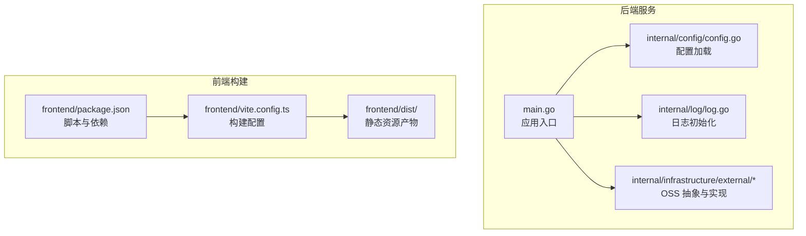
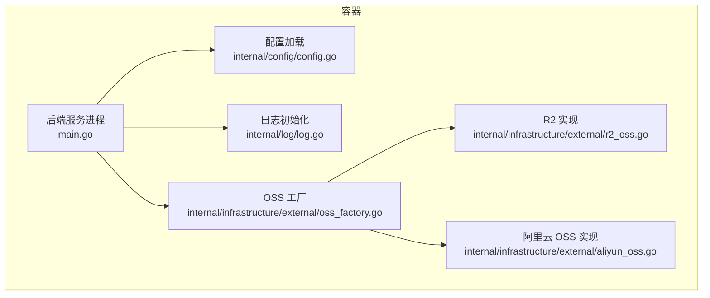
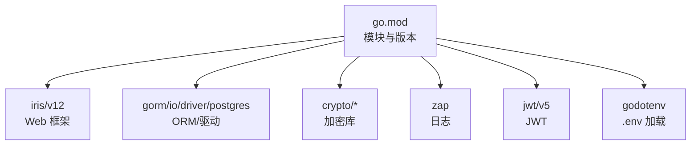

# 容器化部署

<cite>
**本文引用的文件**
- [main.go](file://main.go)
- [go.mod](file://go.mod)
- [app_config.json](file://app_config.json)
- [internal/config/config.go](file://internal/config/config.go)
- [internal/log/log.go](file://internal/log/log.go)
- [internal/infrastructure/external/oss_factory.go](file://internal/infrastructure/external/oss_factory.go)
- [internal/infrastructure/external/r2_oss.go](file://internal/infrastructure/external/r2_oss.go)
- [internal/infrastructure/external/aliyun_oss.go](file://internal/infrastructure/external/aliyun_oss.go)
- [frontend/package.json](file://frontend/package.json)
- [frontend/vite.config.ts](file://frontend/vite.config.ts)
- [frontend/dist/index.html](file://frontend/dist/index.html)
- [.golangci.yml](file://.golangci.yml)
- [justfile](file://justfile)
</cite>

## 目录
1. [简介](#简介)
2. [项目结构](#项目结构)
3. [核心组件](#核心组件)
4. [架构总览](#架构总览)
5. [详细组件分析](#详细组件分析)
6. [依赖分析](#依赖分析)
7. [性能考虑](#性能考虑)
8. [故障排查指南](#故障排查指南)
9. [结论](#结论)
10. [附录](#附录)

## 简介
本文件面向 poprako-web-ms 项目的容器化部署与运维，覆盖以下内容：
- Docker 镜像构建流程与多阶段优化
- 容器运行时配置与安全加固
- docker-compose 编排与网络设置
- Kubernetes 清单、资源限制与滚动更新策略
- 容器监控、日志收集与健康检查
- 稳定可靠的交付与运维实践

## 项目结构
该项目由后端 Go 服务与前端 Vue 应用组成，后端通过 HTTP 暴露 API，前端构建产物可由后端或独立反向代理提供。关键目录与职责如下：
- 后端主程序与配置：main.go、internal/config、internal/log
- 外部存储抽象：internal/infrastructure/external（支持 R2 与阿里云 OSS）
- 前端构建：frontend（Vite + Vue 3），产出静态资源至 dist/
- 工程工具链：justfile、.golangci.yml、go.mod

**图表来源**
- [main.go:25-145](file://main.go#L25-L145)
- [internal/config/config.go:11-59](file://internal/config/config.go#L11-L59)
- [internal/log/log.go:13-30](file://internal/log/log.go#L13-L30)
- [internal/infrastructure/external/oss_factory.go:16-35](file://internal/infrastructure/external/oss_factory.go#L16-L35)
- [frontend/package.json:6-12](file://frontend/package.json#L6-L12)
- [frontend/vite.config.ts:12-19](file://frontend/vite.config.ts#L12-L19)
- [frontend/dist/index.html:1-16](file://frontend/dist/index.html#L1-L16)

**章节来源**
- [main.go:25-145](file://main.go#L25-L145)
- [frontend/package.json:6-12](file://frontend/package.json#L6-L12)
- [frontend/vite.config.ts:12-19](file://frontend/vite.config.ts#L12-L19)
- [frontend/dist/index.html:1-16](file://frontend/dist/index.html#L1-L16)

## 核心组件
- 应用入口与生命周期
  - 入口函数加载环境变量与配置，初始化日志、数据库连接与各应用层实例，最后启动 HTTP 服务器。
  - 关键路径参考：[main.go:25-145](file://main.go#L25-L145)
- 配置系统
  - 使用 Viper 从 JSON 文件加载基础配置，结合环境变量注入敏感参数（如 JWT 密钥、数据库连接串）。
  - 关键路径参考：[internal/config/config.go:11-59](file://internal/config/config.go#L11-L59)，[app_config.json:1-11](file://app_config.json#L1-L11)
- 日志系统
  - 开发模式下输出彩色控制台日志；生产模式下输出 JSON 并写入轮转文件，同时保留堆栈与调用者信息。
  - 关键路径参考：[internal/log/log.go:13-83](file://internal/log/log.go#L13-L83)
- 存储抽象
  - 通过工厂方法按环境变量选择 OSS 提供商（默认 R2 或阿里云 OSS），并在运行时校验必需环境变量。
  - 关键路径参考：[internal/infrastructure/external/oss_factory.go:16-35](file://internal/infrastructure/external/oss_factory.go#L16-L35)，[internal/infrastructure/external/r2_oss.go:41-65](file://internal/infrastructure/external/r2_oss.go#L41-L65)，[internal/infrastructure/external/aliyun_oss.go:34-58](file://internal/infrastructure/external/aliyun_oss.go#L34-L58)

**章节来源**
- [main.go:25-145](file://main.go#L25-L145)
- [internal/config/config.go:11-59](file://internal/config/config.go#L11-L59)
- [app_config.json:1-11](file://app_config.json#L1-L11)
- [internal/log/log.go:13-83](file://internal/log/log.go#L13-L83)
- [internal/infrastructure/external/oss_factory.go:16-35](file://internal/infrastructure/external/oss_factory.go#L16-L35)
- [internal/infrastructure/external/r2_oss.go:41-65](file://internal/infrastructure/external/r2_oss.go#L41-L65)
- [internal/infrastructure/external/aliyun_oss.go:34-58](file://internal/infrastructure/external/aliyun_oss.go#L34-L58)

## 架构总览
后端服务在容器内以单一进程运行，监听配置中的地址与端口；前端静态资源可由后端直接提供或由外部反向代理提供。OSS 适配器在运行时根据环境变量选择具体实现。

**图表来源**
- [main.go:25-145](file://main.go#L25-L145)
- [internal/config/config.go:11-59](file://internal/config/config.go#L11-L59)
- [internal/log/log.go:13-83](file://internal/log/log.go#L13-L83)
- [internal/infrastructure/external/oss_factory.go:16-35](file://internal/infrastructure/external/oss_factory.go#L16-L35)
- [internal/infrastructure/external/r2_oss.go:41-65](file://internal/infrastructure/external/r2_oss.go#L41-L65)
- [internal/infrastructure/external/aliyun_oss.go:34-58](file://internal/infrastructure/external/aliyun_oss.go#L34-L58)

## 详细组件分析

### Docker 镜像构建与多阶段优化
目标：最小化镜像体积、提升构建速度与安全性，同时保证运行时可用性。

- 基础镜像选择
  - 构建阶段：使用官方 Go 官方镜像作为构建环境，启用模块缓存与分层缓存。
  - 运行阶段：使用精简的基础镜像（如 distroless/static 或 alpine），仅包含运行时所需二进制与 CA 证书。
- 多阶段构建要点
  - 第一阶段：安装构建依赖，拉取 Go 模块缓存，编译生成 Linux 可执行文件。
  - 第二阶段：复制可执行文件与必要的只读资源（如前端静态文件），不包含构建工具链。
  - 最终镜像仅包含运行时二进制与最小依赖，降低攻击面。
- 镜像大小控制
  - 使用 .dockerignore 排除构建无关文件（如 node_modules、dist、.git 目录等）。
  - 合理利用 Go build flags（如 -trimpath、-ldflags）去除调试符号与冗余信息。
- 安全加固
  - 运行阶段以非 root 用户运行（如 65532 或自定义用户），移除不必要的组与权限。
  - 仅挂载只读根文件系统与必要的卷（如日志目录），禁用 SUID/SGID。
  - 使用只读配置卷注入密钥与敏感参数，避免硬编码在镜像中。

### 容器运行时配置
- 端口暴露与绑定
  - 依据配置文件中的 server_address 决定监听地址与端口；在容器中通常映射到 8080 或 80。
- 环境变量注入
  - APP_ENVIRONMENT：决定日志级别与行为（development/production）。
  - JWT_SECRET_KEY：用于签发与验证令牌。
  - DATABASE_URL：PostgreSQL 连接串。
  - OSS_PROVIDER：选择 OSS 提供商（r2/aliyun）。
  - R2_* 或 ALIYUN_OSS_*：对应提供商所需的访问凭据与区域/端点。
- 健康检查
  - HTTP GET /health（或后端提供的健康端点），返回 200 表示健康。
  - 配合探针超时、重试与初始延迟，避免冷启动误判。
- 资源限制
  - CPU/内存限制与请求值，结合业务峰值与并发模型设定。
  - 设置优雅停机信号（SIGTERM/SIGINT）与超时，确保事务与连接有序关闭。

### docker-compose 编排与网络
- 服务编排
  - web-service：后端服务容器，挂载只读配置卷与日志卷。
  - db：PostgreSQL 数据库容器，使用持久卷与只读 root 密码卷。
  - reverse-proxy（可选）：Nginx/Envoy 提供静态资源与反向代理，统一入口。
- 网络设置
  - 自定义桥接网络，web-service 与 db 位于同一网络，便于服务发现与通信。
  - 将 web-service 的 8080 映射到宿主机端口（如 8080），便于本地联调。
- 卷管理
  - 日志卷：将 logs/ 目录映射到宿主机，便于采集与轮转。
  - 静态资源卷：将前端 dist/ 目录映射到 web-service 或反向代理，减少重复构建。

### Kubernetes 部署清单与策略
- Deployment
  - replicas：副本数，结合 HPA 动态扩缩容。
  - podTemplate：设置资源 requests/limits、liveness/readiness probes。
  - imagePullSecrets：私有仓库凭证。
- ConfigMap
  - app_config.json：通过挂载为只读配置卷。
- Secret
  - JWT_SECRET_KEY、DATABASE_URL、OSS 凭据等敏感信息。
- Service
  - ClusterIP/LoadBalancer，暴露 8080 端口。
- HPA
  - CPU/内存利用率或自定义指标触发扩缩容。
- 滚动更新策略
  - maxUnavailable 与 maxSurge 参数，确保更新期间服务连续性。
  - preStop hook 与终止宽限期，保障优雅停机。
- Pod 安全
  - runAsNonRoot、readOnlyRootFilesystem、allowPrivilegeEscalation=false。
  - 通过 SecurityContext 限制 capabilities。

### 容器监控、日志收集与健康检查
- 监控
  - 指标：CPU、内存、Goroutines、GC、HTTP 请求速率与延迟、数据库连接池状态。
  - 告警：阈值告警与异常检测（如 5xx 比例、P95 延迟）。
- 日志
  - stdout/stderr：结构化 JSON（生产模式），便于集中采集。
  - 文件日志：轮转与压缩，保留天数与最大文件大小合理配置。
- 健康检查
  - livenessProbe/readinessProbe：HTTP GET /health，成功即健康。
  - failureThreshold、periodSeconds、timeoutSeconds 根据业务特性调整。

## 依赖分析
后端依赖主要集中在 Web 框架、ORM、加密与日志库，以及 OSS SDK。这些依赖对镜像体积与运行时安全有直接影响。

**图表来源**
- [go.mod:5-18](file://go.mod#L5-L18)

**章节来源**
- [go.mod:5-18](file://go.mod#L5-L18)

## 性能考虑
- 构建优化
  - 启用 Go 模块缓存与并行构建，减少重复下载与编译时间。
  - 使用 -trimpath 与 -ldflags 去除调试信息，减小二进制体积。
- 运行时优化
  - 数据库连接池参数与并发模型匹配，避免过度连接。
  - 日志级别在生产环境提升至 Warn，降低 I/O 压力。
  - 前端静态资源开启压缩与缓存策略，减少带宽与延迟。

## 故障排查指南
- 启动失败
  - 检查环境变量是否完整（APP_ENVIRONMENT、JWT_SECRET_KEY、DATABASE_URL、OSS_*）。
  - 查看日志输出（控制台与文件），定位配置加载与数据库连接错误。
- 认证问题
  - 确认 JWT_SECRET_KEY 一致且未被截断；核对过期时间配置。
- 数据库连接
  - 核对 DATABASE_URL 格式与可达性；检查连接池参数与最大连接数。
- OSS 上传/下载
  - 根据 OSS_PROVIDER 校验对应凭据与区域/端点；确认桶名与权限策略。
- 健康检查失败
  - 确认探针路径与端口正确；检查初始延迟与超时设置。

**章节来源**
- [internal/config/config.go:44-47](file://internal/config/config.go#L44-L47)
- [internal/config/config.go:74-78](file://internal/config/config.go#L74-L78)
- [internal/config/config.go:91-95](file://internal/config/config.go#L91-L95)
- [internal/log/log.go:13-83](file://internal/log/log.go#L13-L83)

## 结论
通过多阶段构建、最小化运行时镜像、严格的环境变量注入与健康检查机制，poprako-web-ms 可实现稳定高效的容器化部署。结合 docker-compose 与 Kubernetes 的编排能力，可在本地开发与生产环境中保持一致的交付体验。

## 附录
- 前端构建产物位置与入口
  - 前端构建产物位于 frontend/dist/，入口页面为 index.html。
  - 参考路径：[frontend/dist/index.html:1-16](file://frontend/dist/index.html#L1-L16)
- 工具链与质量门禁
  - 使用 golangci-lint 与 .golangci.yml 配置进行静态检查。
  - 参考路径：[justfile:9-13](file://justfile#L9-L13)，[justfile:21-22](file://justfile#L21-L22)，[justfile:18-19](file://justfile#L18-L19)，[justfile:37-38](file://justfile#L37-L38)，[frontend/package.json:6-12](file://frontend/package.json#L6-L12)