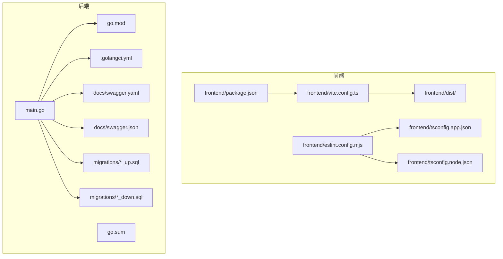
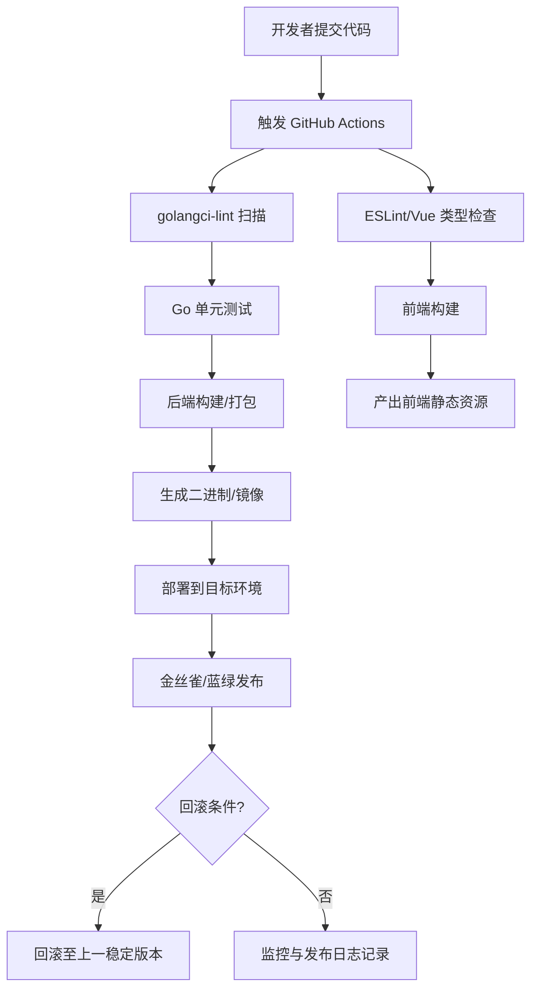
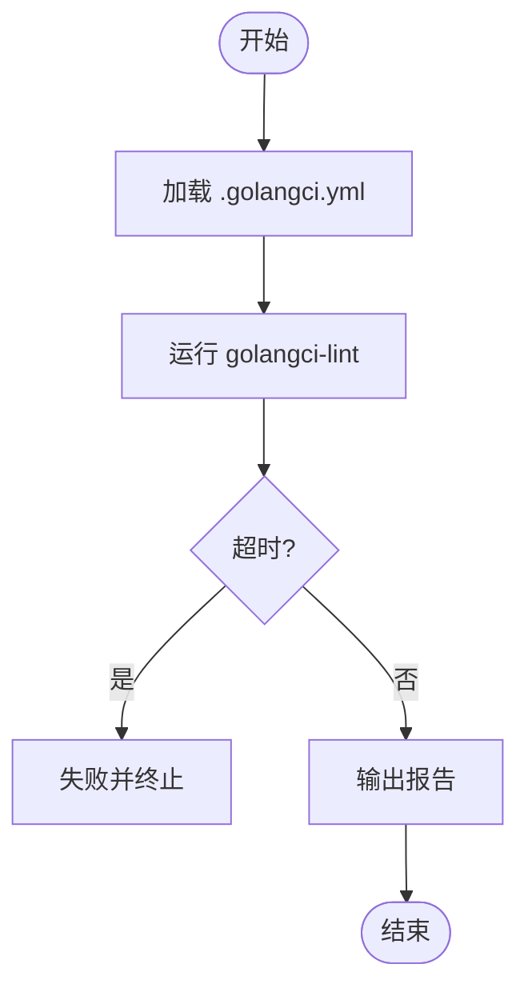
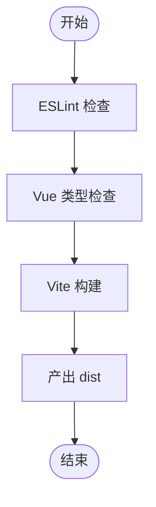
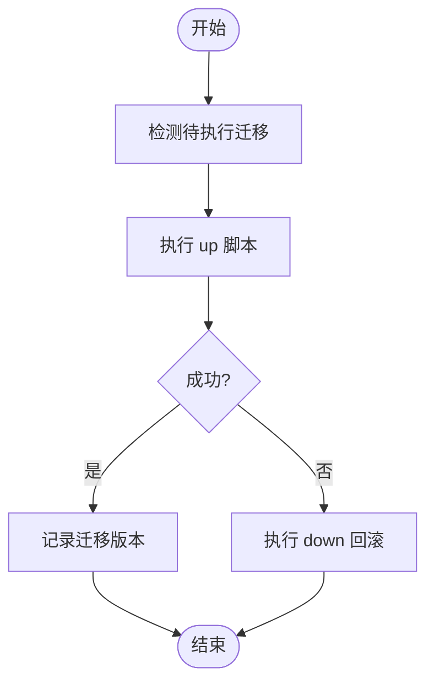
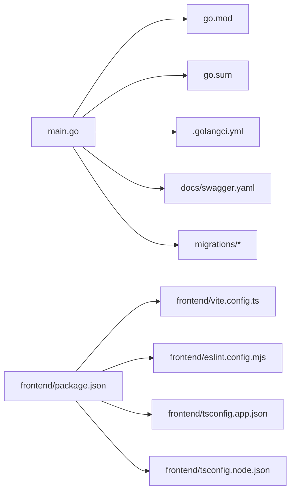
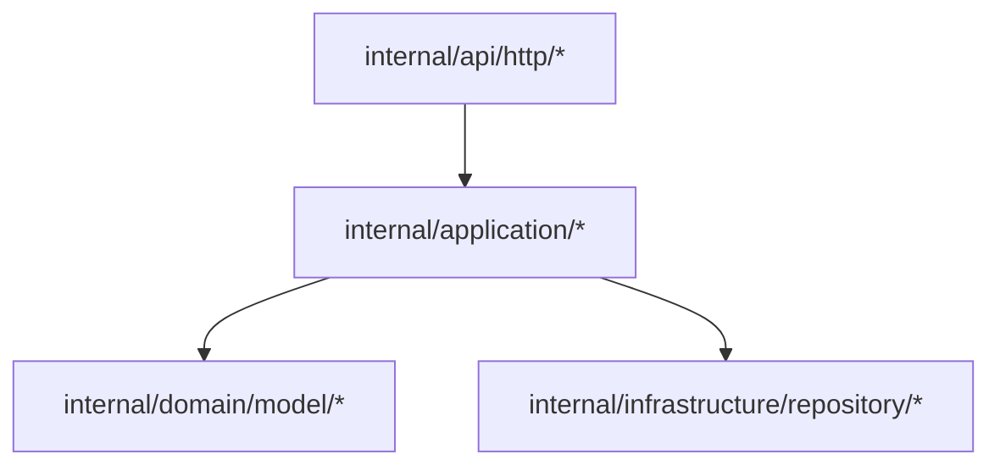

# 持续集成部署

<cite>
**本文引用的文件**
- [.github/copilot-instructions.md](file://.github/copilot-instructions.md)
- [justfile](file://justfile)
- [.golangci.yml](file://.golangci.yml)
- [go.mod](file://go.mod)
- [go.sum](file://go.sum)
- [main.go](file://main.go)
- [frontend/package.json](file://frontend/package.json)
- [frontend/vite.config.ts](file://frontend/vite.config.ts)
- [frontend/tsconfig.app.json](file://frontend/tsconfig.app.json)
- [frontend/tsconfig.node.json](file://frontend/tsconfig.node.json)
- [frontend/eslint.config.mjs](file://frontend/eslint.config.mjs)
- [frontend/src/main.ts](file://frontend/src/main.ts)
- [frontend/src/router/index.ts](file://frontend/src/router/index.ts)
- [frontend/src/stores/auth.ts](file://frontend/src/stores/auth.ts)
- [frontend/src/env.d.ts](file://frontend/src/env.d.ts)
- [frontend/dist/index.html](file://frontend/dist/index.html)
- [frontend/dist/assets/index-XXXXXXX.js](file://frontend/dist/assets/index-XXXXXXX.js)
- [docs/swagger.yaml](file://docs/swagger.yaml)
- [docs/swagger.json](file://docs/swagger.json)
- [migrations/20260306101216_unit-table.up.sql](file://migrations/20260306101216_unit-table.up.sql)
- [migrations/20260306101216_unit-table.down.sql](file://migrations/20260306101216_unit-table.down.sql)
- [internal/api/http/auth.go](file://internal/api/http/auth.go)
- [internal/api/http/user.go](file://internal/api/http/user.go)
- [internal/api/http/team.go](file://internal/api/http/team.go)
- [internal/api/http/workset.go](file://internal/api/http/workset.go)
- [internal/api/http/comic.go](file://internal/api/http/comic.go)
- [internal/api/http/chapter.go](file://internal/api/http/chapter.go)
- [internal/api/http/page.go](file://internal/api/http/page.go)
- [internal/api/http/assignment.go](file://internal/api/http/assignment.go)
- [internal/api/http/unit.go](file://internal/api/http/unit.go)
- [internal/api/http/http.go](file://internal/api/http/http.go)
- [internal/application/user.go](file://internal/application/user.go)
- [internal/application/team.go](file://internal/application/team.go)
- [internal/application/workset.go](file://internal/application/workset.go)
- [internal/application/comic.go](file://internal/application/comic.go)
- [internal/application/chapter.go](file://internal/application/chapter.go)
- [internal/application/page.go](file://internal/application/page.go)
- [internal/application/assignment.go](file://internal/application/assignment.go)
- [internal/application/unit.go](file://internal/application/unit.go)
- [internal/domain/model/user.go](file://internal/domain/model/user.go)
- [internal/domain/model/team.go](file://internal/domain/model/team.go)
- [internal/domain/model/workset.go](file://internal/domain/model/workset.go)
- [internal/domain/model/comic.go](file://internal/domain/model/comic.go)
- [internal/domain/model/chapter.go](file://internal/domain/model/chapter.go)
- [internal/domain/model/page.go](file://internal/domain/model/page.go)
- [internal/domain/model/assignment.go](file://internal/domain/model/assignment.go)
- [internal/domain/model/unit.go](file://internal/domain/model/unit.go)
- [internal/infrastructure/repository/user.go](file://internal/infrastructure/repository/user.go)
- [internal/infrastructure/repository/team.go](file://internal/infrastructure/repository/team.go)
- [internal/infrastructure/repository/workset.go](file://internal/infrastructure/repository/workset.go)
- [internal/infrastructure/repository/comic.go](file://internal/infrastructure/repository/comic.go)
- [internal/infrastructure/repository/chapter.go](file://internal/infrastructure/repository/chapter.go)
- [internal/infrastructure/repository/page.go](file://internal/infrastructure/repository/page.go)
- [internal/infrastructure/repository/assignment.go](file://internal/infrastructure/repository/assignment.go)
- [internal/infrastructure/repository/unit.go](file://internal/infrastructure/repository/unit.go)
- [internal/config/config.go](file://internal/config/config.go)
- [internal/log/log.go](file://internal/log/log.go)
- [internal/state/app_state.go](file://internal/state/app_state.go)
- [legacy/migrations/allmg.sql](file://legacy/migrations/allmg.sql)
- [script/seed/README.md](file://script/seed/README.md)
- [script/seed/config.ts](file://script/seed/config.ts)
- [script/seed/http.ts](file://script/seed/http.ts)
- [script/seed/seedBase.ts](file://script/seed/seedBase.ts)
- [script/seed/bun.lock](file://script/seed/bun.lock)
- [script/seed/package.json](file://script/seed/package.json)
- [script/seed/api/auth.ts](file://script/seed/api/auth.ts)
- [script/seed/api/member.ts](file://script/seed/api/member.ts)
- [script/seed/api/team.ts](file://script/seed/api/team.ts)
- [script/seed/api/invitation.ts](file://script/seed/api/invitation.ts)
- [script/seed/util/roles.ts](file://script/seed/util/roles.ts)
- [script/seed/util/qq.ts](file://script/seed/util/qq.ts)
</cite>

## 目录
1. [简介](#简介)
2. [项目结构](#项目结构)
3. [核心组件](#核心组件)
4. [架构总览](#架构总览)
5. [详细组件分析](#详细组件分析)
6. [依赖分析](#依赖分析)
7. [性能考虑](#性能考虑)
8. [故障排查指南](#故障排查指南)
9. [结论](#结论)
10. [附录](#附录)

## 简介
本文件面向 poprako-web-ms 项目的持续集成与部署（CI/CD），目标是帮助开发团队以安全、高效的方式交付代码变更。内容覆盖：
- GitHub Actions 工作流配置建议与最佳实践
- 自动化测试与质量检查（代码质量、单元测试、集成测试、端到端测试）的执行顺序与并行策略
- 构建优化、缓存策略与并行执行配置
- 多环境部署策略、蓝绿部署与金丝雀发布方案
- 回滚机制、变更管理与发布日志记录
- 基于仓库现有工具链（Just、golangci-lint、Vite、Swagger）的落地建议

## 项目结构
该项目采用前后端分离架构：
- 后端：Go 语言实现，基于 Iris 框架，模块化分层（config、log、state、api/http、application、domain、infrastructure）
- 前端：Vue 3 + TypeScript + Vite，构建产物输出至 dist 目录
- 数据库迁移：migrations 目录下按时间戳命名的 up/down 脚本
- 测试与质量：golangci-lint 配置、前端 ESLint/Vue 类型检查、Swagger 文档生成
- 辅助脚本：Justfile 提供常用任务，script/seed 提供种子数据初始化

**图表来源**
- [frontend/package.json:1-36](file://frontend/package.json#L1-L36)
- [frontend/vite.config.ts](file://frontend/vite.config.ts)
- [frontend/tsconfig.app.json](file://frontend/tsconfig.app.json)
- [frontend/tsconfig.node.json](file://frontend/tsconfig.node.json)
- [frontend/eslint.config.mjs](file://frontend/eslint.config.mjs)
- [frontend/dist/index.html](file://frontend/dist/index.html)
- [main.go:1-146](file://main.go#L1-L146)
- [go.mod:1-114](file://go.mod#L1-L114)
- [go.sum:298-355](file://go.sum#L298-L355)
- [.golangci.yml:1-31](file://.golangci.yml#L1-L31)
- [docs/swagger.yaml](file://docs/swagger.yaml)
- [docs/swagger.json](file://docs/swagger.json)
- [migrations/20260306101216_unit-table.up.sql:1-1](file://migrations/20260306101216_unit-table.up.sql#L1-L1)
- [migrations/20260306101216_unit-table.down.sql:1-1](file://migrations/20260306101216_unit-table.down.sql#L1-L1)

**章节来源**
- [frontend/package.json:1-36](file://frontend/package.json#L1-L36)
- [frontend/vite.config.ts](file://frontend/vite.config.ts)
- [frontend/tsconfig.app.json](file://frontend/tsconfig.app.json)
- [frontend/tsconfig.node.json](file://frontend/tsconfig.node.json)
- [frontend/eslint.config.mjs](file://frontend/eslint.config.mjs)
- [frontend/dist/index.html](file://frontend/dist/index.html)
- [main.go:1-146](file://main.go#L1-L146)
- [go.mod:1-114](file://go.mod#L1-L114)
- [go.sum:298-355](file://go.sum#L298-L355)
- [.golangci.yml:1-31](file://.golangci.yml#L1-L31)
- [docs/swagger.yaml](file://docs/swagger.yaml)
- [docs/swagger.json](file://docs/swagger.json)
- [migrations/20260306101216_unit-table.up.sql:1-1](file://migrations/20260306101216_unit-table.up.sql#L1-L1)
- [migrations/20260306101216_unit-table.down.sql:1-1](file://migrations/20260306101216_unit-table.down.sql#L1-L1)

## 核心组件
- 后端入口与配置
  - 应用入口负责加载 .env、初始化日志、数据库执行器与各仓储实例，并组装应用状态后启动 HTTP 服务器
  - 关键路径参考：[main.go:25-145](file://main.go#L25-L145)
- 代码质量与静态检查
  - golangci-lint 配置启用 vet、staticcheck、gosec、misspell 等规则，支持测试扫描
  - 关键路径参考：[.golangci.yml:1-31](file://.golangci.yml#L1-L31)
- 前端构建与类型检查
  - 使用 Vite 构建，ESLint 与 Vue 类型检查作为前置步骤
  - 关键路径参考：[frontend/package.json:6-12](file://frontend/package.json#L6-L12)
- Swagger 文档
  - 通过 swag 生成接口文档，便于 API 文档一致性与测试验证
  - 关键路径参考：[docs/swagger.yaml](file://docs/swagger.yaml)，[docs/swagger.json](file://docs/swagger.json)
- 数据库迁移
  - 迁移脚本按时间戳命名，提供 up/down，确保数据库演进可追踪
  - 关键路径参考：[migrations/20260306101216_unit-table.up.sql:1-1](file://migrations/20260306101216_unit-table.up.sql#L1-L1)，[migrations/20260306101216_unit-table.down.sql:1-1](file://migrations/20260306101216_unit-table.down.sql#L1-L1)

**章节来源**
- [main.go:25-145](file://main.go#L25-L145)
- [.golangci.yml:1-31](file://.golangci.yml#L1-L31)
- [frontend/package.json:6-12](file://frontend/package.json#L6-L12)
- [docs/swagger.yaml](file://docs/swagger.yaml)
- [docs/swagger.json](file://docs/swagger.json)
- [migrations/20260306101216_unit-table.up.sql:1-1](file://migrations/20260306101216_unit-table.up.sql#L1-L1)
- [migrations/20260306101216_unit-table.down.sql:1-1](file://migrations/20260306101216_unit-table.down.sql#L1-L1)

## 架构总览
下图展示 CI/CD 关键节点：代码提交触发流水线 → 质量检查与测试 → 构建与打包 → 部署与发布 → 回滚与日志。

[此图为概念性架构示意，无需图表来源]

## 详细组件分析

### GitHub Actions 工作流配置建议
- 触发策略
  - 推送主分支与拉取请求分别触发不同阶段的任务，避免在 PR 中执行生产级部署
- 并行与缓存
  - 使用矩阵构建（多平台/多架构）与缓存策略（Go mod cache、pnpm 缓存）提升速度
- 安全与密钥
  - 使用 GitHub Secrets 存储敏感信息，避免硬编码
- 步骤建议
  - 代码检出 → 环境准备 → 依赖安装 → 质量检查 → 测试 → 构建 → 打包 → 部署 → 回滚与日志

[本节为通用配置建议，未直接分析具体文件，故不列出章节来源]

### 代码质量检查（golangci-lint）
- 启用规则集：govet、staticcheck、errcheck、ineffassign、unused、gosec、gocritic、misspell
- 支持测试文件扫描，超时控制为 5 分钟
- 建议在 CI 中固定版本，确保一致性

**图表来源**
- [.golangci.yml:1-31](file://.golangci.yml#L1-L31)

**章节来源**
- [.golangci.yml:1-31](file://.golangci.yml#L1-L31)

### 前端质量与构建
- ESLint 与 Vue 类型检查作为构建前置，保证前端代码质量
- Vite 构建产物输出至 dist，后续可直接部署静态站点或嵌入后端

**图表来源**
- [frontend/package.json:6-12](file://frontend/package.json#L6-L12)

**章节来源**
- [frontend/package.json:6-12](file://frontend/package.json#L6-L12)

### 数据库迁移与回滚
- 迁移脚本按 up/down 组织，支持增量演进与回滚
- 建议在 CI 中执行迁移前先备份，失败时自动回滚
- Justfile 提供迁移命令，便于本地与 CI 一致化

**图表来源**
- [migrations/20260306101216_unit-table.up.sql:1-1](file://migrations/20260306101216_unit-table.up.sql#L1-L1)
- [migrations/20260306101216_unit-table.down.sql:1-1](file://migrations/20260306101216_unit-table.down.sql#L1-L1)
- [justfile:24-38](file://justfile#L24-L38)

**章节来源**
- [migrations/20260306101216_unit-table.up.sql:1-1](file://migrations/20260306101216_unit-table.up.sql#L1-L1)
- [migrations/20260306101216_unit-table.down.sql:1-1](file://migrations/20260306101216_unit-table.down.sql#L1-L1)
- [justfile:24-38](file://justfile#L24-L38)

### 多环境部署策略
- 开发/预发/生产三环境隔离，镜像标签按环境区分
- 配置文件与密钥通过环境变量注入，避免硬编码
- 前端静态资源可托管于 CDN 或与后端容器一起部署

[本节为通用策略说明，未直接分析具体文件，故不列出章节来源]

### 蓝绿部署与金丝雀发布
- 蓝绿：两套完全相同的环境，切换流量实现无缝发布
- 金丝雀：逐步放量（如 10%→50%→100%），结合健康检查与指标回滚
- 建议配合外部负载均衡与健康探针

[本节为通用策略说明，未直接分析具体文件，故不列出章节来源]

### 回滚机制与发布日志
- 版本化发布：镜像标签与 Git Commit 关联
- 回滚：一键回退至上一稳定版本；失败时自动回滚
- 发布日志：记录版本、变更摘要、部署时间、负责人与影响范围

[本节为通用策略说明，未直接分析具体文件，故不列出章节来源]

## 依赖分析
后端依赖通过 go.mod 管理，包含 Web 框架、ORM、Swagger、加密与配置等模块；前端依赖通过 package.json 管理，构建工具链清晰。

**图表来源**
- [main.go:1-146](file://main.go#L1-L146)
- [go.mod:1-114](file://go.mod#L1-L114)
- [go.sum:298-355](file://go.sum#L298-L355)
- [.golangci.yml:1-31](file://.golangci.yml#L1-L31)
- [docs/swagger.yaml](file://docs/swagger.yaml)
- [migrations/20260306101216_unit-table.up.sql:1-1](file://migrations/20260306101216_unit-table.up.sql#L1-L1)
- [frontend/package.json:1-36](file://frontend/package.json#L1-L36)
- [frontend/vite.config.ts](file://frontend/vite.config.ts)
- [frontend/eslint.config.mjs](file://frontend/eslint.config.mjs)
- [frontend/tsconfig.app.json](file://frontend/tsconfig.app.json)
- [frontend/tsconfig.node.json](file://frontend/tsconfig.node.json)

**章节来源**
- [go.mod:1-114](file://go.mod#L1-L114)
- [go.sum:298-355](file://go.sum#L298-L355)
- [frontend/package.json:1-36](file://frontend/package.json#L1-L36)

## 性能考虑
- 构建缓存
  - Go：缓存 GOPATH/pkg 与 .cache/go-build
  - Node：缓存 pnpm-store 与 node_modules（仅在锁文件变化时重建）
- 并行执行
  - 质量检查与测试可并行，构建与部署串行
  - 使用矩阵对多平台/多架构并行构建
- 资源优化
  - 前端构建开启压缩与 Tree-shaking
  - 后端二进制最小化依赖，剥离调试符号

[本节为通用性能建议，未直接分析具体文件，故不列出章节来源]

## 故障排查指南
- 本地与 CI 差异
  - 使用 Justfile 统一步骤，确保本地与 CI 行为一致
  - 参考：[justfile:1-39](file://justfile#L1-L39)
- 依赖问题
  - Go：清理缓存后重新下载依赖
  - Node：删除 node_modules 与锁文件后重装
- 构建失败
  - 检查 ESLint/Vue 类型检查输出
  - 检查 golangci-lint 报告与超时设置
- 部署失败
  - 检查环境变量与配置文件
  - 查看迁移执行结果与回滚策略

**章节来源**
- [justfile:1-39](file://justfile#L1-L39)
- [.golangci.yml:1-31](file://.golangci.yml#L1-L31)
- [frontend/package.json:6-12](file://frontend/package.json#L6-L12)

## 结论
通过明确的 CI/CD 流程、质量门禁与多环境策略，poprako-web-ms 可实现安全、高效的交付。建议以 GitHub Actions 为核心编排，结合 Justfile 与前端构建工具，形成统一的自动化流水线，并配套蓝绿/金丝雀发布与完善的回滚与日志体系。

[本节为总结性内容，未直接分析具体文件，故不列出章节来源]

## 附录

### API 层与应用层关系（示意）

**图表来源**
- [internal/api/http/http.go](file://internal/api/http/http.go)
- [internal/application/user.go](file://internal/application/user.go)
- [internal/domain/model/user.go](file://internal/domain/model/user.go)
- [internal/infrastructure/repository/user.go](file://internal/infrastructure/repository/user.go)

**章节来源**
- [internal/api/http/http.go](file://internal/api/http/http.go)
- [internal/application/user.go](file://internal/application/user.go)
- [internal/domain/model/user.go](file://internal/domain/model/user.go)
- [internal/infrastructure/repository/user.go](file://internal/infrastructure/repository/user.go)

### Swagger 与 API 文档
- 通过 swag 生成接口文档，便于 API 文档一致性与测试验证
- 建议在 CI 中生成并上传文档制品

**章节来源**
- [docs/swagger.yaml](file://docs/swagger.yaml)
- [docs/swagger.json](file://docs/swagger.json)

### 种子数据与初始化
- script/seed 提供种子数据初始化脚本，便于本地与测试环境快速就绪
- 建议在 CI 的预发环境执行种子初始化

**章节来源**
- [script/seed/README.md](file://script/seed/README.md)
- [script/seed/seedBase.ts](file://script/seed/seedBase.ts)
- [script/seed/api/auth.ts](file://script/seed/api/auth.ts)
- [script/seed/api/member.ts](file://script/seed/api/member.ts)
- [script/seed/api/team.ts](file://script/seed/api/team.ts)
- [script/seed/api/invitation.ts](file://script/seed/api/invitation.ts)
- [script/seed/util/roles.ts](file://script/seed/util/roles.ts)
- [script/seed/util/qq.ts](file://script/seed/util/qq.ts)