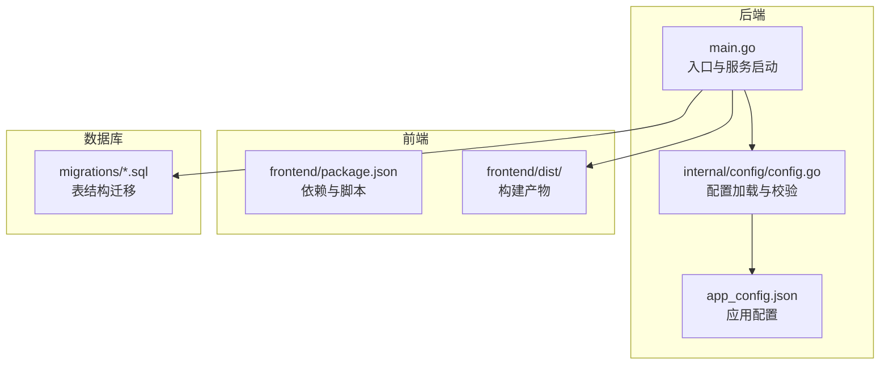
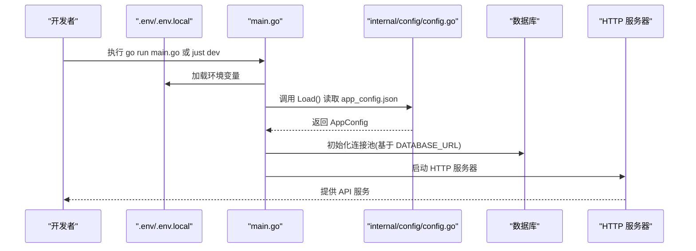
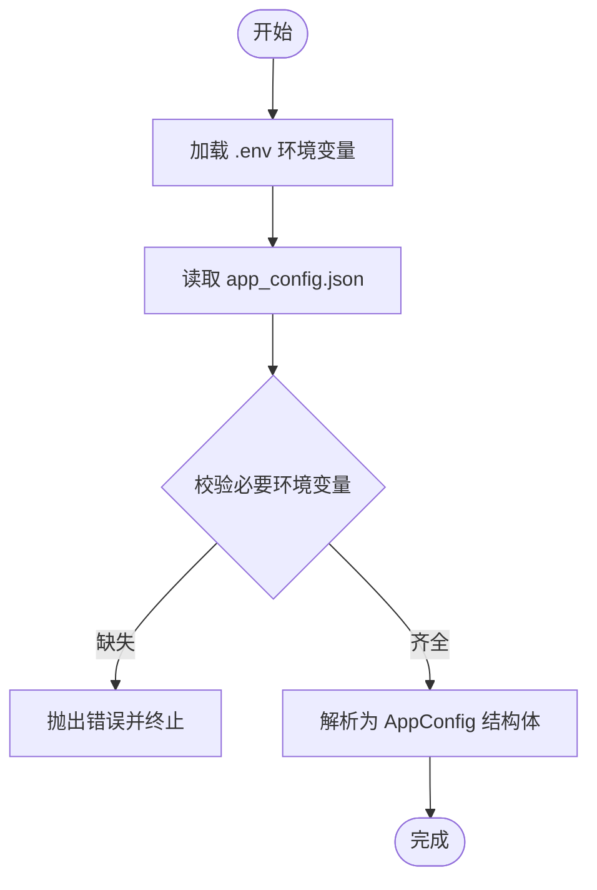
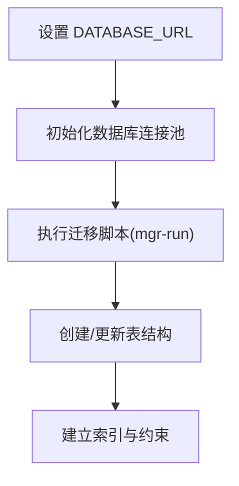
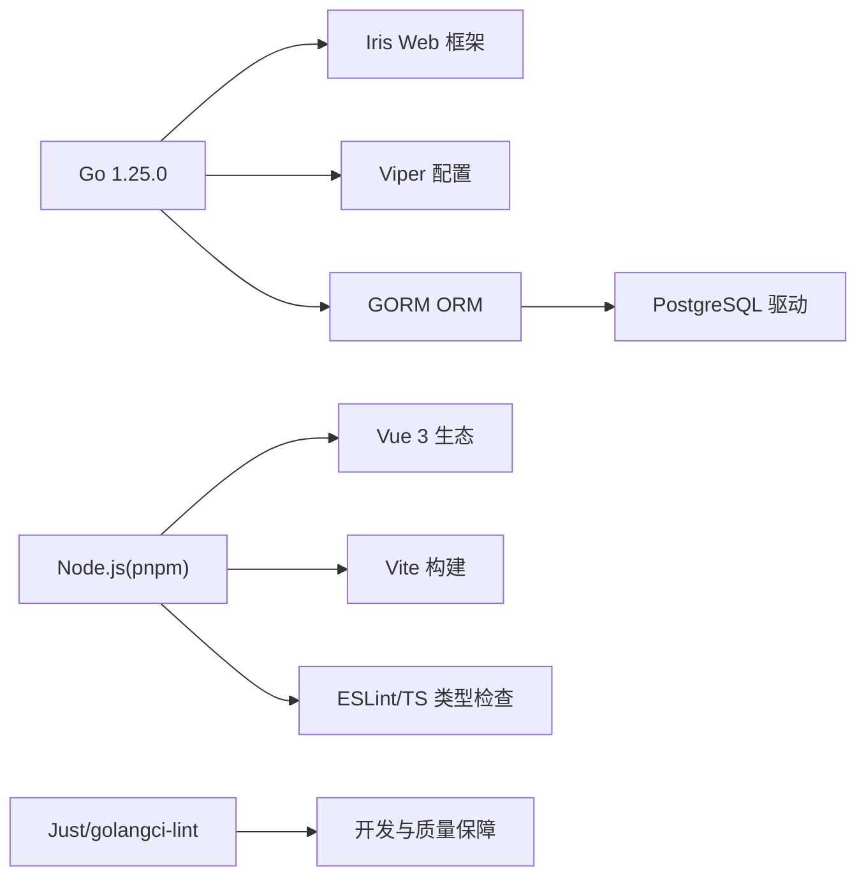

# 环境配置

<cite>
**本文引用的文件**
- [app_config.json](file://app_config.json)
- [go.mod](file://go.mod)
- [frontend/package.json](file://frontend/package.json)
- [justfile](file://justfile)
- [main.go](file://main.go)
- [internal/config/config.go](file://internal/config/config.go)
- [.golangci.yml](file://.golangci.yml)
- [script/seed/README.md](file://script/seed/README.md)
- [migrations/20260306101211_workset-table.up.sql](file://migrations/20260306101211_workset-table.up.sql)
</cite>

## 目录
1. [简介](#简介)
2. [项目结构](#项目结构)
3. [核心组件](#核心组件)
4. [架构总览](#架构总览)
5. [详细组件分析](#详细组件分析)
6. [依赖关系分析](#依赖关系分析)
7. [性能考虑](#性能考虑)
8. [故障排查指南](#故障排查指南)
9. [结论](#结论)
10. [附录](#附录)

## 简介
本文件面向开发者，提供 poprako-web-ms 项目的完整环境配置指南，覆盖开发、测试与生产三类环境。内容包括：
- Go 语言版本与依赖管理
- Node.js 与前端构建工具链
- PostgreSQL 数据库配置与迁移
- 应用配置文件 app_config.json 的参数说明与调优建议
- 环境变量设置与初始化步骤
- 不同操作系统下的安装与运行指引
- 常见问题与排障方法

## 项目结构
该项目采用后端 Go 与前端 Vue 的双栈结构，配合 Justfile 提供常用任务编排，数据库迁移脚本位于 migrations 目录。

图表来源
- [main.go:25-145](file://main.go#L25-L145)
- [internal/config/config.go:11-59](file://internal/config/config.go#L11-L59)
- [app_config.json:1-11](file://app_config.json#L1-L11)
- [frontend/package.json:1-36](file://frontend/package.json#L1-L36)

章节来源
- [main.go:12-23](file://main.go#L12-L23)
- [internal/config/config.go:30-59](file://internal/config/config.go#L30-L59)
- [frontend/package.json:6-12](file://frontend/package.json#L6-L12)

## 核心组件
- Go 运行时与模块
  - 使用 Go 1.25.0（由 go.mod 指定）
  - 通过 Viper 读取 JSON 配置文件 app_config.json
  - 通过 godotenv 加载 .env 环境变量
- 前端构建与依赖
  - 使用 pnpm 管理依赖，Vite 作为构建工具
  - 开发脚本 dev、构建脚本 build、预览脚本 preview
- 数据库与迁移
  - 使用 GORM + PostgreSQL 驱动
  - 迁移脚本位于 migrations 目录，按时间戳命名
- 工具链与任务编排
  - 使用 Justfile 提供 swag、fmt、check、build、mgr-*、seed-base 等任务
  - 使用 golangci-lint 进行静态检查

章节来源
- [go.mod:3](file://go.mod#L3)
- [frontend/package.json:13-34](file://frontend/package.json#L13-L34)
- [justfile:6-38](file://justfile#L6-L38)
- [.golangci.yml:7-18](file://.golangci.yml#L7-L18)

## 架构总览
后端启动流程：加载 .env → 读取 app_config.json → 初始化日志 → 创建数据库连接池 → 注入各应用层 → 启动 HTTP 服务器。

图表来源
- [main.go:25-145](file://main.go#L25-L145)
- [internal/config/config.go:11-59](file://internal/config/config.go#L11-L59)

## 详细组件分析

### 应用配置文件 app_config.json
- server_address
  - 作用：HTTP 服务器监听地址与端口
  - 示例路径：[app_config.json:2](file://app_config.json#L2)
- auth.expiration_hours
  - 作用：JWT 令牌有效期（小时）
  - 示例路径：[app_config.json:4](file://app_config.json#L4)
- database.min_idle_connections / max_open_connections
  - 作用：数据库连接池最小空闲与最大打开连接数
  - 示例路径：[app_config.json:7-8](file://app_config.json#L7-L8)

调优建议
- min_idle_connections：根据并发请求量与数据库性能调整，避免频繁创建/销毁连接
- max_open_connections：不超过数据库最大连接限制，防止连接过多导致阻塞
- expiration_hours：结合业务安全策略与用户体验权衡，建议开发环境可适当缩短

章节来源
- [app_config.json:1-11](file://app_config.json#L1-L11)

### 配置加载与环境变量
- 环境变量要求
  - APP_ENVIRONMENT：必须设置，区分 development/production 等环境
  - JWT_SECRET_KEY：必须设置，用于签发与验证 JWT
  - DATABASE_URL：必须设置，PostgreSQL 连接字符串
- 配置加载流程
  - 读取 app_config.json（JSON）
  - 读取环境变量并校验
  - 解析为结构体供后续模块使用

图表来源
- [main.go:25-33](file://main.go#L25-L33)
- [internal/config/config.go:11-59](file://internal/config/config.go#L11-L59)

章节来源
- [internal/config/config.go:44-47](file://internal/config/config.go#L44-L47)
- [internal/config/config.go:74-83](file://internal/config/config.go#L74-L83)
- [internal/config/config.go:91-99](file://internal/config/config.go#L91-L99)

### 数据库与迁移
- 连接配置
  - DATABASE_URL 通过环境变量传入，驱动为 gorm.io/driver/postgres
  - 连接池参数来自 app_config.json 的 database 段
- 迁移脚本
  - 按时间戳命名，包含 up/down 双向脚本
  - 示例：工作集表迁移脚本展示了索引与约束设计

图表来源
- [internal/config/config.go:91-99](file://internal/config/config.go#L91-L99)
- [migrations/20260306101211_workset-table.up.sql:1-19](file://migrations/20260306101211_workset-table.up.sql#L1-L19)

章节来源
- [go.mod:16](file://go.mod#L16)
- [migrations/20260306101211_workset-table.up.sql:1-19](file://migrations/20260306101211_workset-table.up.sql#L1-L19)

### 前端依赖与构建
- 依赖管理
  - pnpm 作为包管理器，Vite 作为构建工具
  - 开发脚本 dev、构建脚本 build、预览脚本 preview
- 构建产物
  - 输出到 frontend/dist，供后端静态资源托管或独立部署

章节来源
- [frontend/package.json:6-12](file://frontend/package.json#L6-L12)
- [frontend/package.json:13-34](file://frontend/package.json#L13-L34)

### 工具链与任务编排
- Justfile 提供常用任务
  - dev：格式化与生成 Swagger 后启动服务
  - build：交叉编译 Linux/amd64 二进制
  - mgr-*：数据库迁移相关命令
  - seed-base：使用 Bun 运行种子脚本
- Lint 与格式化
  - golangci-lint 配置启用 vet、staticcheck、gosec 等规则

章节来源
- [justfile:6-38](file://justfile#L6-L38)
- [.golangci.yml:7-18](file://.golangci.yml#L7-L18)

## 依赖关系分析
- 后端依赖
  - Iris Web 框架、Viper 配置、GORM ORM、PostgreSQL 驱动、JWT 签发等
- 前端依赖
  - Vue 3、Vue Router、Pinia、Ant Design Vue、Axios 等
- 工具链
  - Vite、ESLint、TypeScript、pnpm、golangci-lint、Just

图表来源
- [go.mod:5-18](file://go.mod#L5-L18)
- [frontend/package.json:13-34](file://frontend/package.json#L13-L34)
- [justfile:6-38](file://justfile#L6-L38)
- [.golangci.yml:7-18](file://.golangci.yml#L7-L18)

章节来源
- [go.mod:3](file://go.mod#L3)
- [frontend/package.json:13-34](file://frontend/package.json#L13-L34)

## 性能考虑
- 数据库连接池
  - 合理设置 min_idle_connections 与 max_open_connections，避免连接不足或过度占用
  - 在高并发场景下，优先保证连接池上限与超时参数合理
- JWT 有效期
  - expiration_hours 过短影响用户体验，过长增加泄露风险；建议结合业务场景折中
- 前端构建
  - 使用 pnpm 缓存与增量构建，减少重复安装与编译时间
- 代码质量
  - 启用 golangci-lint 规则，持续优化静态检查覆盖率

## 故障排查指南
- 环境变量缺失
  - 症状：启动时报错提示未设置 APP_ENVIRONMENT、JWT_SECRET_KEY 或 DATABASE_URL
  - 处理：在 .env 中补齐对应键值，并确保 main.go 能正确加载
  - 参考路径：[internal/config/config.go:44-47](file://internal/config/config.go#L44-L47)、[internal/config/config.go:74-83](file://internal/config/config.go#L74-L83)、[internal/config/config.go:91-99](file://internal/config/config.go#L91-L99)
- 配置文件读取失败
  - 症状：加载 app_config.json 失败
  - 处理：确认文件存在且 JSON 格式正确，字段名与类型匹配
  - 参考路径：[internal/config/config.go:30-42](file://internal/config/config.go#L30-L42)
- 数据库连接异常
  - 症状：创建数据库执行器失败或迁移报错
  - 处理：检查 DATABASE_URL 格式与可达性；确认数据库已启动并允许连接
  - 参考路径：[main.go:37-42](file://main.go#L37-L42)、[internal/config/config.go:91-99](file://internal/config/config.go#L91-L99)
- 前端依赖安装失败
  - 症状：pnpm 安装或构建报错
  - 处理：清理 pnpm 缓存与 node_modules，重新安装；确保 Node.js 版本满足 package.json 要求
  - 参考路径：[frontend/package.json:13-34](file://frontend/package.json#L13-L34)
- 种子脚本运行失败
  - 症状：Bun 报错或脚本无法执行
  - 处理：参考 seed 仓库 README 安装 Bun 并运行脚本
  - 参考路径：[script/seed/README.md:3-16](file://script/seed/README.md#L3-L16)

章节来源
- [internal/config/config.go:30-42](file://internal/config/config.go#L30-L42)
- [internal/config/config.go:44-47](file://internal/config/config.go#L44-L47)
- [internal/config/config.go:74-83](file://internal/config/config.go#L74-L83)
- [internal/config/config.go:91-99](file://internal/config/config.go#L91-L99)
- [main.go:37-42](file://main.go#L37-L42)
- [frontend/package.json:13-34](file://frontend/package.json#L13-L34)
- [script/seed/README.md:3-16](file://script/seed/README.md#L3-L16)

## 结论
通过明确的环境变量、配置文件与工具链规范，开发者可在 Windows/Linux/macOS 上快速搭建 poprako-web-ms 的开发与测试环境。建议在本地开发时使用较小的连接池与较短的 JWT 有效期，在测试与生产环境中根据负载与安全需求逐步调优。

## 附录

### 环境变量清单
- APP_ENVIRONMENT：应用环境标识（如 development、production）
- JWT_SECRET_KEY：JWT 密钥
- DATABASE_URL：PostgreSQL 连接字符串

章节来源
- [internal/config/config.go:44-47](file://internal/config/config.go#L44-L47)
- [internal/config/config.go:74-83](file://internal/config/config.go#L74-L83)
- [internal/config/config.go:91-99](file://internal/config/config.go#L91-L99)

### 依赖安装与初始化步骤
- 后端
  - 安装 Go 1.25.0
  - 安装 golangci-lint（可选）
  - 安装 Just（可选）
- 前端
  - 安装 pnpm（随 Node.js）
  - 安装依赖：pnpm install
- 数据库
  - 安装并启动 PostgreSQL
  - 设置 DATABASE_URL
  - 执行迁移：just mgr-run
- 初始化
  - 在根目录创建 .env，填入上述环境变量
  - 运行 just dev 启动后端服务
  - 如需前端，进入 frontend 目录执行 pnpm dev

章节来源
- [go.mod:3](file://go.mod#L3)
- [frontend/package.json:13-34](file://frontend/package.json#L13-L34)
- [justfile:27-28](file://justfile#L27-L28)
- [main.go:25-28](file://main.go#L25-L28)