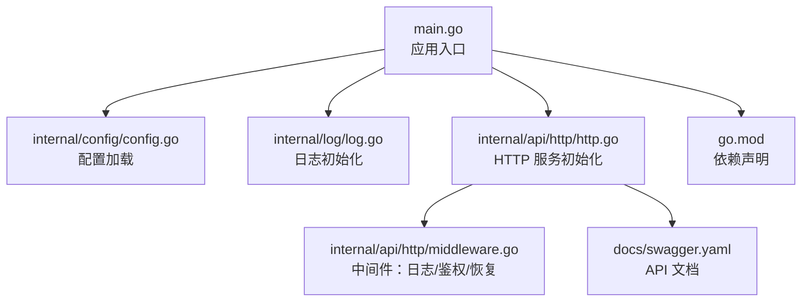
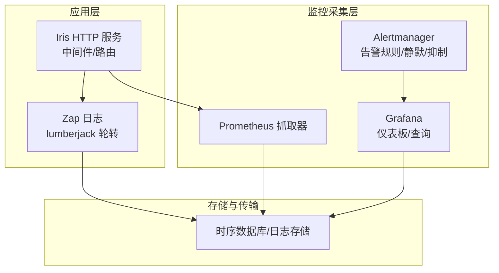
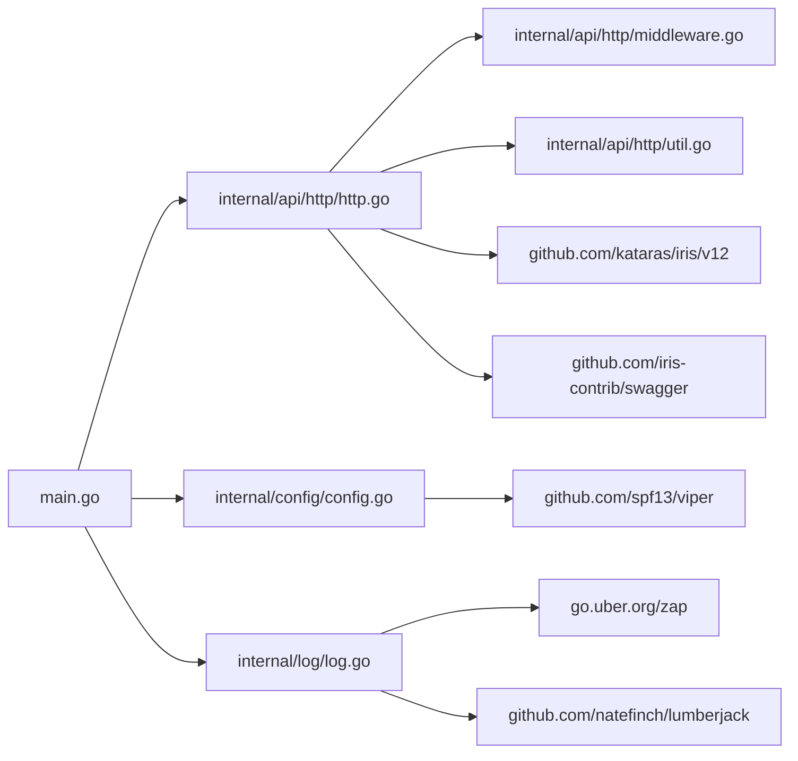

# 监控告警

<cite>
**本文引用的文件**   
- [main.go](file://main.go)
- [config.go](file://internal/config/config.go)
- [log.go](file://internal/log/log.go)
- [http.go](file://internal/api/http/http.go)
- [middleware.go](file://internal/api/http/middleware.go)
- [util.go](file://internal/api/http/util.go)
- [trace_scope.go](file://internal/util/trace_scope.go)
- [swagger.yaml](file://docs/swagger.yaml)
- [go.mod](file://go.mod)
- [.golangci.yml](file://.golangci.yml)
</cite>

## 目录
1. [简介](#简介)
2. [项目结构](#项目结构)
3. [核心组件](#核心组件)
4. [架构总览](#架构总览)
5. [组件详解](#组件详解)
6. [依赖关系分析](#依赖关系分析)
7. [性能考量](#性能考量)
8. [故障排查指南](#故障排查指南)
9. [结论](#结论)
10. [附录](#附录)

## 简介
本文件为 poprako-web-ms 项目的监控与告警方案文档，目标是帮助运维团队建立完善的可观测性体系，覆盖应用监控指标、日志采集与结构化、性能监控、告警规则与通知渠道，并提供关键业务指标（错误率、响应时间）的追踪与可视化。当前代码库尚未内置 Prometheus/Grafana/Alertmanager 等监控组件，因此本方案以“建议与落地指引”的形式给出，便于在现有 Iris HTTP 服务基础上扩展。

## 项目结构
项目采用 Go 语言与 Iris 框架，核心入口在主程序，配置通过 Viper 加载，日志使用 Zap 并结合 lumberjack 进行轮转。HTTP 层通过中间件实现请求追踪与恢复，Swagger 文档用于 API 描述。

图表来源
- [main.go:25-145](file://main.go#L25-L145)
- [config.go:11-59](file://internal/config/config.go#L11-L59)
- [log.go:13-30](file://internal/log/log.go#L13-L30)
- [http.go:16-24](file://internal/api/http/http.go#L16-L24)
- [middleware.go:15-45](file://internal/api/http/middleware.go#L15-L45)
- [swagger.yaml:1-20](file://docs/swagger.yaml#L1-L20)
- [go.mod:1-114](file://go.mod#L1-L114)

章节来源
- [main.go:25-145](file://main.go#L25-L145)
- [config.go:11-59](file://internal/config/config.go#L11-L59)
- [log.go:13-30](file://internal/log/log.go#L13-L30)
- [http.go:16-24](file://internal/api/http/http.go#L16-L24)
- [middleware.go:15-45](file://internal/api/http/middleware.go#L15-L45)
- [swagger.yaml:1-20](file://docs/swagger.yaml#L1-L20)
- [go.mod:1-114](file://go.mod#L1-L114)

## 核心组件
- 配置系统：通过 Viper 读取 JSON 配置文件与环境变量，支持开发/生产环境切换。
- 日志系统：Zap 初始化，开发环境输出到控制台并带颜色，生产环境输出 JSON 并轮转至文件。
- HTTP 服务：Iris 默认实例，注册中间件（请求 ID、日志、panic 恢复），按模块划分路由。
- 中间件：日志中间件记录请求耗时与关键上下文；鉴权中间件解析 JWT；统一响应/拒绝处理。
- Swagger：在非生产环境暴露 API 文档。

章节来源
- [config.go:11-59](file://internal/config/config.go#L11-L59)
- [log.go:13-83](file://internal/log/log.go#L13-L83)
- [http.go:16-24](file://internal/api/http/http.go#L16-L24)
- [middleware.go:15-45](file://internal/api/http/middleware.go#L15-L45)
- [util.go:11-39](file://internal/api/http/util.go#L11-L39)

## 架构总览
下图展示监控与告警在系统中的位置与数据流方向：应用日志与指标由外部监控系统采集，告警规则在 Alertmanager 中定义并通过通知渠道下发，Grafana 作为可视化面板承载指标展示与仪表盘。

说明
- 应用层：Iris 服务与 Zap 日志
- 采集层：Prometheus 抓取应用指标，Alertmanager 执行告警策略，Grafana 展示
- 存储层：时序数据库（如 Prometheus 自带 TSDB）与日志存储（如 Loki）

## 组件详解

### 配置与环境
- 配置来源：JSON 文件与环境变量，支持 APP_ENVIRONMENT、JWT_SECRET_KEY、DATABASE_URL 等关键项。
- 环境切换：IsDevelopment()/IsProduction() 控制日志级别与 Swagger 暴露行为。

章节来源
- [config.go:11-59](file://internal/config/config.go#L11-L59)
- [config.go:61-67](file://internal/config/config.go#L61-L67)

### 日志与结构化
- 开发环境：控制台彩色输出，Debug 级别，便于本地调试。
- 生产环境：JSON 输出，Warn 级别及以上，结合 lumberjack 进行文件轮转（大小、备份数、保留天数、压缩）。
- 建议：在日志中加入 trace_id/request_id，便于跨服务追踪。

章节来源
- [log.go:13-83](file://internal/log/log.go#L13-L83)
- [util.go:41-46](file://internal/api/http/util.go#L41-L46)

### HTTP 服务与中间件
- 服务启动：initialize() 注册中间件与路由，StartServer() 监听配置地址。
- 中间件：
  - requestid：生成请求 ID
  - LogMiddleware：记录方法、路径、状态码、远端地址、请求 ID、耗时
  - recover：panic 恢复
- 鉴权中间件：解析 Authorization 头，校验 Bearer Token，提取用户 ID 放入上下文。

章节来源
- [http.go:16-24](file://internal/api/http/http.go#L16-L24)
- [http.go:26-151](file://internal/api/http/http.go#L26-L151)
- [middleware.go:15-45](file://internal/api/http/middleware.go#L15-L45)
- [middleware.go:47-79](file://internal/api/http/middleware.go#L47-L79)
- [util.go:41-58](file://internal/api/http/util.go#L41-L58)

### 分布式追踪（建议）
- 当前代码已通过中间件生成 request_id，并在日志中记录该 ID，便于关联。
- 建议引入 OpenTelemetry SDK，为每个请求生成 trace_id/span_id，将日志字段与追踪 ID 关联，实现端到端链路追踪。

章节来源
- [util.go:41-46](file://internal/api/http/util.go#L41-L46)
- [trace_scope.go:1-30](file://internal/util/trace_scope.go#L1-L30)

### 性能监控指标（建议）
基于现有中间件与日志能力，建议采集以下指标（PromQL 可用）：
- 请求总量：increase(http_requests_total[5m])
- 错误率：sum(rate(http_request_duration_seconds_bucket{le="+Inf", code=~"^(?:5|4)..$"}[5m])) / sum(rate(http_request_duration_seconds_bucket{le="+Inf"}[5m]))
- 响应时间 P50/P90/P99：histogram_quantile(0.99, sum by(le, path, method) (rate(http_request_duration_seconds_bucket[5m])))
- 并发连接/队列长度：根据系统指标采集
- 数据库连接池指标：最大连接数、空闲连接数、等待时间
- 日志级别统计：count_over_time(log_level_count{level="error"}[5m])

说明
- 指标名称与标签可根据实际埋点调整
- 建议在 LogMiddleware 中增加 Prometheus Counter/Histogram 指标上报

章节来源
- [middleware.go:15-45](file://internal/api/http/middleware.go#L15-L45)

### 告警规则与阈值（建议）
- 错误率阈值：5 分钟窗口内错误率 > 5%
- 响应时间阈值：P99 > 配置的 SLA（例如 2 秒）
- 告警抑制：同路径/同服务的告警在短时间内合并，避免风暴
- 通知渠道：邮件、IM（如钉钉/企业微信）、Webhook

章节来源
- [middleware.go:15-45](file://internal/api/http/middleware.go#L15-L45)

### Grafana 仪表板（建议）
- 面板类型：时序图、热力图、状态机
- 关键指标：
  - 每路由错误率
  - 每路由 P50/P90/P99
  - 并发与吞吐
  - 日志错误趋势
- 面板联动：点击某条路由，联动显示其子指标

章节来源
- [swagger.yaml:645-800](file://docs/swagger.yaml#L645-L800)

### 故障自愈（建议）
- 基于告警触发的自动化动作：重启进程、扩容副本、切换上游服务
- 建议配合 Kubernetes HPA/HPA 与探针健康检查

## 依赖关系分析
- Iris：HTTP 框架，提供路由、中间件与 Swagger 集成
- Viper：配置加载与环境变量解析
- Zap：高性能日志库，支持结构化输出与轮转
- lumberjack：日志文件轮转
- Swagger：API 文档生成与展示

图表来源
- [main.go:25-145](file://main.go#L25-L145)
- [http.go:16-24](file://internal/api/http/http.go#L16-L24)
- [config.go:11-59](file://internal/config/config.go#L11-L59)
- [log.go:13-83](file://internal/log/log.go#L13-L83)
- [middleware.go:15-45](file://internal/api/http/middleware.go#L15-L45)
- [util.go:41-58](file://internal/api/http/util.go#L41-L58)
- [go.mod:5-18](file://go.mod#L5-L18)

章节来源
- [go.mod:5-18](file://go.mod#L5-L18)

## 性能考量
- 日志级别：生产环境使用 Warn 及以上，降低 I/O 压力；必要时在关键路径增加采样。
- 中间件顺序：requestid -> 日志 -> recover，保证请求 ID 可用且异常可恢复。
- 路由设计：按模块划分路由，便于独立监控与限流。
- Swagger：仅在非生产环境启用，避免泄露敏感信息与额外开销。

章节来源
- [log.go:52-83](file://internal/log/log.go#L52-L83)
- [http.go:26-151](file://internal/api/http/http.go#L26-L151)
- [http.go:153-166](file://internal/api/http/http.go#L153-L166)

## 故障排查指南
- 启动失败：检查 .env 与 app_config.json 是否正确加载，确认环境变量是否设置。
- 认证失败：核对 Authorization 头格式与 JWT Secret，确认中间件是否正确解析。
- 日志缺失：确认生产环境日志轮转配置与权限，检查 logs 目录是否存在。
- 响应缓慢：结合中间件记录的 duration 与 Prometheus 指标定位慢查询或下游依赖。

章节来源
- [main.go:25-33](file://main.go#L25-L33)
- [middleware.go:47-79](file://internal/api/http/middleware.go#L47-L79)
- [log.go:64-70](file://internal/log/log.go#L64-L70)
- [middleware.go:15-45](file://internal/api/http/middleware.go#L15-L45)

## 结论
本方案在现有代码基础上，提出监控与告警的实施路径：完善日志结构化与追踪 ID 关联、在中间件中埋点关键指标、通过 Prometheus 抓取与 Alertmanager 告警、在 Grafana 中可视化关键业务指标。建议优先实现错误率与响应时间监控，逐步扩展到数据库与外部依赖的可观测性。

## 附录

### Prometheus 抓取配置（建议）
- job_name: poprako-web-ms
- static_configs:
  - targets: ["localhost:8080"]
- metrics_path: "/metrics"
- scrape_interval: 15s

### Grafana 仪表板建议
- 面板 1：每路由错误率（5 分钟）
- 面板 2：P50/P90/P99 响应时间
- 面板 3：并发与吞吐
- 面板 4：日志错误趋势

### 告警规则示例（建议）
- expr: sum(rate(http_request_duration_seconds_bucket{le="+Inf", code=~"^(?:5|4)..$"}[5m])) / sum(rate(http_request_duration_seconds_bucket{le="+Inf"}[5m])) > 0.05
- for: 5m
- labels:
  severity: warning
- annotations:
  summary: "错误率过高"

### 通知渠道
- 邮件组
- IM 机器人（钉钉/企业微信）
- Webhook 集成值班系统