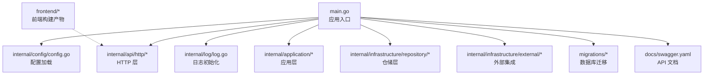
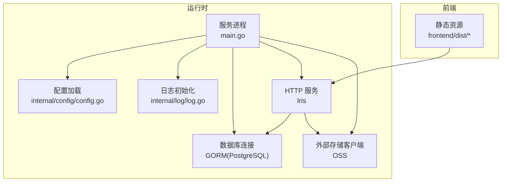
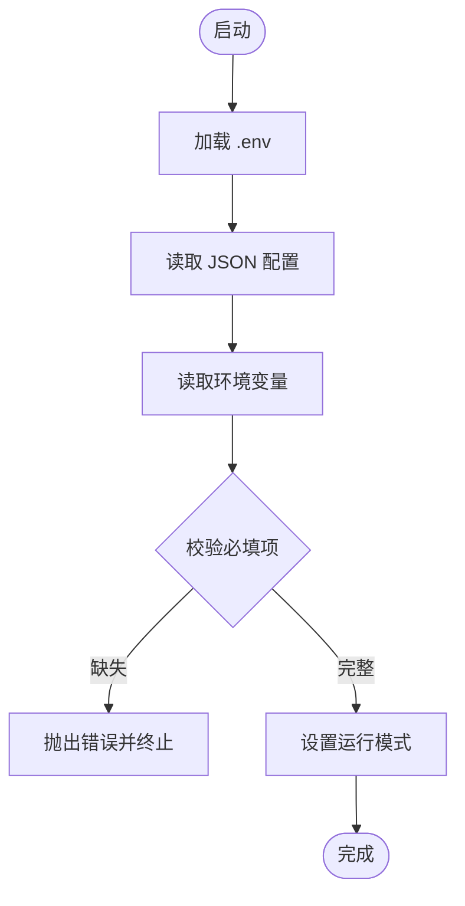
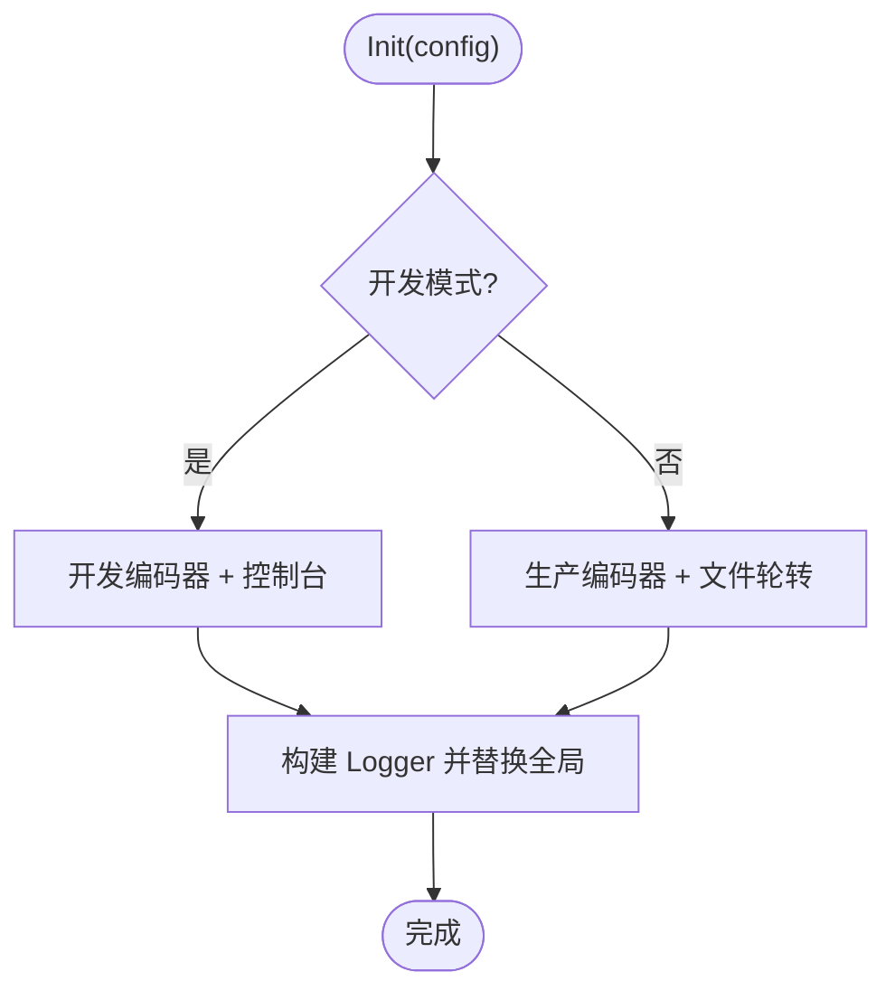
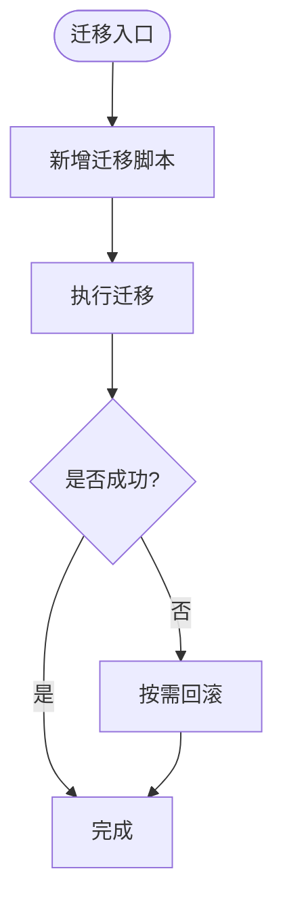
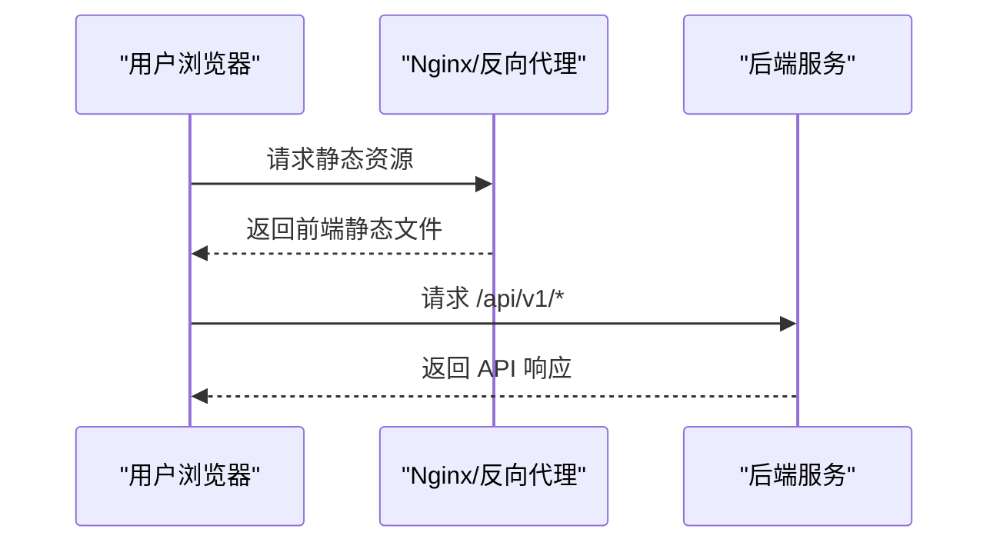
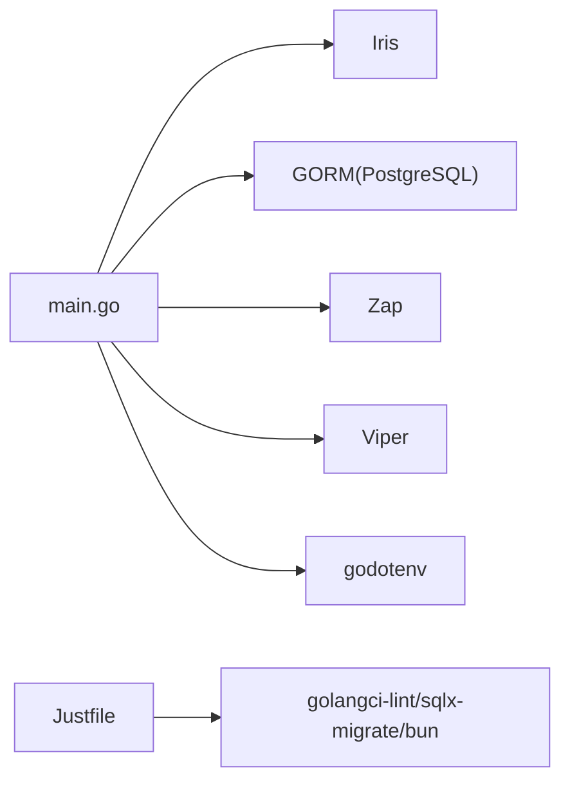

# 部署运维

<cite>
**本文引用的文件**
- [main.go](file://main.go)
- [go.mod](file://go.mod)
- [app_config.json](file://app_config.json)
- [justfile](file://justfile)
- [internal/config/config.go](file://internal/config/config.go)
- [internal/log/log.go](file://internal/log/log.go)
- [migrations/20260301065010_features-enable.up.sql](file://migrations/20260301065010_features-enable.up.sql)
- [migrations/20260301065022_user-table.up.sql](file://migrations/20260301065022_user-table.up.sql)
- [legacy/migrations/allmg.sql](file://legacy/migrations/allmg.sql)
- [docs/swagger.yaml](file://docs/swagger.yaml)
- [frontend/package.json](file://frontend/package.json)
- [frontend/vite.config.ts](file://frontend/vite.config.ts)
- [frontend/dist/index.html](file://frontend/dist/index.html)
</cite>

## 目录
1. [简介](#简介)
2. [项目结构](#项目结构)
3. [核心组件](#核心组件)
4. [架构总览](#架构总览)
5. [详细组件分析](#详细组件分析)
6. [依赖分析](#依赖分析)
7. [性能考虑](#性能考虑)
8. [故障排查指南](#故障排查指南)
9. [结论](#结论)
10. [附录](#附录)

## 简介
本文件面向运维工程师与平台团队，提供 poprako-web-ms 项目的生产级部署与运维指南。内容覆盖环境配置、依赖安装、数据库迁移、服务器配置、容器化与编排、监控告警、日志收集、性能监控、CI/CD 流程、自动化测试与部署策略、运维脚本、备份恢复与灾难恢复、安全加固、性能优化与容量规划等，帮助稳定运行与维护生产环境。

## 项目结构
该项目为 Go 语言实现的后端服务，采用模块化分层设计（config、application、domain、infrastructure、api/http、log、state 等），配合前端静态资源构建产物。数据库迁移脚本位于 migrations 目录，历史迁移位于 legacy/migrations。项目根目录提供 Justfile 作为常用运维任务入口，Swagger 文档位于 docs 目录。

图表来源
- [main.go:25-145](file://main.go#L25-L145)
- [internal/config/config.go:11-59](file://internal/config/config.go#L11-L59)
- [internal/log/log.go:13-83](file://internal/log/log.go#L13-L83)

章节来源
- [main.go:12-23](file://main.go#L12-L23)
- [go.mod:1-114](file://go.mod#L1-114)
- [justfile:1-39](file://justfile#L1-L39)

## 核心组件
- 应用入口与生命周期
  - 应用通过入口函数加载 .env、读取配置、初始化日志、建立数据库连接、组装应用层服务并启动 HTTP 服务器。
- 配置系统
  - 从 JSON 文件加载基础配置，结合环境变量（APP_ENVIRONMENT、DATABASE_URL、JWT_SECRET_KEY）决定运行模式与敏感参数。
- 日志系统
  - 开发环境输出到控制台并带颜色；生产环境输出 JSON 并写入轮转日志文件，同时保留堆栈与调用者信息。
- 数据库迁移
  - 提供启用扩展与多张业务表的迁移脚本，包含索引与示例行，便于快速初始化开发/测试环境。
- 前端静态资源
  - 前端构建产物位于 frontend/dist，可由后端或独立 Nginx 提供静态文件服务。

章节来源
- [main.go:25-145](file://main.go#L25-L145)
- [internal/config/config.go:11-100](file://internal/config/config.go#L11-L100)
- [internal/log/log.go:13-83](file://internal/log/log.go#L13-L83)
- [migrations/20260301065010_features-enable.up.sql:1-2](file://migrations/20260301065010_features-enable.up.sql#L1-L2)
- [migrations/20260301065022_user-table.up.sql:1-52](file://migrations/20260301065022_user-table.up.sql#L1-L52)
- [frontend/dist/index.html](file://frontend/dist/index.html)

## 架构总览
后端服务基于 Iris 框架提供 REST API，使用 GORM 连接 PostgreSQL，Zap 记录日志，Viper 加载配置，godotenv 支持本地开发环境变量。前端静态资源可由后端统一托管或由反向代理提供。

图表来源
- [main.go:35-141](file://main.go#L35-L141)
- [internal/config/config.go:29-59](file://internal/config/config.go#L29-L59)
- [internal/log/log.go:13-83](file://internal/log/log.go#L13-L83)
- [go.mod:15-17](file://go.mod#L15-L17)

## 详细组件分析

### 配置加载与环境变量
- 配置来源
  - JSON 配置文件：app_config.json，包含服务地址、认证过期小时数、数据库连接池参数。
  - 环境变量：APP_ENVIRONMENT、DATABASE_URL、JWT_SECRET_KEY。
- 运行模式
  - development 或 production 决定日志级别与输出目标。
- 敏感参数
  - JWT 密钥与数据库连接串必须通过环境变量注入，避免硬编码。

图表来源
- [main.go:25-28](file://main.go#L25-L28)
- [internal/config/config.go:29-59](file://internal/config/config.go#L29-L59)

章节来源
- [app_config.json:1-11](file://app_config.json#L1-L11)
- [internal/config/config.go:11-100](file://internal/config/config.go#L11-L100)

### 日志系统
- 开发模式
  - 控制台彩色输出，时间格式本地化，调试级别。
- 生产模式
  - JSON 输出，文件轮转（大小、备份数、保留天数），警告级别及以上输出到控制台与文件。
- 全局替换
  - 初始化后替换全局 Logger，确保后续模块一致的日志行为。

图表来源
- [internal/log/log.go:13-83](file://internal/log/log.go#L13-L83)

章节来源
- [internal/log/log.go:13-83](file://internal/log/log.go#L13-L83)

### 数据库迁移
- 迁移策略
  - 使用 sqlx-migrate 工具管理版本化迁移，提供新增、执行、回滚等任务。
- 示例脚本
  - 启用扩展与创建用户表等迁移脚本，包含索引与示例行，便于快速初始化。
- 历史迁移
  - legacy/migrations 中包含历史表定义，可用于兼容或数据迁移参考。

图表来源
- [justfile:24-38](file://justfile#L24-L38)
- [migrations/20260301065010_features-enable.up.sql:1-2](file://migrations/20260301065010_features-enable.up.sql#L1-L2)
- [migrations/20260301065022_user-table.up.sql:1-52](file://migrations/20260301065022_user-table.up.sql#L1-L52)
- [legacy/migrations/allmg.sql:1-16](file://legacy/migrations/allmg.sql#L1-L16)

章节来源
- [justfile:24-38](file://justfile#L24-L38)
- [migrations/20260301065010_features-enable.up.sql:1-2](file://migrations/20260301065010_features-enable.up.sql#L1-L2)
- [migrations/20260301065022_user-table.up.sql:1-52](file://migrations/20260301065022_user-table.up.sql#L1-L52)
- [legacy/migrations/allmg.sql:1-16](file://legacy/migrations/allmg.sql#L1-L16)

### 前端静态资源与 API
- 前端构建
  - 前端工程使用 Vite 构建，产物位于 frontend/dist，包含入口 HTML 与静态资源。
- API 文档
  - Swagger YAML 描述了 API 路径、模型与鉴权方式，便于联调与监控对接。
- 静态托管
  - 可由后端统一托管，或通过反向代理（如 Nginx）提供静态资源，减少后端压力。

图表来源
- [frontend/dist/index.html](file://frontend/dist/index.html)
- [docs/swagger.yaml:1-10](file://docs/swagger.yaml#L1-L10)

章节来源
- [frontend/vite.config.ts](file://frontend/vite.config.ts)
- [frontend/package.json](file://frontend/package.json)
- [docs/swagger.yaml:645-800](file://docs/swagger.yaml#L645-L800)

## 依赖分析
- 运行时依赖
  - Iris Web 框架、GORM PostgreSQL 驱动、Zap 日志、Viper 配置、godotenv 环境变量加载。
- 迁移与工具
  - sqlx-migrate 用于迁移管理；Justfile 提供 lint、格式化、构建、迁移等任务。
- 前端生态
  - Vite、包管理器与 TypeScript 配置，构建产物用于静态托管。

图表来源
- [go.mod:5-17](file://go.mod#L5-L17)
- [justfile:9-38](file://justfile#L9-L38)

章节来源
- [go.mod:1-114](file://go.mod#L1-L114)
- [justfile:1-39](file://justfile#L1-L39)

## 性能考虑
- 连接池参数
  - 通过配置文件设置最小空闲与最大打开连接数，结合数据库实例规格进行压测与调优。
- 日志级别
  - 生产环境提升日志级别并开启文件轮转，避免频繁 IO 影响性能。
- 前端静态资源
  - 启用压缩与缓存策略，合理设置缓存头，降低带宽与延迟。
- 数据库索引
  - 迁移脚本中已创建必要索引，建议结合慢查询分析持续优化。

章节来源
- [app_config.json:6-9](file://app_config.json#L6-L9)
- [internal/log/log.go:52-83](file://internal/log/log.go#L52-L83)
- [migrations/20260301065022_user-table.up.sql:19-34](file://migrations/20260301065022_user-table.up.sql#L19-L34)

## 故障排查指南
- 启动失败
  - 检查 .env 是否正确加载，确认环境变量是否齐全（APP_ENVIRONMENT、DATABASE_URL、JWT_SECRET_KEY）。
- 数据库连接
  - 核对 DATABASE_URL 格式与可达性，确认迁移脚本已执行。
- 日志定位
  - 开发环境查看控制台彩色输出；生产环境检查 logs/main-service.log 轮转文件与警告级别以上日志。
- API 联调
  - 使用 Swagger 文档核对请求路径、参数与鉴权头，确认静态资源托管与跨域配置。

章节来源
- [main.go:25-28](file://main.go#L25-L28)
- [internal/config/config.go:44-47](file://internal/config/config.go#L44-L47)
- [internal/log/log.go:64-70](file://internal/log/log.go#L64-L70)
- [docs/swagger.yaml:1-10](file://docs/swagger.yaml#L1-L10)

## 结论
本指南提供了从环境准备、配置与迁移、服务器与容器化、监控与日志、CI/CD 到运维脚本与安全优化的全链路实践建议。建议在生产环境中严格区分环境变量与密钥管理，完善自动化测试与灰度发布策略，并持续进行容量评估与性能调优。

## 附录

### A. 生产环境部署清单
- 系统要求
  - Linux/Windows（推荐 Linux），Go 运行时，PostgreSQL 数据库，Nginx 或反向代理。
- 环境变量
  - APP_ENVIRONMENT、DATABASE_URL、JWT_SECRET_KEY。
- 依赖安装
  - 安装 Go、sqlx-migrate、golangci-lint、Node.js（前端构建）。
- 数据库迁移
  - 执行迁移脚本，确保扩展与表结构就绪。
- 服务启动
  - 构建二进制后以 systemd 或容器方式运行，配置健康检查与重启策略。

章节来源
- [internal/config/config.go:44-47](file://internal/config/config.go#L44-L47)
- [justfile:21-28](file://justfile#L21-L28)
- [migrations/20260301065010_features-enable.up.sql:1-2](file://migrations/20260301065010_features-enable.up.sql#L1-L2)
- [migrations/20260301065022_user-table.up.sql:1-52](file://migrations/20260301065022_user-table.up.sql#L1-L52)

### B. 容器化与编排建议
- Docker 镜像
  - 基于官方 Go 镜像构建，复制二进制与静态资源，暴露服务端口，设置 HEALTHCHECK。
- Kubernetes
  - 使用 Deployment/Service/Ingress，配置 ConfigMap（环境变量）与 Secret（密钥），持久化日志目录，设置资源限制与探针。
- 前端托管
  - 将前端静态资源放入只读存储或 CDN，后端仅提供 API。

[本节为概念性建议，不直接对应具体源码文件]

### C. 监控告警与日志
- 指标采集
  - HTTP 请求数、响应时间、错误率、数据库连接池使用率、CPU/内存。
- 日志
  - 生产环境 JSON 输出并轮转，集中收集至日志平台，设置关键词告警。
- 告警
  - 基于阈值与异常模式触发，结合值班流程与变更通知。

[本节为通用运维实践，不直接对应具体源码文件]

### D. CI/CD 流程与自动化测试
- 任务编排
  - Lint、测试、构建、打包、扫描、发布镜像、部署编排。
- 自动化测试
  - 单元测试与集成测试，迁移脚本验证，API 文档一致性检查。
- 部署策略
  - 蓝绿/金丝雀发布，回滚策略，灰度流量控制。

[本节为通用流程建议，不直接对应具体源码文件]

### E. 运维脚本与命令
- 常用命令
  - 构建：just build
  - 迁移：just mgr-add / mgr-run / mgr-rvt
  - 代码检查：just check
  - 格式化：just fmt
  - 生成文档：just swag
  - 种子数据：just seed-base

章节来源
- [justfile:18-38](file://justfile#L18-L38)

### F. 备份恢复与灾难恢复
- 数据备份
  - 定期导出数据库快照，验证恢复流程。
- 配置备份
  - 备份环境变量与密钥，确保可快速重建。
- DR 方案
  - 多可用区部署，自动故障转移，RPO/RTO 指标明确。

[本节为通用方案建议，不直接对应具体源码文件]

### G. 安全加固
- 最小权限
  - 数据库连接串与密钥通过 Secret 管理，避免明文。
- 网络隔离
  - 反向代理层做限流与 WAF，后端仅暴露必要端口。
- 传输加密
  - HTTPS/TLS 终止于反向代理，内部服务间通信加密。
- 审计与合规
  - 日志留存与审计追踪，定期安全扫描。

[本节为通用安全建议，不直接对应具体源码文件]