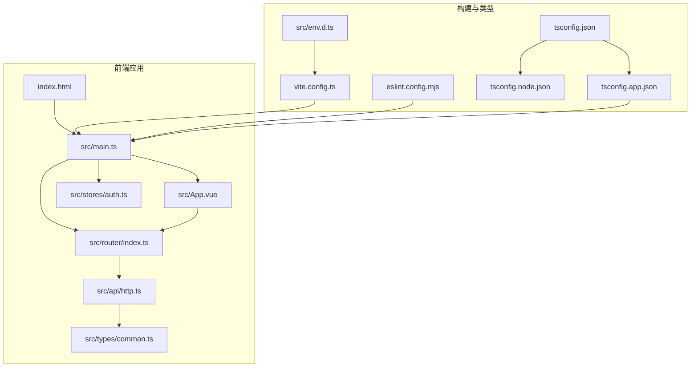
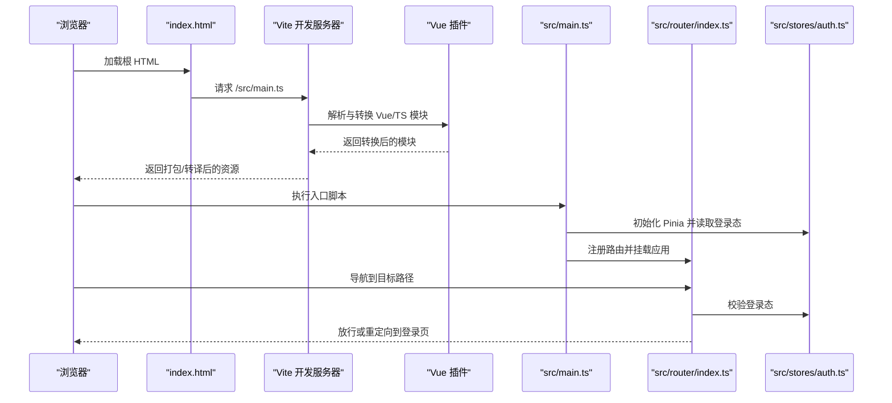
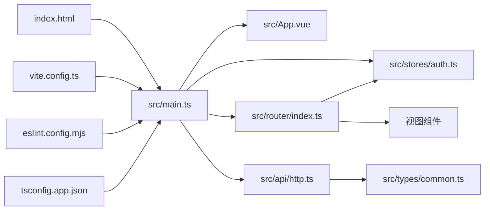

# 前端配置

<cite>
**本文引用的文件**
- [package.json](file://frontend/package.json)
- [vite.config.ts](file://frontend/vite.config.ts)
- [tsconfig.json](file://frontend/tsconfig.json)
- [tsconfig.app.json](file://frontend/tsconfig.app.json)
- [tsconfig.node.json](file://frontend/tsconfig.node.json)
- [eslint.config.mjs](file://frontend/eslint.config.mjs)
- [env.d.ts](file://frontend/src/env.d.ts)
- [index.html](file://frontend/index.html)
- [main.ts](file://frontend/src/main.ts)
- [App.vue](file://frontend/src/App.vue)
- [router/index.ts](file://frontend/src/router/index.ts)
- [api/http.ts](file://frontend/src/api/http.ts)
- [types/common.ts](file://frontend/src/types/common.ts)
- [stores/auth.ts](file://frontend/src/stores/auth.ts)
</cite>

## 目录
1. [简介](#简介)
2. [项目结构](#项目结构)
3. [核心组件](#核心组件)
4. [架构总览](#架构总览)
5. [详细组件分析](#详细组件分析)
6. [依赖关系分析](#依赖关系分析)
7. [性能考虑](#性能考虑)
8. [故障排查指南](#故障排查指南)
9. [结论](#结论)
10. [附录](#附录)

## 简介
本文件面向前端工程配置与开发环境，围绕 Vue 3 + TypeScript + Vite 技术栈，系统梳理构建配置、开发服务器与代理、TypeScript 编译与类型检查、依赖与脚本命令、环境变量与运行时注入、性能优化（代码分割、懒加载、缓存）以及多环境部署与开发体验（热重载、调试工具集成）等关键主题。文档以仓库现有配置为依据，避免臆测，提供可操作的实践建议与可视化图示。

## 项目结构
前端工程位于 frontend 目录，采用 Vite 作为构建与开发服务器，使用 TypeScript 管理类型，ESLint/Volar 提供代码质量保障，Pinia 管理状态，Ant Design Vue 提供 UI 组件库，Vue Router 管理路由与导航守卫，Axios 封装统一 HTTP 请求层。

图表来源
- [index.html:1-15](file://frontend/index.html#L1-L15)
- [main.ts:1-26](file://frontend/src/main.ts#L1-L26)
- [App.vue:1-45](file://frontend/src/App.vue#L1-L45)
- [router/index.ts:1-54](file://frontend/src/router/index.ts#L1-L54)
- [stores/auth.ts:1-51](file://frontend/src/stores/auth.ts#L1-L51)
- [api/http.ts:1-174](file://frontend/src/api/http.ts#L1-L174)
- [types/common.ts:1-41](file://frontend/src/types/common.ts#L1-L41)
- [vite.config.ts:1-20](file://frontend/vite.config.ts#L1-L20)
- [tsconfig.json:1-12](file://frontend/tsconfig.json#L1-L12)
- [tsconfig.app.json:1-9](file://frontend/tsconfig.app.json#L1-L9)
- [tsconfig.node.json:1-20](file://frontend/tsconfig.node.json#L1-L20)
- [eslint.config.mjs:1-40](file://frontend/eslint.config.mjs#L1-L40)
- [env.d.ts:1-5](file://frontend/src/env.d.ts#L1-L5)

章节来源
- [index.html:1-15](file://frontend/index.html#L1-L15)
- [main.ts:1-26](file://frontend/src/main.ts#L1-L26)
- [vite.config.ts:1-20](file://frontend/vite.config.ts#L1-L20)
- [tsconfig.json:1-12](file://frontend/tsconfig.json#L1-L12)
- [eslint.config.mjs:1-40](file://frontend/eslint.config.mjs#L1-L40)

## 核心组件
- 构建与开发服务器：Vite 配置集中于 vite.config.ts，注册 Vue 插件与路径别名，便于统一开发体验与构建行为。
- 类型系统：采用多 tsconfig 分离策略，tsconfig.json 作为聚合入口，分别指向 tsconfig.app.json（应用侧）与 tsconfig.node.json（Vite/Node 工具侧），确保严格类型与模块解析一致性。
- 代码质量：ESLint 使用 eslint.config.mjs（Flat Config），结合 TypeScript 与 Vue 插件规则集，并对浏览器全局进行类型声明。
- 应用入口：main.ts 初始化 Vue、Pinia、Ant Design Vue、路由，统一注入全局依赖。
- 路由与导航守卫：router/index.ts 定义路由表与前置守卫，实现登录态校验与重定向。
- HTTP 请求层：api/http.ts 封装 Axios，统一注入 Authorization 头、错误处理与查询参数序列化。
- 状态管理：stores/auth.ts 维护访问令牌与登录态，持久化至 localStorage。
- 环境类型：env.d.ts 引入 Vite 客户端类型，提供 import.meta 的类型提示。

章节来源
- [vite.config.ts:1-20](file://frontend/vite.config.ts#L1-L20)
- [tsconfig.json:1-12](file://frontend/tsconfig.json#L1-L12)
- [tsconfig.app.json:1-9](file://frontend/tsconfig.app.json#L1-L9)
- [tsconfig.node.json:1-20](file://frontend/tsconfig.node.json#L1-L20)
- [eslint.config.mjs:1-40](file://frontend/eslint.config.mjs#L1-L40)
- [main.ts:1-26](file://frontend/src/main.ts#L1-L26)
- [router/index.ts:1-54](file://frontend/src/router/index.ts#L1-L54)
- [api/http.ts:1-174](file://frontend/src/api/http.ts#L1-L174)
- [stores/auth.ts:1-51](file://frontend/src/stores/auth.ts#L1-L51)
- [env.d.ts:1-5](file://frontend/src/env.d.ts#L1-L5)

## 架构总览
下图展示了从浏览器启动到路由守卫生效的关键流程，体现开发服务器、插件、入口脚本与运行时依赖之间的交互。

图表来源
- [index.html:10-12](file://frontend/index.html#L10-L12)
- [vite.config.ts:12-19](file://frontend/vite.config.ts#L12-L19)
- [main.ts:16-23](file://frontend/src/main.ts#L16-L23)
- [router/index.ts:42-51](file://frontend/src/router/index.ts#L42-L51)
- [stores/auth.ts:19-26](file://frontend/src/stores/auth.ts#L19-L26)

## 详细组件分析

### Vite 构建与开发服务器配置
- 插件注册：通过 @vitejs/plugin-vue 提供 Vue SFC 与 TS 支持，简化开发体验。
- 路径别名：将 @ 映射到 src，提升导入可读性与可维护性。
- 开发服务器：默认行为由 Vite 提供，支持热重载与快速冷启动；如需代理、HTTPS、端口定制等，可在 defineConfig 中扩展 server 字段。
- 构建优化：当前未显式配置 rollupOptions 或插件优化项，适合中小型项目；大型项目可按需开启压缩、预构建依赖、动态导入等。

章节来源
- [vite.config.ts:12-19](file://frontend/vite.config.ts#L12-L19)

### TypeScript 配置策略
- 聚合入口：tsconfig.json 通过 references 引入应用与 Node 两套配置，避免重复与冲突。
- 应用侧配置：tsconfig.app.json 继承 Node 配置，添加 DOM/DOM.Iterable 与 vite/client 类型，限定 include 范围为 src 下的 TS/Vue 文件。
- 工具侧配置：tsconfig.node.json 面向 Vite/Node 工具链，启用 Bundler 解析、严格模式与 ESNext 模块，确保类型检查与构建稳定性。
- 类型声明：env.d.ts 引入 Vite 客户端类型，保证 import.meta 等变量具备类型提示。

章节来源
- [tsconfig.json:1-12](file://frontend/tsconfig.json#L1-L12)
- [tsconfig.app.json:1-9](file://frontend/tsconfig.app.json#L1-L9)
- [tsconfig.node.json:1-20](file://frontend/tsconfig.node.json#L1-L20)
- [env.d.ts:1-5](file://frontend/src/env.d.ts#L1-L5)

### 代码质量与 ESLint 规则
- Flat Config：eslint.config.mjs 采用最新 Flat Config 结构，忽略 dist、node_modules 与 JS/声明文件。
- 解析器与插件：vue-eslint-parser + @typescript-eslint/parser，结合 eslint-plugin-vue 与 @typescript-eslint/eslint-plugin。
- 全局变量：声明浏览器常见全局只读变量，减少规则误报。
- 规则覆盖：继承基础 recommended 规则集，补充 Vue 3 推荐规则，关闭多字母组件名强制与显式 any 警告，兼顾团队风格与可维护性。

章节来源
- [eslint.config.mjs:7-39](file://frontend/eslint.config.mjs#L7-L39)

### 依赖管理与脚本命令
- 依赖：Vue 3、Vue Router、Pinia、Ant Design Vue、Axios 等核心库。
- 开发依赖：Vite、@vitejs/plugin-vue、TypeScript、ESLint 及相关插件、Sass 等。
- 脚本命令：
  - dev：启动 Vite 开发服务器。
  - lint：执行 ESLint 检查，限制警告数量。
  - type-check：基于 tsconfig.app.json 执行类型检查。
  - build：先执行 lint 与 type-check，再进行生产构建。
  - preview：预览生产构建产物。
- 依赖版本与类型：通过 package.json 统一锁定，配合 tsconfig.node.json 的 Bundler 解析与严格模式，降低运行时风险。

章节来源
- [package.json:6-12](file://frontend/package.json#L6-L12)
- [package.json:13-34](file://frontend/package.json#L13-L34)

### 应用入口与运行时依赖
- 入口职责：创建 Vue 应用实例，注入 Pinia、路由与 Ant Design Vue，挂载到 DOM。
- 样式：引入 Ant Design Vue 的 reset 样式与自定义样式文件，确保主题与布局一致。
- 组件树：App.vue 作为根组件，包裹全局主题 Provider 与路由视图，提供主题切换 UI。

章节来源
- [main.ts:16-23](file://frontend/src/main.ts#L16-L23)
- [App.vue:1-45](file://frontend/src/App.vue#L1-L45)

### 路由与导航守卫
- 路由表：包含登录页与仪表盘页，使用动态导入实现懒加载。
- 导航守卫：前置守卫根据登录态决定放行或重定向，避免未登录用户访问受保护页面。
- 历史模式：使用 createWebHistory，适配现代浏览器与静态部署。

章节来源
- [router/index.ts:14-29](file://frontend/src/router/index.ts#L14-L29)
- [router/index.ts:42-51](file://frontend/src/router/index.ts#L42-L51)

### HTTP 请求层与鉴权
- 基础配置：baseURL 设为 /api/v1，统一超时时间，便于代理与服务端对接。
- 请求拦截：自动从 localStorage 读取访问令牌并注入 Authorization 头。
- 响应拦截：标准化错误消息，401 时清理令牌并跳转登录页。
- 方法封装：提供 get/post/put/patch/delete 等常用方法，统一返回 data 字段。
- 查询参数：序列化 includes[] 等数组参数，兼容后端接口约定。

章节来源
- [api/http.ts:28-33](file://frontend/src/api/http.ts#L28-L33)
- [api/http.ts:51-62](file://frontend/src/api/http.ts#L51-L62)
- [api/http.ts:67-82](file://frontend/src/api/http.ts#L67-L82)
- [api/http.ts:150-167](file://frontend/src/api/http.ts#L150-L167)

### 状态管理与登录态
- 存储键：访问令牌以固定键名持久化至 localStorage。
- 计算属性：isLoggedIn 基于令牌长度推导，简化模板与逻辑判断。
- 方法：setAccessToken/clearAccessToken 同步更新内存与本地存储，保证状态一致性。

章节来源
- [stores/auth.ts:19-26](file://frontend/src/stores/auth.ts#L19-L26)
- [stores/auth.ts:31-42](file://frontend/src/stores/auth.ts#L31-L42)

### 环境变量与运行时注入
- Vite 类型：env.d.ts 引入 vite/client 类型，提供 import.meta 的类型提示，便于在代码中安全使用 Vite 特性。
- 环境变量：当前配置未显式定义 .env 文件与变量注入；如需区分开发/生产环境，可在 Vite 配置中通过 define 或 dotenv 插件注入，并在代码中通过 import.meta.env 使用。

章节来源
- [env.d.ts:1-5](file://frontend/src/env.d.ts#L1-L5)

## 依赖关系分析
- 入口依赖：index.html 通过 module 脚本加载 main.ts；main.ts 依赖 App.vue、router、stores、Antd。
- 路由依赖：router/index.ts 依赖 stores/auth.ts 与视图组件，实现登录态校验。
- 请求依赖：api/http.ts 依赖 axios 与 types/common.ts 的错误结构定义。
- 类型依赖：tsconfig.app.json include 涵盖 src 下 TS/Vue 文件，确保类型检查覆盖完整。
- 构建依赖：vite.config.ts 依赖 @vitejs/plugin-vue，ESLint 依赖 eslint.config.mjs 与相关插件。

图表来源
- [index.html:10-12](file://frontend/index.html#L10-L12)
- [main.ts:16-23](file://frontend/src/main.ts#L16-L23)
- [router/index.ts:42-51](file://frontend/src/router/index.ts#L42-L51)
- [stores/auth.ts:19-26](file://frontend/src/stores/auth.ts#L19-L26)
- [api/http.ts:12-13](file://frontend/src/api/http.ts#L12-L13)
- [types/common.ts:31-40](file://frontend/src/types/common.ts#L31-L40)
- [vite.config.ts:12-19](file://frontend/vite.config.ts#L12-L19)
- [eslint.config.mjs:1-40](file://frontend/eslint.config.mjs#L1-L40)
- [tsconfig.app.json:7-8](file://frontend/tsconfig.app.json#L7-L8)

章节来源
- [index.html:10-12](file://frontend/index.html#L10-L12)
- [main.ts:16-23](file://frontend/src/main.ts#L16-L23)
- [router/index.ts:42-51](file://frontend/src/router/index.ts#L42-L51)
- [stores/auth.ts:19-26](file://frontend/src/stores/auth.ts#L19-L26)
- [api/http.ts:12-13](file://frontend/src/api/http.ts#L12-L13)
- [types/common.ts:31-40](file://frontend/src/types/common.ts#L31-L40)
- [vite.config.ts:12-19](file://frontend/vite.config.ts#L12-L19)
- [eslint.config.mjs:1-40](file://frontend/eslint.config.mjs#L1-L40)
- [tsconfig.app.json:7-8](file://frontend/tsconfig.app.json#L7-L8)

## 性能考虑
- 代码分割与懒加载
  - 路由级懒加载：router/index.ts 对视图组件使用动态导入，实现按需加载，降低首屏体积。
  - 组件级懒加载：可在需要时对重型组件采用动态导入，进一步拆分包体。
- 构建优化
  - 当前未配置 rollupOptions 或插件优化项；可在 vite.config.ts 中按需启用压缩、预构建依赖、外部化不常变依赖等。
- 缓存策略
  - 浏览器缓存：通过 Vite 默认输出命名策略与静态资源指纹，结合 CDN/反向代理设置合理的缓存头。
  - 本地缓存：localStorage 用于令牌与轻量状态，避免重复网络请求。
- 网络与请求
  - api/http.ts 已内置超时与错误处理，建议结合 HTTP/2、连接复用与后端缓存提升整体响应速度。
- 图标与 UI
  - Ant Design Vue 采用按需加载与 Tree Shaking 友好的设计，建议避免一次性引入整库样式。

章节来源
- [router/index.ts:20-28](file://frontend/src/router/index.ts#L20-L28)
- [api/http.ts:28-33](file://frontend/src/api/http.ts#L28-L33)
- [main.ts:6-10](file://frontend/src/main.ts#L6-L10)

## 故障排查指南
- 类型检查失败
  - 症状：pnpm type-check 报错。
  - 排查：确认 tsconfig.app.json 的 include 范围是否覆盖到相关文件；检查 tsconfig.node.json 的 strict 与 moduleResolution 是否与项目一致。
- ESLint 报错
  - 症状：pnpm lint 报错或警告过多。
  - 排查：检查 eslint.config.mjs 的规则覆盖与忽略列表；针对特定文件调整规则或添加注释禁用。
- 构建失败
  - 症状：pnpm build 失败。
  - 排查：先执行 pnpm lint 与 pnpm type-check，修复后再构建；检查 vite.config.ts 的插件与别名配置。
- 登录态异常
  - 症状：登录后仍被重定向至登录页。
  - 排查：确认 stores/auth.ts 的令牌写入与 localStorage 同步；检查 api/http.ts 的请求拦截是否正确注入 Authorization 头。
- 请求 401
  - 症状：接口返回 401。
  - 排查：确认 api/http.ts 的响应拦截逻辑是否触发清理与跳转；检查后端令牌有效期与签发策略。

章节来源
- [package.json:6-12](file://frontend/package.json#L6-L12)
- [tsconfig.app.json:7-8](file://frontend/tsconfig.app.json#L7-L8)
- [tsconfig.node.json:8-16](file://frontend/tsconfig.node.json#L8-L16)
- [eslint.config.mjs:8-39](file://frontend/eslint.config.mjs#L8-L39)
- [stores/auth.ts:31-42](file://frontend/src/stores/auth.ts#L31-L42)
- [api/http.ts:67-82](file://frontend/src/api/http.ts#L67-L82)

## 结论
本项目以 Vite + Vue 3 + TypeScript 为基础，构建了结构清晰、类型严谨、质量可控的前端工程骨架。通过路由懒加载、状态持久化与统一 HTTP 层，实现了良好的用户体验与可维护性。建议后续在 Vite 配置中完善代理与构建优化，在环境变量与多环境部署方面增加 dotenv 与 define 注入，以进一步提升开发效率与上线稳定性。

## 附录
- 多环境部署建议
  - 环境变量：新增 .env.development/.env.production，通过 Vite define 或 dotenv 插件注入，区分 API 域名、调试开关等。
  - 构建产物：在 vite.config.ts 中配置 base、assetsDir 与 rollupOptions.output.manualChunks，实现稳定缓存与 CDN 友好命名。
- 热重载与调试
  - Vite 默认支持 HMR；如需更精细的调试，可在浏览器 DevTools 中启用 Vue DevTools 与 Redux DevTools（结合 Pinia）。
- 代理配置
  - 在 vite.config.ts 的 server.proxy 中配置后端接口代理，避免跨域问题；生产环境通过反向代理或 CDN 配置解决。