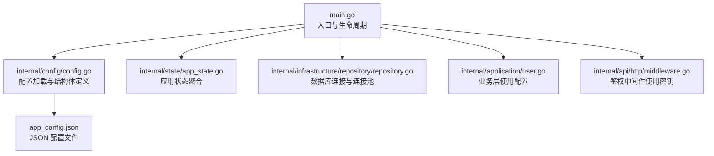
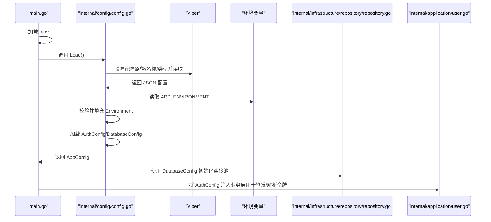
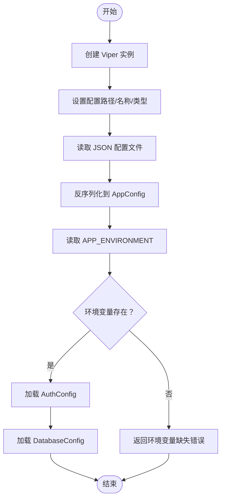
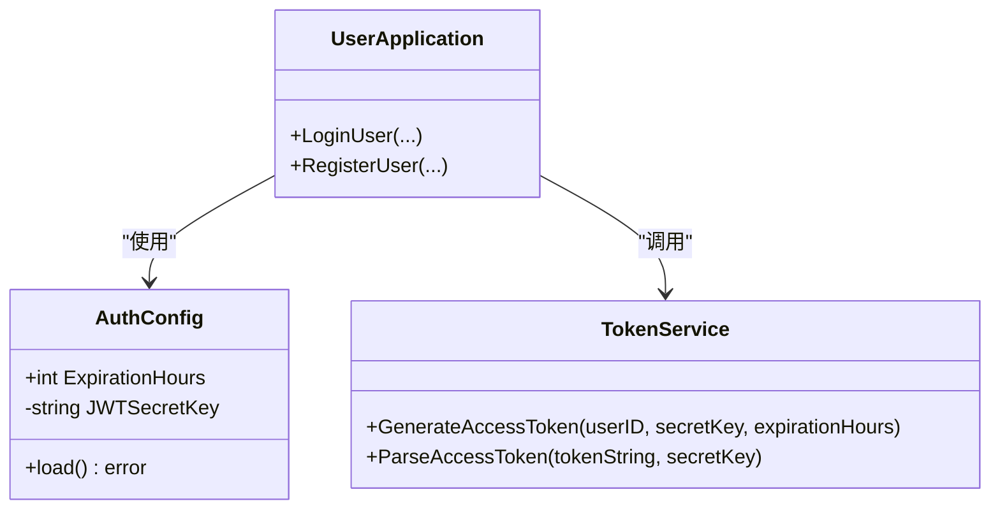
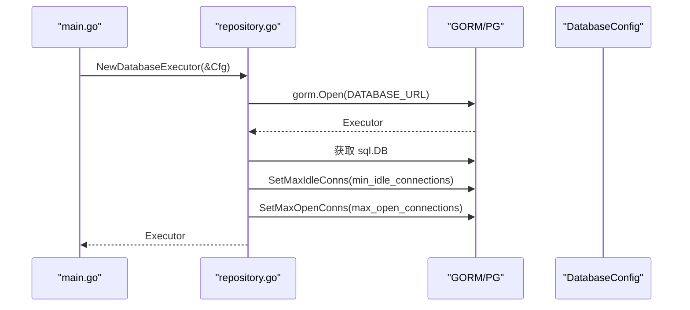
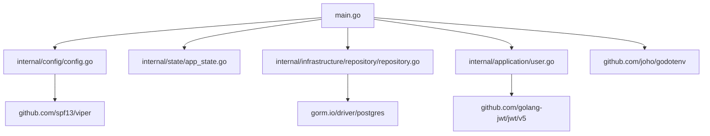

# 应用配置

<cite>
**本文引用的文件**
- [main.go](file://main.go)
- [config.go](file://internal/config/config.go)
- [app_config.json](file://app_config.json)
- [repository.go](file://internal/infrastructure/repository/repository.go)
- [user.go](file://internal/application/user.go)
- [middleware.go](file://internal/api/http/middleware.go)
- [go.mod](file://go.mod)
- [app_state.go](file://internal/state/app_state.go)
</cite>

## 目录
1. [简介](#简介)
2. [项目结构](#项目结构)
3. [核心组件](#核心组件)
4. [架构总览](#架构总览)
5. [详细组件分析](#详细组件分析)
6. [依赖分析](#依赖分析)
7. [性能考虑](#性能考虑)
8. [故障排查指南](#故障排查指南)
9. [结论](#结论)
10. [附录](#附录)

## 简介
本文件系统性梳理该 Go 后端应用的配置体系与加载机制，重点围绕以下目标展开：
- AppConfig 结构体设计理念：环境变量解析、配置文件加载流程、配置验证机制
- AuthConfig 与 DatabaseConfig 的配置项设置：JWT 密钥管理、数据库连接参数与连接池配置
- Viper 配置管理库的使用：配置文件格式、环境变量覆盖、配置热更新策略
- 安全管理最佳实践：敏感信息保护、配置审计、多环境配置管理
- 高级特性：功能开关、性能调优、故障恢复

## 项目结构
应用采用分层与按职责划分的组织方式，配置相关代码集中在 internal/config，并在 main 中统一加载与传递给各模块。

图表来源
- [main.go:25-145](file://main.go#L25-L145)
- [config.go:11-59](file://internal/config/config.go#L11-L59)
- [app_config.json:1-11](file://app_config.json#L1-L11)
- [repository.go:11-29](file://internal/infrastructure/repository/repository.go#L11-L29)
- [user.go:140-144](file://internal/application/user.go#L140-L144)
- [middleware.go:65-65](file://internal/api/http/middleware.go#L65-L65)

章节来源
- [main.go:25-145](file://main.go#L25-L145)
- [config.go:11-59](file://internal/config/config.go#L11-L59)
- [app_config.json:1-11](file://app_config.json#L1-L11)

## 核心组件
- AppConfig：顶层配置对象，包含运行环境标识、服务监听地址，以及嵌套的 AuthConfig 与 DatabaseConfig。
- AuthConfig：认证相关配置，包含访问令牌过期时长与 JWT 密钥。
- DatabaseConfig：数据库连接与连接池配置，包含最小空闲连接数与最大打开连接数。

这些结构体通过 Viper 从 JSON 文件反序列化，并通过环境变量注入运行时敏感值（如密钥、数据库连接串）。

章节来源
- [config.go:21-27](file://internal/config/config.go#L21-L27)
- [config.go:69-72](file://internal/config/config.go#L69-L72)
- [config.go:85-89](file://internal/config/config.go#L85-L89)

## 架构总览
下图展示了配置从加载到使用的端到端流程，包括 Viper 读取 JSON、环境变量覆盖、结构体校验与最终在业务层与基础设施层的使用。

图表来源
- [main.go:25-145](file://main.go#L25-L145)
- [config.go:29-59](file://internal/config/config.go#L29-L59)
- [repository.go:11-29](file://internal/infrastructure/repository/repository.go#L11-L29)
- [user.go:140-144](file://internal/application/user.go#L140-L144)

## 详细组件分析

### AppConfig 设计与加载流程
- 设计理念
  - 分层清晰：顶层 AppConfig 聚合子配置，便于集中管理与传递。
  - 环境隔离：通过环境变量区分开发/生产等环境，避免在配置文件中硬编码敏感信息。
  - 显式校验：在关键环节对环境变量进行显式检查，失败即刻返回，避免静默错误。
- 加载流程
  - 创建 Viper 实例，设置配置文件路径、名称与类型，读取 JSON 并反序列化到 AppConfig。
  - 读取 APP_ENVIRONMENT 并赋值，随后分别加载 AuthConfig 与 DatabaseConfig。
  - AuthConfig 与 DatabaseConfig 通过各自的 load 方法从环境变量注入敏感值。
- 验证机制
  - 若任一环境变量缺失，立即返回错误；若配置文件读取或反序列化失败，同样返回错误。

图表来源
- [config.go:29-59](file://internal/config/config.go#L29-L59)

章节来源
- [config.go:11-59](file://internal/config/config.go#L11-L59)
- [app_config.json:1-11](file://app_config.json#L1-L11)

### AuthConfig：JWT 密钥与过期时间
- 配置项
  - expiration_hours：访问令牌有效期（小时）
  - JWTSecretKey：JWT 签名密钥（仅内存持有，不写回配置文件）
- 加载与使用
  - 从环境变量 JWT_SECRET_KEY 注入，失败则直接报错。
  - 在业务层生成与解析访问令牌时使用该密钥与过期时长。
- 安全要点
  - 密钥来自环境变量，避免提交到版本控制。
  - 过期时间可按需调整，平衡安全与用户体验。

图表来源
- [config.go:69-83](file://internal/config/config.go#L69-L83)
- [user.go:140-144](file://internal/application/user.go#L140-L144)

章节来源
- [config.go:69-83](file://internal/config/config.go#L69-L83)
- [user.go:140-144](file://internal/application/user.go#L140-L144)

### DatabaseConfig：连接参数与连接池
- 配置项
  - min_idle_connections：最小空闲连接数
  - max_open_connections：最大打开连接数
  - DATABASE_URL：数据库连接字符串（来自环境变量）
- 加载与使用
  - DATABASE_URL 由环境变量注入，失败则报错。
  - 初始化数据库执行器时，将连接池参数设置到底层 SQL 对象。
- 性能建议
  - 根据并发与数据库承载能力调整连接池参数，避免过高导致资源争用，过低导致排队。

图表来源
- [repository.go:11-29](file://internal/infrastructure/repository/repository.go#L11-L29)
- [config.go:85-100](file://internal/config/config.go#L85-L100)

章节来源
- [repository.go:11-29](file://internal/infrastructure/repository/repository.go#L11-L29)
- [config.go:85-100](file://internal/config/config.go#L85-L100)

### Viper 使用与环境变量覆盖
- 配置文件格式与位置
  - JSON 文件名为 app_config.json，位于项目根目录。
- 环境变量覆盖
  - 通过环境变量覆盖敏感参数（如 JWT_SECRET_KEY、DATABASE_URL），避免将敏感信息写入仓库。
- 配置热更新策略
  - 当前实现为一次性加载，未启用 Viper 的自动热更新。若需热更新，可在应用内注册变更回调或引入文件监控。

章节来源
- [config.go:30-34](file://internal/config/config.go#L30-L34)
- [config.go:44-49](file://internal/config/config.go#L44-L49)

### 配置在中间件与业务层的应用
- 中间件鉴权
  - 从请求头提取 Bearer 令牌并解析，使用全局注入的密钥进行验证。
- 业务层签发令牌
  - 使用 AuthConfig 中的密钥与过期时长生成访问令牌。

章节来源
- [middleware.go:65-79](file://internal/api/http/middleware.go#L65-L79)
- [user.go:140-144](file://internal/application/user.go#L140-L144)

## 依赖分析
- 外部库
  - github.com/spf13/viper：配置管理与反序列化
  - github.com/joho/godotenv：加载 .env 文件
  - gorm.io/driver/postgres：PostgreSQL 驱动
  - github.com/golang-jwt/jwt/v5：JWT 生成与解析
- 内部模块耦合
  - main 作为入口，负责加载配置并将 AppConfig 注入到应用状态与各业务模块。
  - repository 层使用 DatabaseConfig 初始化连接池。
  - application 层使用 AuthConfig 生成与解析令牌。

图表来源
- [go.mod:5-18](file://go.mod#L5-L18)
- [main.go:12-23](file://main.go#L12-L23)

章节来源
- [go.mod:5-18](file://go.mod#L5-L18)
- [main.go:12-23](file://main.go#L12-L23)

## 性能考虑
- 连接池参数
  - min_idle_connections 与 max_open_connections 直接影响数据库并发与资源占用，应结合压测结果调整。
- 令牌过期时间
  - 较短的过期时间提升安全性但增加刷新频率，较长的过期时间提升体验但带来风险。
- 启动阶段一次性加载配置
  - 避免运行时频繁 IO，有利于启动与运行时性能稳定。

## 故障排查指南
- 常见错误与定位
  - 未设置 APP_ENVIRONMENT：在加载 AppConfig 时会直接报错，检查环境变量注入。
  - 未设置 JWT_SECRET_KEY：加载 AuthConfig 时报错，检查密钥注入。
  - 未设置 DATABASE_URL：加载 DatabaseConfig 时报错，检查数据库连接串。
  - 配置文件读取/反序列化失败：检查 app_config.json 格式与字段映射。
- 排查步骤
  - 确认 .env 已成功加载（入口处已调用 godotenv.Load）。
  - 确认环境变量已在进程环境中生效。
  - 打印 AppConfig 关键字段进行核对（可通过日志或调试）。
  - 检查数据库连接串是否可连通，连接池参数是否合理。

章节来源
- [config.go:44-47](file://internal/config/config.go#L44-L47)
- [config.go:75-78](file://internal/config/config.go#L75-L78)
- [config.go:92-95](file://internal/config/config.go#L92-L95)
- [config.go:36-42](file://internal/config/config.go#L36-L42)

## 结论
该配置体系以 AppConfig 为核心，通过 Viper 读取 JSON 配置并结合环境变量注入敏感信息，实现了清晰的职责分离与强校验。AuthConfig 与 DatabaseConfig 分别聚焦于认证与数据访问的关键参数，配合中间件与业务层使用，形成完整的配置闭环。建议在现有基础上补充环境隔离与热更新能力，并完善配置审计与密钥轮换流程，以进一步提升安全性与可运维性。

## 附录

### 配置项一览表
- AppConfig
  - server_address：服务监听地址
  - auth.expiration_hours：访问令牌过期时长（小时）
  - database.min_idle_connections：最小空闲连接数
  - database.max_open_connections：最大打开连接数
- 环境变量
  - APP_ENVIRONMENT：运行环境标识
  - JWT_SECRET_KEY：JWT 签名密钥
  - DATABASE_URL：数据库连接字符串

章节来源
- [app_config.json:1-11](file://app_config.json#L1-L11)
- [config.go:22-26](file://internal/config/config.go#L22-L26)
- [config.go:44-49](file://internal/config/config.go#L44-L49)
- [config.go:75-80](file://internal/config/config.go#L75-L80)
- [config.go:92-97](file://internal/config/config.go#L92-L97)