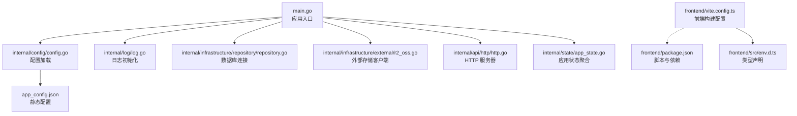
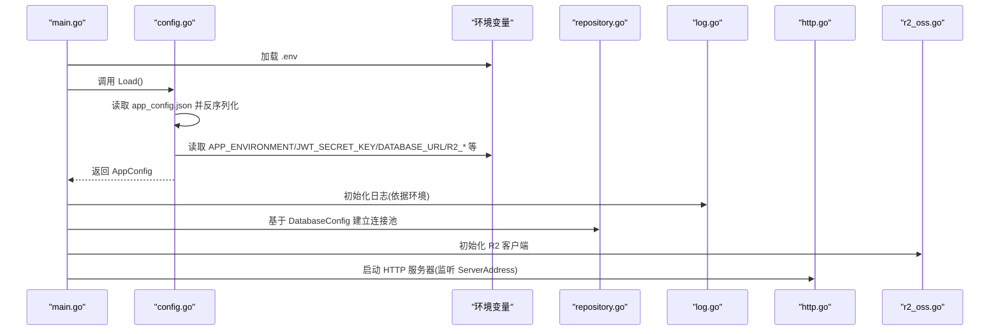
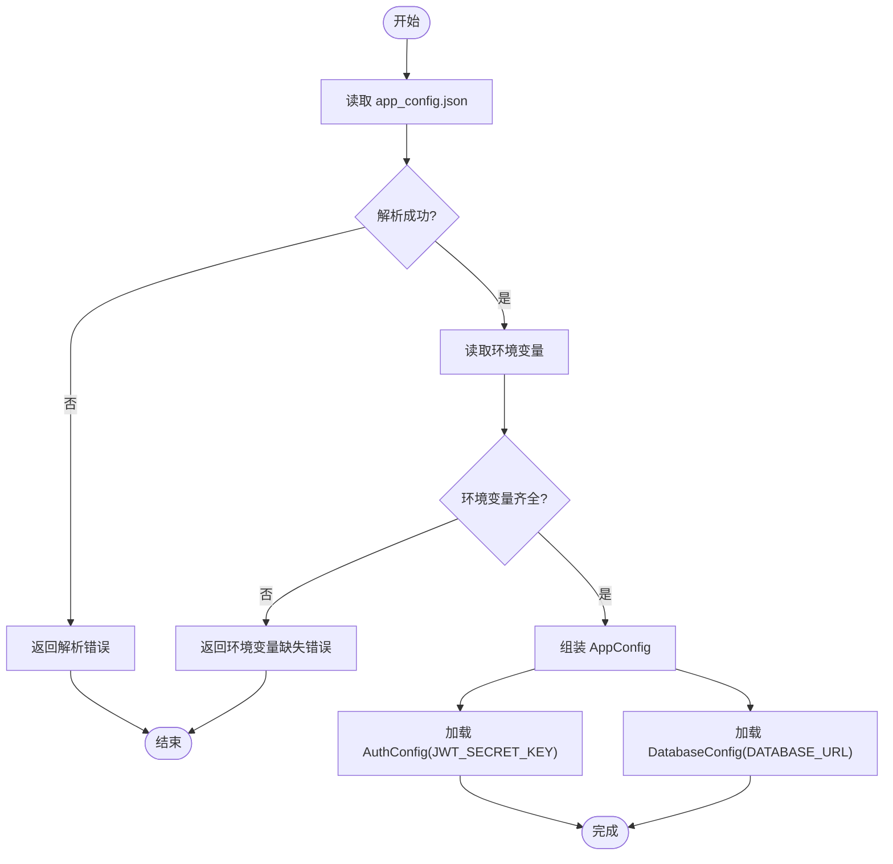
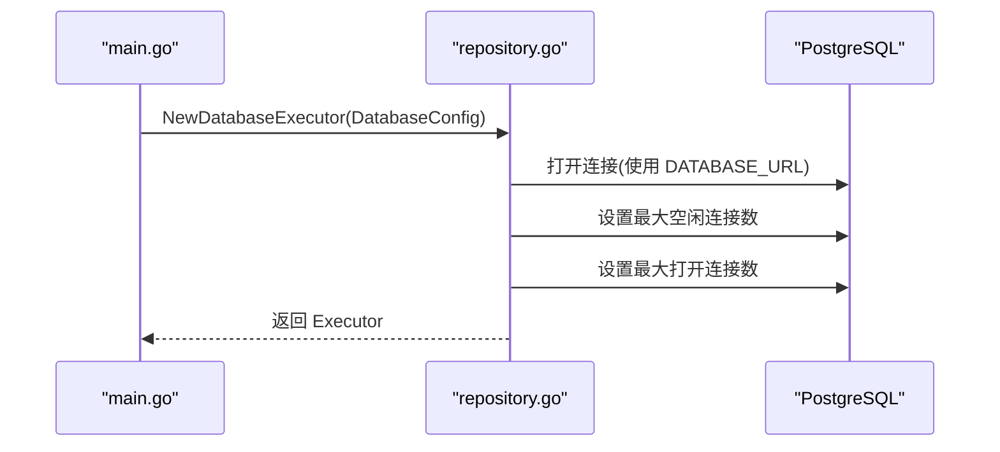
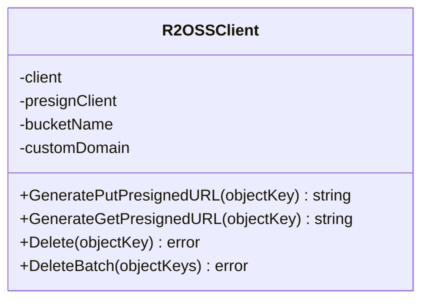
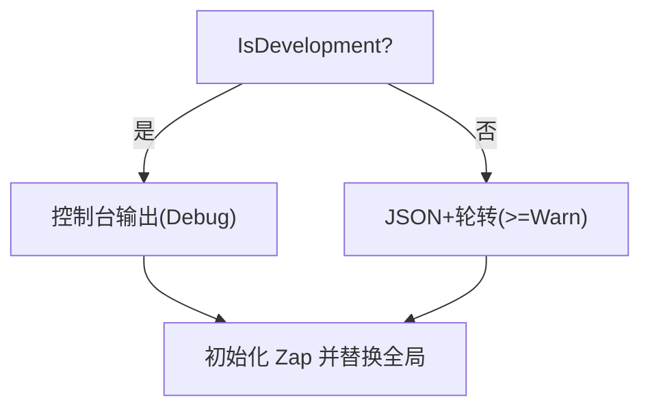
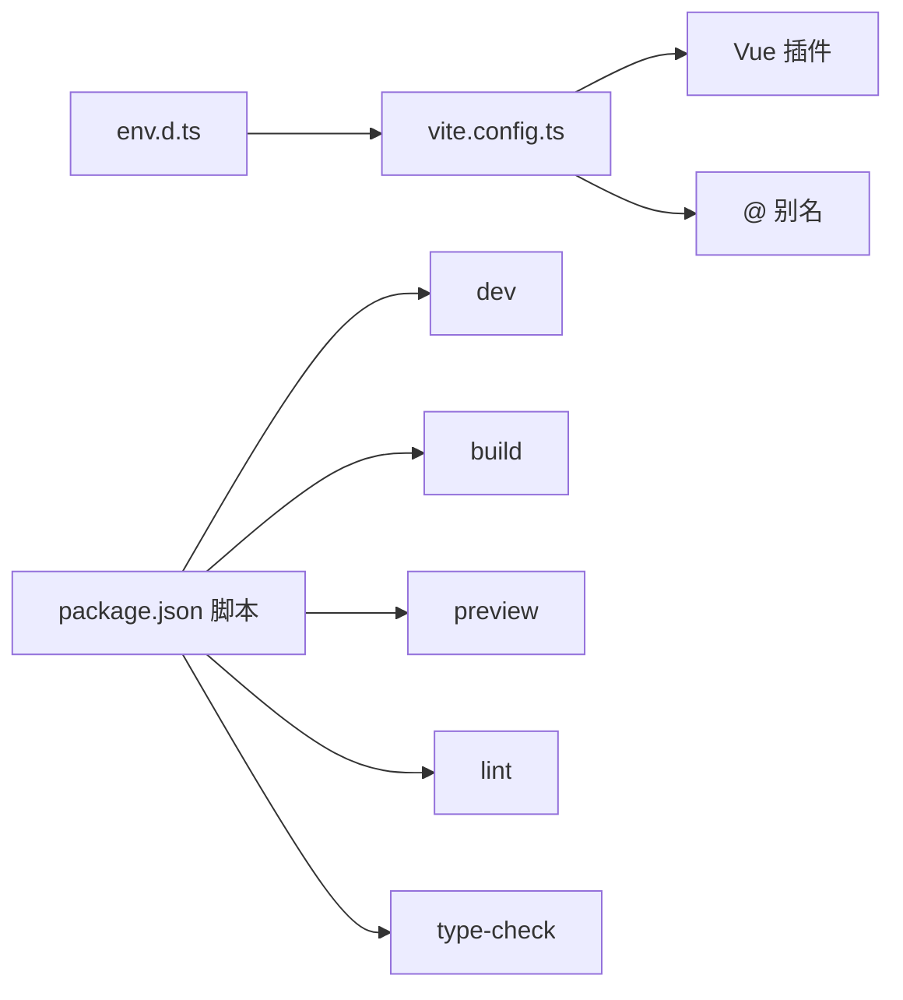
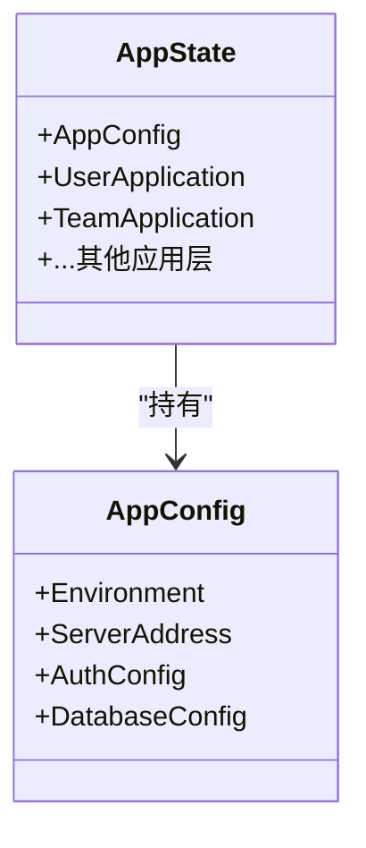
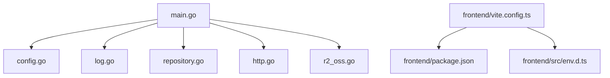

# 配置管理

<cite>
**本文引用的文件**
- [main.go](file://main.go)
- [config.go](file://internal/config/config.go)
- [app_config.json](file://app_config.json)
- [repository.go](file://internal/infrastructure/repository/repository.go)
- [log.go](file://internal/log/log.go)
- [http.go](file://internal/api/http/http.go)
- [r2_oss.go](file://internal/infrastructure/external/r2_oss.go)
- [vite.config.ts](file://frontend/vite.config.ts)
- [package.json](file://frontend/package.json)
- [env.d.ts](file://frontend/src/env.d.ts)
- [app_state.go](file://internal/state/app_state.go)
- [config.ts](file://script/seed/config.ts)
</cite>

## 目录
1. [简介](#简介)
2. [项目结构](#项目结构)
3. [核心组件](#核心组件)
4. [架构总览](#架构总览)
5. [详细组件分析](#详细组件分析)
6. [依赖分析](#依赖分析)
7. [性能考虑](#性能考虑)
8. [故障排查指南](#故障排查指南)
9. [结论](#结论)
10. [附录](#附录)

## 简介
本文件系统性梳理漫画翻译协作平台的配置管理体系，覆盖后端 Go 应用、前端 Vite 构建、外部服务集成与日志策略。重点阐述配置加载流程、环境变量解析、配置验证机制、数据库连接与认证参数、外部服务配置、前端构建与开发服务器设置、生产优化选项、安全与环境隔离策略，以及可扩展的配置热更新、动态配置与配置审计思路。

## 项目结构
后端采用分层架构，配置集中在 internal/config；前端位于 frontend；外部服务通过 AWS SDK 兼容的 R2 OSS 客户端接入；日志与 HTTP 服务器分别在 internal/log 与 internal/api/http 中初始化。

图表来源
- [main.go:25-145](file://main.go#L25-L145)
- [config.go:11-59](file://internal/config/config.go#L11-L59)
- [app_config.json:1-11](file://app_config.json#L1-L11)
- [log.go:13-30](file://internal/log/log.go#L13-L30)
- [repository.go:11-29](file://internal/infrastructure/repository/repository.go#L11-L29)
- [r2_oss.go:29-79](file://internal/infrastructure/external/r2_oss.go#L29-L79)
- [http.go:16-24](file://internal/api/http/http.go#L16-L24)
- [app_state.go:23-49](file://internal/state/app_state.go#L23-L49)
- [vite.config.ts:12-19](file://frontend/vite.config.ts#L12-L19)
- [package.json:6-12](file://frontend/package.json#L6-L12)
- [env.d.ts:1-5](file://frontend/src/env.d.ts#L1-L5)

章节来源
- [main.go:25-145](file://main.go#L25-L145)
- [config.go:11-59](file://internal/config/config.go#L11-L59)
- [app_config.json:1-11](file://app_config.json#L1-L11)
- [vite.config.ts:12-19](file://frontend/vite.config.ts#L12-L19)
- [package.json:6-12](file://frontend/package.json#L6-L12)
- [env.d.ts:1-5](file://frontend/src/env.d.ts#L1-L5)

## 核心组件
- 配置加载器：从 JSON 文件读取静态配置，结合环境变量进行动态注入与校验，支持开发/生产模式切换。
- 数据库连接器：基于环境变量 DATABASE_URL 建立连接池，设置空闲与最大连接数。
- 认证参数：从环境变量 JWT_SECRET_KEY 注入，用于签发与校验令牌。
- 外部存储客户端：基于 R2/OSS 兼容接口，通过多个环境变量配置访问密钥、区域、桶名与自定义域名。
- 日志系统：根据环境选择开发或生产日志策略，生产环境启用日志轮转与级别提升。
- HTTP 服务器：按配置监听地址，注册中间件与路由，非生产环境启用 Swagger UI。
- 前端构建：Vite 统一插件与路径别名，配合脚本与类型声明。

章节来源
- [config.go:11-100](file://internal/config/config.go#L11-L100)
- [repository.go:11-29](file://internal/infrastructure/repository/repository.go#L11-L29)
- [r2_oss.go:29-79](file://internal/infrastructure/external/r2_oss.go#L29-L79)
- [log.go:13-83](file://internal/log/log.go#L13-L83)
- [http.go:16-166](file://internal/api/http/http.go#L16-L166)
- [vite.config.ts:12-19](file://frontend/vite.config.ts#L12-L19)

## 架构总览
下图展示配置在启动阶段的加载与传递链路，以及各子系统如何消费配置。

图表来源
- [main.go:25-145](file://main.go#L25-L145)
- [config.go:29-59](file://internal/config/config.go#L29-L59)
- [repository.go:11-29](file://internal/infrastructure/repository/repository.go#L11-L29)
- [log.go:13-30](file://internal/log/log.go#L13-L30)
- [http.go:16-24](file://internal/api/http/http.go#L16-L24)
- [r2_oss.go:29-79](file://internal/infrastructure/external/r2_oss.go#L29-L79)

## 详细组件分析

### 配置加载与验证流程
- 静态配置：从当前目录的 app_config.json 读取，字段包括服务器监听地址、认证过期小时数、数据库连接池参数。
- 动态注入：通过环境变量覆盖与注入，如 APP_ENVIRONMENT、JWT_SECRET_KEY、DATABASE_URL、R2_ACCOUNT_ID 等。
- 校验逻辑：若任一必需环境变量缺失，立即返回错误；开发/生产模式由环境变量决定，影响日志与 Swagger 行为。
- 结构化类型：AppConfig 包含 AuthConfig 与 DatabaseConfig 子结构，分别负责认证与数据库参数。

图表来源
- [config.go:29-59](file://internal/config/config.go#L29-L59)
- [app_config.json:1-11](file://app_config.json#L1-L11)

章节来源
- [config.go:11-100](file://internal/config/config.go#L11-L100)
- [app_config.json:1-11](file://app_config.json#L1-L11)

### 数据库连接配置
- 连接字符串：从环境变量 DATABASE_URL 获取，驱动为 PostgreSQL。
- 连接池：通过 MinIdleConnections 与 MaxOpenConnections 控制空闲与最大连接数。
- 初始化位置：在 main.go 中创建 DatabaseExecutor 并注入各仓储。

图表来源
- [main.go:37-42](file://main.go#L37-L42)
- [repository.go:11-29](file://internal/infrastructure/repository/repository.go#L11-L29)

章节来源
- [repository.go:11-29](file://internal/infrastructure/repository/repository.go#L11-L29)
- [config.go:85-100](file://internal/config/config.go#L85-L100)

### 认证参数与外部服务配置
- 认证密钥：JWT_SECRET_KEY 必须在运行环境中提供，否则加载失败。
- 外部存储：R2/OSS 客户端需要 R2_ACCOUNT_ID、R2_ACCESS_KEY_ID、R2_SECRET_ACCESS_KEY、R2_REGION、R2_BUCKET_NAME、R2_CUSTOM_DOMAIN 等环境变量；若未设置关键变量会触发异常。
- 自定义域名：当配置了 R2_CUSTOM_DOMAIN 时，生成下载预签名 URL 时可直接拼接自定义域名；否则返回未配置错误。

图表来源
- [r2_oss.go:21-79](file://internal/infrastructure/external/r2_oss.go#L21-L79)

章节来源
- [config.go:69-83](file://internal/config/config.go#L69-L83)
- [r2_oss.go:29-79](file://internal/infrastructure/external/r2_oss.go#L29-L79)

### 日志与 HTTP 服务器
- 日志：开发模式使用控制台编码器与 Debug 级别；生产模式使用 JSON 编码器、日志轮转与 Warn 级别及以上。
- HTTP：按 ServerAddress 监听；非生产环境启用 Swagger UI；注册通用中间件（请求 ID、恢复、日志）。

图表来源
- [log.go:13-83](file://internal/log/log.go#L13-L83)
- [http.go:16-166](file://internal/api/http/http.go#L16-L166)
- [config.go:61-67](file://internal/config/config.go#L61-L67)

章节来源
- [log.go:13-83](file://internal/log/log.go#L13-L83)
- [http.go:16-24](file://internal/api/http/http.go#L16-L24)
- [config.go:21-27](file://internal/config/config.go#L21-L27)

### 前端构建与开发服务器
- Vite 配置：注册 Vue 插件与路径别名，简化模块导入。
- 脚本命令：dev、build、preview、lint、type-check 等，构建前执行 ESLint 与类型检查。
- 类型声明：env.d.ts 提供 import.meta 的类型提示，便于 IDE 支持。

图表来源
- [vite.config.ts:12-19](file://frontend/vite.config.ts#L12-L19)
- [package.json:6-12](file://frontend/package.json#L6-L12)
- [env.d.ts:1-5](file://frontend/src/env.d.ts#L1-L5)

章节来源
- [vite.config.ts:12-19](file://frontend/vite.config.ts#L12-L19)
- [package.json:6-12](file://frontend/package.json#L6-L12)
- [env.d.ts:1-5](file://frontend/src/env.d.ts#L1-L5)

### 应用状态与配置传播
- AppState 将 AppConfig 与各应用层实例聚合，贯穿 HTTP 层路由与业务层调用。
- 配置通过构造函数逐层注入，避免全局共享带来的耦合。

图表来源
- [app_state.go:8-21](file://internal/state/app_state.go#L8-L21)
- [config.go:21-27](file://internal/config/config.go#L21-L27)

章节来源
- [app_state.go:23-49](file://internal/state/app_state.go#L23-L49)
- [config.go:21-27](file://internal/config/config.go#L21-L27)

### 种子脚本中的配置示例
- 种子脚本使用常量配置定义后端 API 基础地址、超级管理员账号与默认团队信息，便于自动化初始化。

章节来源
- [config.ts:1-16](file://script/seed/config.ts#L1-L16)

## 依赖分析
- 配置依赖：main.go 依赖 config.Load()；config.go 依赖 viper 读取 JSON；依赖 os 获取环境变量。
- 数据库依赖：repository.go 依赖 gorm 与 postgres 驱动；依赖 config.DatabaseConfig。
- 外部服务依赖：r2_oss.go 依赖 AWS SDK S3 客户端；依赖多个 R2 环境变量。
- 日志依赖：log.go 依赖 zap 与 lumberjack；依赖 config.AppConfig 决策。
- HTTP 依赖：http.go 依赖 iris；依赖 config.AppConfig 读取监听地址与环境。
- 前端依赖：vite.config.ts 依赖 @vitejs/plugin-vue；package.json 定义脚本与依赖。

图表来源
- [main.go:25-145](file://main.go#L25-L145)
- [config.go:3-9](file://internal/config/config.go#L3-L9)
- [repository.go:3-9](file://internal/infrastructure/repository/repository.go#L3-L9)
- [r2_oss.go:3-18](file://internal/infrastructure/external/r2_oss.go#L3-L18)
- [log.go:3-11](file://internal/log/log.go#L3-L11)
- [http.go:3-14](file://internal/api/http/http.go#L3-L14)
- [vite.config.ts:4-6](file://frontend/vite.config.ts#L4-L6)
- [package.json:13-32](file://frontend/package.json#L13-L32)

章节来源
- [main.go:25-145](file://main.go#L25-L145)
- [config.go:3-9](file://internal/config/config.go#L3-L9)
- [repository.go:3-9](file://internal/infrastructure/repository/repository.go#L3-L9)
- [r2_oss.go:3-18](file://internal/infrastructure/external/r2_oss.go#L3-L18)
- [log.go:3-11](file://internal/log/log.go#L3-L11)
- [http.go:3-14](file://internal/api/http/http.go#L3-L14)
- [vite.config.ts:4-6](file://frontend/vite.config.ts#L4-L6)
- [package.json:13-32](file://frontend/package.json#L13-L32)

## 性能考虑
- 数据库连接池：合理设置最小空闲与最大打开连接数，避免高并发下的连接争用与资源耗尽。
- 日志级别与输出：生产环境提升日志级别并启用轮转，减少磁盘 IO 与日志膨胀。
- 预签名 URL：上传预签名有效期短（示例为 10 分钟），降低暴露风险并限制窗口。
- 前端构建：在构建前执行类型检查与 ESLint，减少运行时错误，提高稳定性。

## 故障排查指南
- 配置文件读取失败：确认 app_config.json 存在且格式正确；检查工作目录是否为包含该文件的目录。
- 环境变量缺失：APP_ENVIRONMENT、JWT_SECRET_KEY、DATABASE_URL、R2_ACCOUNT_ID 等必须设置；缺少任一都会导致启动失败。
- 数据库连接失败：核对 DATABASE_URL 格式与可达性；检查网络与权限。
- R2 客户端异常：确认 R2_* 环境变量完整；若使用自定义域名，需设置 R2_CUSTOM_DOMAIN。
- Swagger 不可用：仅在非生产环境启用；确认环境变量与路由配置。
- 前端构建报错：确保 Node.js 与包管理器版本满足要求；先执行类型检查与 ESLint。

章节来源
- [config.go:36-42](file://internal/config/config.go#L36-L42)
- [config.go:44-47](file://internal/config/config.go#L44-L47)
- [config.go:75-78](file://internal/config/config.go#L75-L78)
- [config.go:92-95](file://internal/config/config.go#L92-L95)
- [r2_oss.go:30-43](file://internal/infrastructure/external/r2_oss.go#L30-L43)
- [http.go:154-166](file://internal/api/http/http.go#L154-L166)
- [package.json:6-12](file://frontend/package.json#L6-L12)

## 结论
本配置体系以 JSON 静态配置为基础，结合环境变量实现灵活的运行时注入与验证。通过明确的子配置结构与严格的校验流程，确保关键参数（数据库、认证、外部服务）在启动阶段即被正确加载。日志与 HTTP 服务器随环境自动适配，前端构建脚本与类型声明保障开发体验。建议在生产中强化密钥管理与环境隔离，并为未来引入配置热更新与动态开关预留扩展点。

## 附录

### 环境变量清单与用途
- APP_ENVIRONMENT：决定开发/生产模式，影响日志与 Swagger。
- JWT_SECRET_KEY：JWT 签发与校验密钥。
- DATABASE_URL：PostgreSQL 连接字符串。
- R2_ACCOUNT_ID：R2 账户标识。
- R2_ACCESS_KEY_ID：R2 访问密钥 ID。
- R2_SECRET_ACCESS_KEY：R2 密钥。
- R2_REGION：R2 区域，默认 auto。
- R2_BUCKET_NAME：R2 存储桶名称。
- R2_CUSTOM_DOMAIN：自定义域名（可选）。

章节来源
- [config.go:44](file://internal/config/config.go#L44)
- [config.go:75](file://internal/config/config.go#L75)
- [config.go:92](file://internal/config/config.go#L92)
- [r2_oss.go:30-56](file://internal/infrastructure/external/r2_oss.go#L30-L56)

### 配置热更新、动态配置与审计建议
- 热更新：在现有 viper 基础上增加配置文件监控与重载回调；对数据库连接池与日志核心进行安全替换。
- 动态配置：引入集中式配置中心（如 etcd/Consul），在启动时拉取并缓存，定期刷新；对敏感字段加密存储。
- 审计：记录配置变更事件（变更人、时间、值前后对比），在日志中脱敏输出；对关键配置变更实施审批与回滚策略。

[本节为概念性建议，不直接对应具体源文件]