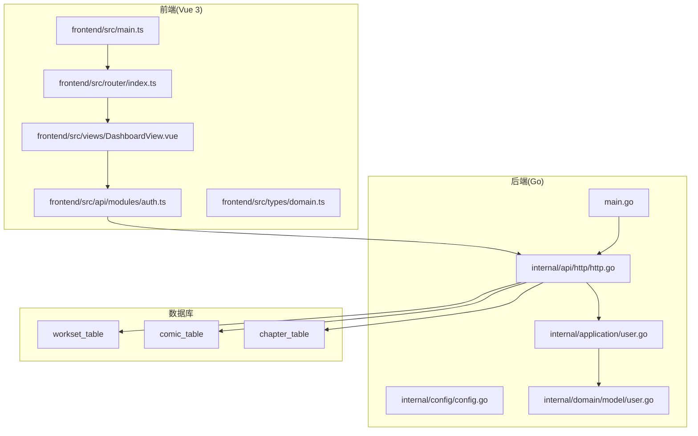
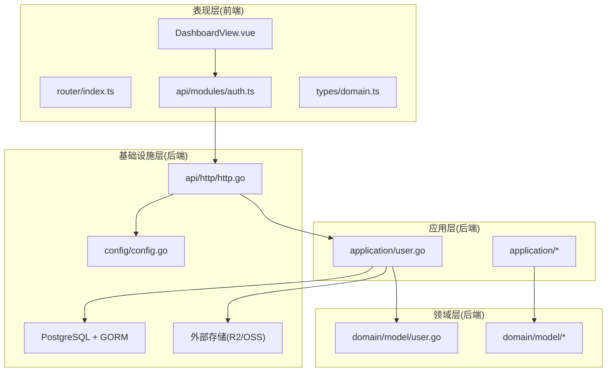
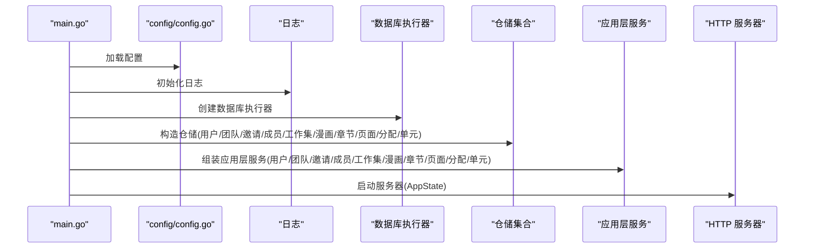
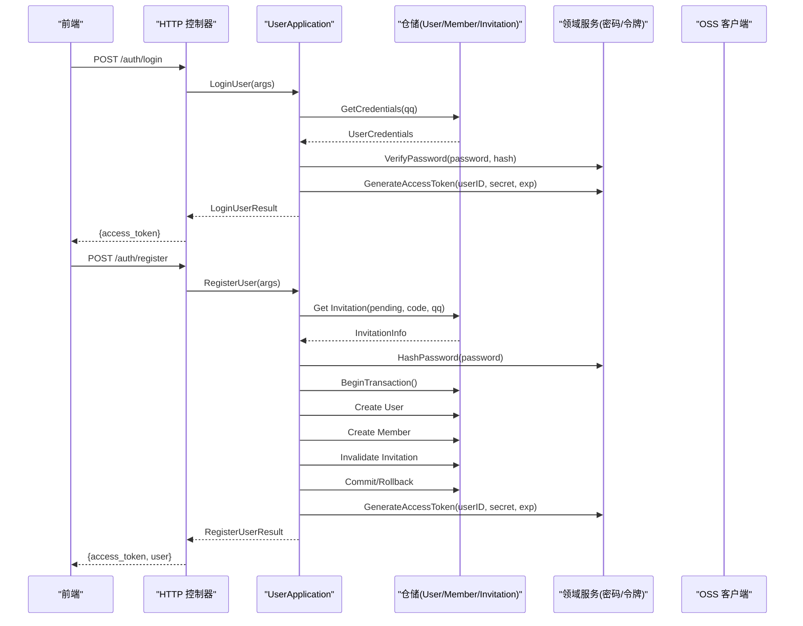
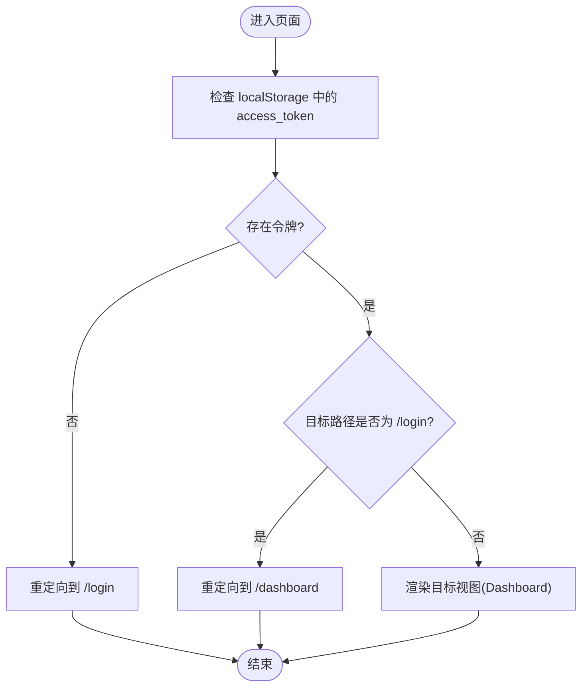
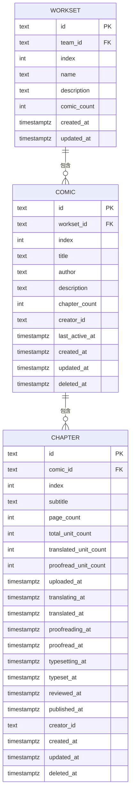
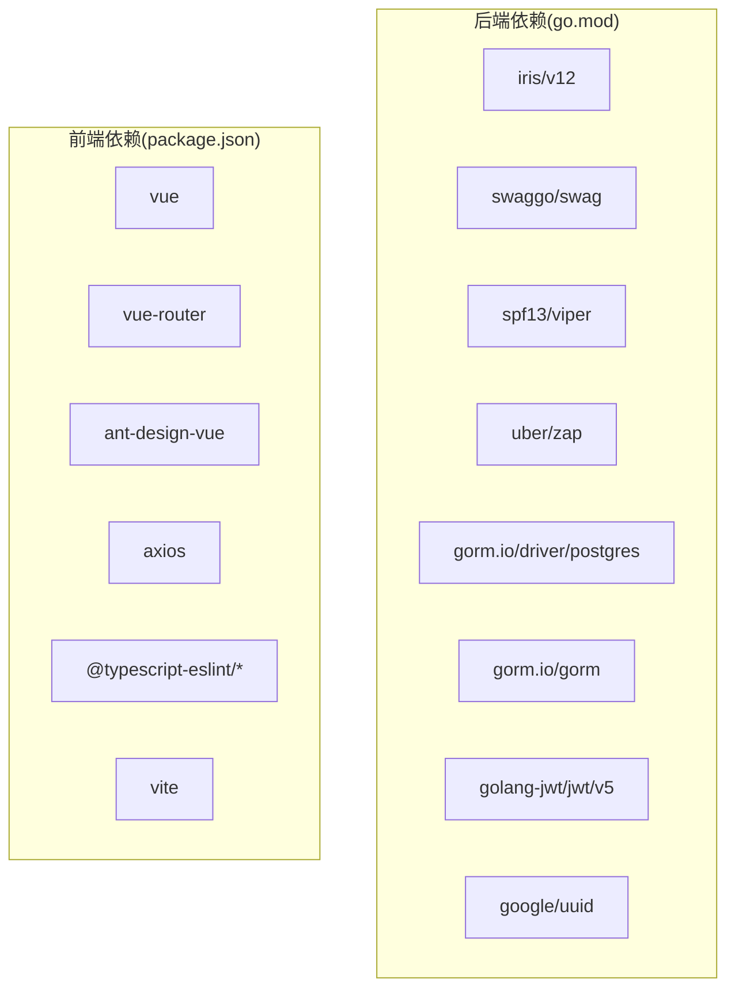

# 项目概述

<cite>
**本文引用的文件**
- [main.go](file://main.go)
- [go.mod](file://go.mod)
- [docs/ARCHETECT.md](file://docs/ARCHETECT.md)
- [internal/api/http/http.go](file://internal/api/http/http.go)
- [internal/application/user.go](file://internal/application/user.go)
- [internal/domain/model/user.go](file://internal/domain/model/user.go)
- [internal/config/config.go](file://internal/config/config.go)
- [frontend/src/main.ts](file://frontend/src/main.ts)
- [frontend/package.json](file://frontend/package.json)
- [frontend/src/router/index.ts](file://frontend/src/router/index.ts)
- [frontend/src/views/DashboardView.vue](file://frontend/src/views/DashboardView.vue)
- [frontend/src/api/modules/auth.ts](file://frontend/src/api/modules/auth.ts)
- [frontend/src/types/domain.ts](file://frontend/src/types/domain.ts)
- [migrations/20260306101211_workset-table.up.sql](file://migrations/20260306101211_workset-table.up.sql)
- [migrations/20260306101212_comic-table.up.sql](file://migrations/20260306101212_comic-table.up.sql)
- [migrations/20260306101213_chapter-table.up.sql](file://migrations/20260306101213_chapter-table.up.sql)
</cite>

## 目录
1. [引言](#引言)
2. [项目结构](#项目结构)
3. [核心组件](#核心组件)
4. [架构总览](#架构总览)
5. [详细组件分析](#详细组件分析)
6. [依赖分析](#依赖分析)
7. [性能考虑](#性能考虑)
8. [故障排除指南](#故障排除指南)
9. [结论](#结论)
10. [附录](#附录)

## 引言
本项目是一个面向漫画翻译团队的协作平台，旨在通过前后端分离的全栈架构，为团队提供从用户管理、团队与成员管理、工作集与漫画编目、章节与页面管理到任务分配与单元标注的完整业务闭环。后端采用 Go 语言构建，基于 Iris 框架提供 REST API；前端采用 Vue 3 + TypeScript + Vite 技术栈，结合 Ant Design Vue 提供现代化交互界面。项目采用受领域驱动设计启发的 Clean Architecture 分层思想，强调业务领域模型的独立性、应用层的用例编排能力以及基础设施层的可替换性，从而提升系统的可维护性、可测试性与可扩展性。

## 项目结构
项目采用“后端 Go + 前端 Vue”的典型前后端分离架构，后端以模块化方式组织代码，分为配置、API、应用、领域、基础设施与状态等层次；前端以组件化方式组织，包含路由、视图、API 模块与类型定义。数据库迁移脚本清晰地定义了漫画协作相关的实体关系与索引策略。

图表来源
- [frontend/src/main.ts:1-24](file://frontend/src/main.ts#L1-L24)
- [frontend/src/router/index.ts:1-54](file://frontend/src/router/index.ts#L1-L54)
- [frontend/src/views/DashboardView.vue:1-328](file://frontend/src/views/DashboardView.vue#L1-L328)
- [frontend/src/api/modules/auth.ts:1-111](file://frontend/src/api/modules/auth.ts#L1-L111)
- [main.go:1-146](file://main.go#L1-L146)
- [internal/api/http/http.go:1-167](file://internal/api/http/http.go#L1-L167)
- [internal/application/user.go:1-594](file://internal/application/user.go#L1-L594)
- [internal/domain/model/user.go:1-100](file://internal/domain/model/user.go#L1-L100)
- [migrations/20260306101211_workset-table.up.sql:1-19](file://migrations/20260306101211_workset-table.up.sql#L1-L19)
- [migrations/20260306101212_comic-table.up.sql:1-37](file://migrations/20260306101212_comic-table.up.sql#L1-L37)
- [migrations/20260306101213_chapter-table.up.sql:1-38](file://migrations/20260306101213_chapter-table.up.sql#L1-L38)

章节来源
- [main.go:25-145](file://main.go#L25-L145)
- [internal/api/http/http.go:16-167](file://internal/api/http/http.go#L16-L167)
- [frontend/src/main.ts:1-24](file://frontend/src/main.ts#L1-L24)
- [frontend/src/router/index.ts:1-54](file://frontend/src/router/index.ts#L1-L54)

## 核心组件
- 后端入口与依赖注入
  - 后端通过主程序集中初始化配置、日志、数据库执行器与各类仓储，随后组装应用层服务并启动 HTTP 服务器。该流程体现了 Clean Architecture 中“应用层编排、领域层不变”的思想，确保业务逻辑集中在应用层，避免控制器直接侵入领域。
- HTTP 路由与中间件
  - 使用 Iris 框架提供统一的路由分派，内置请求追踪、日志与异常恢复中间件；路由按资源域划分（认证、用户、团队、成员、邀请、漫画、工作集、章节、页面、分配、单元），并提供 Swagger 文档（非生产环境）。
- 应用层服务
  - 以用户应用为例，封装登录、注册、头像预留与确认、用户信息更新与删除等用例，统一处理鉴权、参数校验、事务与外部依赖（如 OSS 客户端）。
- 前端入口与路由
  - 前端应用在入口处初始化 Vue 实例、路由与 UI 组件库；路由包含登录态守卫，未登录用户会被重定向至登录页，已登录用户无法直接访问登录页。
- 数据模型与类型
  - 后端领域模型定义用户、团队、工作集、漫画、章节等核心实体；前端类型定义与 Swagger 对应的领域对象，确保前后端契约一致。

章节来源
- [main.go:35-142](file://main.go#L35-L142)
- [internal/api/http/http.go:16-167](file://internal/api/http/http.go#L16-L167)
- [internal/application/user.go:21-104](file://internal/application/user.go#L21-L104)
- [frontend/src/main.ts:15-23](file://frontend/src/main.ts#L15-L23)
- [frontend/src/router/index.ts:41-50](file://frontend/src/router/index.ts#L41-L50)
- [internal/domain/model/user.go:7-100](file://internal/domain/model/user.go#L7-L100)
- [frontend/src/types/domain.ts:1-65](file://frontend/src/types/domain.ts#L1-L65)

## 架构总览
项目采用 Clean Architecture 的分层设计，强调“依赖倒置”和“用例驱动”。后端以应用层为核心，向上对接 HTTP 控制器，向下依赖领域模型与基础设施；前端通过 API 模块与后端交互，视图层负责展示与用户交互。

图表来源
- [frontend/src/views/DashboardView.vue:1-328](file://frontend/src/views/DashboardView.vue#L1-L328)
- [frontend/src/router/index.ts:1-54](file://frontend/src/router/index.ts#L1-L54)
- [frontend/src/api/modules/auth.ts:1-111](file://frontend/src/api/modules/auth.ts#L1-L111)
- [frontend/src/types/domain.ts:1-65](file://frontend/src/types/domain.ts#L1-L65)
- [internal/application/user.go:1-594](file://internal/application/user.go#L1-L594)
- [internal/domain/model/user.go:1-100](file://internal/domain/model/user.go#L1-L100)
- [internal/api/http/http.go:1-167](file://internal/api/http/http.go#L1-L167)
- [internal/config/config.go:1-101](file://internal/config/config.go#L1-L101)

章节来源
- [docs/ARCHETECT.md:1-36](file://docs/ARCHETECT.md#L1-L36)
- [internal/api/http/http.go:16-167](file://internal/api/http/http.go#L16-L167)
- [internal/application/user.go:21-104](file://internal/application/user.go#L21-L104)

## 详细组件分析

### 后端启动与依赖注入流程
后端通过主程序集中装配各层组件，形成清晰的控制流：加载环境配置 → 初始化日志 → 构造数据库执行器与仓储 → 组装应用层服务 → 注入 AppState 并启动 HTTP 服务器。该流程确保应用层与基础设施解耦，便于测试与替换。

图表来源
- [main.go:30-142](file://main.go#L30-L142)
- [internal/config/config.go:11-59](file://internal/config/config.go#L11-L59)

章节来源
- [main.go:25-145](file://main.go#L25-L145)
- [internal/config/config.go:29-59](file://internal/config/config.go#L29-L59)

### 用户认证与注册流程
用户认证与注册是系统的关键入口，涉及参数校验、密码哈希、JWT 签发、事务一致性与外部依赖（OSS）。该流程体现了应用层对业务规则的集中处理与对基础设施的抽象。

图表来源
- [internal/api/http/http.go:40-49](file://internal/api/http/http.go#L40-L49)
- [internal/application/user.go:106-278](file://internal/application/user.go#L106-L278)
- [internal/domain/model/user.go:43-54](file://internal/domain/model/user.go#L43-L54)

章节来源
- [internal/application/user.go:106-278](file://internal/application/user.go#L106-L278)
- [internal/api/http/http.go:40-49](file://internal/api/http/http.go#L40-L49)

### 前端仪表盘与路由守卫
前端仪表盘作为协作平台的主界面，负责展示团队与任务摘要、团队列表与个人分配情况；路由守卫根据本地存储中的访问令牌决定是否放行。该设计确保用户在未登录状态下无法访问受保护页面。

图表来源
- [frontend/src/router/index.ts:41-50](file://frontend/src/router/index.ts#L41-L50)
- [frontend/src/views/DashboardView.vue:204-231](file://frontend/src/views/DashboardView.vue#L204-L231)

章节来源
- [frontend/src/router/index.ts:1-54](file://frontend/src/router/index.ts#L1-L54)
- [frontend/src/views/DashboardView.vue:1-328](file://frontend/src/views/DashboardView.vue#L1-L328)

### 数据模型与关系
系统围绕“工作集-漫画-章节-页面-分配-单元”构建内容与协作关系，数据库迁移脚本定义了主键、外键、唯一索引与常用查询索引，支撑高效的数据检索与一致性约束。

图表来源
- [migrations/20260306101211_workset-table.up.sql:1-19](file://migrations/20260306101211_workset-table.up.sql#L1-L19)
- [migrations/20260306101212_comic-table.up.sql:1-37](file://migrations/20260306101212_comic-table.up.sql#L1-L37)
- [migrations/20260306101213_chapter-table.up.sql:1-38](file://migrations/20260306101213_chapter-table.up.sql#L1-L38)

章节来源
- [migrations/20260306101211_workset-table.up.sql:1-19](file://migrations/20260306101211_workset-table.up.sql#L1-L19)
- [migrations/20260306101212_comic-table.up.sql:1-37](file://migrations/20260306101212_comic-table.up.sql#L1-L37)
- [migrations/20260306101213_chapter-table.up.sql:1-38](file://migrations/20260306101213_chapter-table.up.sql#L1-L38)

## 依赖分析
- 后端依赖
  - Web 框架与工具：Iris、Swag、Viper、Zap、GORM、Postgres 驱动、JWT、UUID 等。
  - 运行时要求：Go 1.25+。
- 前端依赖
  - 核心库：Vue 3、Vue Router、Ant Design Vue、Axios、TypeScript、Vite。
  - 开发工具：ESLint、Vue TSC、TS 配置。

图表来源
- [go.mod:5-18](file://go.mod#L5-L18)
- [frontend/package.json:13-32](file://frontend/package.json#L13-L32)

章节来源
- [go.mod:1-113](file://go.mod#L1-L113)
- [frontend/package.json:1-34](file://frontend/package.json#L1-L34)

## 性能考虑
- 事务与一致性：用户注册流程在单事务中完成用户创建、成员加入与邀请失效，减少跨操作的不一致风险。
- 外部依赖：通过预签名 URL 与对象存储客户端解耦，降低后端直连存储的复杂度与带宽压力。
- 查询优化：数据库迁移脚本为常用过滤字段建立索引，有助于提高列表与筛选查询性能。
- 前端并发：仪表盘在加载数据时采用 Promise.all 并行请求团队与分配数据，缩短首屏等待时间。

章节来源
- [internal/application/user.go:199-261](file://internal/application/user.go#L199-L261)
- [migrations/20260306101212_comic-table.up.sql:22-37](file://migrations/20260306101212_comic-table.up.sql#L22-L37)
- [migrations/20260306101213_chapter-table.up.sql:31-38](file://migrations/20260306101213_chapter-table.up.sql#L31-L38)
- [frontend/src/views/DashboardView.vue:204-223](file://frontend/src/views/DashboardView.vue#L204-L223)

## 故障排除指南
- 启动失败
  - 环境变量缺失：确认 APP_ENVIRONMENT、JWT_SECRET_KEY、DATABASE_URL 是否正确设置。
  - 配置加载失败：检查 app_config.json 的结构与字段映射。
- 认证问题
  - 登录失败：检查 QQ 与密码是否匹配，关注服务端返回的错误信息。
  - 注册失败：确认邀请码有效且处于待使用状态，查看事务回滚日志。
- 前端路由
  - 无法进入受保护页面：检查 localStorage 中 access_token 是否存在。
  - 登录后跳转异常：确认路由守卫逻辑与路径配置。

章节来源
- [internal/config/config.go:11-59](file://internal/config/config.go#L11-L59)
- [internal/application/user.go:124-153](file://internal/application/user.go#L124-L153)
- [frontend/src/router/index.ts:41-50](file://frontend/src/router/index.ts#L41-L50)

## 结论
本项目通过 Clean Architecture 的分层设计与前后端分离的工程实践，为漫画翻译团队提供了可扩展、可维护的协作平台基础。后端以应用层为核心编排业务用例，前端以组件化与类型安全保障用户体验，配合完善的数据库索引与事务处理，能够满足从用户管理到内容编目的全流程协作需求。建议后续持续完善领域服务与仓储抽象，补充更多业务用例与测试覆盖，逐步扩展工作流与审批机制。

## 附录
- 项目背景与应用场景
  - 面向漫画翻译团队的协作平台，支持团队管理、成员邀请、漫画编目、章节与页面管理、任务分配与单元标注等。
- 技术选型理由
  - Go + Iris：高性能、并发友好、部署简单；GORM + Postgres：成熟的关系型数据持久化方案。
  - Vue 3 + TypeScript：现代前端生态，类型安全与组件化开发体验良好；Ant Design Vue：丰富的 UI 组件与设计规范。
- 清洁架构优势
  - 业务逻辑集中在应用层，领域模型保持纯净；基础设施可替换，便于集成对象存储、消息队列等外部系统。