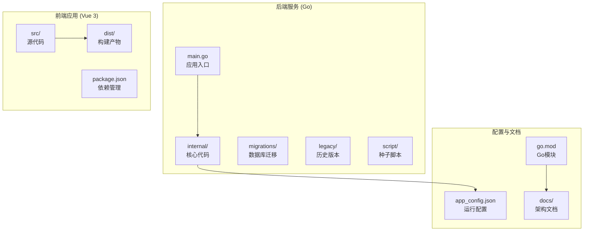
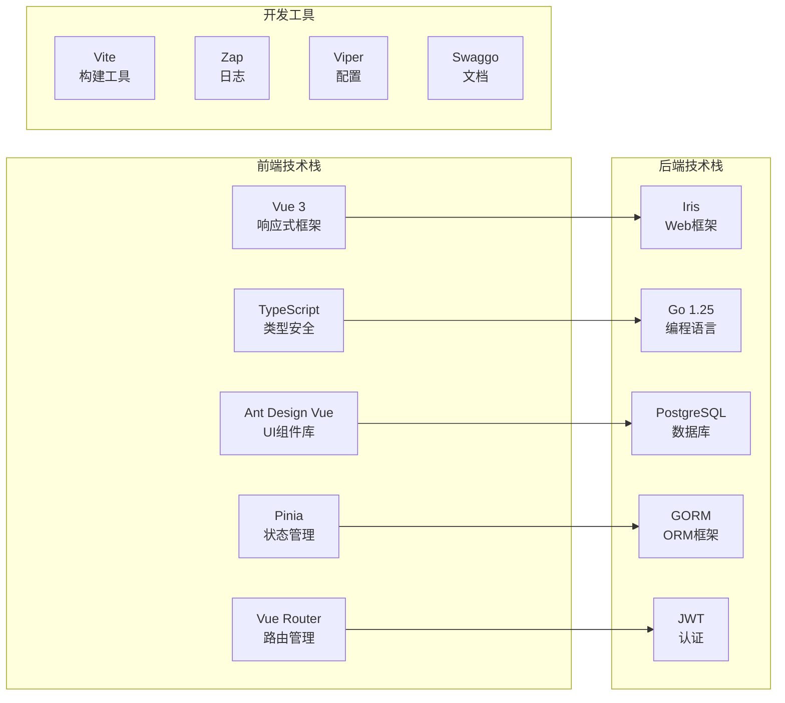
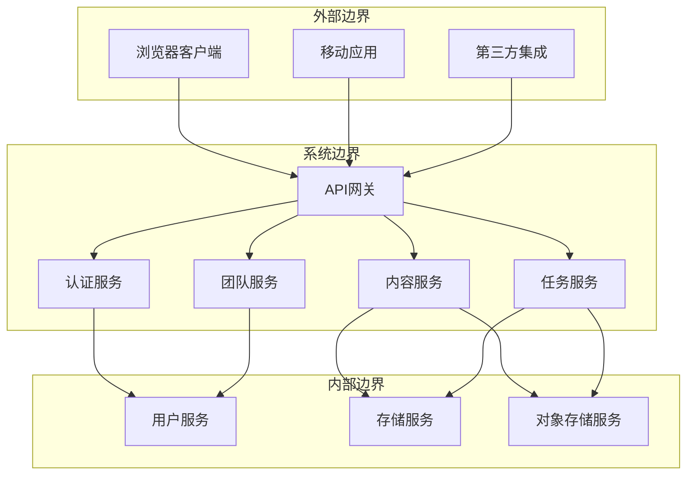
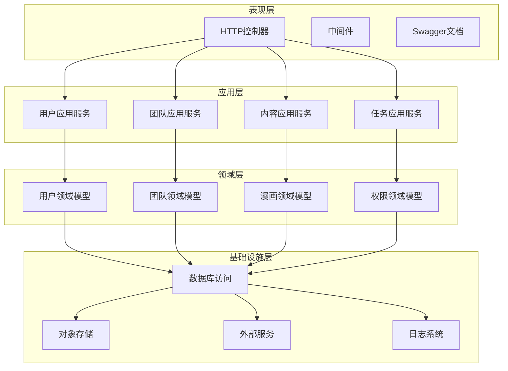
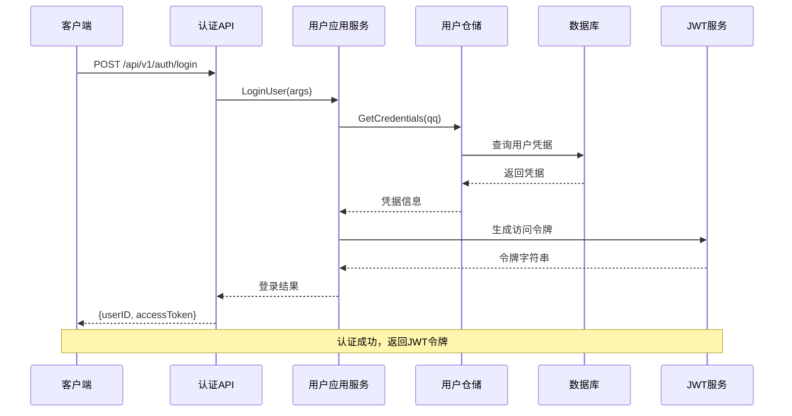
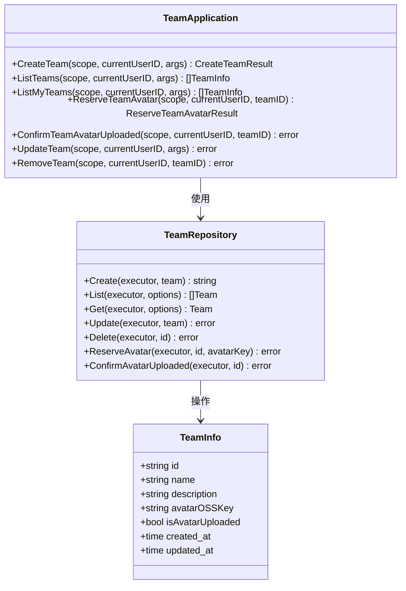
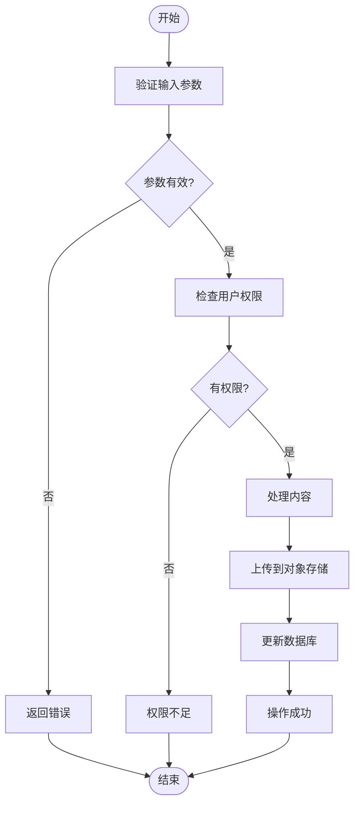
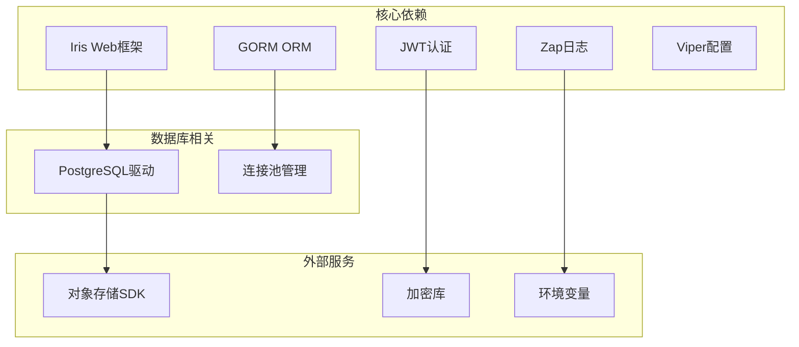
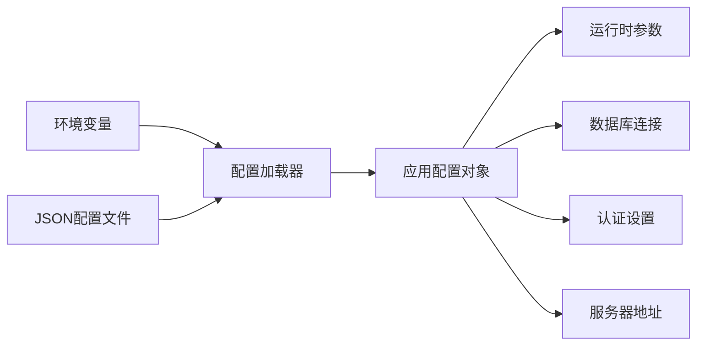

# 项目概述

<cite>
**本文档引用的文件**
- [main.go](file://main.go)
- [ARCHETECT.md](file://docs/ARCHETECT.md)
- [package.json](file://frontend/package.json)
- [go.mod](file://go.mod)
- [app_config.json](file://app_config.json)
- [config.go](file://internal/config/config.go)
- [http.go](file://internal/api/http/http.go)
- [main.ts](file://frontend/src/main.ts)
- [index.ts](file://frontend/src/router/index.ts)
- [user.go](file://internal/domain/model/user.go)
- [user.go](file://internal/application/user.go)
- [team.go](file://internal/application/team.go)
- [user.go](file://internal/domain/service/user.go)
- [user.go](file://internal/infrastructure/repository/user.go)
- [domain.ts](file://frontend/src/types/domain.ts)
</cite>

## 目录
1. [引言](#引言)
2. [项目结构](#项目结构)
3. [核心组件](#核心组件)
4. [架构总览](#架构总览)
5. [详细组件分析](#详细组件分析)
6. [依赖分析](#依赖分析)
7. [性能考虑](#性能考虑)
8. [故障排除指南](#故障排除指南)
9. [结论](#结论)
10. [附录](#附录)

## 引言

poprako-web-ms 是一个基于微服务架构的漫画协作平台后端系统，采用前后端分离的设计理念。该项目旨在为漫画翻译、校对、绘制等创作流程提供高效协作能力，支持团队管理、成员邀请、漫画内容管理、章节组织、页面处理以及任务分配等功能。

系统采用 Go 语言作为后端技术栈，Vue 3 作为前端框架，PostgreSQL 作为持久化存储，并通过 Swagger 提供 API 文档。项目遵循部分领域驱动设计（DDD）思想，采用分层架构模式，将业务逻辑清晰地划分为应用层、领域层、基础设施层和表示层。

## 项目结构

项目采用模块化的目录结构，主要分为以下几个核心部分：

**图表来源**
- [main.go:1-146](file://main.go#L1-L146)
- [package.json:1-36](file://frontend/package.json#L1-L36)
- [go.mod:1-114](file://go.mod#L1-L114)

### 后端核心模块

后端代码位于 `internal/` 目录下，按照职责划分为多个层次：

- **api/http**: HTTP 接口层，负责路由定义和请求处理
- **application**: 应用层，包含业务用例和协调逻辑
- **domain**: 领域层，包含实体模型、值对象和领域服务
- **infrastructure**: 基础设施层，包含数据访问和外部集成
- **config**: 配置管理
- **state**: 应用状态管理

**章节来源**
- [main.go:12-146](file://main.go#L12-L146)
- [ARCHETECT.md:1-36](file://docs/ARCHETECT.md#L1-L36)

### 前端架构

前端采用 Vue 3 + TypeScript + Vite 的现代开发栈，主要特性包括：

- 响应式状态管理（Pinia）
- 类型安全的组件开发
- 模块化的路由系统
- Ant Design Vue 组件库集成
- 开发环境的热重载和生产优化

**章节来源**
- [package.json:1-36](file://frontend/package.json#L1-L36)
- [main.ts:1-26](file://frontend/src/main.ts#L1-L26)
- [index.ts:1-54](file://frontend/src/router/index.ts#L1-L54)

## 核心组件

### 技术栈概览

项目采用的技术组合体现了现代化 Web 应用的最佳实践：

**图表来源**
- [package.json:13-34](file://frontend/package.json#L13-L34)
- [go.mod:5-18](file://go.mod#L5-L18)

### 主要业务场景

系统围绕四大核心业务场景构建：

1. **用户认证与授权**
   - 基于 JWT 的无状态认证
   - 密码哈希与验证
   - 权限控制和角色管理

2. **团队协作管理**
   - 汉化组创建与管理
   - 成员邀请与加入
   - 角色权限体系

3. **漫画内容管理**
   - 漫画作品的创建与维护
   - 章节结构组织
   - 页面内容处理

4. **任务分配与跟踪**
   - 翻译、校对等角色分配
   - 工作流状态管理
   - 进度跟踪

**章节来源**
- [user.go:106-278](file://internal/application/user.go#L106-L278)
- [team.go:92-130](file://internal/application/team.go#L92-L130)

### 系统边界

系统采用微服务架构，通过清晰的边界划分实现松耦合：

**图表来源**
- [http.go:38-146](file://internal/api/http/http.go#L38-L146)
- [main.go:25-145](file://main.go#L25-L145)

## 架构总览

项目采用分层架构设计，结合部分 DDD 思想，实现了业务逻辑与基础设施的分离：

**图表来源**
- [ARCHETECT.md:3-36](file://docs/ARCHETECT.md#L3-L36)
- [http.go:16-151](file://internal/api/http/http.go#L16-L151)

### 设计理念

项目的设计理念体现在以下几个方面：

1. **分层解耦**: 通过清晰的层次划分，实现关注点分离
2. **领域驱动**: 以业务领域为核心，抽象出完整的领域模型
3. **依赖注入**: 通过构造函数注入依赖，提高可测试性
4. **接口隔离**: 定义明确的接口契约，降低耦合度
5. **配置管理**: 通过环境变量和配置文件管理运行时参数

**章节来源**
- [ARCHETECT.md:15-24](file://docs/ARCHETECT.md#L15-L24)
- [config.go:29-58](file://internal/config/config.go#L29-L58)

## 详细组件分析

### 用户认证组件

用户认证是系统的核心安全组件，实现了完整的注册、登录和权限管理流程：

**图表来源**
- [http.go:42-45](file://internal/api/http/http.go#L42-L45)
- [user.go:106-154](file://internal/application/user.go#L106-L154)
- [user.go:15-41](file://internal/domain/service/user.go#L15-L41)

#### 核心流程分析

用户认证流程包含三个关键步骤：

1. **凭据验证**: 通过 QQ 号查询用户凭据，验证密码哈希
2. **令牌生成**: 使用 JWT 生成具有过期时间的访问令牌
3. **权限检查**: 基于用户角色进行权限验证

**章节来源**
- [user.go:106-154](file://internal/application/user.go#L106-L154)
- [user.go:70-84](file://internal/domain/service/user.go#L70-L84)

### 团队协作组件

团队管理组件提供了完整的团队生命周期管理：

**图表来源**
- [team.go:20-56](file://internal/application/team.go#L20-L56)
- [team.go:58-90](file://internal/application/team.go#L58-L90)

#### 权限模型

系统采用基于角色的权限控制模型，支持多种权限级别：

- **超级管理员**: 拥有所有权限
- **团队创建者**: 可创建和管理团队
- **团队成员**: 可查看和参与团队活动
- **普通用户**: 注册用户，具备基础权限

**章节来源**
- [team.go:112-118](file://internal/application/team.go#L112-L118)
- [user.go:21-41](file://internal/domain/model/user.go#L21-L41)

### 内容管理组件

内容管理组件负责漫画作品的完整生命周期管理：

**图表来源**
- [user.go:426-468](file://internal/application/user.go#L426-L468)
- [team.go:186-232](file://internal/application/team.go#L186-L232)

#### 存储策略

系统采用分布式存储架构，结合本地数据库和对象存储：

- **元数据存储**: 使用 PostgreSQL 存储结构化数据
- **文件存储**: 使用对象存储服务存储图片、文档等大文件
- **预签名URL**: 通过预签名URL实现安全的文件访问控制

**章节来源**
- [user.go:454-467](file://internal/application/user.go#L454-L467)
- [team.go:215-231](file://internal/application/team.go#L215-L231)

## 依赖分析

### 后端依赖关系

项目后端依赖通过 Go 模块系统管理，主要依赖包括：

**图表来源**
- [go.mod:5-18](file://go.mod#L5-L18)
- [go.mod:20-114](file://go.mod#L20-L114)

### 前端依赖关系

前端项目采用现代化的包管理策略：

- **运行时依赖**: Vue 3、Ant Design Vue、Axios、Pinia、Vue Router
- **开发依赖**: TypeScript、ESLint、Vite、Sass、Vue ESLint 插件
- **构建工具**: Vite 提供快速的开发体验和高效的生产构建

**章节来源**
- [package.json:13-34](file://frontend/package.json#L13-L34)

### 配置管理

系统通过多层配置机制实现灵活的环境管理：

**图表来源**
- [config.go:11-59](file://internal/config/config.go#L11-L59)
- [app_config.json:1-11](file://app_config.json#L1-11)

**章节来源**
- [config.go:69-100](file://internal/config/config.go#L69-L100)
- [app_config.json:3-10](file://app_config.json#L3-L10)

## 性能考虑

### 数据库优化

系统采用多项数据库优化策略：

- **连接池管理**: 通过最小空闲连接数和最大打开连接数控制数据库负载
- **查询优化**: 使用 GORM 的链式查询和预编译语句减少 SQL 注入风险
- **索引策略**: 为常用查询字段建立合适的索引
- **事务管理**: 合理使用事务保证数据一致性

### 缓存策略

虽然当前实现主要依赖数据库，但系统架构支持缓存层的扩展：

- **会话缓存**: JWT 令牌可以在内存中进行短期缓存
- **配置缓存**: 应用配置可以缓存在进程内存中
- **查询结果缓存**: 对于静态数据可以考虑 Redis 缓存

### 并发处理

系统采用并发友好的设计：

- **goroutine 管理**: Iris 框架内置的 goroutine 支持高并发请求处理
- **资源池**: 数据库连接池和对象存储连接池优化资源利用率
- **异步处理**: 对于耗时操作建议使用后台任务队列

## 故障排除指南

### 常见问题诊断

#### 配置相关问题

**问题**: 应用启动时提示配置加载失败
**解决方案**: 
1. 检查 `.env` 文件是否正确配置
2. 验证 `app_config.json` 格式是否正确
3. 确认环境变量 `APP_ENVIRONMENT` 是否设置

#### 数据库连接问题

**问题**: 应用启动时报数据库连接错误
**解决方案**:
1. 检查 `DATABASE_URL` 环境变量是否正确
2. 验证数据库服务是否正常运行
3. 确认连接池配置参数合理

#### 认证问题

**问题**: 用户登录失败或令牌生成错误
**解决方案**:
1. 检查 `JWT_SECRET_KEY` 环境变量
2. 验证用户凭据是否正确
3. 确认密码哈希算法配置

**章节来源**
- [config.go:36-56](file://internal/config/config.go#L36-L56)
- [config.go:74-83](file://internal/config/config.go#L74-L83)

### 日志分析

系统使用 Zap 日志库提供详细的运行时日志：

- **请求日志**: 记录每个 HTTP 请求的详细信息
- **错误日志**: 记录系统异常和错误信息
- **调试日志**: 提供开发阶段的详细调试信息
- **性能日志**: 记录关键操作的执行时间和性能指标

**章节来源**
- [http.go:30-36](file://internal/api/http/http.go#L30-L36)

## 结论

poprako-web-ms 项目是一个设计精良的漫画协作平台后端系统，展现了现代 Web 应用开发的最佳实践。项目通过清晰的分层架构、完善的权限控制、合理的数据模型设计，为漫画翻译和创作团队提供了强大的协作能力。

系统的主要优势包括：

1. **架构清晰**: 采用分层架构和部分 DDD 思想，代码结构清晰易维护
2. **技术先进**: 选用 Go + Vue 3 + PostgreSQL 的现代技术栈
3. **功能完善**: 覆盖了漫画协作的全流程业务需求
4. **扩展性强**: 模块化设计便于功能扩展和维护升级

未来可以考虑的方向包括：引入缓存层提升性能、增加监控和告警系统、实现更细粒度的权限控制、添加消息队列支持异步任务处理等。

## 附录

### API 端点概览

系统提供 RESTful API 接口，主要包含以下端点组：

- **认证相关**: `/api/v1/auth/login`, `/api/v1/auth/register`
- **用户管理**: `/api/v1/users`, `/api/v1/users/{user_id}`
- **团队管理**: `/api/v1/teams`, `/api/v1/teams/{team_id}`
- **成员管理**: `/api/v1/members`
- **邀请管理**: `/api/v1/invitations`
- **漫画管理**: `/api/v1/comics`, `/api/v1/comics/{comic_id}`
- **工作集管理**: `/api/v1/worksets`, `/api/v1/worksets/{workset_id}`
- **章节管理**: `/api/v1/chapters`, `/api/v1/chapters/{chapter_id}`
- **页面管理**: `/api/v1/pages`, `/api/v1/pages/{page_id}`
- **任务分配**: `/api/v1/assignments`, `/api/v1/assignments/{assignment_id}`
- **单元管理**: `/api/v1/units`

**章节来源**
- [http.go:40-146](file://internal/api/http/http.go#L40-L146)

### 前端组件映射

前端应用与后端 API 的主要组件映射关系：

- **用户界面**: 显示用户信息、头像上传、个人资料编辑
- **团队界面**: 团队列表、团队详情、成员管理
- **漫画界面**: 漫画列表、漫画详情、章节浏览
- **任务界面**: 任务分配、进度跟踪、工作流管理
- **仪表板**: 统计信息、最近活动、快捷操作

**章节来源**
- [domain.ts:7-89](file://frontend/src/types/domain.ts#L7-L89)